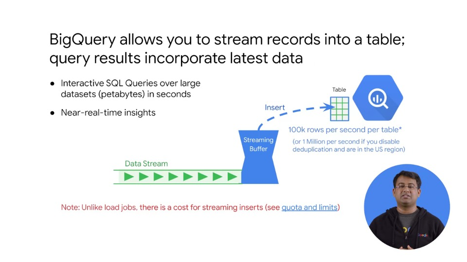
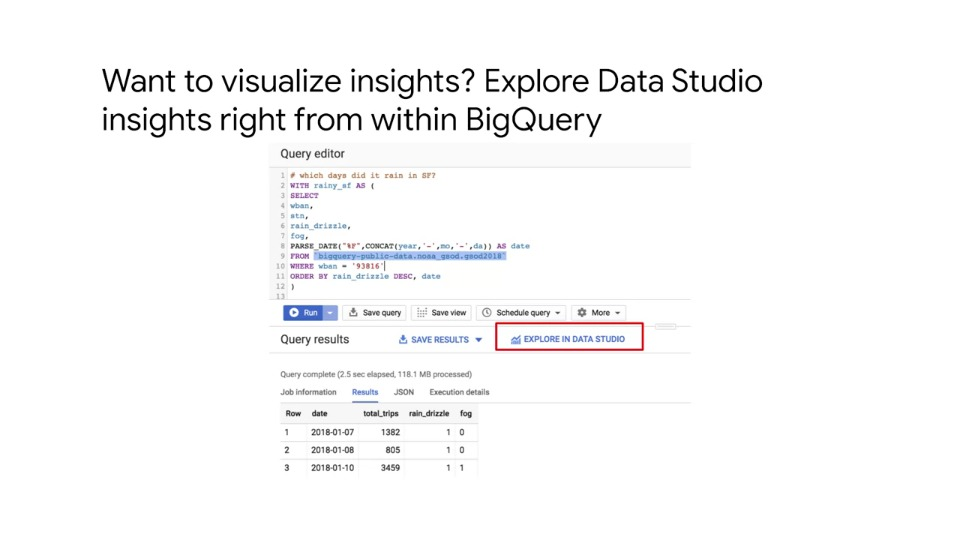

# Streaming into BigQuery and Visualising Results

## Agenda

- Processing Streaming Data
- Cloud Pub/Sub
- Cloud Dataflow Streaming Features
- BigQuery Streaming Features *
- Cloud BigTable

(*Current course)

## BigQuery allows you to stream records into a table; query results incorporate latest data

- Interactive SQL Queries over large datasets (petabytes) in seconds
- Near real-time insights



- Streaming from BigQuery gives an Insert ID; as streaming is not a load job
- Streaming inserts allow you to stream one item at a time into a table

### Steps

- We first create a table in which we wish to store the streaming data
  - Tables can be created aby providing **template tables** or providing the schema specifically
- The data enters the system and gets buffered in streaming buffers for a brief time until it can be inserted into the table
- Usually data is made available in seconds

### What is the rate for streaming inserts?

- As seen in slide above: 100k rows per second per table is the rate for inserts

### Quotas

- Since streaming data is unbounded, it is important to consider the streaming quotas
- There is both a daily limit and a concurrent rate limit
- Check Google Cloud pricing documentation for BigQuery streaming

### When should you consider streaming data rather than using a batch approach to loading data?

- When the immediate availability of data is a soluton requirement, you can do that
- One major reason in most cases is: **loading batch data is not charged**, whereas **streaming data is charged**.
- So it is advisable to use batch loading or repeated/scheduled batch loading rather than streaming unless there is a streaming requirement for the application

## Inserting streaming data into a BigQuery table

### Example code used for inserting streaming data into a BigQuery table

- Credentials: The service must have Cloud IAM permissions set in the Web UI

```bash
export GOOGLE_APPLICATION_CREDENTIALS="/home/user/Downloads/[FILE_NAME].json
```

- Install API

```bash
pip install google-cloud-bigquery
```

- Python

```python
from google.cloud import bigquery
client = bigquery.Client(project='PROJECT_ID') ## create a client

## Access dataset and table
dataset_ref = bigquery_client.dataset('my_dataset_id')
table_ref = dataset_ref.table('my_table_id')
table = bigquery_client.get_table(table_ref) ## get table access from API

# read data from Cloud Pub/Sub and place into row format
# static example customer orders in units:
rows_to_insert = [
    (u'customer 1', 5),
    (u'customer 2', 17)
]

# Insert rows into table (perform insert)
errors = bigquery_client.insert_rows(table, rows_to_insert)
```

## Want to visualise insights? Explore Data Studio insights right from within BigQuery



- Next steps are to run SQL queries to analyse this data (see course 1)
- One feature for visual exploration is trending now
- After executing a query in BigQuery you can use the 'Explore in Data Studio' feature to immediately start creating visuals as part of a dashboard

## Build, collaborate and share your dashboards (with Data Studio)

- Tell a clear story with your data
- Share and collaborate on reports with others
- What is the report trying to do?
- Highlight key insights that your audience cares about
- Telling a good story on your dashboard is a critical skill

## Creating new reports in the Data Studio UI

- Home page shows dashboards and connected sources
- Two ways to create a new report from scratch
  - Templates at top
  - Button in lower right

- Specify data source in the right panel using the Data Source picker

## Connect to multiple different types of data sources

- You can choose any or all of the data sources available in a single Data Studio report
- Given sharing of Data Studio reports and datasets you should be aware of the rammifications of sharing a data source:
  - Other people who view the report can potentially see all the data in that Data Source if you share that source with them
  - Anyone who can edit the report can use all the fields from any added data sources to create new charts with them
  - You can click 'Add to report' to add the data source and then you are ready to start visualising
