# High throughput streaming with Cloud Bigtable

## Agenda

- Processing Streaming Data
- Cloud Pub/Sub
- Cloud Dataflow Streaming Features
- BigQuery Streaming Features
- **Cloud BigTable***

(*Current course)

## Introduction

- BigQuery is a very good general purpose solution for most cases
- However, occasionally you may come across situations where the latency of BigQuery is problematic
- In BigQuery, streaming data is typically available in a matter of seconds
- You may want streaming latencies to be in the maginitude of milliseconds or microseconds, or deal with a higher throughput than BigQuery is capable of dealing with
- A solution to the above issues is Cloud Big Table

## In this course

We will look at:

- How to design for Bigtable
  - How to design schemas
  - How to design the row key for Bigtable
- How to ingest data into Bigtable

## Cloud Bigtable

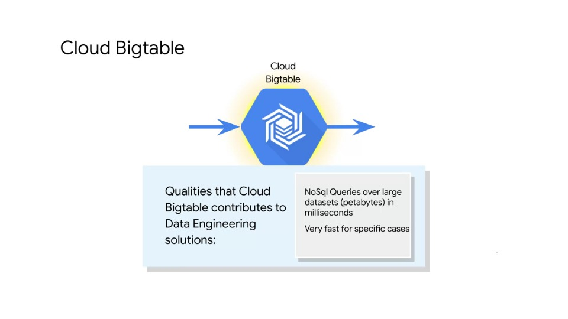

- Bigtable is for high performance applications
- To use Bigtable effectively, you have to know a lot about your data and how it will be queried upfront
- A lot of optimisations happen (or can happen) before you load data into Cloud Bigtable

## How to choose between Cloud Bigtable and BigQuery

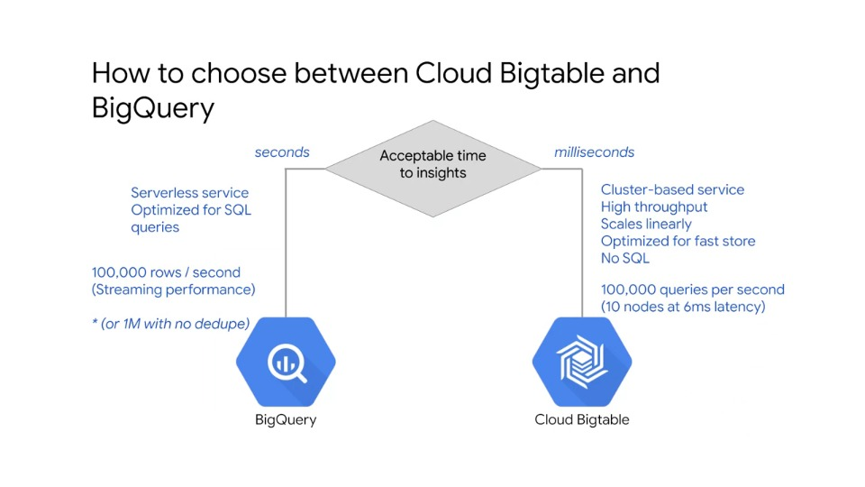

- Cloud Bigtable is ideal for applications that need very high throughput and scalability **for non-structured key-value data**
  - Where each value is typically no larger than 10 MB
- Cloud Bigtable is **not good** for:
  - (Highly) structured data
  - Transaction data
  - Small data (< 1TB)
  - Anything requiring SQL queries or SQL joins

## Consider Cloud Bigtable for these requirements

Here are a few examples of Data Engineering requirements that have been solved using Cloud Bigtable:

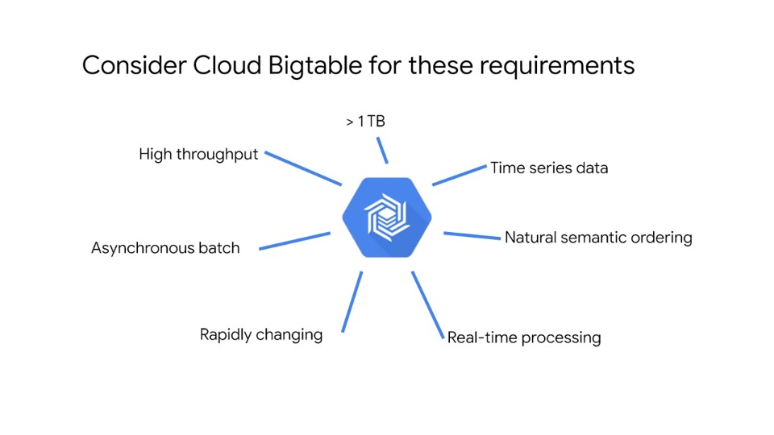

### Example use-cases of Cloud Bigtable

- Machine learning algorithms that have many or all of the requirements listed above
- Applications that use marketing data such as purchase histories or customer preferences
- Applications that use financial data such as transaction histories, stock prices or currency exchange rates
- Internet of things; IoT data such as usage reports from meters, sensors or devices
- Time series data, such as resource consumption such as CPU and memory usage over a period of time for multiple servers

### The most common use of Cloud Bigtable is...

> Productionise a real-time lookup as part of an application, where speed and efficient are desired beyond that of other databases

- The Cloud Bigtable use-case was originally for keyword search

## How does Cloud Bigtable work?

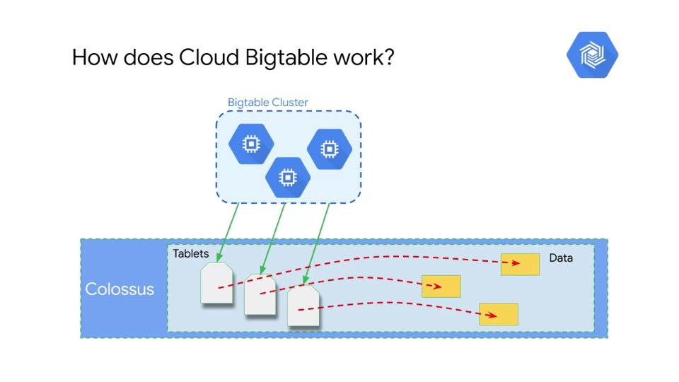

- Cloud Bigtable stores data in a filesystem called: Collossus
- Collossus also contains data structures such as **tablets** that are used to identify and manage the data
- Metadata about the tablets is what is stored on the VMs in the Bigtable cluster itself
- This design gives Cloud Bigtable the following qualities via three levels of operation:
  1. It can manipulate the actual data
  2. It can manipulate the tablets, that point to and describe the data
  3. Or, it can manipulate the metadata that points to the tablets
- Rebalancing tablets from one node to the other is very fast
  - This is because all the pointers are updated
- Cloud Bigtable is a learning system; it detects hotspots where a lot of activity is going through a single tablet and splits the table into two
- It can also rebalance the processing by moving the pointer to a tablet to a different VM in the cluster
- Therefore, best use-cases of Cloud Bigtable are with:
  - Big data (> 300GB)
  - Very fast access
  - Constant use over a longer period of time
- This gives Cloud Bigtable a chance to learn about the traffic patterns, and rebalance the tablets and the  processing

### Bigtable is a cluster-based implementation

- This means that there are multiple machines which host the Bigtable service and offer processing capabilities
- What if one of the machines or nodes fail in this cluster?
  - Is data lost? What happens to processing?
  - **Answer**:  Bigtable is a managed service and is fault tolerant by default
  - In the case of a node's failure, only pointers to the actual data will be lost but actual data will still be available in Colossus
  - A replacement node will then be provided which will have a fresh copy of pointers or metadata that was previously handled by the faulty node
  - > **Colossus provides three replicas by default to provide durability**

## How is data stored in Cloud Bigtable?

### The design idea for Cloud Bigtable is to "simplify for speed"

- Cloud Bigtable stores data in tables
- To begin with, it is just a table with rows and columns
  - However, unlike other table-based data systems like spreadsheets or SQL databases, Cloud Bigtable has only one index (known as a **row key**)
  - There are no alternate indexes or secondary indexes
  - When data is entered it is organised lexicographically by the row key
- If you take a traditional table and simplify the controls and operations, you allow yourself to perform on it, and can optimise for specific tasks
- By simplifying operations and not having to account for variations, you can ensure operations  are very fast
- Cloud Bigtable is a NoSQL database as it abandons a SQL design and increases speed by building up from a minimal set of operations

## But speed depends on your data and Row key

When the data and queries are the right match for Bigtable, Bigtable can be both consistently and extremely fast and efficient

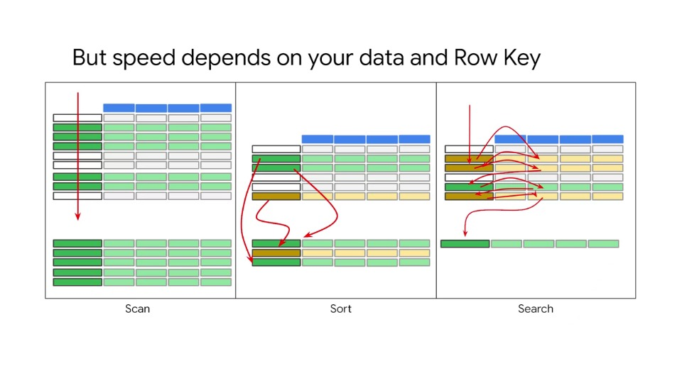

### Scanning

- Green items are the results you want to produce from the query
  - Best case you are going to scan the Row key one time only from top to bottom
  - And you will find all the data you want to retrieve in adjacent and contiguous rows

### Sorting

- The second instance is sorting;
  - You are still only looking at the row key
  - In this case the yellow line contains the data you want, but it is out of order
  - You can collect the data in a single scan, but this will result in a disorderly solution set
  - This requires the extra step of sorting the intermediate results to get the final results
  - The addition sorting operation can introduce a couple of variables to the time it will take:
    1. If the solution set is only a few rows, then the sorting operation will be quick:
        - But if the solution set is large, then the sorting will take more time
        - Therefore the size of the solution set becomes a factor in timing
    2. The orderliness of the original data is another factor
        - If most of the rows are already in order then there will be less manipulation required than if there are many rows out of order
        - The orderliness of the original data also becomes a factor in timing
    - Therefore introducing sorting means that the time it takes to produce the result is much more variable than scanning

### Searching

- The third instance is searching, in this case, one of the columns contains critical data
- You cannot tell whether a row is a member of a solution set or not without examining the data contained in the critical column
- The Row Key is no longer sufficient; this leads to bouncing back and forth between the Row key and column contents
- There are many approaches to searching:
  - You can divide it up into multiple steps
  - One scan through the Row key and subsequent scans through the columns
  - An then (perhaps), a final sort to get the data in the order you want
- This gets more complicated if the conditions of the solution set membership involve (extra) logic
  - Such as a value in one column **and** a value in another column
  - Or, a value in one column **or** a value in another column
- However, regardless of the algorithm or strategy you use, searching will always be slower and more variable than scanning or sorting

## Best practices for Bigtable

The following lessons can be learn from the previous section:

- To get the best performance with the design of the Cloud Bigtable service:
  1. The data needs to be in order first (if possible)
  2. You need to select or construct a Row key that minimises sorting and searching and turns your most common queries into scans

## Example: Flights of the world - reviewing the data

Let us take an example to understand the Bigtable best design practices and implementation tips

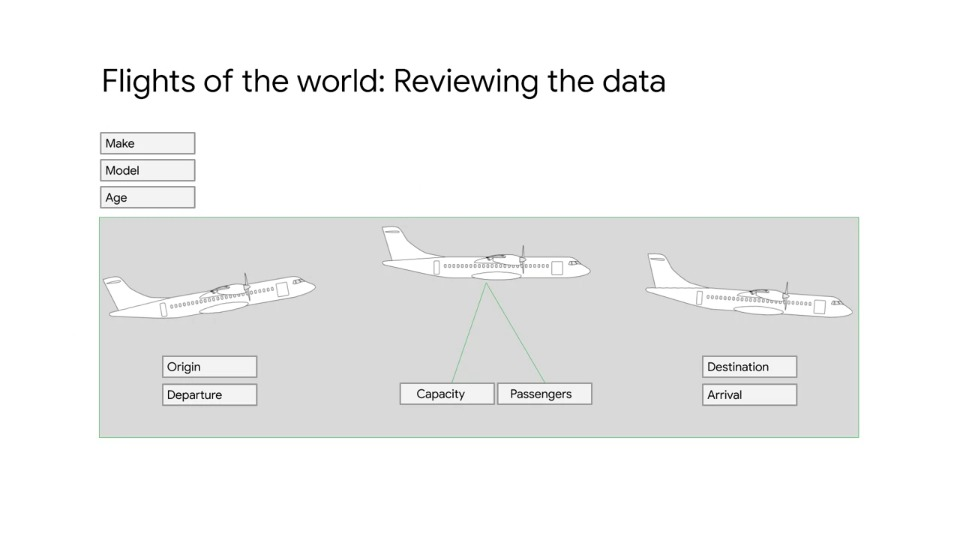

We are considering flights data for all the airlines and flight routes operated on:

- Each entry records the occurrence of one flight
- The data includes:
  - City of origin & date and time of departure
  - Destination city & date and time of arrival
  - Each airplane has a maximum capacity and data for the number of passengers aboard each flight
  - There is also information/data about the aircraft itself, including the manufacturer, the airplane make and model number and the current age of the aircraft at the time of the flight

### What is the best Row Key?

In this example, the Row Key will be defined for the most common use-cases.

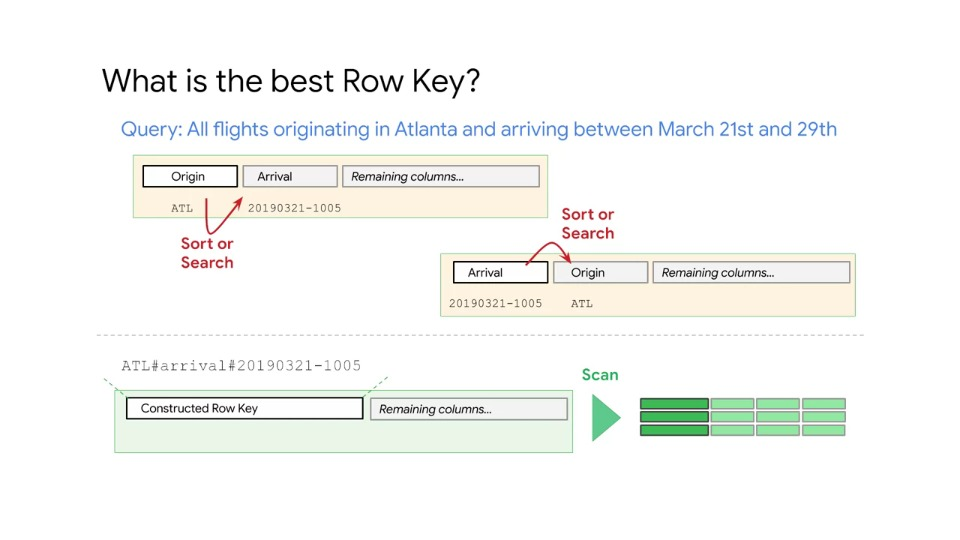

The query is to find all flights originating from the Atlanta airport, and arriving between March 21st and 29th.

The airport where the flight originates from is the origin field and the date when the aircraft landed is in the arrival field.

The slide above shows three approaches in determining which field to use as a Row Key:

#### Approach 1

- If we use the `Origin` field as the Row Key, it will be easy to pull out records for flights that originated from Atlanta, but the arrival dates will not be included in this Row Key and therefore additional searching will be needed to find flights that originated from Atlanta

#### Approach 2

- If we use the `Arrival` field as the Row Key, it will be easy to pull out records for flights that arrived between March 21st and 29th, but the airport of origin will not be included and therefore recognised by this Row Key.
- This means that you will be searching through the arrival column to get the solution set.

#### Approach 3

- In the third example the Row Key has been constructed from information extracted from the `Origin` field and the `Arrival` field, creating a **Constructed Row Key**.
- Because the data is organised lexicographically by the Row Key, all the Atlanta flights will appear in a group and sorted by Date of Arrival.
- Using this Row Key you can generate a solution set with only one scan.
- In this example the data was transformed when it arrived. So constructing a Row Key during the transformation process is straightforward.

## Cloud Bigtable schema organisation

Cloud Bigtable also provides column families. By accessing a column family, you can pull some of the data you need without pulling all of the data from the row, or having to search for it and assembling.

This makes access more efficient. For example, you may only need flight information most of the time and do not really care about aircraft details.

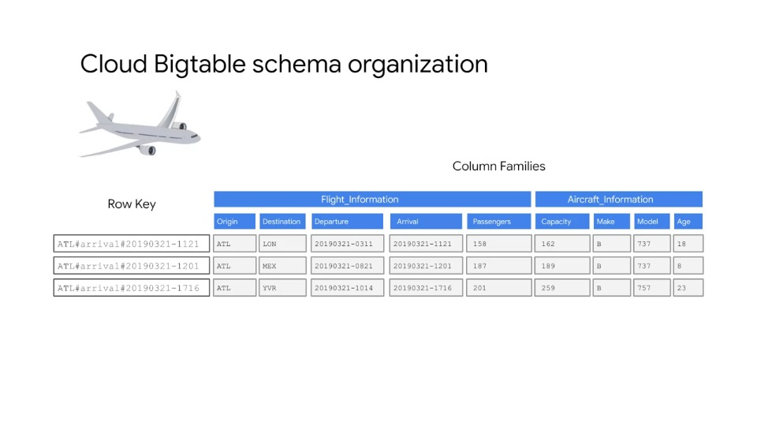

### Queries that use the row key, a row prefix, or a row range are the most efficient

#### Example query: current arrival delays for flights from Atlanta

Say the most common query is for current arrival delays in Atlanta. That will involve averaging flight delays over the last 30 minutes, hence will require a Row Key of the format: `ORIGIN#arrival`

We want to show most recent flights at the top of the table, hence use a reverse timestamp, giving a Row Key of the format `ORIGIN#arrival#RTS`.

- Example 1:
    | Description     | *Row Key based on Atlanta arrivals*            |
    |-----------------|------------------------------------------------|
    | Row Key format  | `ORIGIN#arrival`                               |
    | Example Row Key | `ATL#arrival#20190321-1005`                    |
    | Result          | Puts latest flights at the bottom of the table |

- Example 2:
    | Description     | *Reverse timestamp to the Rowkey*           |
    |-----------------|---------------------------------------------|
    | Row Key format  | `ORIGIN#arrival#RTS`                        |
    | Example Row Key | `ATL#arrival#12345678`                      |
    | Result          | Puts latest flights at the top of the table |

#### Use reverse timestamps when your most common query is for the most recent values

Timestamps can be reversed by subtracting the timestamp (e.g. in milliseconds since Epoch), from a large or maximum value for long integers.

E.g. - Java implementation:

```java
// key is ORIGIN#arrival#REVTS
String key = info.getORIGIN() //
  + "#arrival" //
  + "#" + (Long.MAX_VALUE - ts.getMillis()); // reverse timestamp
```

## What happens when data in Cloud Bigtable is changed?

So far, we have discussed adding and querying the data. Now we will see how Bigtable handles removal. When you delete data, the row is marked for deletion, and skipped during subsequent processing. It is not immediately removed. 

If you want to make a change to the data, a new row is appended sequentially to the end of the table and the previous version is marked for deletion. So both rows exist for a period of time.

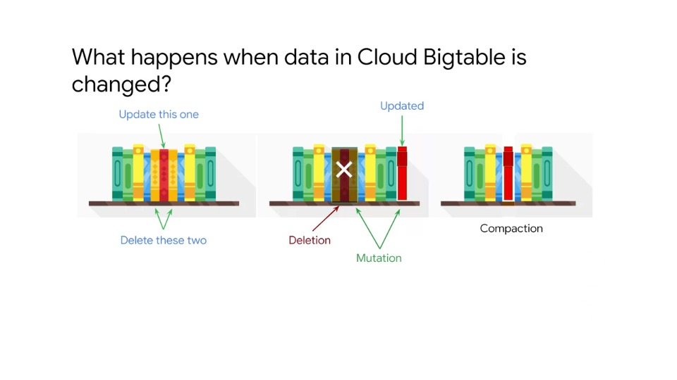

Periodically, Cloud Bigtable compacts the table, removing rows marked for deletion and reorgansing the data for read and write efficiency.

## Optimising data organisation for performance

Distributing the write across nodes provides the best write performance. One way to accomplish this are by choosing Row Keys that are randomly distributed.

However, choosing a Row Key that groups related rows so they're adjacent makes it much more efficient to read multiple rows at one time.

In the airline example, if we were collecting weather data from the airport cities, we might construct a key consisting of a hash of the city name along with a timestamp (e.g. `CityName#TS`).

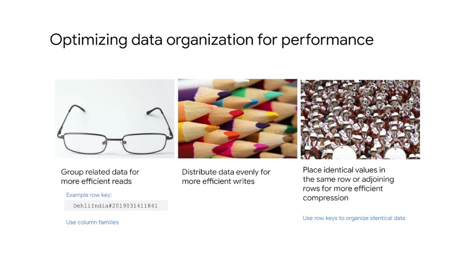

The example Row Key shown would enable pulling all the data for Delhi, India as a contiguous range of rows. Whenever there are rows containing multiple column values that are related, it is a good idea to group them into a column family.

Some NoSQL databases suffer performance degradation if there are too many column families. Cloud Bigtable can handle up to 100 column families without losing performance.

It is much more efficient to retrieve data from one or more column families than retrieving all of the data in a row.

There are currently no configuration settings in Cloud Bigtable for compression, however, random data cannot be compressed as efficiently as organised data.

Compression works best if identical values are near each other, either in the same row or in adjoining rows. If Row Keys are arranged such that rows with identical data are adjacent, the data can be compressed more efficiently.

## Cloud Bigtable self-improves by learning access patterns

Cloud Bigtable periodically rewrites your table to remove deleted entries, and to reorganise your data so that reads and writes are more efficient.

It tries to redistribute reads and writes equally across all Cloud Bigtable nodes.

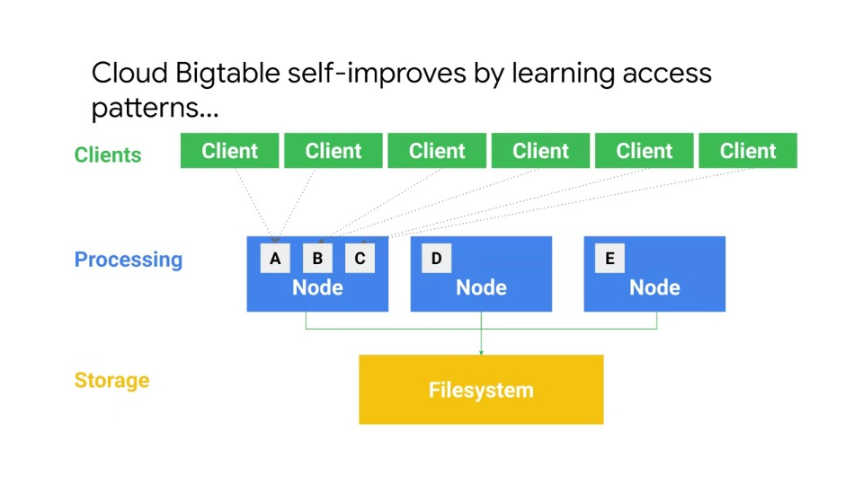

In the example above, A, B, C, D and E are not data; but rather pointers or references and cache. This is why rebalancing is not time-consuming - we are just moving pointers. Actual data resides in tablets in the Colossus file system.

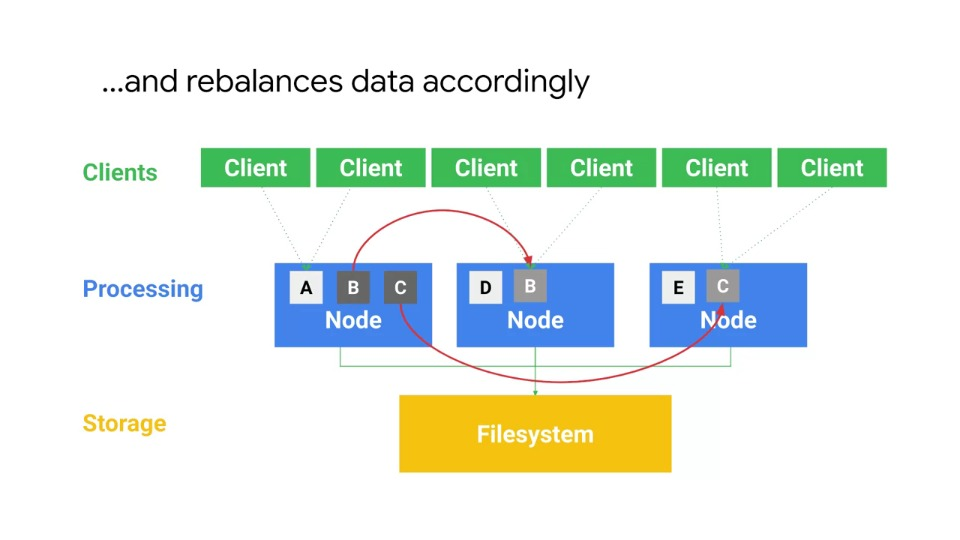

Based on the learned access patterns, Bigtable re-balances data accordingly, and balances the workload across nodes.

## Rebalance strategy: distribute reads

With a well-designed schema, reads and writes should be distributed fairly evenly across an entire table and cluster.

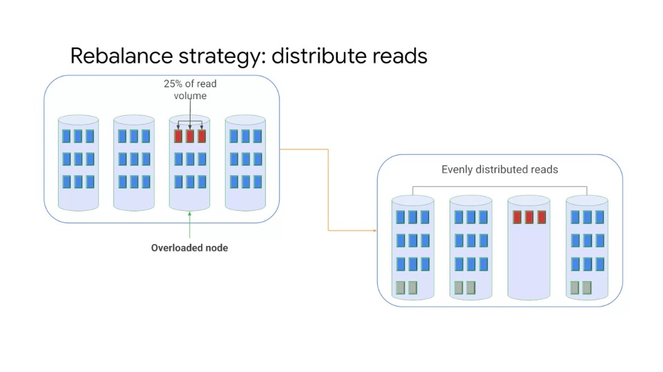

However, it is inevitable that some data will be accessed more frequently than others. In these cases, Cloud Bigtable will redistribute tablets so that reads are spread across nodes in the cluster evenly.

Note that ensuring an even distribution of reads has taken priority over evenly distributing storage across the cluster.
