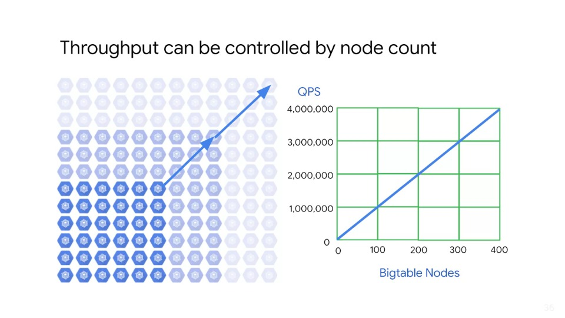

# Optimising Cloud Bigtable Performance

In this course, we will look at how you can further optimise Bigtable performance.

There are several factors that can result in slower performance:

1. The table schema is not designed correctly
    - It is essential to design a schema that allows reads and writes to be evenly distributed across the Cloud Bigtable cluster
    - Otherwise individual nodes can get overloaded which may result in slower performance
2. The workload is not appropriate for Cloud Bigtable testing with a small amount of data (e.g.: < 300GB), or for a very short period of time (seconds rather than minutes or hours)
    - Cloud Bigtable will not be able to properly optimise your data
    - It needs time to learn your access patterns and it needs large enough shards of data to make use of all of the nodes in your cluster
3. The Cloud Bigtable cluster doesn't have enough nodes
    - Typically, performance increases linearly with the number of nodes in the cluster
    - Adding more nodes can therefore improve performance
    - Monitoring tools can be used to check if the cluster is overloaded
4. Issues with network connection at work
    - Network issues can reduce throughput and can cause reads and writes to take longer than usual
    - In particular, you will see issues if your clients are not running in the same zone as your Cloud Bigtable cluster - this is because different workloads can cause performance to vary
    - You should perform tests with you own workloads to obtain the most accurate benchmarks

## Note

- The Cloud Bigtable cluster was scaled up very recently
- Cloud Bigtable can take up to 20 minutes under load to optimally distribute cluster workload across new nodes
- The Cloud Bigtable cluster uses HDD disks
  - Using HDD disks instead of SSD disks means slower response time and a significantly lower cap on the number of read requests handled per second
  - To get an idea - 500 QPS (queries per second) for HDD vs. 10,000 QPS for SSD

## Throughput can be controlled by node count

The slide above shows the numbers that are possible in terms of throughput. With 100 nodes you can handle 1 million queries per second. As can be seen, throughput scales linearly well, up to the hundreds of nodes.

## Schema design is the primary control for streaming

A high-throughput means more items are processed in a given amount of time. If you have larger rows, then fewer of them will be processed in the same amount of time.

In general, smaller rows offer higher throughput and therefore, is better for streaming performance. Cloud Bigtable takes time to process cells within rows. So if there are fewer cells within a row, then it will generally provide better performance than more cells.

Finally, selecting the right Row Key is critical. Rows are sorted lexicographically. The goal when optimising for streaming is to avoid creating hotspots when writing, which would cause Cloud Bigtable to have a split tablets and adjust loads. To accomplish this you want the data to be as evenly distributed as possible.

Reading delays, added to processing delays lead to longer response times.

## Use Cloud Bigtable replications to improve availability

Besides high-throughput, you also want to make sure your data is highly available.

Replication of Cloud Bigtable (data) enables you to increase the availability and durability of your data by copying it across multiple regions or multiple zones within the same region.

You can also isolate workloads by routing different types of requests to different clusters. A simple command like `gcloud bigtable clusters create` lets you create a cluster of Bigtable replicas. If a Cloud Bigtable cluster becomes unresponsive, replication makes it possible for incoming traffic to failover to another cluster in the same instance.

Failovers can be either manual or automatic depending on the app profile an application is using and how the app profile is configured. The ability to create multiple clusters in an instance is valuable for performance. As one can be for writing and the replica clusters exclusively for reading. 

## Run performance tests carefully for Cloud Bigtable streaming

The generalisations to isolate the right workload, increase number of nodes, decrease row size and the cell size will not apply in all cases.

In most circumstances, experimentation is the key to define the best solution.

A performance estimate is given in the documentation online for write-only workloads.

Of course, the purpose of writing data is to eventually read it. So the baseline should be considered as an ideal case.

At the time of writing (Q2/Q3 2019), a 10-node SSD cluster with 1 KB rows and a write-only workload can process 10,000 rows per second with a 6 ms delay.

This estimate will be affected by average row size, the balance and the timing of read discrete from writes and other factors.

You will want to run performance tests with your actual data and application code.

To get valid results, tests need to:

- Be run on at least 300GB of data
- Perform enough actions over a long enough period of time to give Cloud Bigtable the necessary time and conditions to learn usage patterns and perform it's internal optimisations

## Key Visualiser exposes read/write access patterns over time and key space

Key Visualiser is a tool that helps you analyse your Cloud Bigtable usage patterns.

It generates visual reports for your tables that break down your usage based on the row keys that you access.

Key Visualiser automatically generates hourly and daily scans for every table in your instance, that meets at least one of the following criteria:

1. In the last 24 hours, the table contained *at least* 30GB of data at some point in time
2. In the last 24 hours, the average of all reads or all the writes was at least 10,000 rows per second

The core of a Key Visualiser scan is a heat map, which shows the value of a metric over time, broken down into contiguous ranges of Row keys.

The x-axis of the heat map represents time and the y-axis represents row-keys.

If the metric has a low value for a group of Row Keys at a point in time, the metric appears 'cold' in the form of a dark colour. Conversely, a high value is 'hot' and appears as a bright colour. Highest values will appear in white. 

By learning such patterns, you will be able to take actions that can help keep optimal performance for Bigtable.

## Lab Intro: Streaming Data Pipelines into Bigtable

### Lab Objectives

- Launch a Dataflow pipeline to read from PubSub and write into Bigtable
- Open an HBase shell to query the Bigtable database