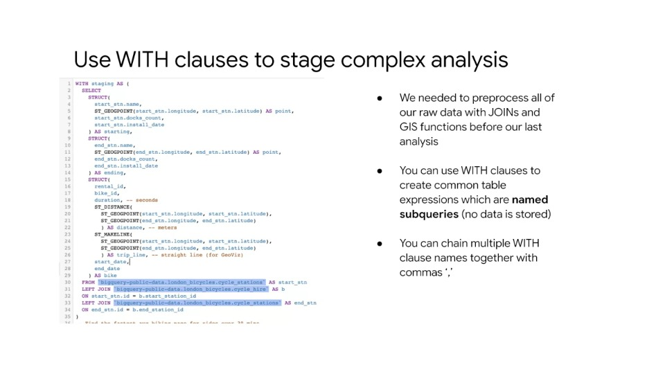
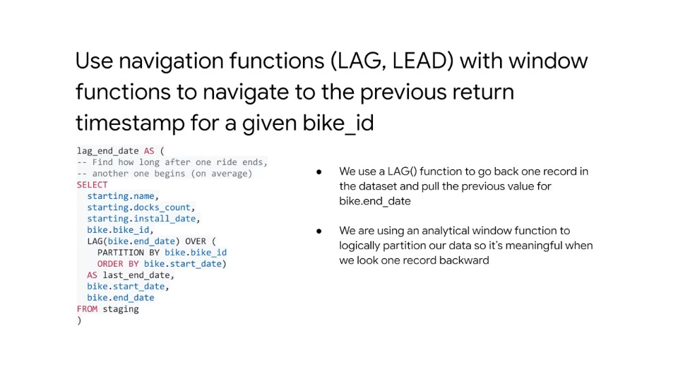
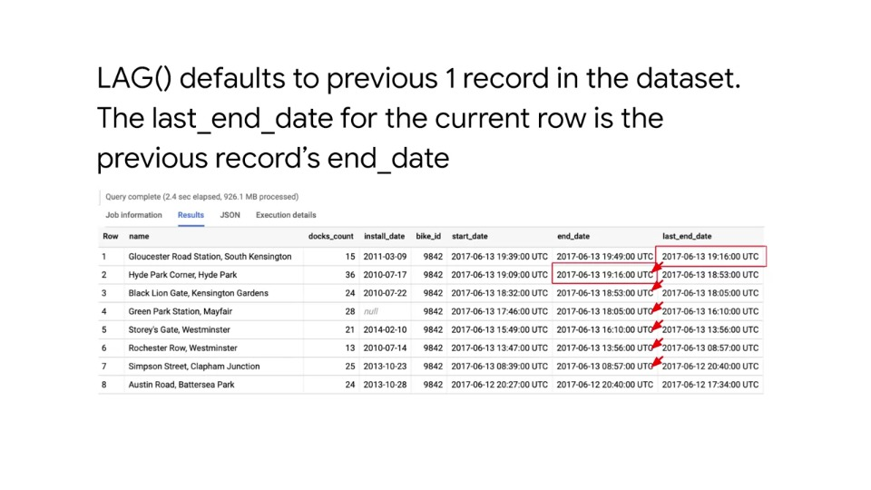
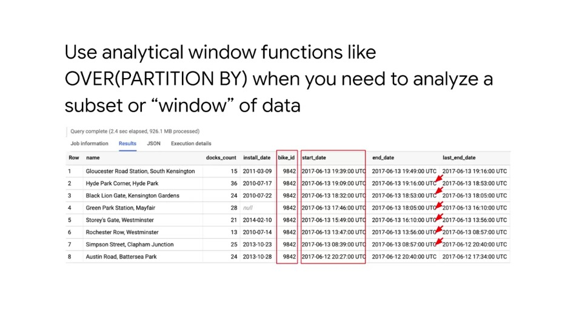
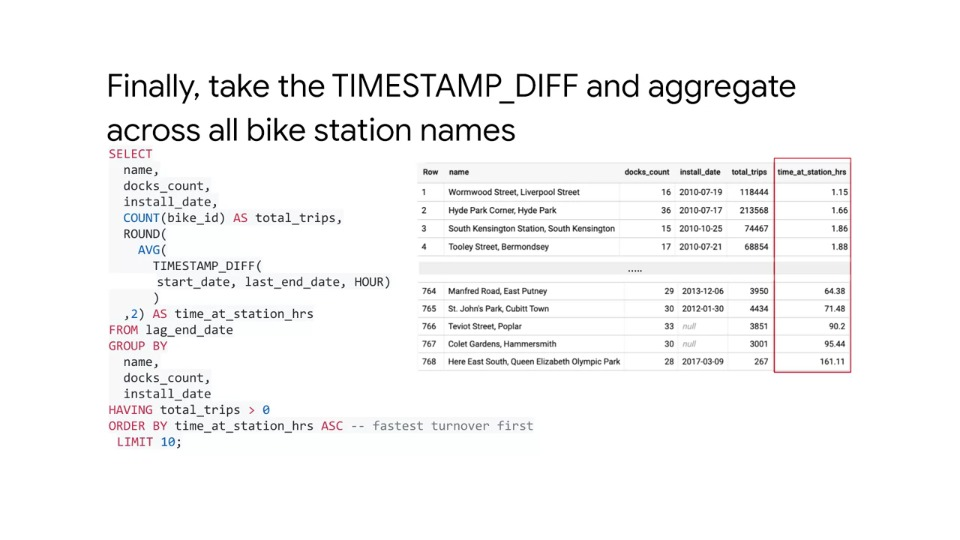
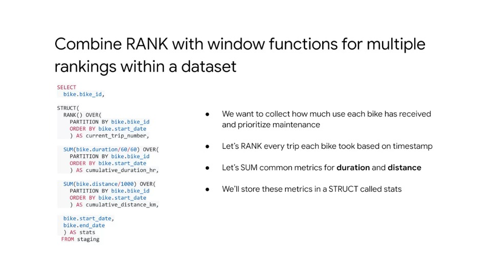
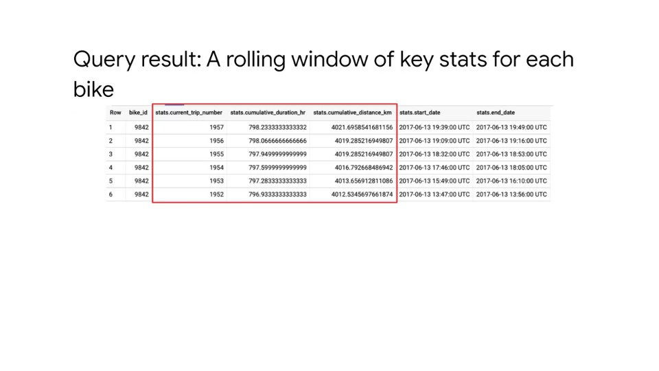

# BigQuery: Advanced functionality (and performance)

## Agenda

- **GIS (Geographic Information System) Functions**
  - Analyse 3 key questions to answer for geospatial analysis and look/use GIS functions to help solve and map the results with BigQuery GeoViz
- **`WITH` Clauses vs. Permanent Tables**
  - Explore `WITH` clauses vs. permanent tables for performance and readability
- **Analytical window(ing) functions**
  - Use of analytical window functions, that allow you to break up a given dataset and perform SQL over certain windows of data
- **Ranking functions + `ARRAY`s**
  - Ranking functions and repeated data / array data types
- **Performance Considerations**
  - Performance best practices to help govern data engineering and analysis

## GIS Functions

### Case Study: London Bike Share dataset

- 24+ million bike share trips around London
- Data from 2015-2017
- Two tables:
  - Cycle trips
  - Cycle stations (containing lat/lon of the location)

#### Analysis goals for London bike share

1. Find the fastest bike share commuters in London (avg kph between stations)
2. Find the stations with the fastest and slowest bike turnover times
3. Rank which bikes need maintenance the most based on usage metrics

#### 1. Finding the fastest bike share commuters

Steps:

1. Find the average pace, then the fastest one, between a pair of docking stations
2. Calculate the time between start of rent and end of rent (assuming this as time taken, given no GPS data)
3. For ease, use a straight line distance in km between the stations as cycle ride distance

##### Preview the `cycling_hire` rentals table

- Go to BigQuery explorer and select `cycling_hire` table from tables list in left menu and then select 'preview'
- Want to calculate speed = distance / time
- Looking at the raw data, how do we calculate how fast a bike moves between stations?


##### We can use duration (seconds) to get total travel time between stations

- In the raw data ('preview'), we can see a column for duration, but what does this figure mean?
- If we click into the schema tab, we can see in the 'Description' column that the duration is the duration of the bike trip in **seconds**
- Remember this is why it's critical when you're creating your own datasets to add in column descriptions


##### How can we calculate the distance (in Km) between the two stations

- The `cycle_hire` table only contains start and end stations names (`start_station_name` and `end_station_name` respectively)


- However, if we look in the other table `cycle_stations`, we can see this table acts as a lookup table containing latitude and longitude coordinates of each station
- As BigQuery natively supports GIS functions we can use the function `ST_DISTANCE()`
- Note that 'ST' in `ST_DISTANCE` simply refers to a special geographic data type - 'Spatial type' that is used as a backend in BigQuery for geographic data


#### Review of overall analysis approach

##### **Goal**: Find the pair of bike stations with the highest avg rider pace in km/h

##### **Analyse the schema**

1. `cycle_hire` has column `duration` (in seconds)
2. `cycle_hire` has the starting and ending bike station ids
3. `cycle_station` has the latitude and longitude for each bike station

##### **Plan the query**

1. `JOIN` the two datasets
2. Use GIS functions to turn lat/lon into geo points
3. Use GIS functions (`ST_DISTANCE()`) to calculate the distance between start and end
4. Use aggregation functions to get the average across all trips for those stations
5. Filter the data as necessary to remove anomalies

#### You can use `STRUCT()` to organise columns from different tables

- In complex queries where tabular results will be shared with others, the `STRUCT` function can be used to clearly outline which fields come from which tables
- This may seem like overkill, but for very wide schemas with 30+ columns, you're almost guaranteed to see structs
- This helps with readability of tables and understanding what data comes from where


- Note: three joins are performed because we want we to join the `cycle_station` lon/lats twice, once for start station and once for end station
- When using `STRUCT()`, nested column names are separated with a '.' to make things clear, so we have `tbl1.tbl1_column1`, `tbl2.tbl2_column1`, etc..


- The process the joining together many tables into a single table is called denormalisation
- Denormalisation is a great way to store data for fast retrieval from BigQuery without having to do these joins each time
- It's also highly performant, as BigQuery stores data in a **columnar** format instead of a **record** format, which means you're not punished for having very wide schemas

#### Calculating distance between geopoints with `ST_DISTANCE()`

- We can use GIS functions to convert lat/lon coordinates into points and take a distance between them
- The inner function in the query below uses the `ST_GEOGPOINT()` function, which converts longitude and latitude coordinate float values into a GIS point (BigQuery data type)
- This is done twice, each for longitude and latitude and then passed to the `ST_DISTANCE()` function for the final distance calculation = 663 meters
- To draw these distance lines on a map, we can use the function `ST_MAKELINE()`


#### Creating the final query with aggregation functions

Summary:

- We pull the station names, round the trip distance, convert it from meters to kilometers, count all those trips from that station and filter by only stations that have only 100 retnals or more with a `HAVING` clause
- We do the speed calculation by dividing distance by duration and taking the average
- Finally, we sort from highest average speed first in the `ORDER BY` clause

Note: It can be seen that the data is being pulled from a staging place noted in the `FROM` clause - this a actually a named sub-query or a `WITH` clause


#### Analysing the result

- The results show that the faster average pace is 16.6 km/h (~10 miles/h)
- Note that we can only speculate at what the actual route each ride took was without having GPS ride data for riders


#### Visualisaing the fastest bike commuter station pairs with BigQuery GeoViz


## Demo: GIS Functions and Mapping with BigQuery

### Takeaways

#### Using `ST_DWITHIN` to check if two location objects are within some distance


#### All longitude and latitude should be represented as Well Known Text (WKT) using the function `ST_GeogPoint`


#### Distances and regions can be represented using `ST_MakeLine` and `ST_MakePolygon`


#### Distances away from a central point can be estimated using `ST_Within`


#### Advanced GIS predicate functions (such as `ST_Intersects`, `ST_Contains`, `ST_CoveredBy`)


## `WITH` Clauses vs. Permanent Tables

- Using a `WITH` clause is a great way to help break apart a complex query
- But you can also create a series of new tables if you wanted to
- Here we will evaluate the pros and cons of each approach

### Use `WITH` clauses to stage complex analysis

- When data is being preprocessed, we can wrap the entire query with a `WITH` clause, a name and then some parentheses
- `WITH` clause queries are essentially named sub-queries, which means you could paste the entire query inside of this into a `FROM` clause in another query
- However, this wouldn't be very readable and would be hard to understand than breaking it up using a `WITH` clause
- `WITH` queries can be edited and changed multiple times and work well as a staging area for later queries
- You can also have more than one named sub-query by simply chaining them together with a comma



#### Should we replace `WITH` queries with just a `CREATE OR REPLACE TABLE AS` query?

- Preprocessing query data *could* be stored in a new table
- Storing in a new table will be much faster to query later, as the pre-processing and joins are done, and could even be shared with others
- The drawbacks of this approach is that if users only ever needed a subset of that data, i.e. they're continuously adding `WHERE` clauses, it may be much faster just to use the `WITH` clause
- This is because, even if the `WITH` clause doesn't have a `WHERE` filter that the user may specify later, BigQuery is smart enough to do what's called **predicate push-down** and do the filter first as part of the `WITH` statement even if it wasn't specified when originally created
- Lastly, if you are continuously modifying the preprocessing steps on the data, then a `WITH` query can be edited whereas a table will need to be dropped and recreated
- Choosing between `WITH` and `CREATE OR REPLACE TABLE AS` comes down to using your own judgement and depend on the situation
- One strategy: might be to start with a lot of `WITH` clauses and then promote them over time to permanent tables as each use case demand

#### Summary

- Choosing between `WITH` and `CREATE OR REPLACE TABLE AS`
- Permanent tables PROs:
  - **Speed** - preprocess the data once
  - **Shared insight** - let others access and query your data
- Permanent tables CONs:
  - **May process more data than you need** (can't do predicate pushdown)
  - **Readability** - it's not always clear what preprocessing steps were taken

#### Exercise: Practice reading multiple `WITH` statements

Goto: https://github.com/GoogleCloudPlatform/training-data-analyst/blob/master/courses/data-engineering/demos/advanced_sql_functions.md#analyzing-bike-turnover-working-with-window-functions

- Practice reading the query
- Look at parts of the query that are pulled from `WITH` clauses or named sub-queries

## Analytical window functions

### 2) Find the stations with the fastest and slowest turnover times

Recap:

1. *Finding the fastest bike share commuters in London (avg kmph between stations)*
2. **Find the stations with the fastest and slowest turnover times**
3. *Rank which bikes need maintenance the most based on usage metrics*

### Reviewing our overall analysis approach

**Goal**: Stations with the fastest and slowest bike turnover times

#### Analyze the schema

1. `cycle_hire` has `start_date` and `end_date` for each bike (timestamp)
2. `cycle_hire` has the starting and ending bike station ids
3. `cycle_station` has the count of total bike docks available (capacity)

#### Plan the query

1. `JOIN` the two datasets
2. Track the previous time a given `bike_id` was returned before it was checked out again
3. Calculate the timestamp difference between last return and this checkout
4. Aggregate by each station
5. Filter the data as necessary to remove anomalies

#### Using `LAG` and `LEAD` functions to get previous timestamp



- The slide below visually shows what the `LAG` function is doing; the last end date is taken from the previous end date from the record before
- By default, lag just looks back one record, but you can look deeper if you want to offset more



- The critical part of the query is the window function that we put with the lag
- The `..OVER( PARTITION BY bike_id ORDER BY start_date )` ensures that we're only taking the lag within all the same bike IDs
- In the example below, we can see that this is what it is doing - performing the lag for bike ID 9842 and then sorting the window of data from oldest to newest
- This allows us to transverse the past rentals accurately



- Lastly we take a simple timestamp diff between the current rental start time, and the last rentals end time, which gives us the time in hours that the bike was idle in that dock
- We can then aggregate with an average and show that result for each station name



- One additional thing you could try is filtering the dataset for only daytime hours or nighttime hours to see how time of day affects each station

## Ranking functions and `ARRAY`s

### 3) Rank which bikes need maintenance the most based on usage metrics

1. *Finding the fastest bike share commuters in London (avg kmph between stations)*
2. *Find the stations with the fastest and slowest turnover times*
3. **Rank which bikes need maintenance the most based on usage metrics**

Our last goal is to rank which bikes need maintenance based on the most usage metrics (that we're going to create)

- For the first part of the query, let's get granualr information on each trip taken by giving each bike a rank
- So for the first trip we give rank 1, for the second rank 2, etc..
- Then let's sum common metrics for duration and distance
- Finally we store all these metrics, new convenient structs that we call stats



- We then get the following results:



- What if we wanted to rank each bike against all other bikes
- This would mean, for example, one record for bike 12757 which is ranked number one is distance travelled over 5000km
- But we also want a repeated value for every trip that that bike took
- If you wanted to drill down into that data, the secret to that is the `ARRAY` data type


### Demo - Ranking Bike Maintenance: Working with window functions and `ARRAY`s

- This time we're looking at individual bike IDs and ranking them in accordance to the problem of solving which bikes need to be maintained the most based on how many hours the bike is ridden; how much distance is actually travelled
- We're going to be doing that with window functions like logical partitions (not column partitions) and then `ARRAY`s with different levels of granularity in a given dataset

#### Query

```sql
-- start with staging query
WITH staging AS (
  SELECT
    --put starting and ending stations inside of their own STRUCTs
    STRUCT(
      start_stn.name,
      ST_GEOGPOINT(start_stn.longitude, start_stn.latitude) AS point,
      start_stn.docks_count,
      start_stn.install_date
    ) AS starting,
    STRUCT(
      end_stn.name,
      ST_GEOGPOINT(end_stn.longitude, end_stn.latitude) AS point,
      end_stn.docks_count,
      end_stn.install_date
    ) AS ending,
    -- put all transactional info about rental in another STRUCT
    STRUCT(
      rental_id,
      bike_id,
      duration, --seconds
      ST_DISTANCE(
        ST_GEOGPOINT(start_stn.longitude, start_stn.latitude),
        ST_GEOGPOINT(end_stn.longitude, end_stn.latitude)
      ) AS distance, --meters
      ST_MAKELINE(
        ST_GEOGPOINT(start_stn.longitude, start_stn.latitude),
        ST_GEOGPOINT(end_stn.longitude, end_stn.latitude)
      ) AS trip_line, -- stright line (for GeoViz)
      start_date,
      end_date
    ) AS bike
  FROM `bigquery-public-data.london_bicycles.cycle_stations` AS start_stn
  LEFT JOIN `bigquery-public-data.london_bicycles.cycle_hire` AS b
  ON start_stn.id = b.station_id
  LEFT JOIN `bigquery-public-data.london_bicycles.cycle_stations`  AS end_stn
  ON end_stn.id = b.end_station_id
)

-- Collect key maintenance stations for each bike on total usage
, maintenance_stats AS ( -- another (chained) entry to WITH clause
  SELECT
    bike.bike_id,

    STRUCT(

      -- for a given bike id, give me every trip that bike has taken and order it

      RANK() OVER(                    -- rank each trip
        PARTITION BY bike.bike_id     -- for a bike id partition
        ORDER BY bike.start_date      -- order by start_date
      ) AS current_trip_number,       -- store as column current_trip_number

      -- for a given bike id, give me the total trip duration

      SUM(bike.duration/60/60) OVER(  -- sum trip duration in hrs
        PARTITION BY bike.bike_id     -- for a bike id partition
        ORDER BY bike.start_date      -- order by start_date
      ) AS cumulative_duration_hr,    -- store as column cumulative_duration_hr

      -- for a given bike id, give me the total trip distance

      SUM(bike.distance/1000) OVER(   -- sum trip distance
        PARTITION BY bike.bike_id     -- for a bike id partition
        ORDER BY bike.start_date      -- order by start date
      ) AS cumulative_distance_km,    -- as cumulative_distance_km

      bike.start_date,
      bike.end_date
    ) AS stats
  FROM staging
)

SELECT
  -- High level summary
  RANK() OVER(
    ORDER BY MAX(stats.cumulative_distance_km) DESC
  ) AS most_distance_km_rank,
  bike_id,
  MAX(stats.cumulative_distance_km) AS distance_travelled,
  -- Detail within array (show 10 most recent rides)
  ARRAY_AGG(stats ORDER BY stats.end_date DESC LIMIT 10) AS maint_stats -- ARRAY_AGG aggregates the stats calculated above into an ARRAY
FROM maintenance_stats
GROUP BY bike_id
ORDER BY most_distance_km_rank LIMIT 10
```

#### Final results

In the final results we can see that our data is in an ARRAY format, given multiple repeated rows per `most_distance_km_rank` and `bike_id`

| Row | most_distance_km_rank | bike_id | distance_travelled | maint_stats.current_trip_number | maint_stats.cumulative_duration_hr | maint_stats.cumulative_distance_km | ... |
|---|---|-------|-----------|------|-----------|----------|-----|
| 1 | 1 | 12757 | 5837.8218 | 2743 | 964.91666 | 5837.821 | ... |
|   |   |       |           | 2742 | 964.76666 | 5835.773 | ... |
|   |   |       |           | 2741 | 964.59999 | 5833.881 | ... |
|   |   |       |           | 2740 | 964.49999 | 5833.039 | ... |
|   |   |       |           | ...  | ...       | ...      | ... |
