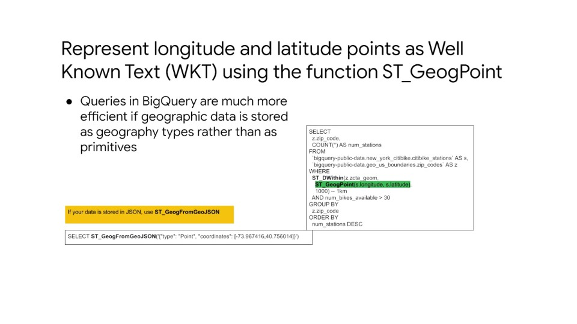
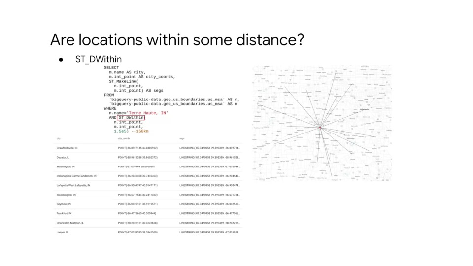

# BigQuery: Advanced functionality (and performance)

## Agenda

- GIS (Geographic Information System) Functions
  - Analyse 3 key questions to answer for geospatial analysis and look/use GIS functions to help solve and map the results with BigQuery GeoViz
- `WITH` Clauses vs. Permanent Tables
  - Explore `WITH` clauses vs. permanent tables for performance and readability
- Analytical window(ing) functions
  - Use of analytical window functions, that allow you to break up a given dataset and perform SQL over certain windows of data
- Ranking functions + `ARRAY`s
  - Ranking functions and repeated data / array data types
- Performance Considerations
  - Performance best practices to help govern data engineering and analysis

## GIS Functions

### Case Study: London Bike Share dataset

- 24+ million bike share trips around London
- Data from 2015-2017
- Two tables:
  - Cycle trips
  - Cycle stations (containing lat/lon of the location)

#### Analysis goals for London bike share

1. Find the fastest bike share commuters in London (avg kph between stations)
2. Find the stations with the fastest and slowest bike turnover times
3. Rank which bikes need maintenance the most based on usage metrics

#### 1. Finding the fastest bike share commuters

Steps:

1. Find the average pace, then the fastest one, between a pair of docking stations
2. Calculate the time between start of rent and end of rent (assuming this as time taken, given no GPS data)
3. For ease, use a straight line distance in km between the stations as cycle ride distance

##### Preview the `cycling_hire` rentals table

- Go to BigQuery explorer and select `cycling_hire` table from tables list in left menu and then select 'preview'
- Want to calculate speed = distance / time
- Looking at the raw data, how do we calculate how fast a bike moves between stations?

##### We can use duration (seconds) to get total travel time between stations

- In the raw data ('preview'), we can see a column for duration, but what does this figure mean?
- If we click into the schema tab, we can see in the 'Description' column that the duration is the duration of the bike trip in **seconds**
- Remember this is why it's critical when you're creating your own datasets to add in column descriptions

##### How can we calculate the distance (in Km) between the two stations

- The `cycle_hire` table only contains start and end stations names (`start_station_name` and `end_station_name` respectively)

- However, if we look in the other table `cycle_stations`, we can see this table acts as a lookup table containing latitude and longitude coordinates of each station
- As BigQuery natively supports GIS functions we can use the function `ST_DISTANCE()`
- Note that 'ST' in `ST_DISTANCE` simply refers to a special geographic data type - 'Spatial type' that is used as a backend in BigQuery for geographic data

#### Review of overall analysis approach

##### **Goal**: Find the pair of bike stations with the highest avg rider pace in km/h

##### **Analyse the schema**

1. `cycle_hire` has column `duration` (in seconds)
2. `cycle_hire` has the starting and ending bike station ids
3. `cycle_station` has the latitude and longitude for each bike station

##### **Plan the query**

1. `JOIN` the two datasets
2. Use GIS functions to turn lat/lon into geo points
3. Use GIS functions (`ST_DISTANCE()`) to calculate the distance between start and end
4. Use aggregation functions to get the average across all trips for those stations
5. Filter the data as necessary to remove anomalies

#### You can use `STRUCT()` to organise columns from different tables

- In complex queries where tabular results will be shared with others, the `STRUCT` function can be used to clearly outline which fields come from which tables
- This may seem like overkill, but for very wide schemas with 30+ columns, you're almost guaranteed to see structs
- This helps with readability of tables and understanding what data comes from where

- Note: three joins are performed because we want we to join the `cycle_station` lon/lats twice, once for start station and once for end station
- When using `STRUCT()`, nested column names are separated with a '.' to make things clear, so we have `tbl1.tbl1_column1`, `tbl2.tbl2_column1`, etc..

- The process the joining together many tables into a single table is called denormalisation
- Denormalisation is a great way to store data for fast retrieval from BigQuery without having to do these joins each time
- It's also highly performant, as BigQuery stores data in a **columnar** format instead of a **record** format, which means you're not punished for having very wide schemas

#### Calculating distance between geopoints with `ST_DISTANCE()`

- We can use GIS functions to convert lat/lon coordinates into points and take a distance between them
- The inner function in the query below uses the `ST_GEOGPOINT()` function, which converts longitude and latitude coordinate float values into a GIS point (BigQuery data type)
- This is done twice, each for longitude and latitude and then passed to the `ST_DISTANCE()` function for the final distance calculation = 663 meters
- To draw these distance lines on a map, we can use the function `ST_MAKELINE()`

#### Creating the final query with aggregation functions

Summary:

- We pull the station names, round the trip distance, convert it from meters to kilometers, count all those trips from that station and filter by only stations that have only 100 retnals or more with a `HAVING` clause
- We do the speed calculation by dividing distance by duration and taking the average
- Finally, we sort from highest average speed first in the `ORDER BY` clause

Note: It can be seen that the data is being pulled from a staging place noted in the `FROM` clause - this a actually a named sub-query or a `WITH` clause

#### Analysing the result

- The results show that the faster average pace is 16.6 km/h (~10 miles/h)
- Note that we can only speculate at what the actual route each ride took was without having GPS ride data for riders

#### Visualisaing the fastest bike commuter station pairs with BigQuery GeoViz

### Demo: GIS Functions and Mapping with BigQuery

#### Takeaways

##### Using `ST_DWITHIN` to check if two location objects are within some distance

##### All longitude and latitude should be represented as Well Known Text (WKT) using the function `ST_GeogPoint`

##### Distances and regions can be represented using `ST_MakeLine` and `ST_MakePolygon`

##### Distances away from a central point can be estimated

##### Advanced GIS predicate functions

