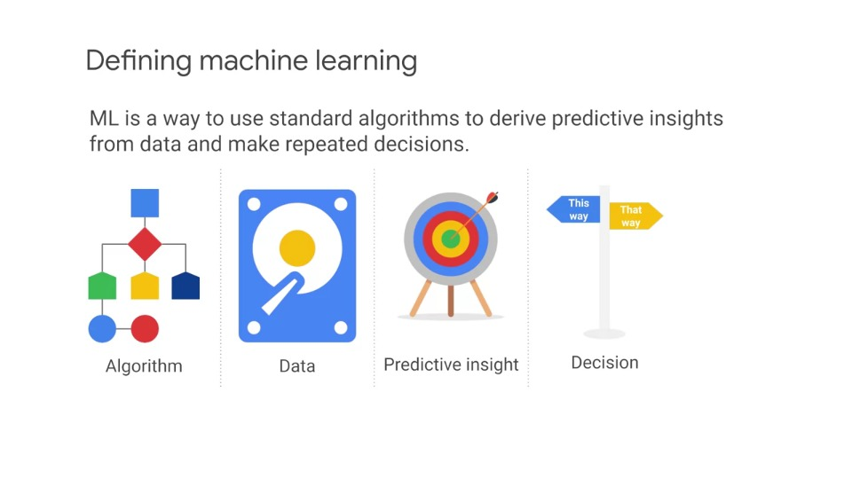
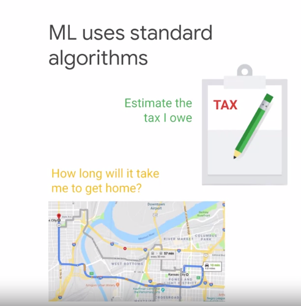
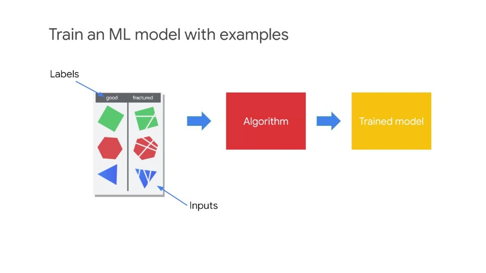
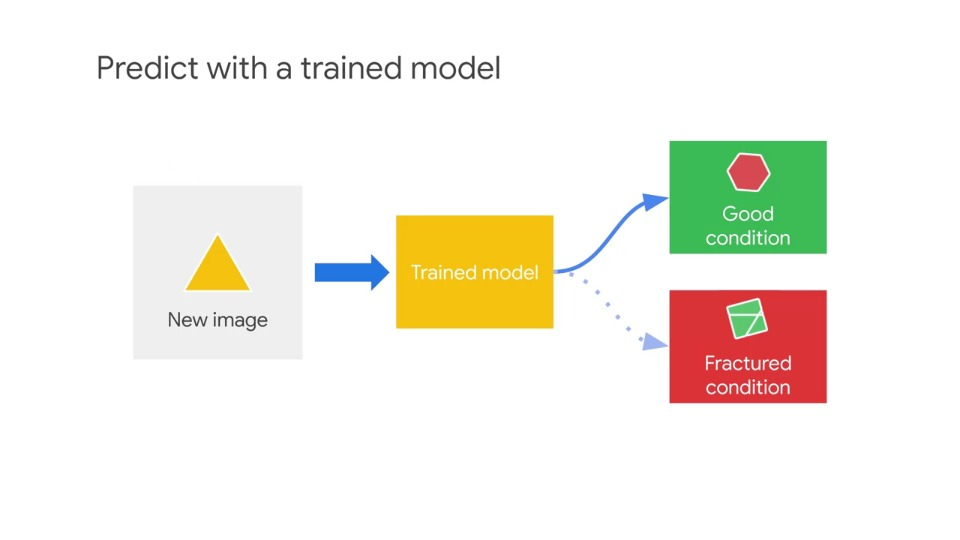
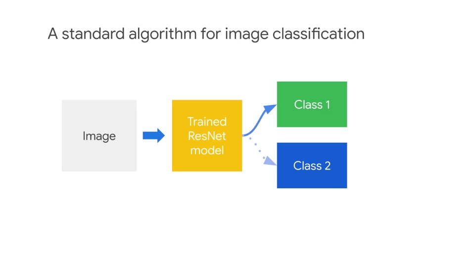
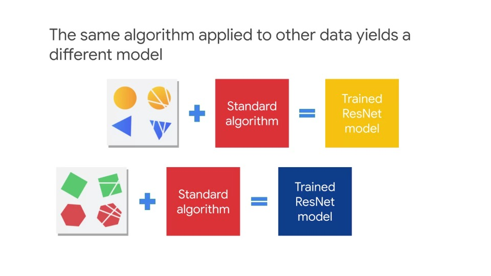
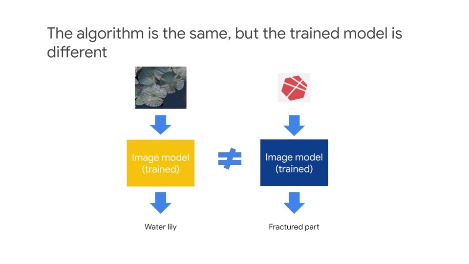

# Analytics and AI

## Agenda
- Introduction to ML (what is ML?)
- Machine Learning and GCP
- Qwik, Draw
- Building Bespoke Machine Learning Models with AI Platform
- Lab: AI Platform Qwik Start
- Cloud AutoML

## What is ML?

### Defining machine learning

> ML is a way to use standard algorithms to derive predictive insights from data and make repeated decisions

- To derive predictive insights from data and make repeated decisions, you do this using algorithms that are relatively general and applicable to a wide variety of datasets
- Think of a company and how they use their data today:
  - Perhaps they have a dashboard that business analysts and decision-makers view on a daily basis, or report that's read on a monthly basis
  - This is an example of a backward-looking use of data - looking at historical data to create reports and dashboards
  - This is what people tend refer to when they talk about **Business Intelligence (BI)**
  - A lot of data analytics including BI is backward-looking
- To generate forward-looking or predictive insights we use **Machine Learning (ML)**
  - By looking at historical data, we can be able to make decisions based off forward-looking or predictive insights
  - Although some business analysts are able to do this - examine the data and suggest new policies or rules, for example: if it's possible to raise the price of a product in a certain region
  - They may face issues with making predictive insights without ML such as:
    - Are those predictive insights scalable?
    - Can the business analyst make such a decision for every single product in every single region?
    - Can they dynamically adjust the price every second?

### Takeaway

- In order to make decisions around predictive insights repeatable, you need ML
- ML is about making (many) predictive insights from data at a time
- It's about scaling up BI and decision-making

### ML uses standard algorithms

- The other part of the ML definition is around the use of standard algorithms
- ML uses standard algorithms to solve what looks like seemingly different problems
- Normally when we think of software, we think that programs do different things
- For example, software that you use to file your taxes is very different from the software that is used to get directions home when you're driving
- With ML, it is different as you may use the same algorithms under the hood - this is what is meant when we say ML uses standard algorithms
- But these algorithms/software can be trained to do very different things
- You can train the software to estimate the amount of taxes that you owe, or train the same software to estimate the amount of time it will take to get home

### Model training requires examples

- We use the term model because it's an approximation, it's a *model* of reality
- For example, when giving the computer lot's of historical data on drive times in New York City, the model learns relationships in the data such as traffic patterns, seasonality, time of day impact, to predict today's commute time home
- Whatever the domain ML modelling requires lots of training examples
- We can train a model to estimate tax by showing it many examples of prior year tax returns
- Or we can train a model to estimate trip duration by showing it many different journeys
- So, **the first stage of ML is to train a ML model with lots of good examples**

### Training an ML model with examples

- An example consists of an input and the correct answer for that output, that's called the **Label**
- In the case of structured data that is rows and columns of data, an input can simply be a single row of data
- In unstructured data like images, an input could be a single image say a cloud that you want to classify - is this a rain cloud or not
- Now, imagine you work for a manufacturing company, you may want to train a ML model to detect defects in the parts before they get assembled into final products for users
- Some of these parts may be good and some of the parts could be fractured or broken up
- And for each image, you'll assign the corresponding label
- And then use this set of examples as training data for your model

### Predict with a trained model

- After you train your model, you can then use it to predict the label of images that it has never seen before
- After you train the model, you can then use it to predict the label of images that it has never seen before - learn from the past, predict the future
- In this example, the input for the trained model is the image of a part
- Because the model has already been trained it's able to correctly predict whether the part is in good condition
- Note that the image here does not belong to the images from the training examples
- The ML model is able to correctly predict the image because it is able to generalise well to ***unseen*** data - this shows that it hasn't memorised the training data with which it was given
- It's learned a more general idea of *what a good looking part or a part in good condition looks like*

### Standard use cases

1. Detect a pattern in an image (image classification)
2. Predict the future of a time series (regression)
3. Understand or transcribe human speech or text (speech recognition/NLP)

So why do we say these algorithms are standard?

- Well, these algorithms exist independently of your use case
- Even though detecting manufacturing defects and parts in those images and detecting something like diseased leaves on tree images are two very different use-cases, the same algorithm - **image classification network** works for both
- Similarly, there are standard algorithms for predicting the future value of a time series dataset (regression) or to transcribe human speech to text (speech recognition/NLP)

### A standard algorithm for image classification

- ResNet is a standard algorithm for image classification
- It *may not be crucial* to understand how an image classification algorithm (such as ResNet) works, *only that* it's the algorithm that you should use if you need to classify images of automotive parts
- When you use the same algorithm on different datasets there are different features or inputs relative to the different use-cases, which can be seen visually below:

- You may wonder, isn't the logic different -- you can't possibly use the same rules for identifying defects in manufacturing that you do in identifying different types of leaves

- And you're right, the logic is different, but ML does not use logical if-then rules
- The image classification network isn't like that set of rules *if this, then that* but a function that learns how to distinguish between categories of images
- Even though we start with the same standard algorithm, after training any model on data for a specific use-case, it is now the *trained* model that works specifically for that use-case
- It is even possible to reuse the same code for the other use-cases focussed on the same kind of task
- So in our example, when identifying manufacturing defects, the higher level task is **classifying images**
- You *can* reuse the same code for another image classification problem like find examples of your products in photos posted on social media, *but* you will still have to train it separately for each use-case
- The main thing to know is **your ML model will only be *as good* as your data**

## Machine Learning and AI

### Agenda
- Introduction to Machine Learning
- **Machine Learning and GCP**
  - Lab: Classify Images of Clouds in the Cloud with AutoML Vision
  - Google's Pre-trained Machine Learning APIs
  - Qwik Start Labs:
    - Cloud Natural Language API
    - Cloud Speech API
    - Video Intelligence API
  - Quiz
  - Summary
- Qwik, Draw
- Building Bespoke Machine Learning Models with AI Platform
- Lab: AI Platform Qwik Start
- Cloud AutoML

### ML is a type of AI

- A very common question that is asked is: what's the difference between Artificial Intelligence, Machine Learning and Deep Learning
- One way to think about it is AI is a discipline like physics
- AI refers to *machines that are capable of acting autonomously, machines that think*
- AI has to do with the theory and methods to build machines that can solve problems by thinking and acting like humans
- Machine Learning is a subset of AI and can be thought of as a tool set like Newton's Laws of Mechanics
- Just as Newton's laws can be used to figure out how long it'll take a ball to drop when it falls off a cliff, you can use Machine Learning to scalably solve certain kinds of problems using dataset examples - but without the need for (completely) custom code
- Deep Learning is a type of Machine Learning that works even when the data consists of unstructured data, like images, speech, video, natural language text and so on
- One type of Deep Learning is image classification - a machine can learn how to classify images into categories when it's shown lots of different examples
- The really cool thing about Deep Learning is that oftentimes in a really complex task, it can do better than humans

### The impact of ML is scale

- The basic difference between Machine Learning and other techniques in AI is that in Machine Learning machines learn
- They don't start out intelligent, they become intelligent
- Let's say we've built a Machine Learning model to find bad manufactured parts, and then want to remove them
- Quality control is now pretty inexpensive. So what? The business factor motivating us isn't just that my business will save money...
- It's that I could also add quality control **throughout** our entire manufacturing process
- Instead of just doing the quality control at the end of the manufacturing line, we can now insert it everywhere and improve overall quality
- The opportunity is for organisations to take advantage of the ease of creating new models to continue to transform their business

### Barriers to entry have now fallen

- Much of the hype around ML now is because the barriers to entry in building these models has fallen dramatically, you don't have to be an astrophysicist to do machine learning
- This is because of the convergence of a number of critical factors:
  1. The increasing availability in data
  2. The increasing maturity and sophication of ML/DL algorithms from you to choose from
  3. The increasing power in the availability of computing hardware and software through things like cloud computing

### How does this translate to building an ML model to identify diseased leaves?

- Imagine we want to build a ML model to identify diseased leaves to predict the health of the trees
- Remember that we can do that using a standard algorithm for image classification - you don't need to have a PhD in image processing
- You just need to know which algorithm should you choose off the shelf
- But back to our ML model, another critical ingredient for ML is that data
- We need to collect lots of images of leaves - this can be done today quite easily with the camera on your phone
- Finally, we need the hardware and the software to make that happen, which today is easier than it has ever been
- We can use the cloud to power thge ML model so that we can do it cost effectively

