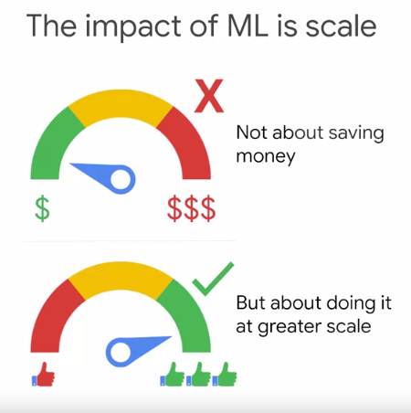

# Analytics and AI

## Machine Learning and AI

### Agenda
- Introduction to Machine Learning
- **Machine Learning and GCP**
  - Lab: Classify Images of Clouds in the Cloud with AutoML Vision
  - Google's Pre-trained Machine Learning APIs
  - Qwik Start Labs:
    - Cloud Natural Language API
    - Cloud Speech API
    - Video Intelligence API
  - Quiz
  - Summary
- Qwik, Draw
- Building Bespoke Machine Learning Models with AI Platform
- Lab: AI Platform Qwik Start
- Cloud AutoML

### ML is a type of AI

- A very common question that is asked is: what's the difference between Artificial Intelligence, Machine Learning and Deep Learning
- One way to think about it is AI is a discipline like physics
- AI refers to *machines that are capable of acting autonomously, machines that think*
- AI has to do with the theory and methods to build machines that can solve problems by thinking and acting like humans
- Machine Learning is a subset of AI and can be thought of as a tool set like Newton's Laws of Mechanics
- Just as Newton's laws can be used to figure out how long it'll take a ball to drop when it falls off a cliff, you can use Machine Learning to scalably solve certain kinds of problems using dataset examples - but without the need for (completely) custom code
- Deep Learning is a type of Machine Learning that works even when the data consists of unstructured data, like images, speech, video, natural language text and so on
- One type of Deep Learning is image classification - a machine can learn how to classify images into categories when it's shown lots of different examples
- The really cool thing about Deep Learning is that oftentimes in a really complex task, it can do better than humans

### The impact of ML is scale

- The basic difference between Machine Learning and other techniques in AI is that in Machine Learning machines learn
- They don't start out intelligent, they become intelligent
- Let's say we've built a Machine Learning model to find bad manufactured parts, and then want to remove them
- Quality control is now pretty inexpensive. So what? The business factor motivating us isn't just that my business will save money...
- It's that I could also add quality control **throughout** our entire manufacturing process
- Instead of just doing the quality control at the end of the manufacturing line, we can now insert it everywhere and improve overall quality
- The opportunity is for organisations to take advantage of the ease of creating new models to continue to transform their business

### Barriers to entry have now fallen

- Much of the hype around ML now is because the barriers to entry in building these models has fallen dramatically, you don't have to be an astrophysicist to do machine learning
- This is because of the convergence of a number of critical factors:
  1. The increasing availability in data
  2. The increasing maturity and sophication of ML/DL algorithms from you to choose from
  3. The increasing power in the availability of computing hardware and software through things like cloud computing

### How does this translate to building an ML model to identify diseased leaves?

- Imagine we want to build a ML model to identify diseased leaves to predict the health of the trees
- Remember that we can do that using a standard algorithm for image classification - you don't need to have a PhD in image processing
- You just need to know which algorithm should you choose off the shelf
- But back to our ML model, another critical ingredient for ML is that data
- We need to collect lots of images of leaves - this can be done today quite easily with the camera on your phone
- Finally, we need the hardware and the software to make that happen, which today is easier than it has ever been
- We can use the cloud to power thge ML model so that we can do it cost effectively

