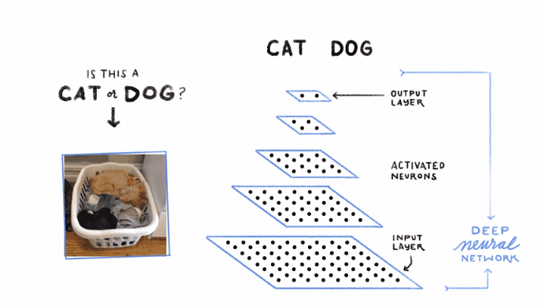
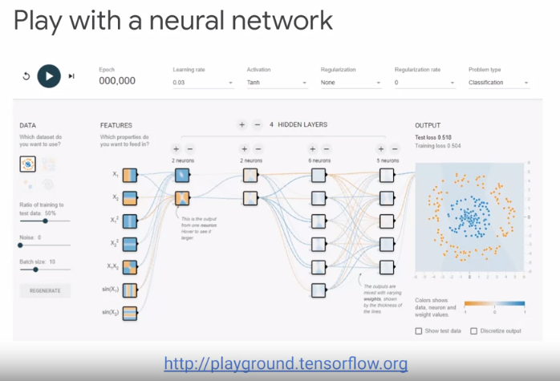

# Analytics and AI

## Game: reviewing key ML concepts

### Agenda

- Introduction to Machine Learning
- Machine Learning and GCP
- **Qwik, Draw** 
- Building Bespoke Machine Learning Models with AI Platform
- Lab: AI Platform Qwik Start
- Cloud AutoML

### Having fun with ML: Quick, Draw

- Navigate to quickdraw.withgoogle.com, and then play the quick drawing game that's powered by machine learning
- This game asks you to draw (doodle) a picture and sees if it can recognise what you're drawing
- One of the things to highlight with any machine learning problem that uses unstructured data (in this case images for image recognition) or even problems with structured data is that you need to have **good, historical, labelled training data**
- For the quickdraw google image recognition system, it was trained on 50 million images
- For example, just for blackberry images, there are ~117,000 images for the model to learn from
- Later, we will look more into the algorithm used behind the scenes here, that thinks about, just like a human would, all of the different features of an image and how to arrive at its ultimate conclusion in recognising what that image is
- The model used for the image recognition is a deep neural network (DNN), and later we'll explore how you can think about the architecture of those networks with a tool called TensorFlow Playground, where you can actually experiment with a deep neural network yourself

### Modern AI applications use deep learning

- The gif above shows how the algorithm behind the quick, draw game works
- This algorithm is a deep neural network (DNN) which has multiple layers that are designed to mimic our own human brains in the way that we perceive stimuli
- With each layer, a trained model learns more and more about the image of the dog that's hiding in the laundry basket
- Starting from things like basic detection of edges in the photo, and then colours, and ultimately arriving at a final decision of is this a cat or is this a dog
- Later in this course, there'll be a chance to build your own image recognition model, without the need to write any code

### Play with a neural network

- For additional intuition about how models such as Deep Neural Networks work, check out the TensorFlow neural network playground at playground.tensorflow.org
- TensorFlow playground is a great learning tool for understanding how computers actually "think" and experiment with neural network architectures, and shows just how far ML has come, that we can build these models at scale into applications like Google Photos
