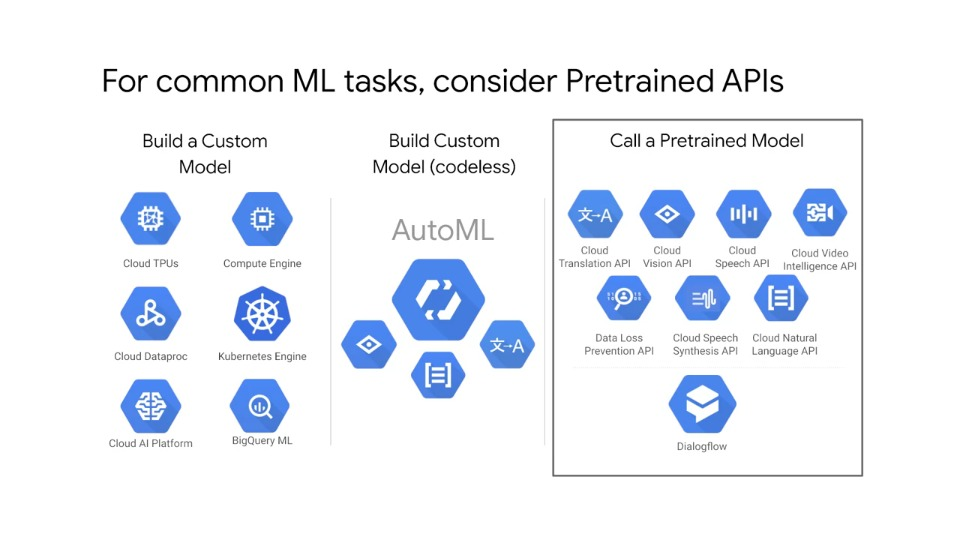

# Prebuild ML model APIs

## Unstructured data is hard

### Agenda

- **Unstructured Data is Hard**
  - This module focuses on ready-to-use ML APIs and how to use them on unstructure data
  - When we say unstructured data, we are referring to the data that comes in the form of audio, video, images, freeform text, etc
  - In this module we start off by describing why unstructured data is so hard to work with
  - Then, we will discuss some of the products available on GCP for applying machine learning to unstructured data
- ML APIs for enriching data

### How do you extract anything useful from images

- The slide above shows two images: one containing a newspaper page and another containing a sporting event
- There is a lot going on in these images and presumably a lot of useful information can be extracted from them. For example:
  - What language is the newspaper clip written in?
  - What does the article say?
  - In what year was it published?
  - What sport is being played in the image on the right?
  - What is the flag being waved?
- In this module we will talk about the technology required to extract the metadata mentioned above from these images

### Case study 1: cloud/snow-capped mountain detection

- The above shows a real-world example of how businesses use unstructured data in their products
- Can you differentiate between snow and cloud cover in the images in the slide above?
- One of GCP's customers - Airbus Defense and Space, works with satellite imagery such as the pictures shown above and it's very important that they can detect and correct imperfections in the images such as the presence of cloud formations
- Historically, this imperfection correcting process was time-consuming, prone to error and not scalable
- Airbus solved these issues with machine learning, specifically image recognition
- The image on the right in the above slide shows the presence of clouds among snow-capped mountains, a task that is difficult for the human-eye to predict/see

### Case study 2: diagnosing diabetic retinopathy

- As another example, consider the realm of health and diagnostics
- Diabetic retinopathy is a disease that can lead to irreversible blindness
- Fortunately, the disease can be caught early and treated by inspecting retinal photographs like the ones shown above
- Unfortunately, a specialist is required to inspect these photographs and make a diagnosis
- Furthermore, such specialists are not very common in some parts of the world where diabetes is most prevalant
- Google worked with a team of specialists to build a deep learning algorithm to automate the process of diagnosing diabetic retinopathy where training on labelled images like the ones shown above
- This is powerful and shows the benefit of machine learning in many real-world applications
- How can you map from images like this to a label using machine learning?
  - Adding to the complexity, keep in mind that medical images are usually extremely high resolution, so processing them requires a lot of compute

### For common ML tasks, consider Pretrained APIs

- Google Cloud Platform offers a number of products that can help businesses make sense of their unstructured data
- These include ML API products such as Cloud Vision API, Dialogflow, Cloud Speech API, etc, which are all based on both Google's data and models
- With the pretrained APIs, you don't have to worry about training models with your data, you simply pass the products your data wire and API, and they will return predictions
- The reasoning for these pretrained ML model APIs is that training models on unstructured data and developing something like vision recognition can be out of reach of many businesses, GCP's pretrained APIs simplify this process
- The downside however, is that if your unstructured data is not within the scope of the data used to train Google's pre-trained models, the APIs won't give you good results. Put differently, the pre-trained models are not a one-glove-fits-all solution and may be narrow in scope for some machine learning problems