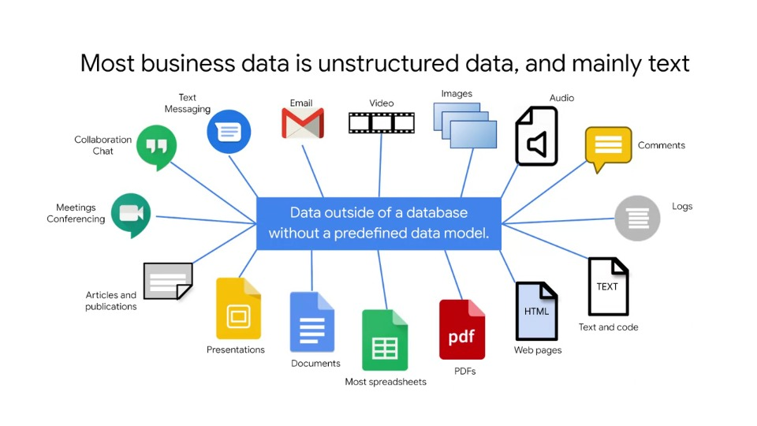
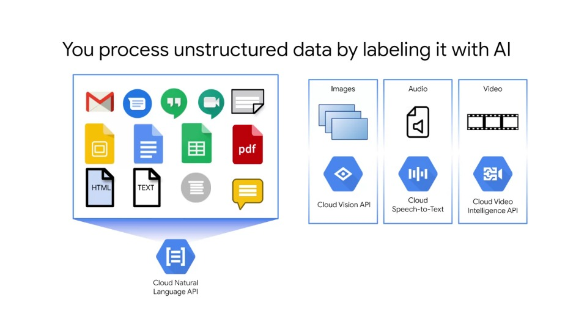
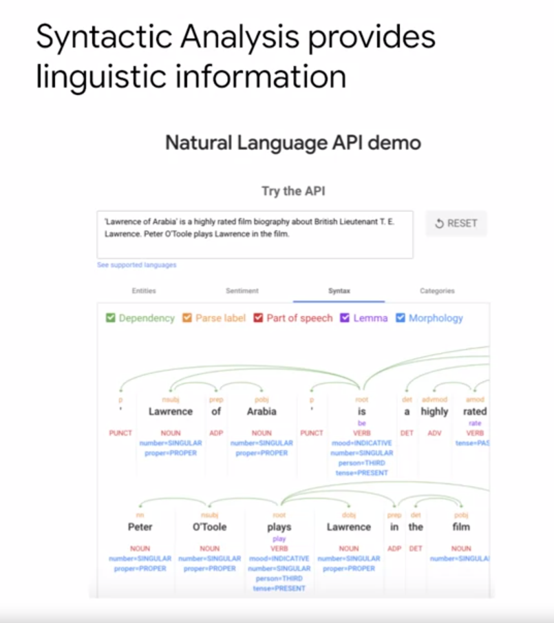
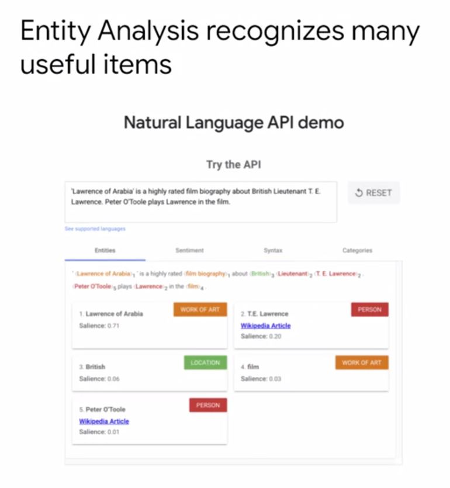
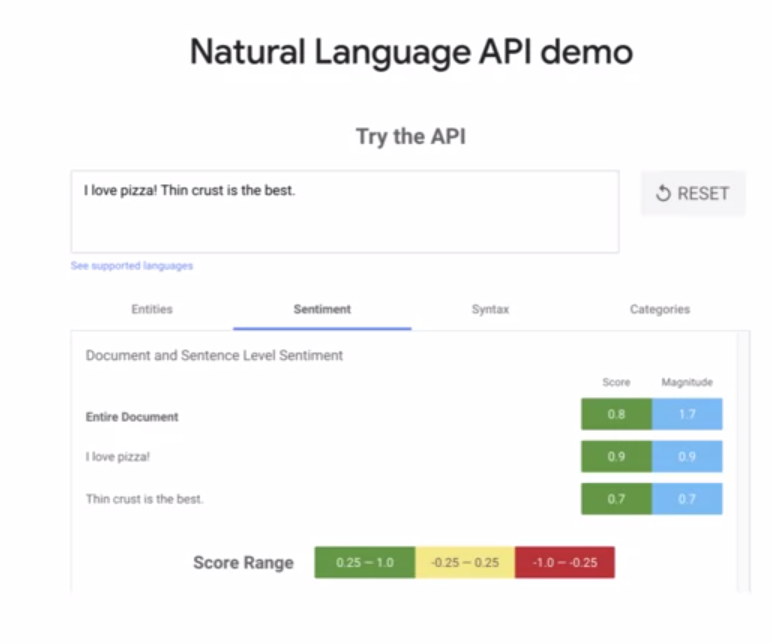
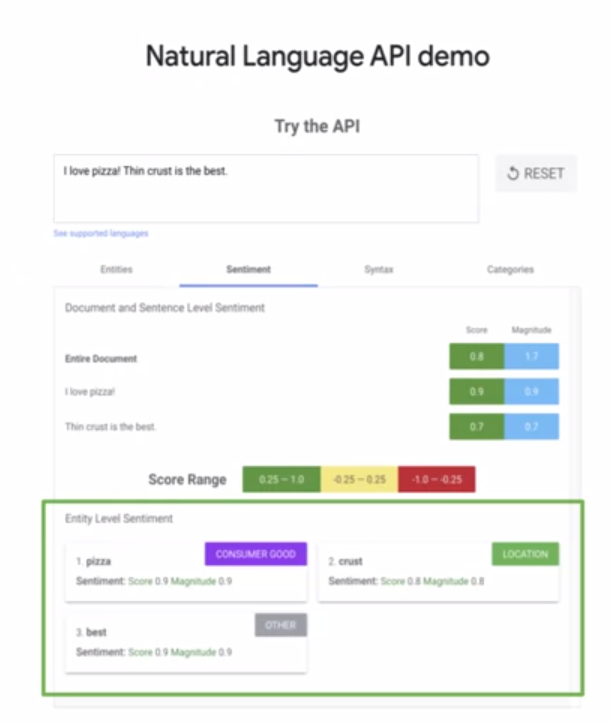

# Prebuilt ML model APIs

## ML APIs for Enriching Data

In this lecture, we will take a closer look at the actual APIs Google offers to make sense of your unstructured data

### Agenda

- Unstructured Data is Hard
- **ML APIs for Enriching Data**

### Most business data is unstructured data, and mainly text

- We know that in a typical business scenario, a company ends up using data that is being generated from multiple sources
- Typical examples of widely used data are RDBMS inventory, SAP, spreadsheets, etc
- These data sources use strict data formatting rules and host data accordingly - hence this data is referred to as **structured** data
- However, not all data sources from an organisation are structured, organisation data may come from a variety of other sources including email, audio, video, images, text, social media likes/comments, etc. These types of data are typically free or unconstrained from strict formatting and are known as **unstructured** data
- For a business, a prominent and important question is how to process unstructured data, which can typically constitute 90% of business data
- This type of data has tremendous, untapped potential to provide detailed insights, which can benefit the business
- In this lecture, we will see which AI technologies can be used to process this unstructured data to help/have business impact

### You process unstructured data by labelling it with AI

- In this module, we are going to concentrate on the cloud natural language API for processing unstructured data in the form of text
- However, keep in mind that there are equivalent APIs for image, video and audio data
- When we say that we are enriching unstructured data, we are saying that **we are applying labels to it**
- We are providing labels for questions such as:
  - What is the subject of this email?
  - Does this comment have positive or negative sentiment?
- The NLP API provides many features with which text analytics can be performed
- The first feature is Syntactic Analysis

### Syntactic Analysis provides linguistic information

- Syntactic Analysis first breaks up text into a series of tokens, which are generally words and sentences, and provides information about the tokens' internal structure and its role in the sentence
- It can label a token as a noun or a verb, singular or plural, first person or second person, masculine, feminine or neutral
- It also provides grammatical information such as case, tense, mood and voice
- The above slide is an example of the entity analysis' output for a small piece of text
- Note this demo can be tried out by navigating to the Google Cloud NLP API homepage and inputting your own text
- The slide above shows that the text "Lawrence of Arabia" is correctly tagged as a proper noun
- In production, the NLP API's output is returned as a JSON object
- At the time of writing, the API supports 10 languages - see the NLP API documentation for current language support

### Entity Analysis recognises many useful items

- The Cloud NLP API also offers entity analysis for recognising people, locations, organisations, events, artwork, consumer products, phone numbers, addresses, dates and numbers
- In the text above, notice how "TE Lawrence" is tagged as a person and "Lawrence of Arabia" is tagged as a work of art

### Sentiment Analysis labels feelings in text

- The second feature of the NLP API is Sentiment Analysis
- Sentiment Analysis identifies the emotional opinion of our writer's attitude
- It is presented as a numerical score and a magnitude for the positive/negative sentiment and intensity of the feeling
- It does not identify specific emotions, but groups them into generally positive, negative and neutral
- For example, sad and angry are both negative, while funny and happy are considered positive
- Note the sentiment analysis output for the short piece of text in the slide below
- The score of the document's sentiment indicates the overall emotion of the document
- In this case the sentiment score of the document is 0.8, which indicates that the document is very positive as expected from the text: "I love pizza! Thin crust is the best"

### Combined Entity and Sentiment Analysis

- Entity sentiment analysis combines both entity analysis and sentiment analysis, and attempts to determine positive or negative sentiment expressed about the entities within the text
- Entity sentiment is represented by a numerical score and magnitude and is determined for each mention of the entity
- Those scores are then aggregated into an overall sentiment score and magnitude for an entity
- In our example, the sentiment score for pizza of 0.9 is very high, as expected
- In our Lawrence of Arabia example, the API correctly predicts that the text is about a movie with 91% confidence
- In summary, the NLP API classifies what your text is all about
- At the time of writing, content is classified into 620 categories

