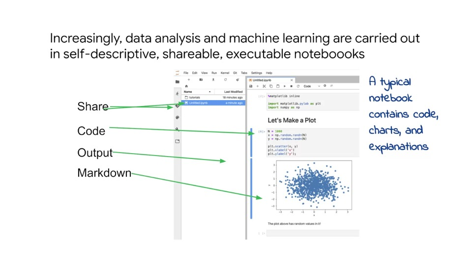
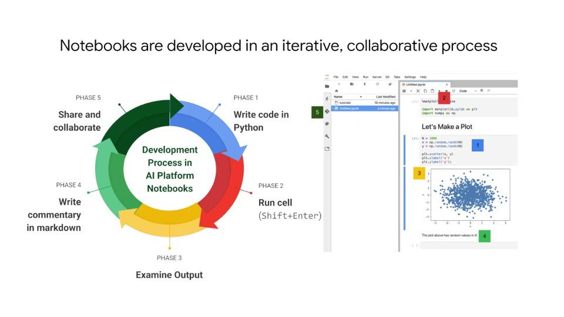
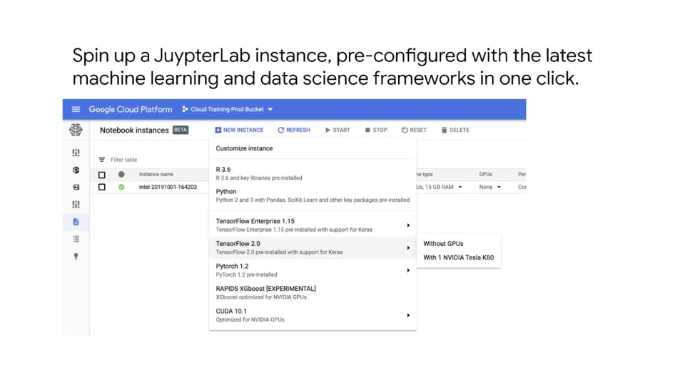
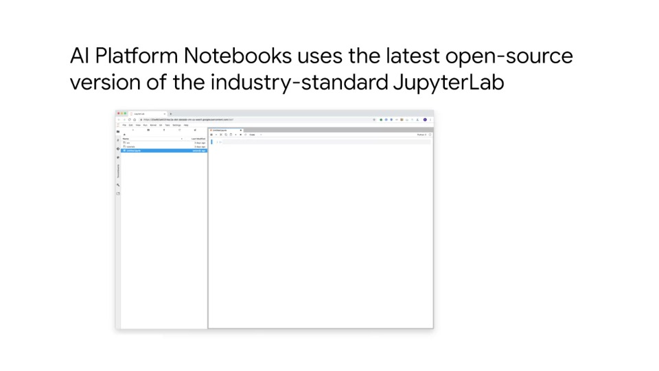
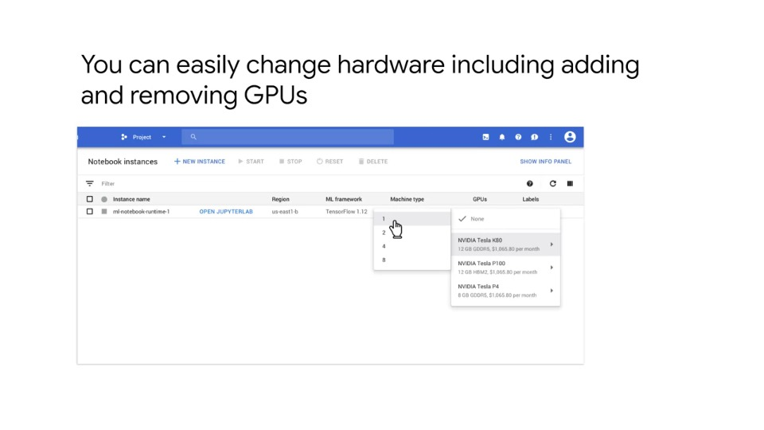
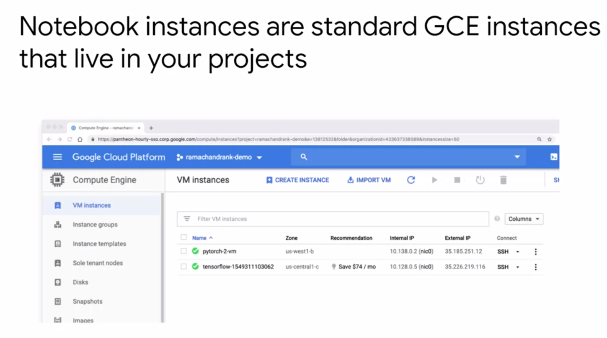
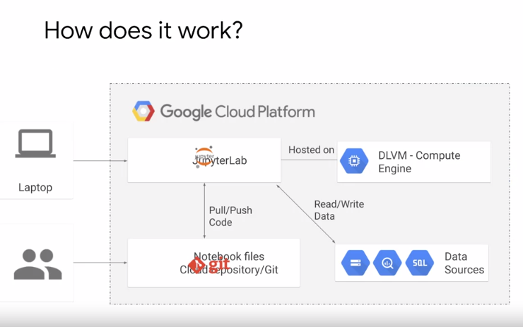
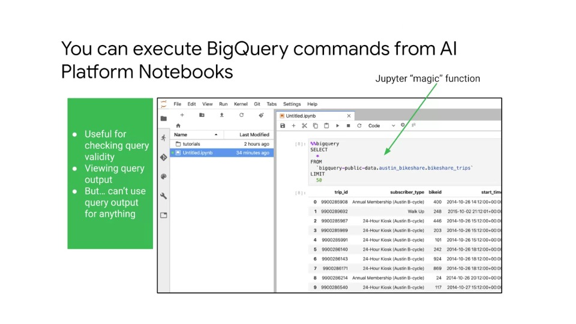
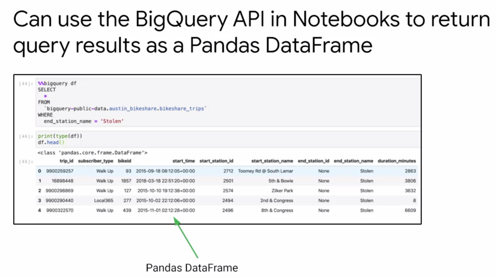
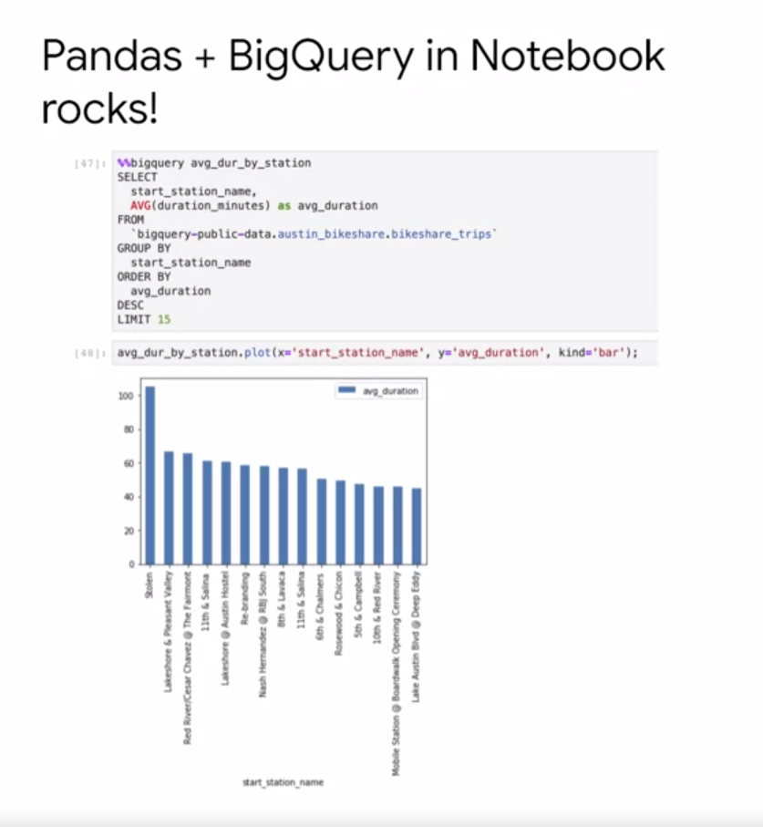

# Cloud AI Platform Notebooks

## Big Data Analytics with Cloud AI Platform Notebooks

- In this course, we are going introduce AI Platform Notebooks, an extremely useful tool for prototyping machine learning solutions

## What's a Notebook

- We will start by describing detail some of the benefits of AI platform notebooks

### Agenda

- **What's a Notebook**
- BigQuery Magic and Ties to Pandas

### Increasingly, data analysis and machine learning are carried out in self-descriptive, shareable, executable notebooks

- Standard software development tools are not very efficient for writing code for data analysis and machine learning
- Data analysis and machine learning coding often involves looking a plots, repeatedly executing small chunks of code with minor changes, and frequently having to print output
- Iteratively running whole scripts for this task can be a burden
- These were some of the issues that motivated the development of notebooks
- Notebook environments seamlessly integrate commentary, markdown, plots and code
- Rather than having a script that performs a piece of analysis, notebooks chunk individually executable pieces of code in cells

### Notebooks are developed in an iterative, collaborative process

- Notebooks work have a similar advantage to Google docs over an offline word processor in that it has the key aspect of support for collaboration
- With notebooks, instead of sending output back and forth, collaborators can edit a single notebook as needed
- If for example, you create a graph and your colleague suggests adding more data points, instead of a roundtrip of communication and edits, the colleague is free to make changes directly in the notebook
- Traditional notebooks can have a similar problem of who runs the server that hosts the notebooks, if done on a local machine which goes to sleep, other collaborators do not have access
- With GCP, AI Platform notebooks are hosted in the cloud and collaborators can develop together quite easily as the notebooks will always be available for other users
- Users working on a notebook just need to simply connect to a VM and use the provided URL
- Another way to share and collaborate notebooks is through revision/source control systems such as Git

### Spinning up a JupyterLab instance

- Spinning up an AI platform notebook can be done in just one click
- THe AI Platform notebooks use Jupyter Notebooks and JupyterLab, with some additional GCP-specific functionality
- The provided Python environment in the AI notebooks has all standard machine learning libraries pre-installed

### Change hardware icluding adding/removing GPUs

- You can easily change hardware including adding and removing GPUs
- This is a convenient feature for prototyping machine learning systems, since it's hard to know in advance what resources allocation you will need
- This is also useful for training deep learning models, since you can prototype on cheaper CPU machines before moving to train models on the much more expensive GPU instances
- When you initially set the hardware of your notebooks, you can use any GCE Compute

### Notebook instances are standard GCE instances that live in your projects

- Notebook instances are treated in the same way as standard GCE instances living in your project
- If you start an AI platform notebook, and then in the GCP console, navigate to VM instances under Compute Engine, you will see your notebook instances there

### How do AI Platform Notebooks work?

- As mentioned before, AI platform notebooks run the latest version of JupyterLab, which is hosted on Compute Engine
- This accounts for the hardward and libraries
- For collaboration, the notebooks are integrated with Git, so you can version your notebooks
- Notebooks provide connects to other GCP services such as BigQuery so that you can easily pull data in and from your notebooks

## BigQuery Magic and Ties to Pandas

- AI Platform notebooks have a convenient functionality that allows users to pull data from BigQuery directly into your notebook

### Executing BigQuery commands from a notebook

- Similar to magic functions in JupyterLab that allows users to execute system commands from within notebook cells such as checking the contents of your current directory, there are magic functions in GCP AI notebooks to do things like connect to BigQuery
- You can also define custom magic functions, the BigQuery magic functon shown in the slide before allows you to execute BigQuery queries
- This is useful for check query correctness and output

### Using BigQuery API to return query results in Pandas

- The BigQuery magic function allows you to save the query output to a Pandas DataFrame so that you can manipulate it further
- In the example below, we are saving the output of a query to a Pandas DataFrame named `df`
- You can then use Pandas to view the data in a tabular format, describe object types and generate summary statistics on the columns
- This is a really powerful and helpful feature to be able to pull query results directly into a DataFrame with a couple lines of code
- It is important to keep in mind however, that when working in a notebook there will be a limited amount of memory, so instead of pulling millions of rows, it is better to use a sampling technique to pull only a subset of the data

### Pandas + BigQuery example

- The slide below shows an example of how you can execute a BigQuery query to pull data into a Pandas DataFrame object
- Once the data is stored in a pd.DataFrame, it is possible to do things like generating a simple bar blot

