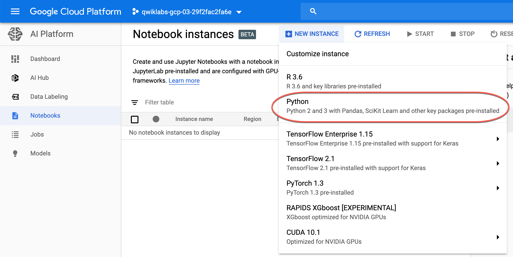
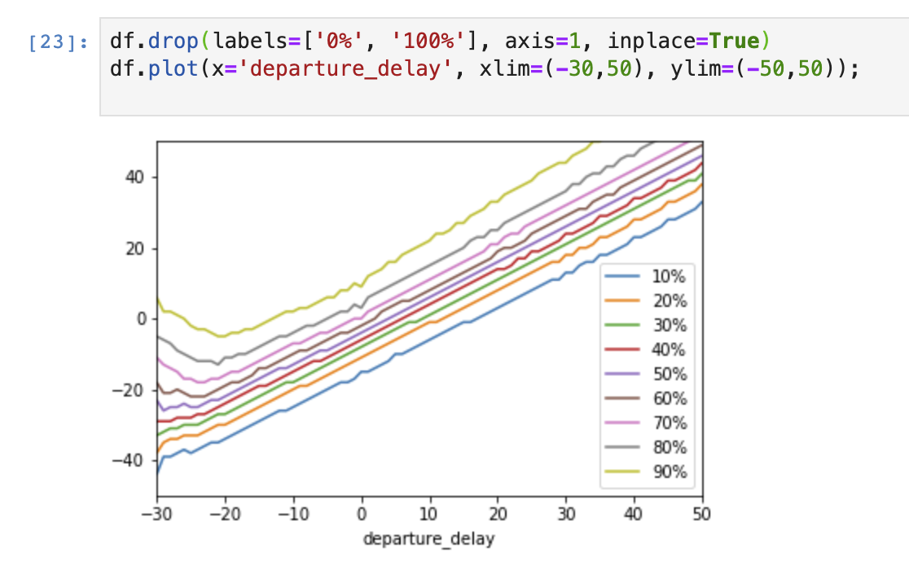

# Cloud AI Platform Notebooks

## Lab: BigQuery in JupyterLab on AI Platform

In this lab, we will explore AI Platform notebooks

### Lab Objectives

- Instantiate a Jupyter notebook on AI Platform
- Execute a BigQuery query from within a Jupyter notebook and process the output using Pandas

### Module summary (Cloud AI Platform Notebooks)

In this module we learned about:

- AI Platform notebooks and some advantages of using them including it's collaboration utilities
- How AI Platform Notebooks are ideal for prototyping machine learning pipelines and models
- How notebooks can integrate nicely with BigQuery and other GCP services/products

### Lab Overview

The purpose of this lab is to show learners how to instantiate a Jupyter notebook running on Google Cloud Platform's AI Platform service. To aid in the demonstration, a dataset with various flight departure and arrival times will be leveraged.

#### Objectives

In this lab, you learn to perform the following tasks:

- Instantiate a Jupyter notebook on AI Platform.
- Execute a BigQuery query from within a Jupyter notebook and process the output using Pandas.

### Starting a JupyterLab Notebook instance

1. Navigate to the search bar in the GCP console and type in **Notebook**.

2. Select **Notebooks** for **AI Platform**.

    

3. You'll be redirected to a page for notebook instances on AI Platform. Click on the **NEW INSTANCE** icon on the top of the page.

4. In the menu that pops down, select the **Python** option.

    

5. A screen titled **New notebook instance** will be shown. Leave the default options and click on **CREATE**.

6. After a few minutes, the AI Platform Notebooks console will have your instance name followed by **OPEN JUPYTERLAB**. Click **OPEN JUPYTERLAB**.

    

7. A new tab will open in your browser with the JupyterLab environment. Select **Python 3** under **Notebook**.

    

Your notebook is now set up.

### Execute a BigQuery query

1. Enter the following query in the first cell of the notebook.

    ```sql
    %%bigquery df
    SELECT
        departure_delay,
        COUNT(1) AS num_flights,
        APPROX_QUANTILES(arrival_delay, 10) AS arrival_delay_deciles
    FROM
        `bigquery-samples.airline_ontime_data.flights`
    GROUP BY
        departure_delay
    HAVING
        num_flights > 100
    ORDER BY
        departure_delay ASC
    ```

    The command makes use of the magic function `%%bigquery`. Magic functions in notebooks provide an alias for a system command. In this case, `%%bigquery` runs the query in the cell in BigQuery and stores the output in a Pandas DataFrame object named `df`.

2. Run the cell by hitting **Shift + Enter**, when the cursor is in the cell. Alternatively, if you navigate to the **Run** tab you can click on **Run Selected Cells**. Note the keyboard shortcut for this action in case it is not Shift + Enter. There should be no output when executing the command.

3. View the first five rows of the query's output by executing the following code in a new cell:

    ```python
    df.head()
    ```

    

### Make a plot with Pandas

We're going to use the Pandas DataFrame containing our query output to build a plot that depicts how arrival delays correspond to departure delays. Before continuing, if you are unfamiliar with Pandas the [Ten Minute Getting Started Guide](https://pandas.pydata.org/pandas-docs/stable/getting_started/10min.html) is recommended reading.

1. To get a DataFrame containing the data we need we first have to wrangle the raw query output. Enter the following code in a new cell to convert the list of `arrival_delay_deciles` into a Pandas Series object. The code also renames the resulting columns.

    ```python
    import pandas as pd

    percentiles = df['arrival_delay_deciles'].apply(pd.Series)
    percentiles.rename(columns = lambda x : '{0}%'.format(x*10), inplace=True)
    percentiles.head()
    ```

2. Since we want to relate departure delay times to arrival delay times we have to concatenate our `percentiles` table to the `departure_delay` field in our original DataFrame. Execute the following code in a new cell:

    ```python
    df = pd.concat([df['departure_delay'], percentiles], axis=1)
    df.head()
    ```

3. Before plotting the contents of our DataFrame, we'll want to drop extreme values stored in the `0%` and `100%` fields. Execute the following code in a new cell:

    ```python
    df.drop(labels=['0%', '100%'], axis=1, inplace=True)
    df.plot(x='departure_delay', xlim=(-30,50), ylim=(-50,50));
    ```

    

That concludes the lab.