# Productionising custom ML models

Say you're working with a ML expert or on a team who have built an important model that can help the business grow, how to we get that model into production?

This is what we'll discuss in this course

## Agenda

- **Phases of ML Projects**
  - Discuss different phases of an ML project
- Ways to do custom ML on GCP
  - Provide an overview of different ways to do ML in GCP
- Kubeflow
  - Using the Kubeflow tool for deploying ML models in a Kubernetes environment  
- AI Hub
  - Discuss the GCP AI Hub, a repository of machine learning resources which can be made publically available for only certain users

## Phases of ML Projects

Before we get into the technology, let's first cover what steps your team will take when doing machine learning

Here's an overview of the ML development lifecycle on GCP from ingestion to model development

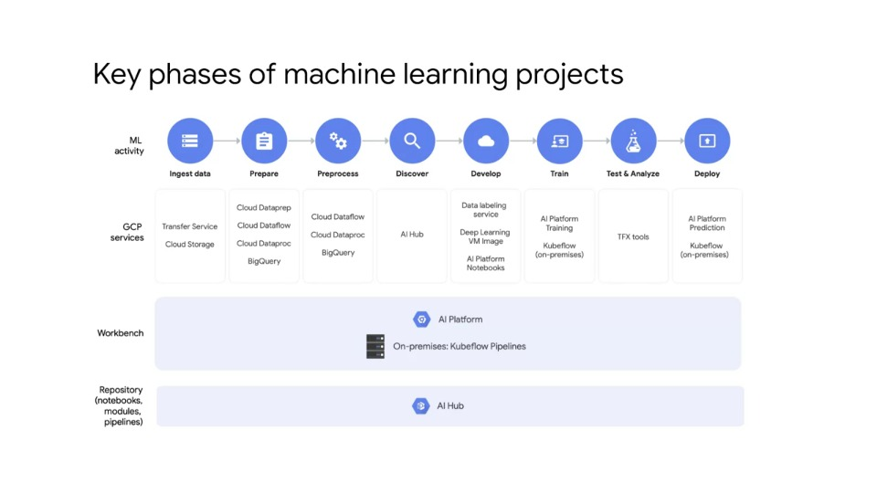

Note that the tools covered later on can be done either through a UI or with code, depending on level of experience

These high-level phases however, will be true regardless of the tool you use

Below outlines the steps in the ML development lifecycle:

1. Bring data into your central Data Lake
2. Get data ready for Machine Learning
3. Build, train, test, and deploy ML to production

### 1. Bring data into your central Data Lake

- First we ingest data from some source either internal or external to GCP to start pre-processing for training
- We can use tools like Google Cloud Storage, BigQuery or even the Data Transfer Service to bring our data into the Cloud

    | ML activities | Available tools/GCP services |
    |---------------|------------------------------|
    | Ingest Data   | Data transfer service, Cloud Storage, BigQuery |

### 2. Get data ready for Machine Learning

- Next, we can prepare our data using tools such as Dataprep, Data Fusion, BigQuery or even Dataproc
- Once we've prepared and understood our data, we can apply these same tools to pre-process our data at scale
- At this point, so as not to reinvent the wheel, we can explore the resources available on AI Hub to see if any relevant models or pipelines are already available
- If so, this can save a lot of development time

    | ML activities | Available tools/GCP services |
    |---------------|------------------------------|
    | Prepare       | Cloud Dataprep, Cloud Dataflow, Cloud DataProc, BigQuery |
    | Preprocess    | Cloud Dataflow, Cloud Dataproc, BigQuery |
    | Discover      | AI Hub |

### 3. Build, train, test, and deploy ML to production

- Once we have an idea about what we want to work with, we can start developing
- We can use the data labelling service to flush out the labels for our data and use AI platform notebooks to experiment in a Jupyter environment
- When we're done with experimentation, we're ready to train at scale
- We can do so locally using tools like Kubeflow or on the Cloud using AI platform training, which is built on top of Kubeflow
- Finally, using tools like TFX, we can test and analyse our model before finally deploying it to AI platform or Kubeflow

    | ML activities | Available tools/GCP services |
    |---------------|------------------------------|
    | Develop       | Data labelling service, Deep learning VM image, AI Platform Notebooks |
    | Train         | AI Platform Training, Kubeflow (on-premises) |
    | Test & Analyse | TFX tools |
    | Deploy        | AI Platform Prediction, Kubeflow (on-premises) |

## Ways to do custom ML on GCP

- In a previous module, we leveraged pre-trained ML APIs to process natural text
- These are great options for seeing if your use case can just use a model that's already created and trained on Google's data
- But you may want a more tailored model trained on your data
- For, that we will need a custom model. Here we will talk about the different ways of building custom models

### GCP ML Ecosystem

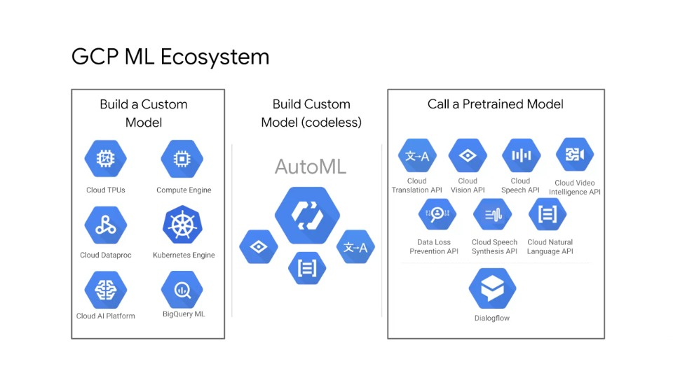

As we covered previously, there are a three ways you can do machine learning on GCP:

- Build custom models
- Build custom models without code
- Call a pre-trained model

We've already looked at pre-trained models and worked on some labs which previous invoked some of these APIs

Now, we're going to visit the other side of the spectrum and build you own custom model and productionise it in GCP

There are a few ways of doing custom model development, training and serving. We will highlight a few major wasy and then focus on four for the remainder of this course:

- AI Platform
- Kubeflow
- BigQuery ML
- AutoML

We worked with the notebooks component of the AI Platform earlier in the course when we connected to BigQuery and run commands in the notebook cells using BigQuery magic commands such as:

```python
%load_ext google.cloud.bigquery
```

and

```sql
%%bigquery
SELECT
    source_year AS year,
    COUNT(is_male) AS birth_count
FROM `bigquery-public-data.samples.natality`
GROUP BY year
ORDER BY year DESC
LIMIT 15
```

Just as we wrote SQL in the notebooks to process data, data scientists and ML engineers can write custom TensorFlow code to train and evaluate their models within their notebooks.

Note that creating tensorflow models in notebooks and using TPUs is out of scope for this course, however we will highlight areas where a data engineer is likely to be involved in Cloud AI platform projects.

### Cloud AI Platform is a fully managed service for custom machine learning models

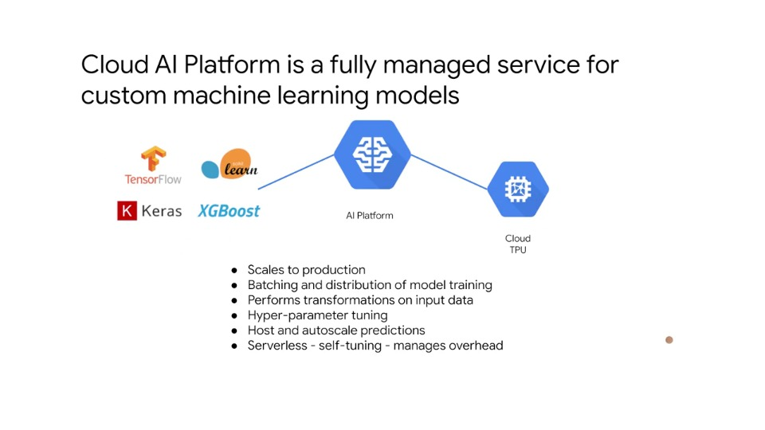

What is AI platform exactly? It's a fully managed service for custom machine learning models both training and serving predictions.

It can scale from the experimentation stage all the way to production.

You can also use features of Tensorflow including transformations on input data and performing hyperparameter tuning to choose the best model for your case

You can deploy your models to AI platform to serve predictions which will autoscale to the demands of your clients.

AI Platform also supports KubeFlow, which is Google's open source framework for building ML pipelines, which will be covered later in a lab.

Essentially, AI Platform is the engine behind doing machine learning at scale on GCP.

A data scientist can train and deploy production models from an AI platform notebook with just a few commands.

### Kubeflow Pipelines package multi-step ML workflows

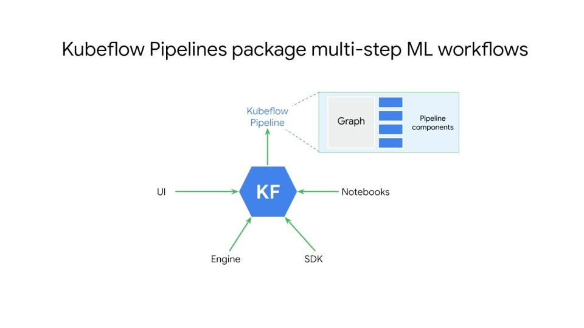

- Getting the data ready and managing the entire pipeline of machine learning is a much broader task
- As a data engineer, you will likely encounter and create Kubeflow pipelines with your ML teams
- Kubeflow is an open-source project that packages machine learning code for Kubernetes
- Kubeflow pipelines is a platform for composing, deploying and managing end-to-end machine learning workflows
- The main components of Kubeflow pipelines include a user interface for managing and tracking experiments, jobs and runs, an engine for scheduling multi-step ML workflows, an SDK for defining and manipulating pipelines and components, notebooks for interacting with the system using the SDK
- These tools are used to define, experiment withm run and share pipelines
- The pipelines consists of pipeline components which are ML steps that are assembled into a graph that described the execution pattern
- The key benefits are reuseability and portability
- You can run Kubeflow pipelines either on GCP or on other Cloud providers, so you're not locked in

### BigQuery ML empowers data analysts and scientists

- BigQuery ML allows your teams to easily build machine learning models on structured data using SQL-like syntax
- You can quickly get a model created for forecasting, classification, and recommendations right where your data already lives in BigQuery.
- Teams use BigQuery ML as a quick prototyping tool to see if machine learning will work for their data set and project
- Then you can dive into more of the advanced features of BigQuery ML like hyperparameter tuning and dataset splitting methods to fine-tune your model's performance.

In summary, BigQuery ML empowers data analysts and scientists to do the following:

- **Execute** ML initiatives without moving data from BigQuery
- **Iterate** on models in SQL in BigQuery to increase development speed
- **Automate** model selection and hyperparameter tuning

### Working with BigQuery ML

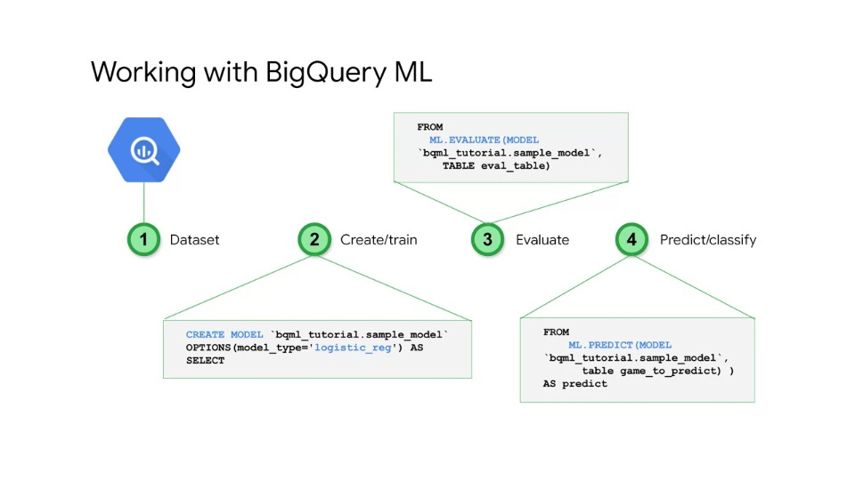

We will see how we can easily create, evaluate and then make predictions on our data all in BigQuery

It's just SQL commands like `CREATE MODEL` or `EVALUATE`, or predict just as you would write a normal SQL query, we will explore this in more depth in the labs later

### Train and serve custom models without any code with Cloud AutoML

- Lastly, another option for custom model building in GCP is AutoML
- If we have labelled training data, we can train, deploy and serve predictions using AutoML without having to write any code
- How do we generate predictions with an easy to use REST API? Again since we're using AI Platform and Kubeflow, we will be often using this to operationalise Tensorflow models

## Kubeflow

Where do data engineers come into the picture? Data engineers build data pipelines, and machine learning pipelines are no different. If we want to have a flexible pipeline for all stages of machine learning, Kubeflow is a great option.

### Perception: ML products are mostly about ML

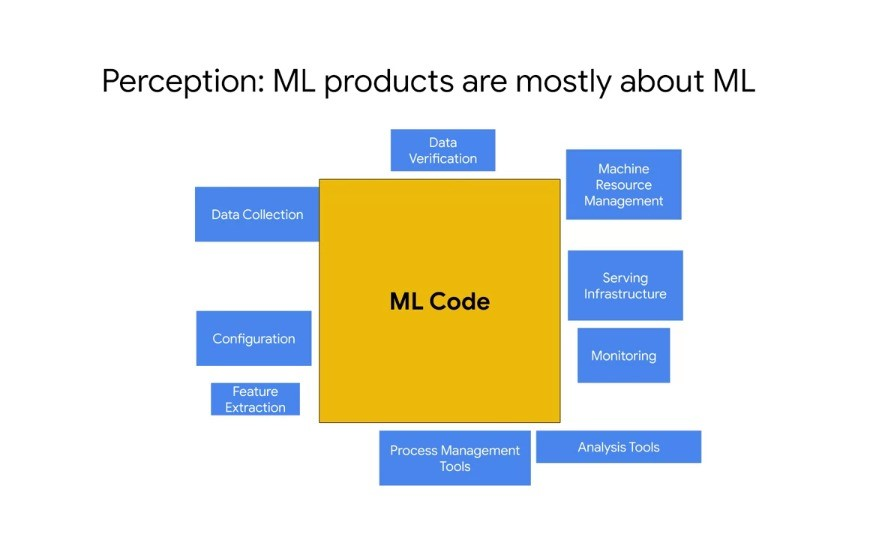

Many people think that machine learning products are all about the code that ML scientists write locally on their machines.

Does this code ensure that data going into it is clean? Can the code autoscale to clients who want to use it for serving predictions? What if we have to retrain the model, does it go off line at that point?

The truth is, Production Machine Learning systems are large, complicated distributed system. There's a lot of DevOps involved with things like monitoring and processing management tools.

Google started building Kubeflow to tackle these DevOps challenges using Kubernetes and Containers. One option to help manage the overhead of productionizing ML pipelines is to use Kubeflow.

### Kubeflow Pipeline features

The capabilities provided by Kubeflow Pipelines can largely be put into three buckets:

- ML workflow orchestration
- Share, reuse, and compose
- Rapid reliable experimentation

You can think of the benefits as similar to those of Cloud composer but better tailored for ML workloads.

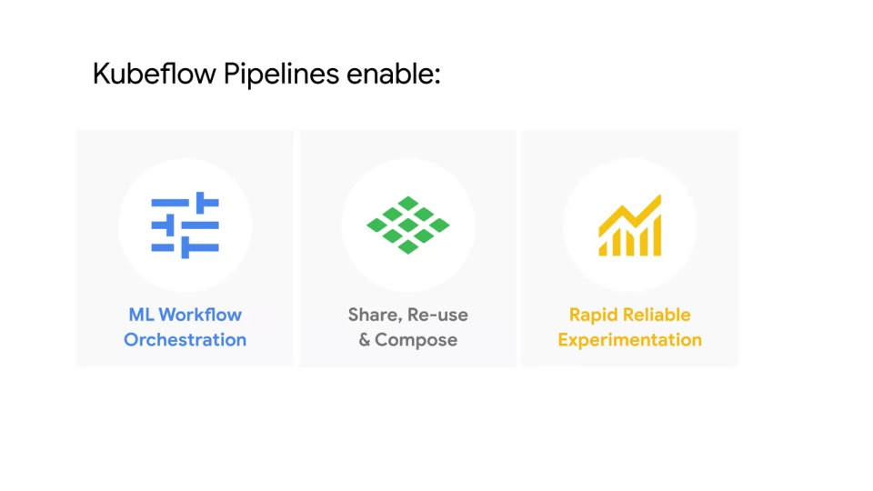

### Visual depiction of a pipeline topology

- Let's see what a pipeline looks like:

    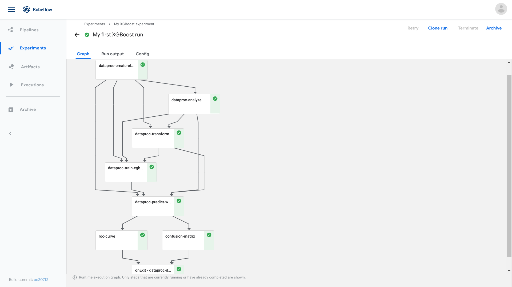

- To make things more concrete, below is a screenshot of an illustrative workflow that was run on Kubeflow Pipelines

    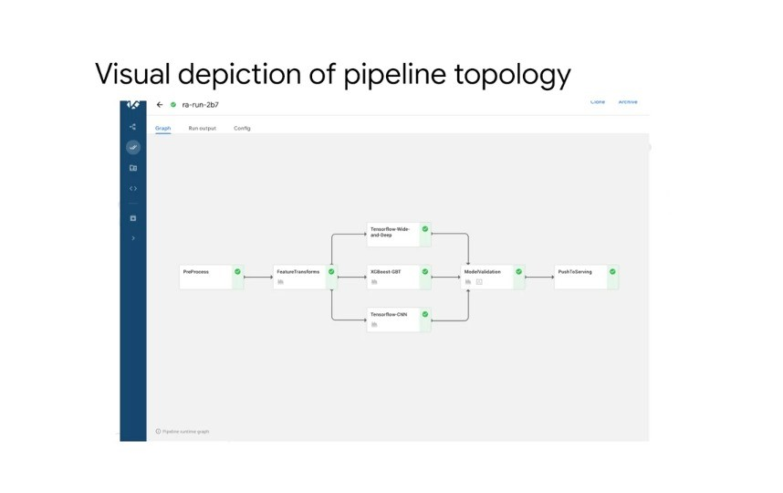

  - This is just an illustrative workflow, and users can author and run many different kinds of workflow topologies with different code and tools in the various steps of the workflow.
  - For each workflow that is run on Kubeflow Pipelines, you get a rich visual depiction of that topology so that you know what was executed as part of the workflow.
  - In this workflow, we start with a data preprocessing and validation step.  
    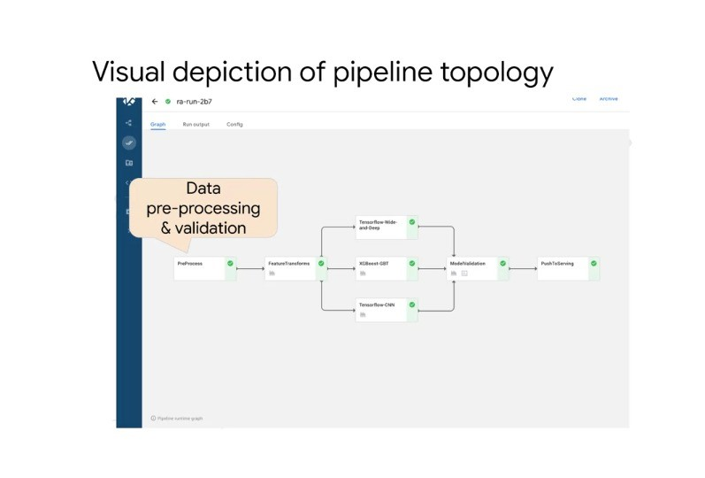
  - The preprocessed data then flows to a feature engineering step
    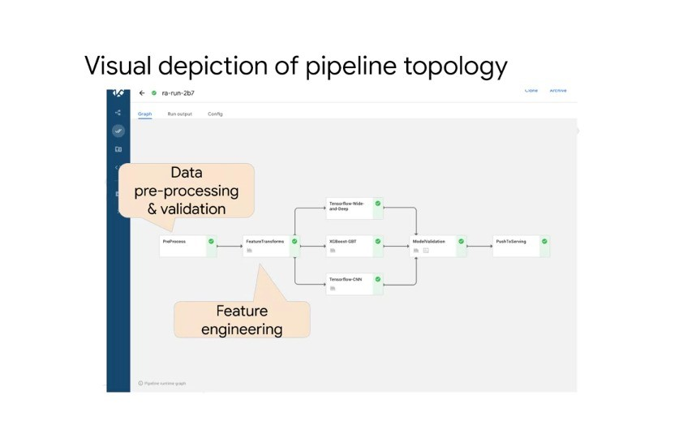
  - This is followed by a fork where we train many different kinds of models in parallel, like a wide and deep model, and XG boost model, and a convolutional neural network or CNN
    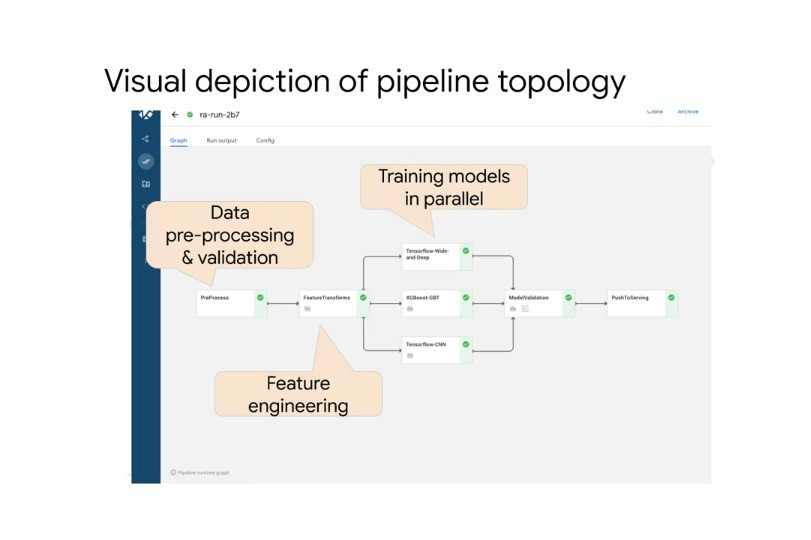

#### Click on training nodes for visualisation of metrics

- During training, you can click on the model for UI to view critical performance characteristics in the model.
- Here we can see the ROC curve of false positive rates versus true positive rates for the model during training.
- If you're familiar with TensorBoard, you can also view the TensorBoard metadata for the model as well.
    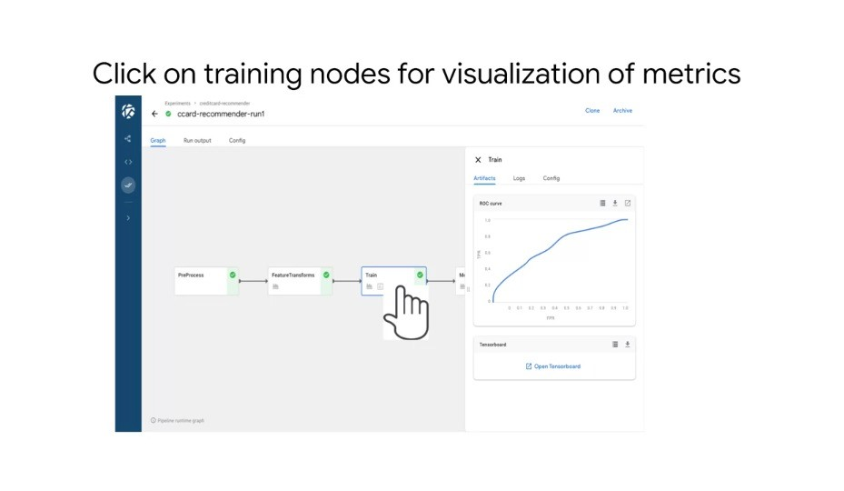

Once training is complete, the models that are trained are then analyzed and compared against each other on a test dataset, and you can choose from which one performed the best for your use case.

Most ML products will stop here and iterate back to the beginning to continue improving model performance before moving to production.

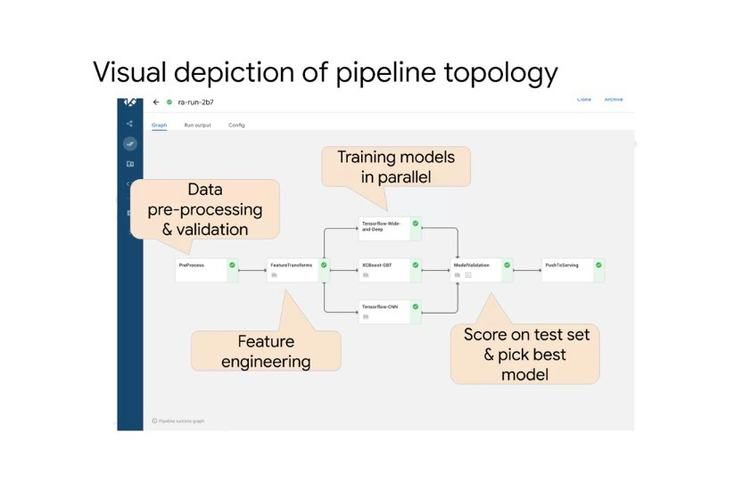

Finally, once you're happy with model performance, you can have a Kubeflow node, push it to production serving endpoint.

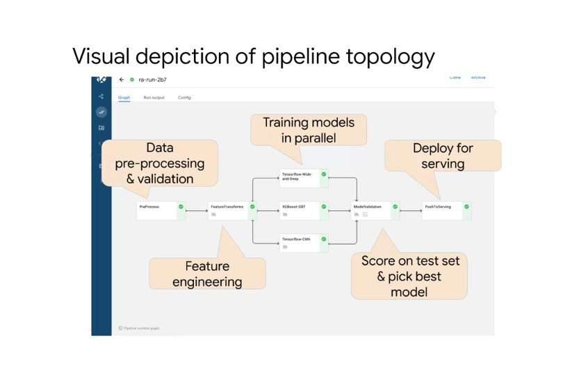

### View all configs, inputs and outputs

For each step of the workflow, you can see the precise configuration parameters, inputs, and outputs. Thus, for a model trained with Kubeflow Pipelines, you never have to wonder how exactly did I create this model.

Here you can quickly see how long the model training took, where the train model is, and what data was used for training and evaluation.

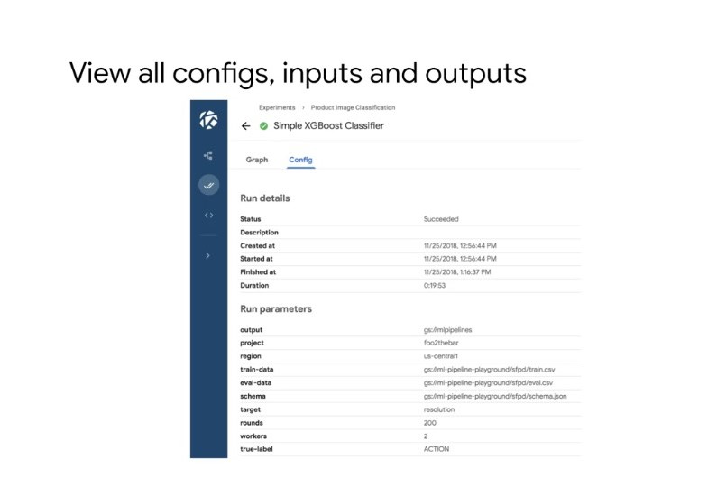

### Author pipelines with an intuitive Python SDK

You can define the ML workflow using Kubeflow as Python SDK. By defining the workflow, we mean specifying each steps; inputs and outputs, and how the various steps are connected.

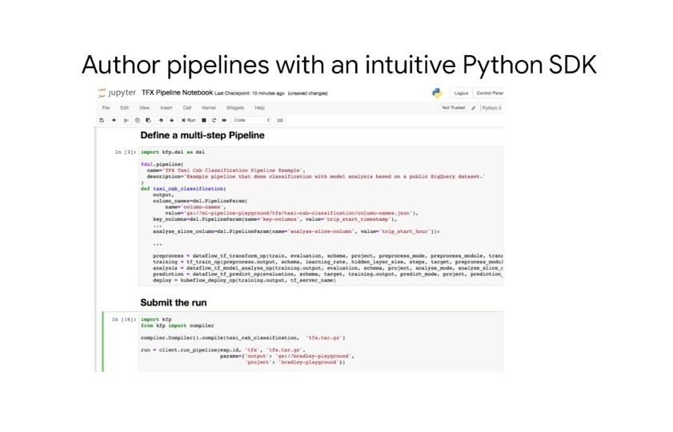

The topology of the workflow is implicitly defined by connecting the outputs of an upstream step to the inputs of a downstream step. You can also define looping constructs as well as conditional steps.

### Package & share pipelines as zip files

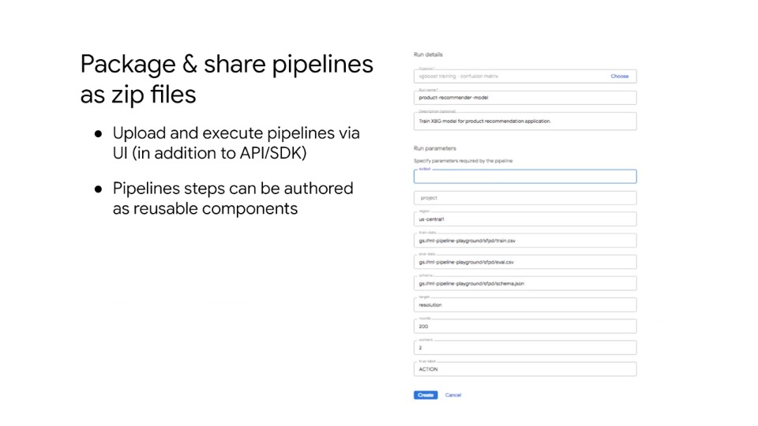

- Another nice Kubeflow feature is the ability to package pipeline components. This adds an element of portability since you can then move your ML pipelines even between Cloud providers.
- Kubeflow Pipelines separate the work for different parts of the pipeline to enable people to specialize.
- For example, a ML engineer can focus on feature engineering and the other parts of creating the model such as hyperparameter tuning.
- The ML engineer solutions can then be bundled up and used by data engineer as part of a data engineering solution.
- The solution can then appear as a service used by data analysts to derive business insights.

### Easy comparison and analysis of runs

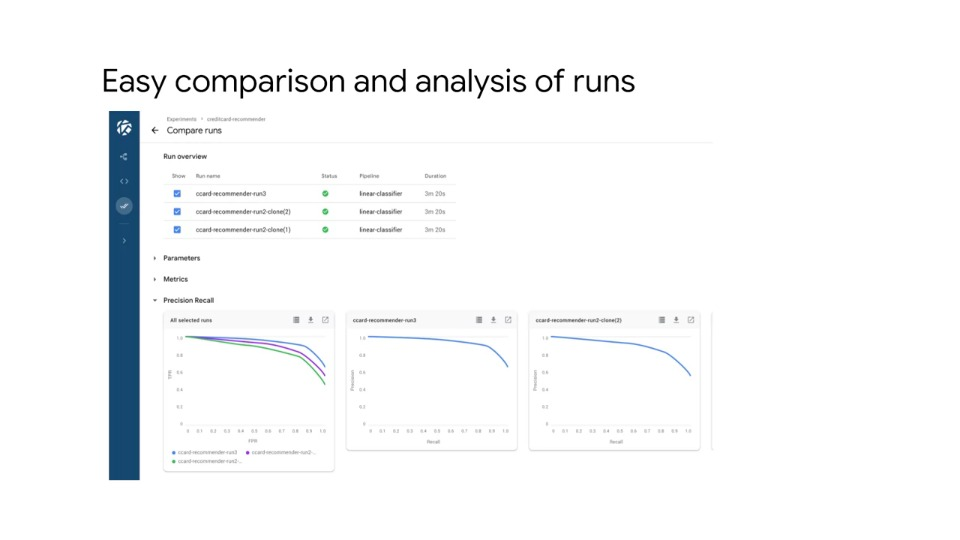

- Kubeflow makes it easy to run a number of ML experiments at the same time.
- For example, if you're doing hyperparameter optimization, you can easily deploy a number of different training instances with different hyperparameter sets.
- Kubeflow's run overview makes it easy to hone in on the techniques or parameters generating the best results. You can quickly identify what works and what did not work.

## AI Hub

We mentioned that Kubeflow pipelines can be packaged and shared with other users.

### AI Hub is a repository for AI assets

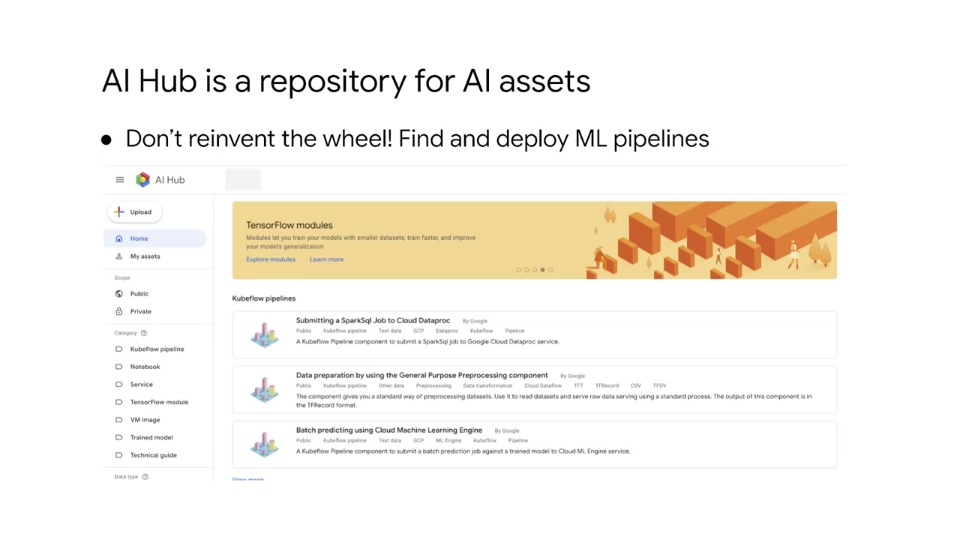

- AI Hub is a repository for ML components
- Don't reinvent the wheel! Avoid buildings some component when someone else has already built it, and most likely has already optimized it.
- You can find and deploy not just containerized applications for machine learning, but also full ML pipelines on AI Hub

### AI Hub stores various asset types

- What asset types can we find on AI Hub?
- Among the assets stored on AI Hub are:
  - Kubeflow Pipelines
  - Jupyter notebooks
  - TensorFlow modules
  - Fully trained models
  - Services
  - VM images

### What a typical asset looks like

Here you see what a typical asset looks like. You can see information about the pipeline such as inputs and outputs and download options.

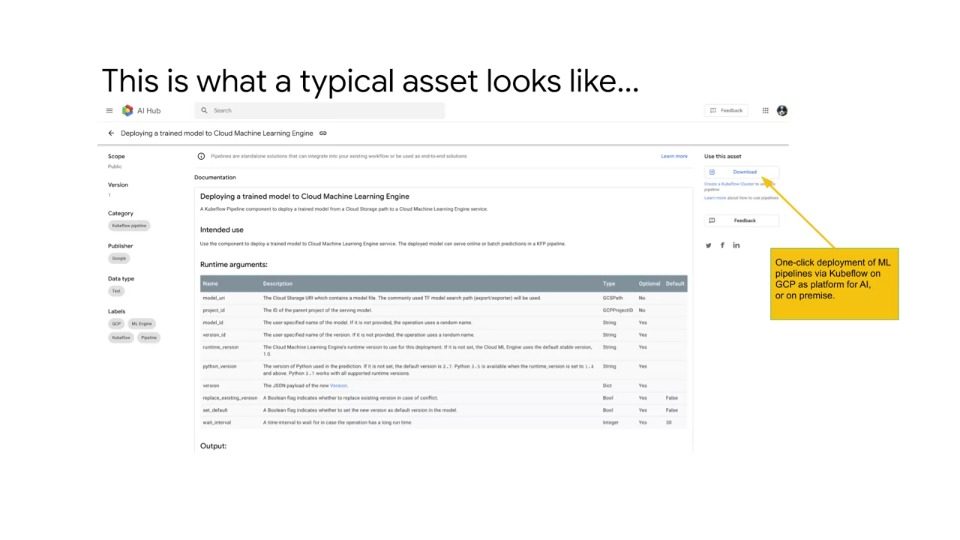

### The assets on AI Hub are collected into two scopes: public assets and restricted assets

- Public assets are available to all AI Hub users.
- Restricted scope assets contain AI components you have uploaded and those that have been shared with you. For example, you could have assets only available to people within your organization or team.

## Summary

- Use ML on GCP using either
  - AI Platform (your model, your data)
  - AutoML (our models, your data)
  - Perception API (our models, our data)
- Use Kubeflow to deploy end-to-end ML pipelines
- Don't reinvent the wheel for your ML pipeline!

GCP has several options to suit your machine-learning needs.  Depending on the time and resources you have available, you have the option to use the AI platform, Auto ML or Perception APIs. You can use Kubeflow to deploy end-to-end ML pipelines and remember, don't reinvent the wheel for your ML pipeline! Instead, leverage available pipelines on AI Hub
