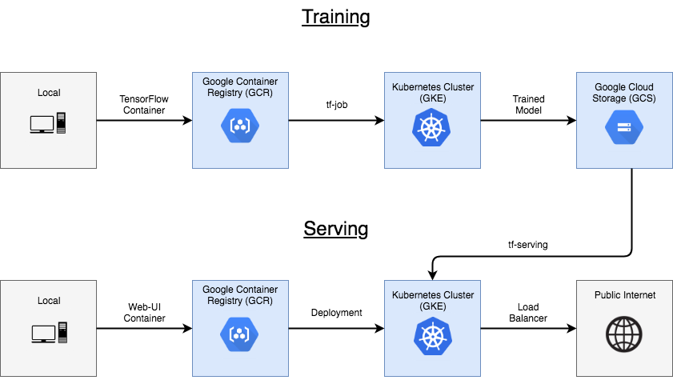
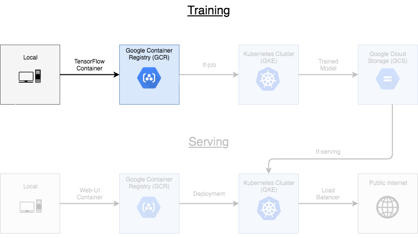
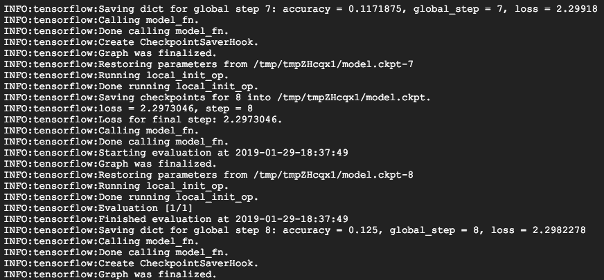
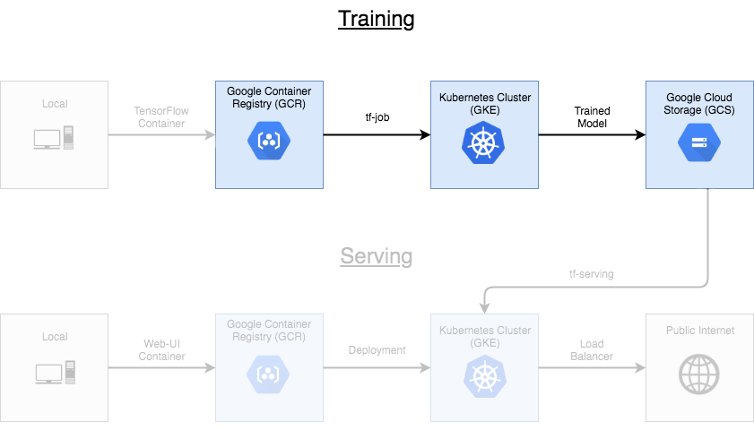
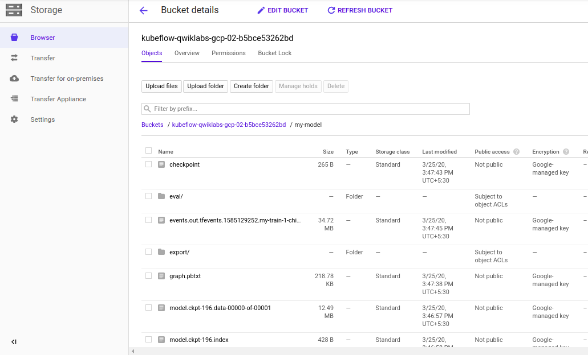
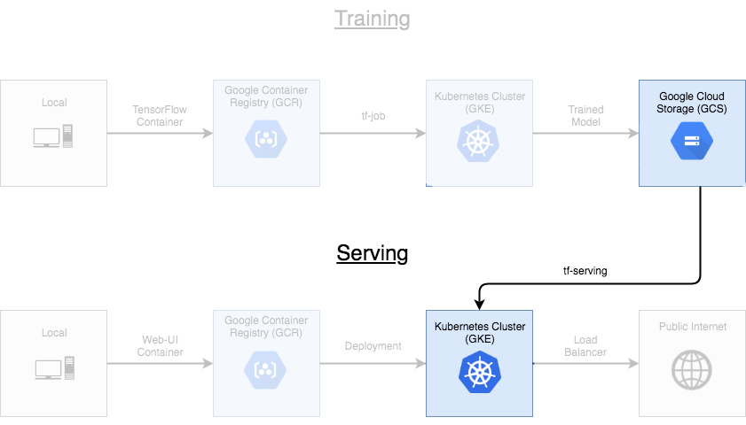
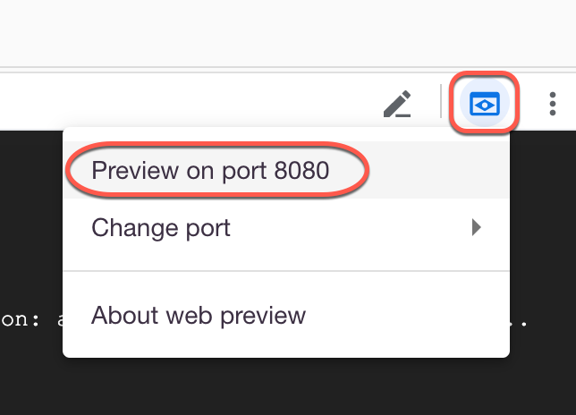
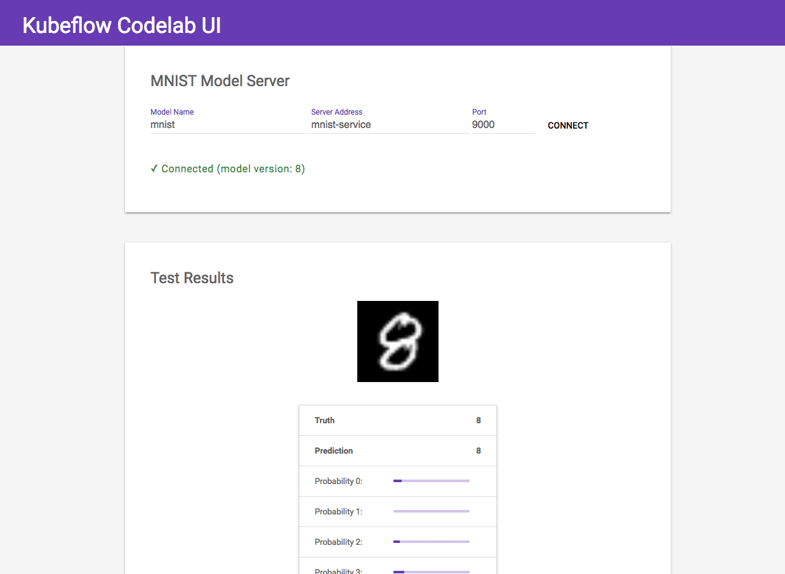
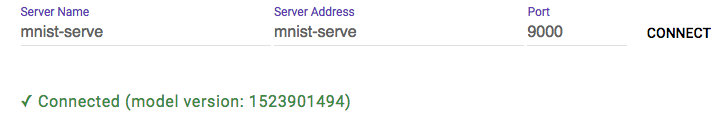
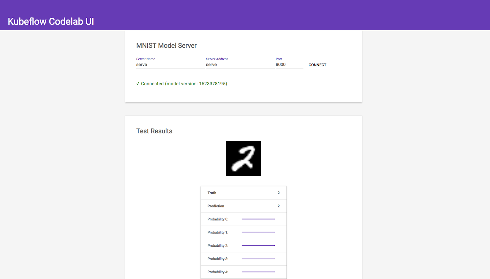

# Lab: Running AI models on Kubeflow

## Lab Objectives

- Set up Kubeflow on a Kubernetes Engine cluster
- Package a Tensorflow program in a container and upload it to Google Container Registry
- Submit a `tf-train` job and save the resulting model to Google Cloud Storage
- Serve and interact with a trained model

As datasets continue to expand and models grow to become complex, distributing machine learning (ML) workloads across multiple nodes is becoming more attractive. Unfortunately, breaking up and distributing a workload can add both computational overhead, and a great deal more complexity to the system. Data scientists should be able to focus on ML problems, not DevOps.

Fortunately, distributed workloads are becoming easier to manage, thanks to [Kubernetes](https://kubernetes.io/). Kubernetes is a mature, production ready platform that gives developers a simple API to deploy programs to a cluster of machines as if they were a single piece of hardware. Using Kubernetes, computational resources can be added or removed as desired, and the same cluster can be used to both train and serve ML models.

This lab will serve as an introduction to [Kubeflow](http://www.kubeflow.org/), an open-source project which aims to make running ML workloads on Kubernetes simple, portable and scalable. Kubeflow adds some resources to your cluster to assist with a variety of tasks, including training and serving models and running [Jupyter Notebooks](http://jupyter.org/). It also extends the Kubernetes API by adding new [Custom Resource Definitions (CRDs)](https://kubernetes.io/docs/tasks/access-kubernetes-api/extend-api-custom-resource-definitions/) to your cluster, so machine learning workloads can be treated as first-class citizens by Kubernetes.

## What You'll Build


This lab will describe how to train and serve a TensorFlow model, and then how to deploy a web interface to allow users to interact with the model over the public internet. You will build a classic handwritten digit recognizer using the MNIST dataset.

The purpose of this lab is to get a brief overview of how to interact with Kubeflow. To keep things simple, the model you'll deploy will use CPU-only training, and only make use of a single node for training. Kubeflow's [documentation](https://www.kubeflow.org/docs/started/getting-started/) has more information when you are ready to explore further.



## What You'll Learn

- How to set up a Kubeflow cluster on GCP
- How to package a Tensorflow program in a container, and upload it to Google Container Registry
- How to submit a Tensorflow training job, and save the resulting model to Google Cloud Storage
- How to serve and interact with a trained model

## Initial steps

- Activate Cloud Shell in the GCP console
- Enable Boost Mode by clicking on the settings dropdown in the GCP Cloud Shell window, selecting "Boost Cloud Shell", then "Restart" on the next screen
  - This will provision a larger instance for your Cloud Shell session, resulting in speedier Docker builds
- Download the project files to Cloud Shell by cloning the Kubeflow examples repo, which hosts the code that will be deployed:

    ```sh
    git clone https://github.com/GoogleCloudPlatform/training-data-analyst
    cd training-data-analyst/courses/data-engineering/kubeflow-examples
    ```

## Setting Environment Variables

- Set up a few environment variables to use. The first is [Project ID](https://cloud.google.com/resource-manager/docs/creating-managing-projects), which denotes which GCP project to use

    ```sh
    export PROJECT_ID=$(gcloud config list project --format "value(core.project)")
    gcloud config set project $PROJECT_ID
    ```

- Next provide the relevant [zone](https://cloud.google.com/compute/docs/regions-zones/) to use

    ```sh
    export ZONE=us-central1-a
    gcloud config set compute/zone $ZONE
    ```

- The contents for the lab are saved in the "mnist" directory of the repository. Change to the proper directory and set an environment variable for accessing it easily later.

## Installing Kustomize

Kubeflow uses a tool called Kustomize to manage deployments. This is a way to setup an application so that the same code can be deployed across different environments.

To install Kustomize, use the following command:

```sh
mkdir $WORKING_DIR/bin
wget https://storage.googleapis.com/cloud-training/dataengineering/lab_assets/kubeflow-resources/kustomize_2.0.3_linux_amd64 -O $WORKING_DIR/bin/kustomize
chmod +x $WORKING_DIR/bin/kustomize
PATH=$PATH:${WORKING_DIR}/bin
```

For other ways to install Kustomize, check out the [installation guide](https://github.com/kubernetes-sigs/kustomize/blob/master/docs/INSTALL.md)

### Install kfctl

Run the following to download and unpack kfctl, the Kubeflow command-line tool, then add it to your `$PATH`. Ignore any erros about 'unknown extended header keyword':

```sh
wget -P /tmp https://storage.googleapis.com/cloud-training/dataengineering/lab_assets/kubeflow-resources/kfctl_v1.0-0-g94c35cf_linux.tar.gz
tar -xvf /tmp/kfctl_v1.0-0-g94c35cf_linux.tar.gz -C ${WORKING_DIR}/bin
```

`kfctl` allows you to install Kubeflow on an existing cluster or create one from scratch

## Enabling the API

Ensure the Google Kubernetes Engine (GKE) API is enabled for your project:

```sh
gcloud services enable container.googleapis.com
```

## Create a cluster

To create a managed Kubernetes cluster on Kubernetes Engine using `kfctl`, we will walk through the following steps:

- Create an application directory
- Set variables for the installation
- Apply the configuration, installing the cluster

To create an application directory with local config files and enable APIs for your project, run these commands:

```sh
export KUBEFLOW_USERNAME=<REPLACE_WITH_USERNAME>
export KUBEFLOW_PASSWORD=<REPLACE_WITH_PASSWORD>

export CONFIG_URI=https://storage.googleapis.com/cloud-training/dataengineering/lab_assets/kubeflow-resources/kfctl_gcp_basic_auth.v1.0.1.yaml
export KF_NAME=kubeflow
export KF_DIR=${WORKING_DIR}/${KF_NAME}
```

This creates the file `kubeflow-qwiklab/app.yaml`, which defines a full, default Kubeflow installation. Ignore any errors related to 'memcache.go'.

To generate the files used to create the deployment, including a cluster and service accounts, run the following commands:

```sh
mkdir -p ${KF_DIR}
cd ${KF_DIR}
kfctl build -V -f ${CONFIG_URI}
```

This generates several new directories, each with customised files. To use the generates files to create all the objects in your project, run the command:

```sh
sed -i 's/n1-standard-8/n1-standard-4/g' gcp_config/cluster-kubeflow.yaml

export CONFIG_FILE=${KF_DIR}/kfctl_gcp_basic_auth.v1.0.1.yaml

kfctl apply -V -f ${CONFIG_FILE}
```

Cluster creation may take up to **10** minutes to complete. Be patient and do not proceed until the command prompt is returned in the console.

You may notice warnings in the console related to:

> `...Encountered error applying application cert-manager...`

and:

> `...Default user namespace pending creation...`

These are advisory and will not affect completeion of the cluster.

While it is running, you can view instantiation of the following objects in the GCP Console:

- In **Deployment Manager**, two deployment objects will appear:
  - kubeflow-qwiklab-storage
  - kubeflow-qwiklab

- In **Kubernetes Engine**, a cluster will appear: kubeflow

  - In the **Workloads** section, a number of Kubeflow components
  - In the **Services** section, a number of Kubeflow services

After the cluster is set up, use `gcloud` to fetch its credentials so you can communicate with it using `kubectl`

```sh
gcloud container clusters get-credentials ${KF_NAME} --zone ${ZONE} --project ${PROJECT_ID}
```

Switch to the `kubeflow` namespace

```sh
kubectl config set-context $(kubectl config current-context) --namespace=kubeflow
```

Check view all the Kubeflow resources deployed on the cluster

```sh
kubectl get all
```

This concludes creating a deployment for creation of cluster, service account and persistent disk.

## Training

The code for our Tensorflow project can be found in the [model.py](https://github.com/kubeflow/examples/blob/master/mnist/model.py) file in the examples repository. model.py defines a fairly straight-forward Tensorflow training program, with no special modifications for Kubeflow. 

After training is complete, it will attempt to upload the trained model to a file path provided as an argument. For the purpose of this lab, you will create and use a [Google Cloud Storage (GCS)](https://console.cloud.google.com/storage/) bucket to hold the trained model.

### Setting up a Storage Bucket

Creating a storage bucket on [Google Cloud Storage](https://cloud.google.com/storage/) to hold our trained model. Note that the name you choose for your bucket must be unique across all of GCS

```sh
# bucket name can be anything, but must be unique across all projects
BUCKET_NAME=${KF_NAME}-${PROJECT_ID}

# create the GCS bucket
gsutil mb gs://${BUCKET_NAME}/
```

This concludes setting up a storage bucket.

## Building the Container



To deploy the code to Kubernetes, you have to first build it into a container image:

```sh
# set the path on GCR you want to push the image to
IMAGE_PATH=us.gcr.io/$PROJECT_ID/kubeflow-train

# build the tensorflow model into a container image
# image is tagged with its eventual path on GCR, but it stays local for now
docker build $WORKING_DIR -t $IMAGE_PATH -f $WORKING_DIR/Dockerfile.model
```

Now, test the new container image locally to make sure everything is working as expected:

```sh
docker run -it $IMAGE_PATH
```

You should see training logs start appearing in your console:



Once you start seeing logs, that means training is working and you can terminate the container with "Ctrl+C". Now that you know that the container can run locall, you can safely upload it to [Google Container Registry (GCP)](https://console.cloud.google.com/gcr) so you can run it on your cluster.

```sh
# allow docker to access our GCR registry
gcloud auth configure-docker --quiet

docker push $IMAGE_PATH
```

You should now see your new container listed on the [GCR console](https://console.cloud.google.com/gcr)

## Training on the Cluster



Finally, you can run the training job on the cluster. First, move into the training directory:

```sh
cd $WORKING_DIR/training/GCS
```

If you look around this directory, you will see a number of YAML files. You can now use kustomize to configure the manifests. First, set a unique name for the training run.

```sh
kustomize edit add configmap mnist-map-training \
    --from-literal=name=my-train-1
```

Next, set some default training parameters (number of training steps, batch size and learning rate)

```sh
kustomize edit add configmap mnist-map-training \
    --from-literal=trainSteps=200
kustomize edit add configmap mnist-map-training \
    --from-literal=batchSize=100
kustomize edit add configmap mnist-map-training \
    --from-literal=learningRate=0.01
```

Now, configure the manifest to use your custom bucket and training image

```sh
kustomize edit set image training-image=${IMAGE_PATH}:latest
kustomize edit add configmap mnist-map-training \
    --from-literal=modelDir=gs://${BUCKET_NAME}/my-model
kustomize edit add configmap mnist-map-training \
    --from-literal=exportDir=gs://${BUCKET_NAME}/my-model/export
```

One thing to keep in mind is that the python training code has to have permissions to read/write to the storage bucket you set up. Kubeflow solves this by creating a [service account](https://cloud.google.com/iam/docs/understanding-service-accounts) within your project as a part of the deployment. You can verify this by listing your service accounts:

```sh
gcloud --project=$PROJECT_ID iam service-accounts list
```

This service account should be automatically granted the right permissions to read and write to our storage bucket. Kubeflow also added a [Kubernetes secret](https://kubernetes.io/docs/concepts/configuration/secret/) called "user-gcp-sa" to our cluster, containing the credentials needed to authenticate as this service account within our cluster:

```sh
kubectl describe secret user-gcp-sa
```

To access your storage bucket from inside our training container, you need to set the [`GOOGLE_APPLICATION_CREDENTIALS`](https://cloud.google.com/docs/authentication/getting-started) environment variable to point to the json file contained in the secret. You can do this by setting a few more Kustomize parameters:

```sh
kustomize edit add configmap mnist-map-training \
    --from-literal=secretName=user-gcp-sa
kustomize edit add configmap mnist-map-training \
    --from-literal=secretMountPath=/var/secrets
kustomize edit add configmap mnist-map-training \
    --from-literal=GOOGLE_APPLICATION_CREDENTIALS=/var/secrets/user-gcp-sa.json
```

Lastly, update the base config files to use this style of authentication (the default has changed in a recent kubeflow update).

```sh
sed -i 's/default-editor/kf-user/g' ../**/*
```

Now that all the parameters are set, use Kustomize to build the new customized YAML file:

```sh
kustomize build .
```

You can pipe this YAML manifest to kubectl to deploy the training job to the cluster. The training will take approximately **45** to **60** minutes:

```sh
kustomize build . | kubectl apply -f -
```

After applying the component, there should be a new tf-job on the cluster called *`my-train-1-chief-0`*. Use kubectl to access information about the job.

```sh
kubectl describe tfjob
```

For even more information, you can use _`kubectl`_ to retrieve the python logs from the pod that's running the container itself (after the container has finished initializing). 
**NOTE**: You may need to execute the command a few times until the job is fully enbabled and running.

Use "Ctrl+C" to exit the log view:

```sh
kubectl logs -f my-train-1-chief-0
```

When training is complete, you can query your bucket's data using gsutil. You should see the model data added to your bucket:

```sh
gsutil ls -r gs://${BUCKET_NAME}/my-model/export
```

Alternatively, you can check the contents of your bucket through the [GCP Cloud Console](https://console.cloud.google.com/storage).



While training is underway, you may refresh the GCS bucket until the "**export**" folder appears or let `kubectl logs -f my-train-1-chief-0` run until it ends.

> Note: The model is actually saving two outputs:
>
> 1. a set of [checkpoints](https://www.tensorflow.org/guide/checkpoints) to resume training later if desired
> 2. A directory called "export" which holds the model in a format that can be read by a [TensorFlow Serving](https://www.tensorflow.org/serving/serving_basic) component

This concludes applying the container to the cluster for training.

## Serving



Now that you have a trained model, it's time to put it in a server so it can be used to handle requests. To do this, move into the "serving/GCS" directory:

```sh
cd $WORKING_DIR/serving/GCS
```

The Kubeflow manifests in this directory contain a TensorFlow Serving implementation. You simply need to point the component to your GCS bucket where the model data is stored, and it will spin up a server to handle requests. 

Unlike the tf-job , no custom container is required for the server process. Instead, all the information the server needs is stored in the model file.

Like before, start by setting some parameters to customize the deployment for our use. First, set the name for the service:

```sh
kustomize edit add configmap mnist-map-serving \
    --from-literal=name=mnist-service
```

Next, point the server at the trained model in your GCP bucket:

```sh
kustomize edit add configmap mnist-map-serving \
    --from-literal=modelBasePath=gs://${BUCKET_NAME}/my-model/export
```

Lastly, update the base config files to use this style of authentication (the default has changed in a recent kubeflow update).

```sh
sed -i 's/default-editor/kf-user/g' ../**/*
```

Now, deploy the server to the cluster:

```sh
kustomize build . | kubectl apply -f -
```

If you describe the new service, you'll see it's listening for connections within the cluster on port 9000:

```sh
kubectl describe service mnist-service
```

This concludes applying the component to the cluster for serving.

## Deploying the UI

Change the directory containing the web front end manifests:

```sh
cd $WORKING_DIR/front
```

Unlike the other steps, this manifest requires no customisation. It can be applied directly:

```sh
kustomize build . | kubectl apply -f -
```

The service added is of type [ClusterIP](https://kubernetes.io/docs/concepts/services-networking/service/#publishing-services-service-types), meaning it can't be accessed from outside the cluster. In order to load the web UI in your web browser, you have to set up a direct connection to the cluster:

```sh
kubectl port-forward svc/web-ui 8080:80
```

It may take **1** to **2** minutes to fully stand up the browser application. You may receive an error message stating `"error: unable to forward port because pod is not running. Current status=Pending"`, if so run the command again until you see **`Forwarding from 127.0.0.1:8080 -> 5000`** in the terminal window.

Now in your Cloud Shell interface, press the **Web Preview** button and select "Preview on port 8080" to open the web interface in your browser:



You should now see the MNIST Web UI:



Keep in mind that the web interface doesn't do much on its own, it's simply a basic HTML/JS wrapper around the [Tensorflow Serving](https://www.tensorflow.org/serving/) component, which performs the actual predictions. To emphasize this, the web interface allows you to manually connect with the serving instance located in the cluster. It has three fields:

**Model Name**: mnist

- The model name associated with the Tensorflow Serving component
- You configured this when you set the modelName parameter for the mnist-deploy-gcp component

**Server Address**: mnist-service

- The IP address or DNS name of the server
- Because Kubernetes has an [internal DNS service](https://kubernetes.io/docs/concepts/services-networking/dns-pod-service/), you can enter the service name here

**Port**: 9000

- The port the server is listening on
- Kubeflow sets this to 9000 by default

These three fields uniquely define your model server. If you deploy multiple serving components, you should be able to switch between them using the web interface. Feel free to experiment!



This concludes applying the component to the cluster to deploy the UI.

## The Final Product

If everything worked properly, you should see an interface for your machine learning model. Each time you refresh the page or press the **TEST RANDOM IMAGE** button, it will load a random image from the MNIST testing set and perform a prediction. The table below the image displays the probability of each class label. Because the model was properly trained, confidence will be high and mistakes should be very rare. See if you can find any!



Press "Ctrl+C" to close the Web Application.

## Congratulations!

You successfully set up Kubeflow on a Kubernetes Engine cluster, used Kubeflow to deploy a TensorFlow model training service, and deployed an interactive API based on the trained model.

## Next Steps / Learn More

- [Simplifying Machine Learning on Open Hybrid Clouds with Kubeflow](https://cloud.google.com/kubernetes-engine/docs/tutorials/migrating-node-pool)
Cloud OnAir: [Kubeflow: Machine Learning + Kubernetes](https://www.youtube.com/watch?v=Jb-XOfaCge8) (open this video in a new tab, 37 minutes long)