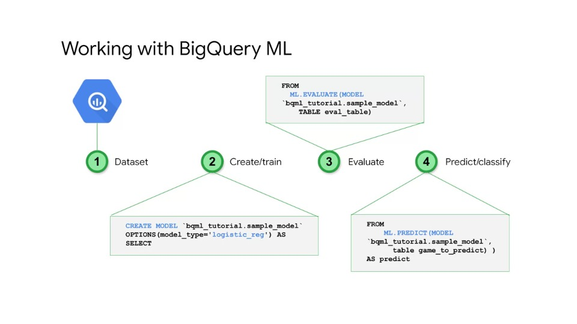
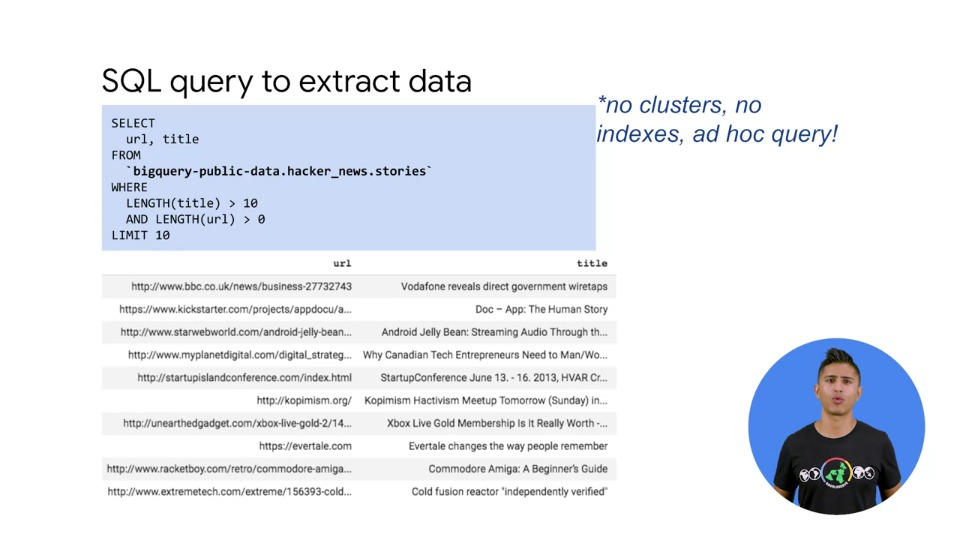

# BigQuery ML

BigQuery Machine Learning allows you to build machine learning models using SQL syntax. This is a really powerful feature since anyone who knows only SQL can build ML models.

BigQuery ML brings us one step closer to democratising Machine Learning and AI, one of the core missions of Google.

## Agenda

- BigQuery ML for Quick Model Building
  - First we'll introduce BigQuery ML and walk through the steps for an end-to-end use-case  
- Classification, Regression and Recommender Models
  - Then, we'll discuss the current zoo of support and models  
- Unsupervised ML with Clustering Models
  - At the end, we will go through some hands-on labs using BQML

## BigQuery ML for Quick Model Building

### BigQuery ML is a way to build custom models

- Where does BQML fit in the greater picture of Google Cloud's AI and ML options?
- Unlike ML APIs, you are able to create your own custom models
- With AutoML users can leverage Google's ML models in certain cases to build their own models from scratch using transfer learning and a form of neural architecture search
- With BQML, the process of training, evaluating and scoring a model can be done easily in a short amount of time using BigQuery's SQL syntax

### Working with BigQuery ML

- To work with BQML, there are only a few steps from beginning to inference:

  1. **Dataset**: first, we must write a query on data stored in BigQuery to extract our training data
  2. **Create/train**: then, we can create a model where we specify a model type and other hyperparameters
  3. **Evaluate**: after the model is trained, we can evaluate the model and verify that it meets our requirements
  4. **Predict/classify**: finally, we can make predictions using our model on data extracted from BigQuery

### Where was this article published?

Hacker News is a social news aggregator website focussed on computer science and entrepreneurship. Given three articles on Hacker News: TechCrunch, GitHub and the New York Times, what if we wanted to build an BigQuery ML model to detect where these articles were published without doing any manual work?

### SQL Query to extract data

First, let's write an Ad-hoc query to expore our data. Here's a quick example where we're simply looking at the title of the article and the URL:

### Use regex to get source + train on words of title

We can extract the publisher information from the URL using regular expression functions.

That's exactly what we'll do in the below query:

Our plan will be the following:

- Let's extract the publication source using a `REGEXP_EXTRACT` function and then separate out the first five words at each title or replace them with null values, in case the title is too short.
- Our goal will then be to decide if the article title is from GitHub, New York Times or TechCrunch using BigQueryML

### Create model syntax

Let's look at the syntax needed to create a model:

- We have a `CREATE OR REPLACE MODEL` statement at the top where we give the name of the model, the options of the model and other hyperparameters
- After the "as" clause, we have our query which defines the training set from the previous slide
- In this case, we're specifying that we want to build a logistic regression model
- This is a type of classification model that we can use to classify our input as being either a Github, New York Times or TechCrunch article

### Evaluate model

- Once we have a trained model, we want to know how it performs
- Since it's a classification model, we can use a variety of metrics to see how well it knew where the article originated based on just the title
- To get those metrics, you simply call: `ML.EVALUATE(MODEK <model>)` on your train model or click on the model in the BigQuery UI and click the evaluation tab
- The metrics: `precision`, `recall`, `accuracy`, `f1_score`, `log_loss`, `roc_auc`; all score from zero to one
- Generally speaking, the closer to one, the better the metric, but it really depends on your metric
- For example, `precision` means for the articles we made a prediction, how accurate were those predictions?
- High `precision` means a low false positive rate, meaning we really punish a model's precision if it makes a ton of bad guesses
- `recall` on the other hand is the ratio of correctly predicted positive obervations to all observations in the actual class
- I.e., how many did we get right out of both true positives and false negatives?
- `accuracy` is simply true positives plus the true negatives over the entire set of observations
- There are also other metrics like `f1_score`, `log_loss` and `roc_auc` curves that can be used to gauge model performance as well
- We can also see the confusion matrix which shows where the model made incorrect predictions
- As we can see, our model had some confusion between TechCrunch and New York Times articles

### Predict using a trained model

- If the model meets our requirements, then we can start making predictions with the model
- We don't need to worry about deploying our model in separate process
- It's automatically available to serve predictions here in BigQuery
- Here's an example of performing batch prediction using BQML
- The first example shows "government", "shutdown", "leaves", "workers" and "reeling" as the first five words of the title
- The model's prediction in this case, is the New York Times

## Classification, Regression and Recommender Models

- In this section, we give a bried overview of the various model types that are currently supported
- For the article prediction task in the previous section, recall that we utilised a logistic regression model
- There are other models that could have been used
- Here are the model options available in BigQuery ML to classify things:

### Classification models

#### Linear Classifier (Logistic Regression)

First, we have another example of linear classification, or, what is also known as logistic regression

In this example, we're using a flights arrivals dataset to predict whether a flight would be on time or not, which is a binary outcome.

For logistic regression, we simply need to specify the type of model and the label we're trying to predict.

For more advanced users, there are other options such as if you want your model to use regularisation.

#### Deep Neural Network (DNN) Classifier (alpha)

While logistic regression models are the "Swiss-army knife" of machine learning, DNN's allow you to better model nonlinear relationships in your data.

An example of a non-linear relationship would be in a car depreciation. A car loses a vast majority of its value within the first few years after which the value more or less stabilises.

All you have to do is specify DNN as the model type in the `CREATE OR REPLACE MODEL` header.

The slide above shows how to do that for the same flight arrival time example used in the previous slide.

#### XGBoost Classifier (alpha)

If you're familiar with gradient boosted trees and XGBoost, you can use this algorithm to train models in BQML

In the example above, we specify the model type as a gradient boosted trees classifier.

There are a number of hyperparameters you can select for this model, including maximal tree depth.

We will not go into fine detail here, but the idea behind gradient boosted trees is to iteratively fit a decision tree to the residuals of preceding decision trees.

### Forecasting models

Here are the model options available in BigQuery ML to forecast things like numeric values.

#### Linear Regression

So far, we've only talked about classification.

You can also use BQML to do regression. In this example, we're fitting a linear regression model to predict taxi fare based on features such as the hour of day, pick-up and drop off location, and the day of the week.

#### Deep Neural Network (DNN) Regression (alpha)

If you need a model more complex than linear regression, you can use a DNN regressor in BQML.

All you have to do is specify the `OPTIONS (model type='dnn_regressor',...` and define the hidden units, just like in the classification version of DNNs.

#### XGBoost Regression (alpha)

Just like for classifcation, we can also use XGBoost for regression.

Just specify you want to use a boosted tree regressor

### Train on TF, predict with BigQuery

What if you have already trained a model on Tensorflow? You can improt your saved model into BigQuery to serve batch predictions.

In this example, the first statement is where we load our model into BQ.

We specify the model name, the model path in Cloud Storage, and we tell BigQuery that the model type is Tensorflow.

When we want to serve predictions, we can do it as shown on the bottom half of the query in the slide above.

Note the `ML.PREDICT(...` statement is being used to generate predictions and then that actual query is being use to print the predictons in a reasonable format.

### Recommender Models

We can also serve recommendations to users in BQML.

#### Recommendation engine (matrix factorisation) (alpha)

- The type of model being used for this is called a matrix factorisation model.
- In short, matrix factorisation models are a form of collaborative filtering algorithm used in recommended systems.
- Matrix factorisation algorithms work by decomposing the user-item interaction matrix.
- That is, the matrix consisting of users and recommendations gets broken apart into the product of two lower dimensionality rectangular matrices.
- This matrix will be really sparse, since users will only review a few products.
- For example, if we have one million movies on our streaming platform, you don't expect a user will review more than a handful.
- For this reason, we expect our matrices to be low rank and thus can store the information in smaller matrices without much loss of information.
- This family of methods became widely known during the Netflix Prize challenge due to its effectiveness in making recommendations.
- To build a recommendation engine in BQML, you must set the model type to matrix factorisation and provide a table of user-item interations
- Once we have a trained recommender model, we can use it to serve recommendations

- Above is an example query where we're getting our users and products with the query and getting the suggested products using the `ML.PREDICT` statement

- Here's what the output will look like for a single user.

- We could sort by the predicted rating for each user ID and give the top 5 or so recommendations using a simple SQL query

## Unsupervised ML with Clustering Models

Let's wrap up with unsupervised machine learning.

- **Supervised ML** is when you have labelled training data, meaning you know the answer in the past and  **unsupervised ML** is where you are using no such label

Here are the model options available in BigQuery ML to explore our data using unsupervised machine learning when we have sparse or no labelled data

### K-means clustering

We will dicuss the unsupervised machine learning algorithm, K-means clustering that's available in BQML.

We won't go into the details of the algorithm, but, in short, when we do not have a label we are trying to predict, we can explore patterns in the data

In the example above, we cluster the data into 4 clusters, standardise the features to account for different feature value ranges which is really important for clustering and remove an ID fields so that we're not grouping based on uniquely identifiable information.

After we've trained a clustering model, we can easily see which cluster our data belongs to with a quick SQL query.

- The centroid ID column refers to the cluster assigned to each row of data.
- The data set used here is for a bike rental company that has stations spread out across London.
- Once you have clusters, how do you actually get utility out of them? The key is to do some analysis on the data in each cluster.

We can explore feature ranges and aggregate statistics to try to understad what is special about the individual clusters.

For example, we could use Data Studio to visualise some of the attributes of the data in the clusters:

Here we see that cluster one has the longest duration rights.

> Using **`TRANSFORM`** option to avoid training/serving skew at prediction time

Using **`TRANSFORM`** ensures that the raw inputs expected from clients will be transformed to avoid training and serving skew at prediction time.

On the left we see that the transformations are done in the query defining the training data set.

In this case, the user of the model would have to perform these same transformations.

However, how would they know what transformations to perform in general and should this even be a worry on the client side? We instead move the casting into a transform statement.

Now, when the client sends in a prediction, the transformations on the start date field will be automatically applied before serving a prediction.

### BQML Cheatsheet

We've covered a lot of syntax in BQML, this includes syntax for training a model, evaluating it, and making predictions among other things.

This cheat-sheet can be helpful for building models in BigQuery ML

