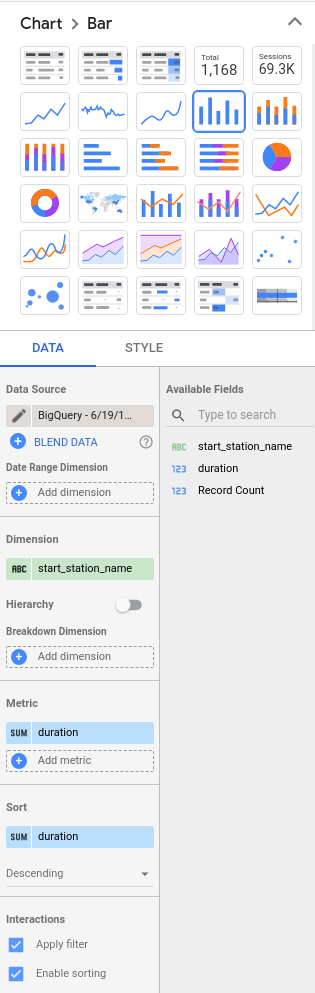
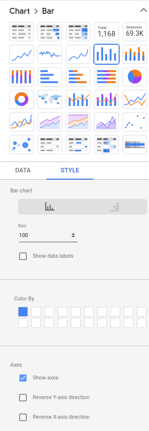
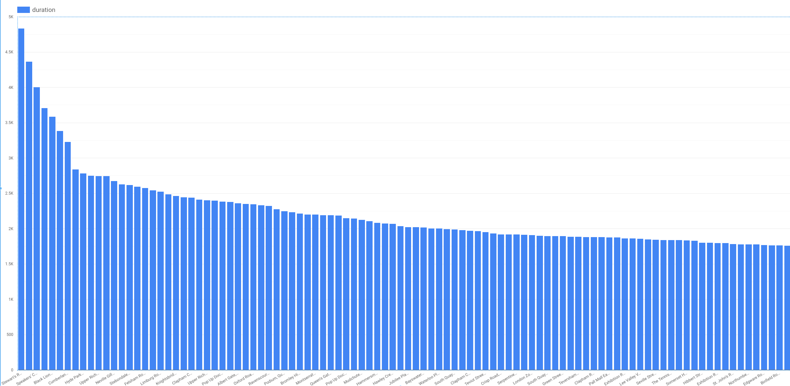
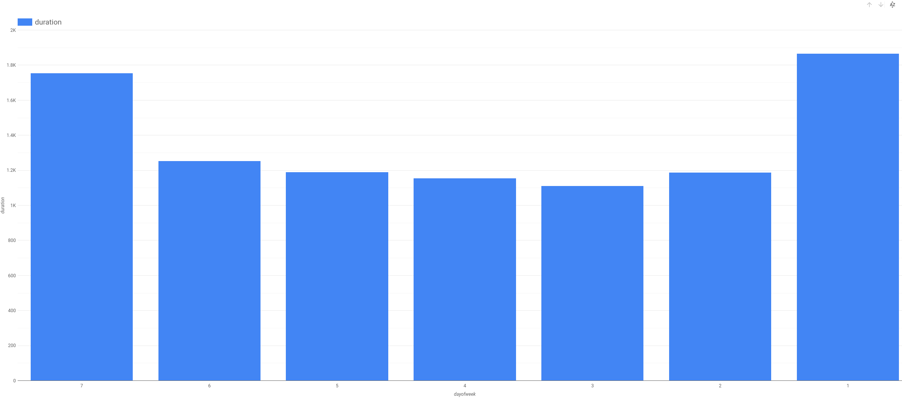
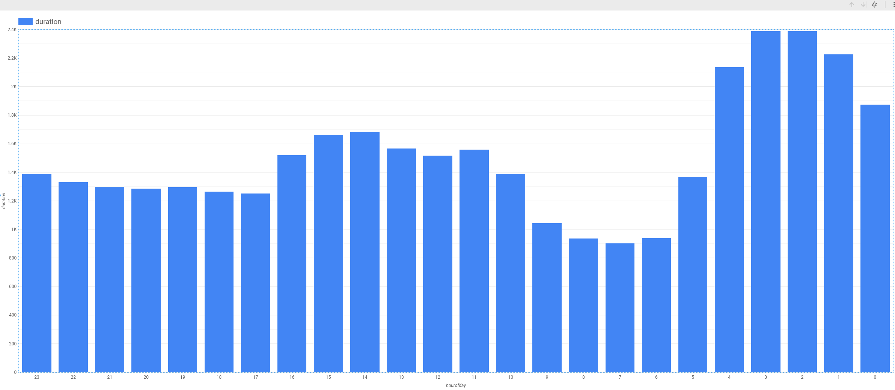
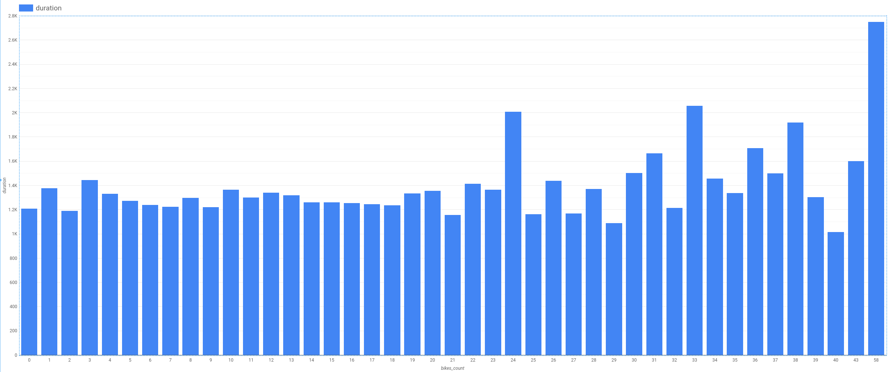
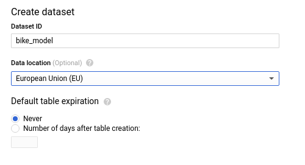
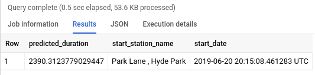
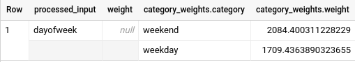

# Lab: Predict Bike Trip Duration with a Regression Model in BQML

## Overview

BigQuery is Google's fully managed, NoOps, low cost analytics database. With BigQuery you can query terabytes and terabytes of data without having any infrastructure to manage or needing a database administrator. BigQuery uses SQL and can take advantage of the pay-as-you-go model. BigQuery allows you to focus on analyzing data to find meaningful insights.

[BigQuery Machine Learning](https://cloud.google.com/bigquery/docs/bigqueryml-analyst-start) (BQML, product in beta) is a new feature in BigQuery where data analysts can create, train, evaluate, and predict with machine learning models with minimal coding.

In this lab you will use the London bicycles dataset to build a regression model in BQML to predict trip duration. Let’s say that you're a bike rental business stocking two types of bicycles -- hardy commuter bikes and fast, but fragile, road bikes. If a bicycle rental is likely to be for a long duration, we need to have road bikes in stock, but if the rental is likely to be for a short duration, we need to have commuter bikes in stock. Therefore, in order to build a system to properly stock bicycles, we need to predict the duration of bicycle rentals.

## Lab Objectives

- Query and explore the London bicycles dataset for feature engineering
- Create a linear regression model in BQML
- Evaluate the performance of your machine learning model
- Extract your model weights

## Explore bike data for feature engineering

The first step of solving an ML problem is to formulate it -- to identify features of our model and the label. Since the goal of our first model is to predict the duration of a rental based on our historical dataset of cycle rentals, the label is the duration of the rental.

If we believe that the duration will vary based on the station the bicycle is being rented at, the day of the week, and the time of day, those could be our features. Before we go ahead and create a model with these features, though, it’s a good idea to verify that these factors do influence the label.

Coming up with features for a machine learning model is called feature engineering. Feature engineering is often the most important part of building accurate ML models, and can be much more impactful than deciding which algorithm to use or tuning hyper-parameters. Good feature engineering requires deep understanding of the data and the domain. It is often a process of hypothesis testing; you have an idea for a feature, you check to see if it works (has mutual information with the label), and then you add it to the model. If it doesn’t work, you try again.

### Impact of station

To check whether the duration of a rental varies by station, we can visualize the result of the following query in Data Studio

1. In the query editor window paste the following query:

    ```sql
    SELECT
      start_station_name,
      AVG(duration) AS duration
    FROM
      `bigquery-public-data`.london_bicycles.cycle_hire
    GROUP BY
      start_station_name
    ```

2. Click **Run**

3. Click on **EXPLORE IN DATA STUDIO** in the BigQuery Cloud Console

4. When prompted, select the **GET STARTED** button

5. Select **AUTHORIZE** when asked if Google Data Studio can access your data

6. Click on **Allow**

7. In the **DATA** tab on the right-hand side menu, configure the settings as follows:

    

8. In the **STYLE** tab on the right-hand side menu, configure the settings as follows:

    

Your plot should resemble this:



It is clear that a handful of stations are associated with long-duration rentals (over 3000 seconds), but that the majority of stations have durations that lie in a relatively narrow range. Had all the stations in London been associated with durations within a narrow range, the station at which the rental commenced would not have been a good feature. But in this problem, as the graph demonstrates, the `start_station_name` does matter.

Note that we cannot use `end_station_name` as a feature because at the time the bicycle is being rented, we won’t know where the bicycle is going to be returned to. Because we are creating a machine learning model to predict events in the future, we need to be mindful of not using any columns that will not be known at the time the prediction is made. This time/causality criterion imposes constraints on what features we can use.

### Impact of day of week and hour of day

For the next candidate features, the process is similar. We can check whether `dayofweek` (or, similarly, `hourofday`) matter.

1. In the query editor window paste the following query:

    ```sql
    SELECT
      EXTRACT(dayofweek
      FROM
        start_date) AS dayofweek,
        AVG(duration) AS duration
    FROM
      `bigquery-public-data`.london_bicycles.cycle_hire
    GROUP BY
      dayofweek
    ```

2. Visualize your data in Data Studio. For day of week your visualization should resemble:

    

    For hour of day your visualization should look like the following:

    

It is clear that the duration varies depending both on the day of the week, and on the hour of the day. It appears that durations are longer on weekends (days 1 and 7) than on weekdays. Similarly, durations are longer early in the morning and in the mid-afternoon. Hence, both `dayofweek` and `hourofday` are good features.

### Impact of number of bicycles

1. Another potential feature is the number of bikes in the station. Perhaps, we hypothesize, people keep bicycles longer if there are fewer bicycles on rent at the station they rented from.

    In the query editor window paste the following query:

    ```sql
    SELECT
      bikes_count,
      AVG(duration) AS duration
    FROM
      `bigquery-public-data`.london_bicycles.cycle_hire
    JOIN
      `bigquery-public-data`.london_bicycles.cycle_stations
    ON
      cycle_hire.start_station_name = cycle_stations.name
    GROUP BY
      bikes_count
    ```

2. Visualize your data in Data Studio

    

We notice that the relationship is noisy with no visible trend (compare against hour-of-day, for example). This indicates that the number of bicycles is not a good feature.

## Create a training dataset

Based on the exploration of the bicycles dataset and the relationship of various columns to the label column, we can prepare the training dataset by pulling out the selected features and the label:

```sql
SELECT
  duration,
  start_station_name,
  CAST(EXTRACT(dayofweek
    FROM
      start_date) AS STRING) AS dayofweek,
  CAST(EXTRACT(hour
    FROM
      start_date) AS STRING) AS hourofday
FROM
  `bigquery-public-data`.london_bicycles.cycle_hire
```

Feature columns have to be either numeric (`INT64`, `FLOAT64`, etc.) or categorical (`STRING`). If the feature is numeric but needs to be treated as categorical, we need to cast it as a string -- this explains why we casted the dayofweek and hourofday columns which are integers (in the ranges 1-7 and 0-23, respectively) into strings.

If preparing the data involves computationally expensive transformations or joins, it might be a good idea to save the prepared training data as a table so as to not repeat that work during experimentation. If the transformations are trivial but the query itself is long-winded, it might be convenient to avoid repetitiveness by saving it as a view.

In this case, the query is simple and short, and so, for clarity, we won't be saving it.

1. Create a dataset in BigQuery called `bike_model` to store your model. Set the **Data location** to the **EU** region since the data we are training on is in the EU.

    

2. To train the ML model and save it into the dataset bike_model, we need to call `CREATE MODEL`, which works similarly to `CREATE TABLE`. Since the label we're trying to predict is numeric this is a regression problem, which is why the most appropriate option is to choose `linear_reg` as the model type under `OPTIONS`. Enter the following query into the query editor:

    ```sql
    CREATE OR REPLACE MODEL
      bike_model.model
    OPTIONS
      (input_label_cols=['duration'],
        model_type='linear_reg') AS
    SELECT
      duration,
      start_station_name,
      CAST(EXTRACT(dayofweek
        FROM
          start_date) AS STRING) AS dayofweek,
      CAST(EXTRACT(hour
        FROM
          start_date) AS STRING) AS hourofday
    FROM
      `bigquery-public-data`.london_bicycles.cycle_hire
    ```

    Note, the model takes 2-3 minutes to train.

3. To see some metrics related to model training, enter the following query into the BigQuery editor window:

    ```sql
    SELECT * FROM ML.EVALUATE(MODEL `bike_model.model`)
    ```

    The mean absolute error is 1026 seconds or about 17 minutes. This means that we should expect to be able to predict the duration of bicycle rentals with an average error of about 17 minutes.

This concludes creating a training set.

## Improving the model through feature engineering

### Combine days of week

There are other ways that we could have chosen to represent the features that we have. For example, recall that when we explored the relationship between `dayofweek` and the `duration` of rentals, we found that durations were longer on weekends than on weekdays. Therefore, instead of treating the raw value of dayofweek as a feature, we can employ this insight by fusing several `dayofweek` values into the weekday category

1. Build a BigQuery ML model with the combined days of week feature using the following query:

    ```sql
    CREATE OR REPLACE MODEL
      bike_model.model_weekday
    OPTIONS
      (input_label_cols=['duration'],
        model_type='linear_reg') AS
    SELECT
      duration,
      start_station_name,
    IF
      (EXTRACT(dayofweek
        FROM
          start_date) BETWEEN 2 AND 6,
        'weekday',
        'weekend') AS dayofweek,
      CAST(EXTRACT(hour
        FROM
          start_date) AS STRING) AS hourofday
    FROM
      `bigquery-public-data`.london_bicycles.cycle_hire
    ```

This model results in a mean absolute error of 967 seconds which is less than the 1026 seconds for the original model. Improvement!

### Bucketize hour of day

Based on the relationship between `hourofday` and the `duration`, we can experiment with bucketizing the variable into 4 bins; (-inf,5), [5,10), [10,17), and [17,inf).

1. Build a BigQuery ML model with the bucketized hour of day, and combined days of week features using the query below:

    ```sql
    CREATE OR REPLACE MODEL
      bike_model.model_bucketized
    OPTIONS
      (input_label_cols=['duration'],
        model_type='linear_reg') AS
    SELECT
      duration,
      start_station_name,
    IF
      (EXTRACT(dayofweek
        FROM
          start_date) BETWEEN 2 AND 6,
        'weekday',
        'weekend') AS dayofweek,
      ML.BUCKETIZE(EXTRACT(hour
        FROM
          start_date),
        [5, 10, 17]) AS hourofday
    FROM
      `bigquery-public-data`.london_bicycles.cycle_hire
    ```

This model results in a mean absolute error of 901 seconds which is less than the 967 seconds for the weekday-weekend model. Futher improvement!

This concludes improving the model through feature engineering.

## Make predictions

Our best model contains several data transformations. Wouldn’t it be nice if BigQuery could remember the sets of transformations we did at the time of training and automatically apply them at the time of prediction? It can, using the `TRANSFORM` clause!

In this case, the resulting model requires just the `start_station_name` and `start_date` to predict the `duration`. The transformations are saved and carried out on the provided raw data to create input features for the model. The main advantage of placing all preprocessing functions inside the `TRANSFORM` clause is that clients of the model do not have to know what kind of preprocessing has been carried out.

1. Build a BigQuery ML model with the `TRANSFORM` clause that incorporates the bucketized hour of day, and combined days of week features using the query below:

    ```sql
    CREATE OR REPLACE MODEL
      bike_model.model_bucketized TRANSFORM(* EXCEPT(start_date),
      IF
        (EXTRACT(dayofweek
          FROM
            start_date) BETWEEN 2 AND 6,
          'weekday',
          'weekend') AS dayofweek,
        ML.BUCKETIZE(EXTRACT(HOUR
          FROM
            start_date),
          [5, 10, 17]) AS hourofday )
    OPTIONS
      (input_label_cols=['duration'],
        model_type='linear_reg') AS
    SELECT
      duration,
      start_station_name,
      start_date
    FROM
      `bigquery-public-data`.london_bicycles.cycle_hire
    ```

2. With the `TRANSFORM` clause in place, enter this query to predict the duration of a rental from Park Lane right now (your result will vary):

    ```sql
    SELECT
      *
    FROM
      ML.PREDICT(MODEL bike_model.model_bucketized,
        (
        SELECT
          'Park Lane , Hyde Park' AS start_station_name,
          CURRENT_TIMESTAMP() AS start_date) )
    ```

    

3. To make batch predictions on a sample of 100 rows in the training set use the query:

    ```sql
    SELECT
      *
    FROM
      ML.PREDICT(MODEL bike_model.model_bucketized,
        (
        SELECT
          start_station_name,
          start_date
        FROM
          `bigquery-public-data`.london_bicycles.cycle_hire
        LIMIT
          100) )
    ```

This concludes making predictions.

## Examine model weights

A linear regression model predicts the output as a weighted sum of its inputs. Often times, the weights of the model need to be utilized in a production environment.

1. Examine (or export) the weights of your model using the query below:

    ```sql
    SELECT * FROM ML.WEIGHTS(MODEL bike_model.model_bucketized)
    ```

    Note, numeric features get a single weight, while categorical features get a weight for each possible value. For example, the dayofweek feature has the following weights:

    

    This means that if the day is a weekday, the contribution of this feature to the overall predicted duration is 1709 seconds (the weights that provide the optimal performance are not unique, so you might get a different value).

This concludes examining model weights and the lab.