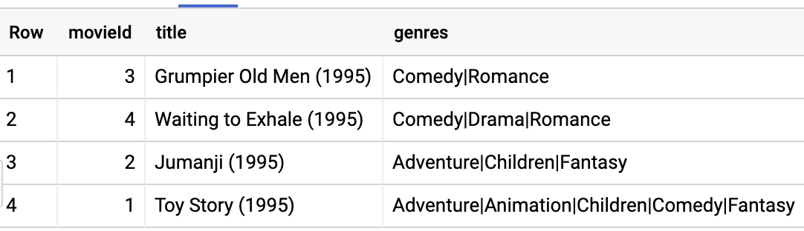
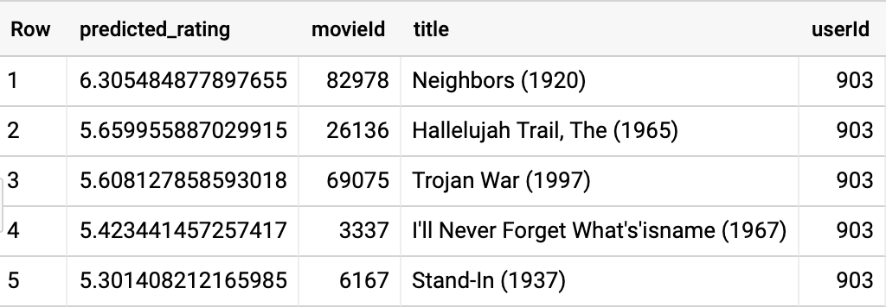
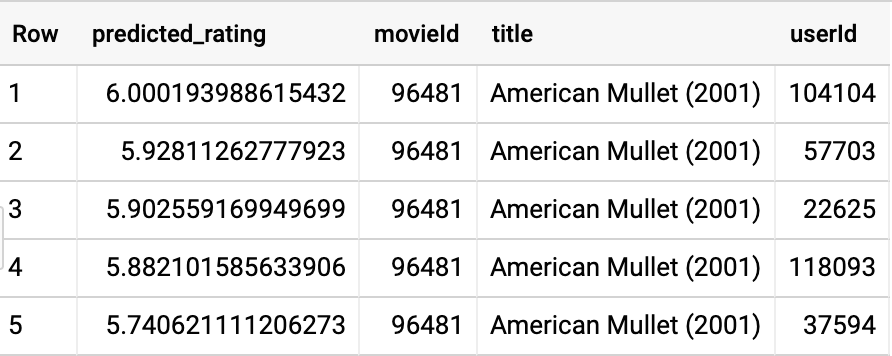

# Movie Recommendations in BigQuery ML

## Overview

BigQuery is Google's fully managed, NoOps, low cost analytics database. With BigQuery you can query terabytes and terabytes of data without having any infrastructure to manage or needing a database administrator. BigQuery uses SQL and can take advantage of the pay-as-you-go model. BigQuery allows you to focus on analyzing data to find meaningful insights.

[BigQuery Machine Learning](https://cloud.google.com/bigquery/docs/bigqueryml-analyst-start) (BQML, product in beta) is a new feature in BigQuery where data analysts can create, train, evaluate, and predict with machine learning models with minimal coding.

Collaborative filtering provides a way to generate product recommendations for users, or user targeting for products. The starting point is a table with three columns: a user id, an item id, and the rating that the user gave the product. This table can be sparse -- users don’t have to rate all products. Then, based on just the ratings, the technique finds similar users and similar products and determines the rating that a user would give an unseen product. Then, we can recommend the products with the highest predicted ratings to users, or target products at users with the highest predicted ratings.

To illustrate recommender systems in action, we'll use the MovieLens dataset. This is a dataset of movie reviews released by [GroupLens](https://grouplens.org/about/what-is-grouplens/), a research lab in the Department of Computer Science and Engineering at the University of Minnesota, through funding by the US National Science Foundation.

### Objectives

In this lab, you learn to perform the following tasks:

- Train a recommendation model in BigQuery
- Make product predictions for both single users and batch users

## Task 1: Get MovieLens Data

First, we're going to use the command line to create a BigQuery dataset to store the MovieLens data. The MovieLens data will then be loaded from a Cloud Storage bucket into the dataset.

### Start the Cloud Shell Editor

To create a BigQuery dataset and load the MovieLens data the Cloud Shell is used.

1. In the GCP Console, click **Activate Cloud Shell** (Cloud Shell).

2. If prompted, click **Start Cloud Shell**.

### Create and Load BigQuery Dataset

1. Run the following command to create a BigQuery dataset named movies:

    ```sh
    bq --location=EU mk --dataset movies
    ```

2. Run the following commands separately in the Cloud Shell:

    ```sh
    bq load --source_format=CSV \
    --location=EU \
    --autodetect movies.movielens_ratings \
    gs://dataeng-movielens/ratings.csv
    ```

    ```sh
    bq load --source_format=CSV \
    --location=EU   \
    --autodetect movies.movielens_movies_raw \
    gs://dataeng-movielens/movies.csv
    ```

This concludes getting the MovieLens dataset

## Task 2: Explore the Data

1. In BigQuery's **Query editor** execute the following query:

    ```sql
    SELECT
      COUNT(DISTINCT userId) numUsers,
      COUNT(DISTINCT movieId) numMovies,
      COUNT(*) totalRatings
    FROM
      movies.movielens_ratings
    ```

    You should confirm that the dataset consists of over 138 thousand users, nearly 27 thousand movies, and a little more than 20 million ratings.

2. Examine the first few movies using the query:

    ```sql
    SELECT
      *
    FROM
      movies.movielens_movies_raw
    WHERE
      movieId < 5
    ```

    

3. We can see that the genres column is a formatted string. Parse the genres into an array and rewrite the results into a table named `movielens_movies_raw`.

    ```sql
    CREATE OR REPLACE TABLE
      movies.movielens_movies AS
    SELECT
      * REPLACE(SPLIT(genres, "|") AS genres)
    FROM
      movies.movielens_movies_raw
    ```

Feel free to perform additional queries until you are comfortable with the dataset.

This concludes exploring the data.

## Task 3: Collaborative Filtering

Matrix factorization is a collaborative filtering technique that relies on two vectors called the user factors and the item factors. The user factors is a low-dimensional representation of a `user_id` and the item factors similarly represents an `item_id`.

To perform a matrix factorization of our data we use the typical BigQuery ML syntax except that the `model_type` is `matrix_factorization` and that we have to identify which columns play what roles in the collaborative filtering setup.

1. In order to apply matrix factorization to the movie ratings data the BQML query that needs to be executed is listed in the block below. However, creation of this model type can take up to 40 minutes and requires a Google Cloud project with reservation-oriented resources -- which is unlike those offered by the Qwiklabs environment.

    A model has been created in the Cloud Training project's **`cloud-training-prod-bucket`** BigQuery dataset for use in the rest of the lab.

    **NOTE**: Please **DO NOT EXECUTE** this query in your project.

    ```sql
    CREATE OR REPLACE MODEL
      movies.movie_recommender
    OPTIONS
      (model_type='matrix_factorization',
        user_col='userId',
        item_col='movieId',
        rating_col='rating',
        l2_reg=0.2,
        num_factors=16) AS
    SELECT
      userId,
      movieId,
      rating
    FROM
      movies.movielens_ratings
    ```

    Note, the `num_factors` and `l2_reg` options have been selected after much experimentation to speed up training of the model.

2. To view metrics for the trained model enter the following query:

    ```sql
    SELECT
      *
    FROM 
      ML.EVALUATE(MODEL `cloud-training-prod-bucket.movies.movie_recommender`)
    ```

## Task 4: Making Recommendations

With the trained model, we can now provide recommendations.

1. Let’s find the best comedy movies to recommend to the user whose `userId` is 903. Enter the query below:

    ```sql
    SELECT
      *
    FROM
      ML.PREDICT(MODEL `cloud-training-prod-bucket.movies.movie_recommender`,
        (
        SELECT
          movieId,
          title,
          903 AS userId
        FROM
          `movies.movielens_movies`,
          UNNEST(genres) g
        WHERE
          g = 'Comedy' ))
    ORDER BY
      predicted_rating DESC
    LIMIT
      5
    ```

    

2. This result includes movies the user has already seen and rated in the past. Let’s remove them:

    ```sql
    SELECT
      *
    FROM
      ML.PREDICT(MODEL `cloud-training-prod-bucket.movies.movie_recommender`,
        (
        WITH
          seen AS (
          SELECT
            ARRAY_AGG(movieId) AS movies
          FROM
            movies.movielens_ratings
          WHERE
            userId = 903 )
        SELECT
          movieId,
          title,
          903 AS userId
        FROM
          movies.movielens_movies,
          UNNEST(genres) g,
          seen
        WHERE
          g = 'Comedy'
          AND movieId NOT IN UNNEST(seen.movies) ))
    ORDER BY
      predicted_rating DESC
    LIMIT
      5
    ```

For this user, this happens to yield the same set of movies -- the top predicted ratings didn’t include any of the movies the user has already seen.

This concludes making recommendations.

## Task 5: Customer Targeting

In the previous section, we looked at how to identify the top-rated movies for a specific user. Sometimes, we have a product and have to find the customers who are likely to appreciate it.

1. We wish to get more reviews for `movieId=96481` which has only one rating and we wish to send coupons to the 100 users who are likely to rate it the highest. Identify those users using:

    ```sql
    SELECT
      *
    FROM
      ML.PREDICT(MODEL `cloud-training-prod-bucket.movies.movie_recommender`,
        (
        WITH
          allUsers AS (
          SELECT
            DISTINCT userId
          FROM
            movies.movielens_ratings )
        SELECT
          96481 AS movieId,
          (
          SELECT
            title
          FROM
            movies.movielens_movies
          WHERE
            movieId=96481) title,
          userId
        FROM
          allUsers ))
    ORDER BY
      predicted_rating DESC
    LIMIT
      100
    ```

    The result gives us 100 users to target, the top 5 of whom are:

    

This concludes customer targeting.

## Task 6: Batch predictions for all users and movies

What if we wish to carry out predictions for every user and movie combination? Instead of having to pull distinct users and movies as in the previous query, a convenience function is provided to carry out batch predictions for all `movieId` and `userId` encountered during training.

1. Enter the following query to obtain batch predictions:

    ```sql
    SELECT
      *
    FROM
      ML.RECOMMEND(MODEL `cloud-training-prod-bucket.movies.movie_recommender`)
    LIMIT
      100000
    ```

Without the `LIMIT` command the results would be too large to return given the default settings. But the output provides you a sense of the type of predictions that can be made with this model.

As seen in a section above, it is possible to filter out movies the user has already seen and rated in the past. The reason already seen movies aren’t filtered out by default is that there are situations (think of restaurant recommendations, for example) where it is perfectly expected that we would need to recommend restaurants the user has liked in the past.
