# Cloud AutoML

## Agenda

In this course, we're going to dive into some of the Cloud AutoML products.

- Why AutoML?
- AutoML Vision - for image data
- AutoML NLP - for text-based data
- AutoML Tables - for tabular data

## Why AutoML?

Cloud AutoML is a service on Google Cloud Platform that allows you to build powerful machine learning models with minimal effort and machine learning expertise.

They're ideal when you have a need to get a machine learning model off the ground as quickly as possible.

### Create and deploy custom models with AutoML

Where does AutoML sit in the suite of GCP products that can be used for machine learning?

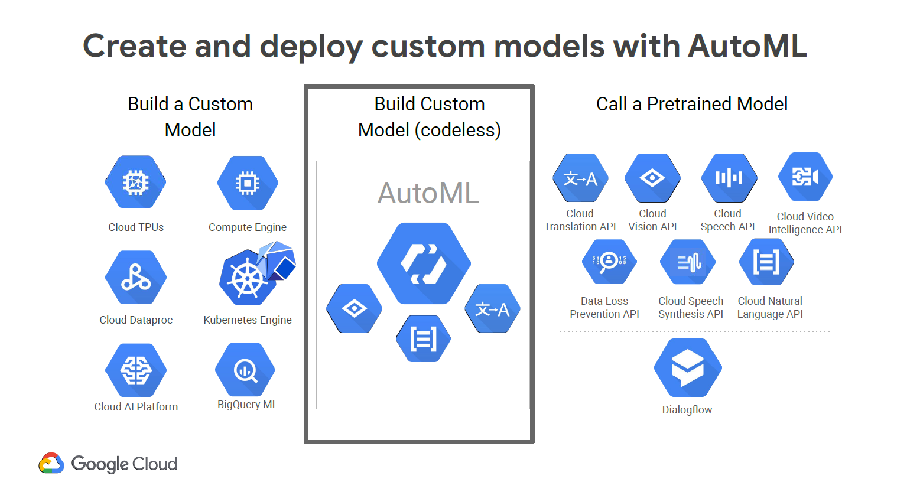

- On one hand, with products such as Cloud AI platform and BigQuery ML, you can build very customised machine learning models.
- However, to use these products you will need someone with machine learning expertise and coding experience.
- You'll be responsible for training the machine learning model yourself, which can take a lot of time.
- On the other hand on GCP, you can call pre-trained models using services like Cloud Vision API and Cloud speech API.
- No model training is required for these services.
- You simply feed the API your data and it returns predictions.
- The downside of using pre-trained models is that they only yield good predictions when your data is relatively commonplace as in social media images or customer reviews.
- Cloud AutoML sits somewhere in between these two.
- Play video for highlighted transcript with text, A model is trained specific to your data, but you don't need any code to train it., marked from 1 minute 50 seconds till 1 minute 55 secondsA model is trained specific to your data, but you don't need any code to train it.

### Training high-quality, custom ML models requires a lot of effort and expertise

- If you're going to train a machine learning model from scratch you need machine learning and coding expertise.
- Anecdotally, building machine learning models follows the Pareto Principle where you can launch a functional machine learning model relatively quickly.
- However, most of the time and effort will go into debugging and making the machine learning model performant.

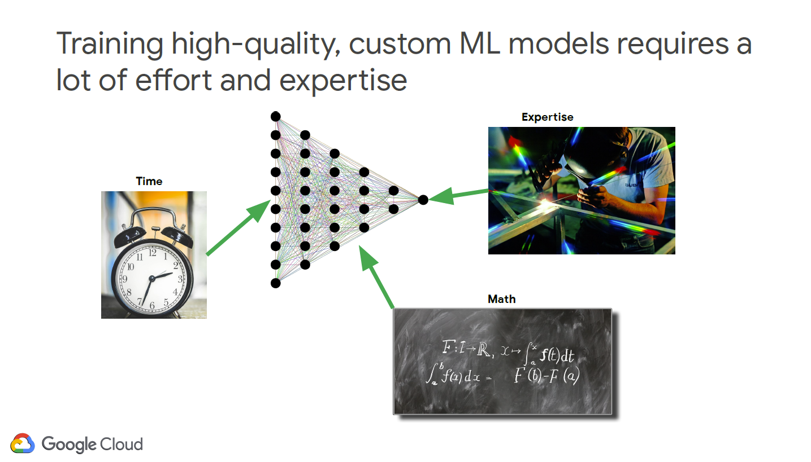

### Cloud AutoML follows a standard procedure that is divided into train, deploy and serve phases

- Cloud AutoML follows a standard procedure that is divided into three phases: train, deploy and serve

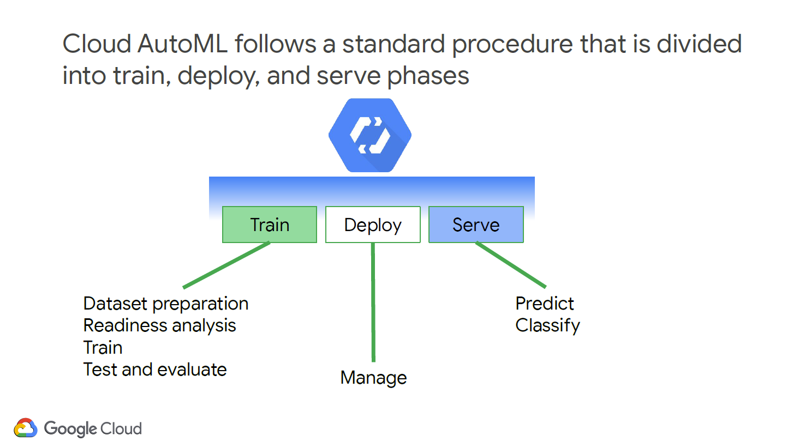

#### Train

The training phase has several steps:

1. **Dataset preparation:** prepare a data set that will be used in the supervised training process
2. **Readiness analysis:** analyse the dataset to make sure it has qualities that will enable it to be effective
3. **Train:** after the dataset is prepared and validated, you use it train the model
4. **Test and evaluate:** finally, the model is used with test data to evaluate whether it is going to be effective in predciting and classifying new cases

#### Deploy

The second phase is to deploy the model and manage it. This means getting rid of old or unused models.

#### Serve

The third phase is hosting the model on a service where it can be used to predict and classify.

In traditional machine learning, the deploy and serve phases are complicated and involve moving the model from the model building system, like Tensorflow, to a model hosting system like Cloud ML Engine.

However, Cloud AutoML handles most of the complexity of these activities for you, making these activities easy.

### Cloud AutoML uses a prepared dataset to train a custom model

- Cloud AutoML uses a prepared dataset to train a custom model
    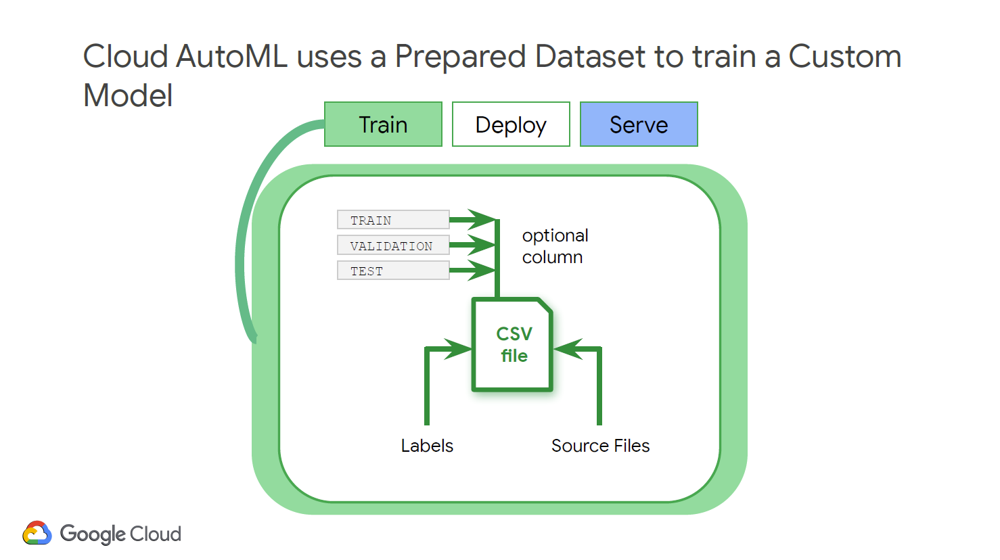
- You can make small prepared datasets for experimentation directly in the web UI but it is more common to assemble the information in a CSV.
- The CSV file must be utf-8 encoded and located in the same cloud storage bucket as the source file.
- You can also create a manage prepared datasets programatically in Python, Java or Node.js.
- The first column in the CSV file is optional; it assigns the data in each row into one of three groups: train, validation or test
- If you leave out this column, the rows will automatically be assigned 80% to train, and 10% to validation and test
- The next column in the CSV file identifies source files that are hosted in cloud storage
- These are paths beginning with `gs://`
- The source file format depends on the kind of model you are training but can also be compressed zip files
- Subsequent columns specify labels; the labels are alphanumeric and can contain underscores but not special characters
- Currently, the CSV file and all the source files must be in a cloud storage bucket in the same project where AutoML runs
- Prepared datasets do not expire. You may accumulate many prepared datasets in a project; you can list and delete those that you do not need

### Cloud AutoML performs basic checks and a preliminary analysis of the Prepared Dataset to determine if there is enough information and if it is properly organised

- Cloud AutoML peforms basic checks and a preliminary analysis of the prepared dataset to determine if there is enough information and if it is organised properly
    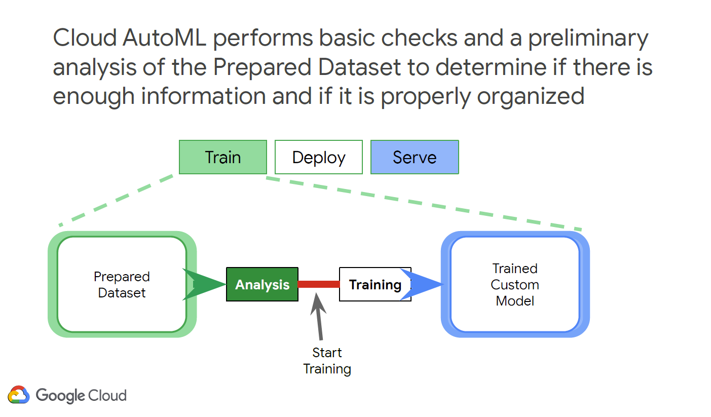
- If the prepared dataset is not ready, you will need to add more rows or more labels to the CSV file.
- When it is ready, you can start training
- Training can take from ten minutes to several hours depending on the kind of model.
- You can check the status while it's running.
- Import and training tasks can be cancelled.
- The trained group of data is used to train the custom model.
- The source files have already been associated with the correct labels in the prepared data set.
- So Cloud AutoML uses a supervised learning method to train the custom model.
- Part of the process uses the validation group data to verify how well the model works at classifying and predicting.
- Supervised learning works on correctable error.
- Cloud AutoML constructs an algorithm that guesses the labels for source data.
- When the guess is right, it strengthens the algorithm.
- When the guess is wrong, the error is used to correct the algorithm.
- And this is how learning occurs.
- One full run through all the trained group data is called an epoch.
- Total error is tracked and minimised through multiple epochs to create the best model possible from the training data provided
- The result is a trained custom model
- The custom model works well with the training data, but is it good at categorising new instances of data it has not seen before? Data from the test group is used to evaluate the custom model and to remove bias from the evaluation

### Data from the TEST group is used to evaluate the Custom Model and to remove bias from the evaluation

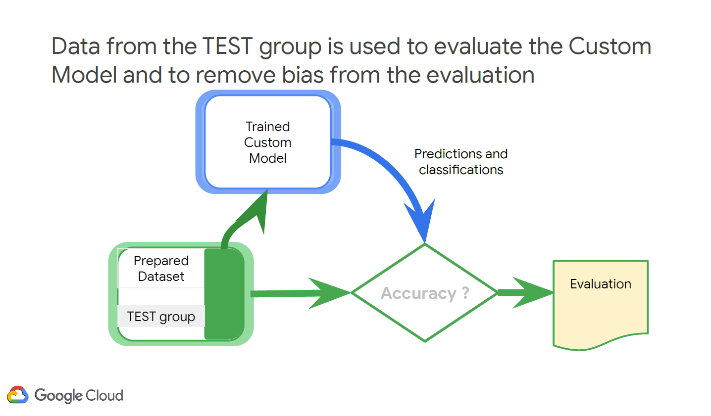

- The predictions and classifications are compared with the labels in the prepared data set
- The evaluation report provides indicators that are specific to the kind of model and help understand how effective the model is at predicting and classifying

### There is nothing you need to do to deploy a trained model

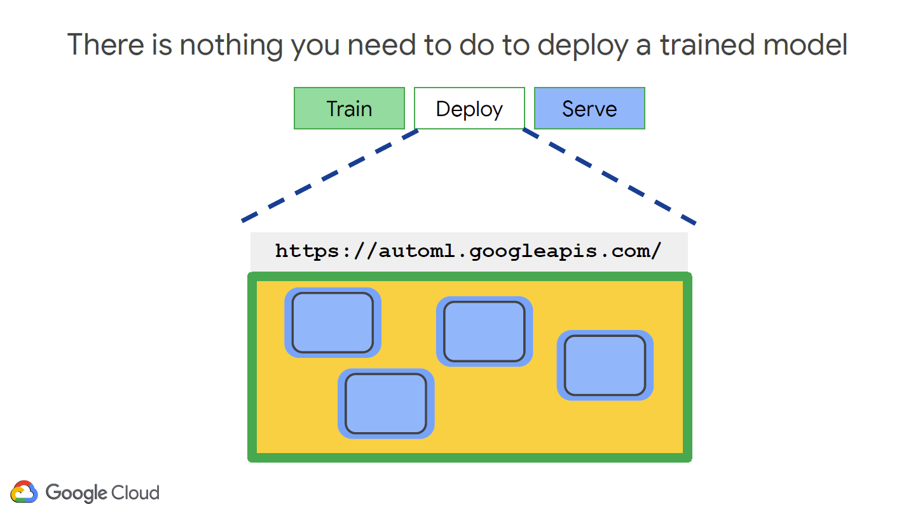

- There is nothing you need to do to activate a model
- However, if it has been some time since you used a model, the system may need to warm up for a few minutes before the model becomes active
- Once it exists, if you have the project credentials and model name, you can access and use the custom model
- Each time you train with a prepared dataset it creates a new custom model
- You can list and delete unneeded models
- Custom models are temporary and are eventually deleted and they cannot be exported or saved internally
- Models that are not used for prediction are automatically deleted after a period of time
- Models that are used are eventually deleted.
- So you will need to train a new custom model periodically to continue predicting and classifying
- How long models remain before they are deleted depends on the model type

### Serve models using the Web UI, or from the command line using CURL to send a JSON-structured request

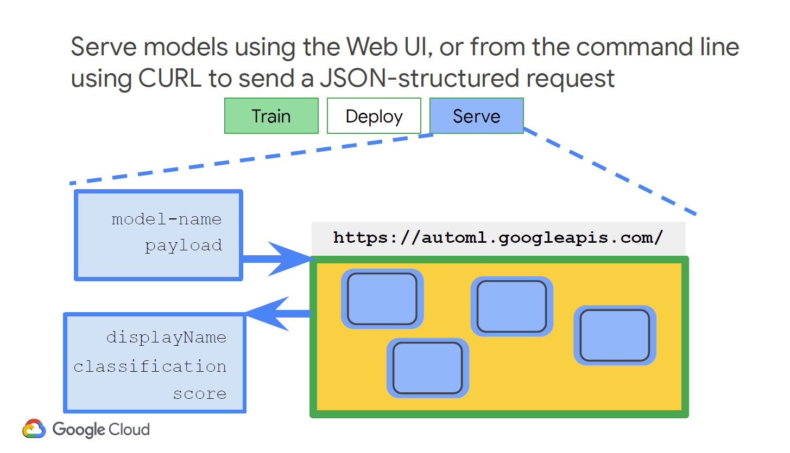

- The primary classification interface is at the URI shown
- You can make a classification using the web URI or from the command line using `CURL` to send a Json structured request
- There are also client libraries for Python, Java and Node.js
- After you have set up authentication to use the REST API, you send a request with the model name and the payload, which is the data you want classified
- The service returns Json containing multiple fields called `displayName`
- These are the labels that matched
- The score is a confidence value when 1.0 is absolute confidence and lower fractional numbers represent lower confidence in the correctness of the classification
- Quotas apply for both model creation and service requests

### Break up complicated problems into multiple models

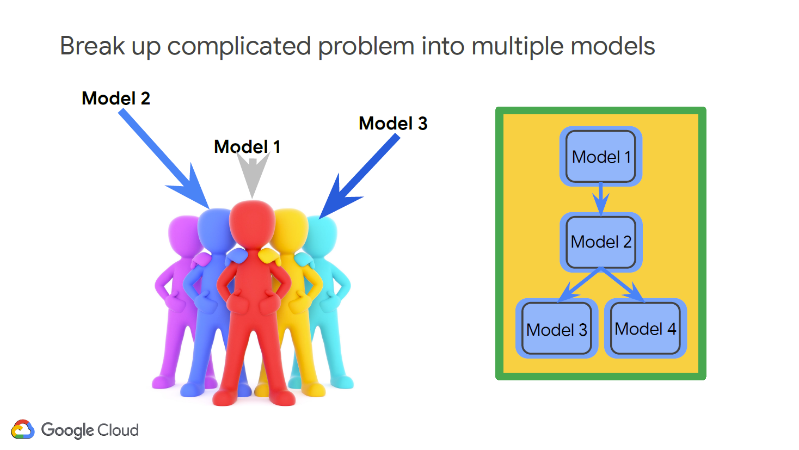

- Cloud AutoML lowers the effort required to create a model when compared to traditional machine learning
- With traditional ML, models were hard to create so there was a tendancy to try to make the dataset and model all inclusive
- With Cloud AutoML you can create smaller, more specialised custom models and use them programmatically
- So you don't have to squeeze everything into one model
- And you can use the results of one classification to make choices about what kind of classification to perform next
- Here's an example: a company that sells clothing has a service office that receives emails from customers
- The first job might be to distinguish email containing feedback about products from emails requesting information about the company
  - Model 1 could be used to classify feedback email
- The second job might be to distinguish whether the email is describing trousers, shirts, shoes or hats
  - This might be the job of model 2
- Model 3 might be used only for emails talking about shirts to see if the style of the shirt is mentioned
- Model 4 might be used only for emails about shoes to see if the shoe style is mentioned
- You can see from this example, that a collection of models might be able to accomplish magic in your own application by focussing the scope and purpose of these models
- You can also programmatically combine your custom model with a standard model such as Cloud Natural Language API
- When should you use cloud AutoML? The recommended application strategy is to first use the pre-built artificial intelligence services

### When should you use cloud AutoML?

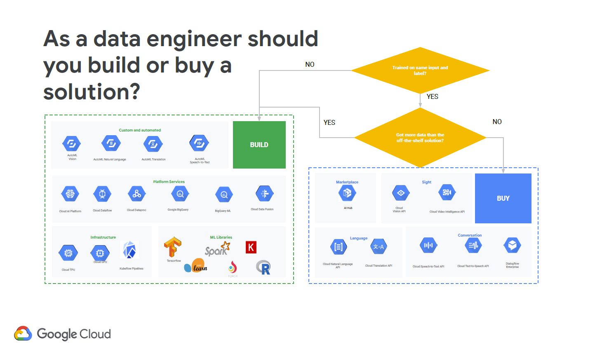

- The recommended application strategy is to first use the pre-built artificial intelligence services
- Next, you can use Cloud AutoML to produce custom models, which can be used with the pre-built services or on their own
- Remember that you can divide a problem into specialised parts and use multiple custom models together
- Finally, if you discover you need more advanced features, you can use the machine learning and artificial intelligence services to create new models

## AutoML Vision

- Cloud AutoML Vision is a Cloud AutoML product for image data
- Cloud AutoML Vision specialises in training models for image classification

### Cloud AutoML Vision specialises in training models for image classification

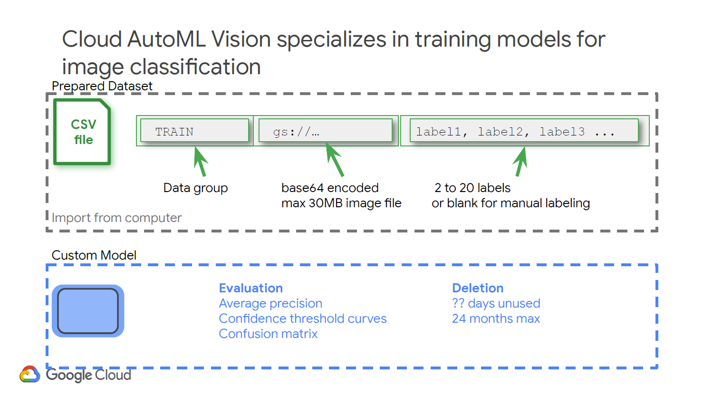

- You can load the CSV file and the image files from cloud storage, or you can upload them from your local computer using Import
- Training supports several file formats, including `JPEG` and `PNG`
- The images can be up to 30MB in size and have to be converted to Base64 encoding which stores the image as a text file
- The prepared file will be a `TXT` file or a compressed `ZIP` file
- Service requests only recognise `JPEG`, `PNG` and `GIF` files up to 1.5MB
- The trained model will work best when there are at most 100 times more images for the most common label than for the least common label
- Consequently, for model performance, it is recommended that you remove very-low frequency labels
- You can label the images in the web UI, or in some cases, you can use the human labelling service offered by Google if you have more than 100 unlabelled images
- To gauge your trained model's readiness, AutoML Vision creates the confusion matrix for up to 10 labels
- If you have more than 10 labels, the matrix includes the 10 labels wit the most incorrect predictions

### Improving Custom AutoML Vision Models

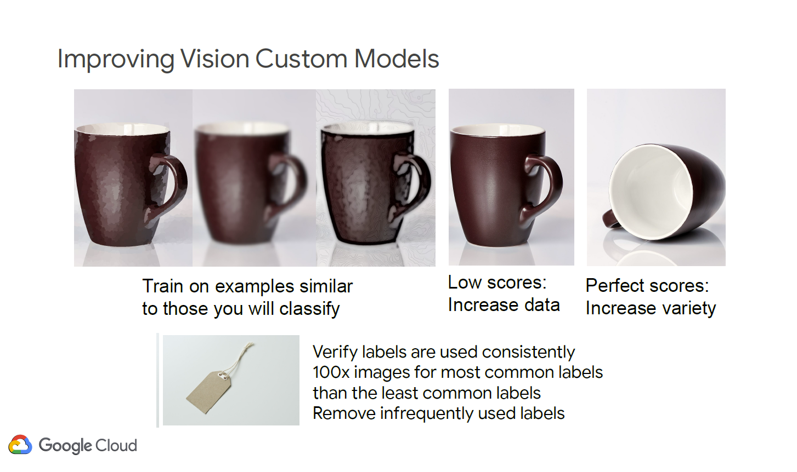

- The quality of custom Vision models has a lot to do with the choice of training data
- Train on images with similar properties to those you intend to classify
- For example, images of similar resolution, lighting, focus and level of detail
- High-confusion, low-average precision scores, or low-precision and recalled scores can indicate that your model needs additional training data or has inconsistent labels
- Perfect is the enemy of good, and perfect or very high average precision scores could indicate that something is wrong in the model
- It could mean the data is too easy and not varied enough and the model might not work well beyond the test data
- In this case, increase the variety of images in the prepared data set

## AutoML NLP

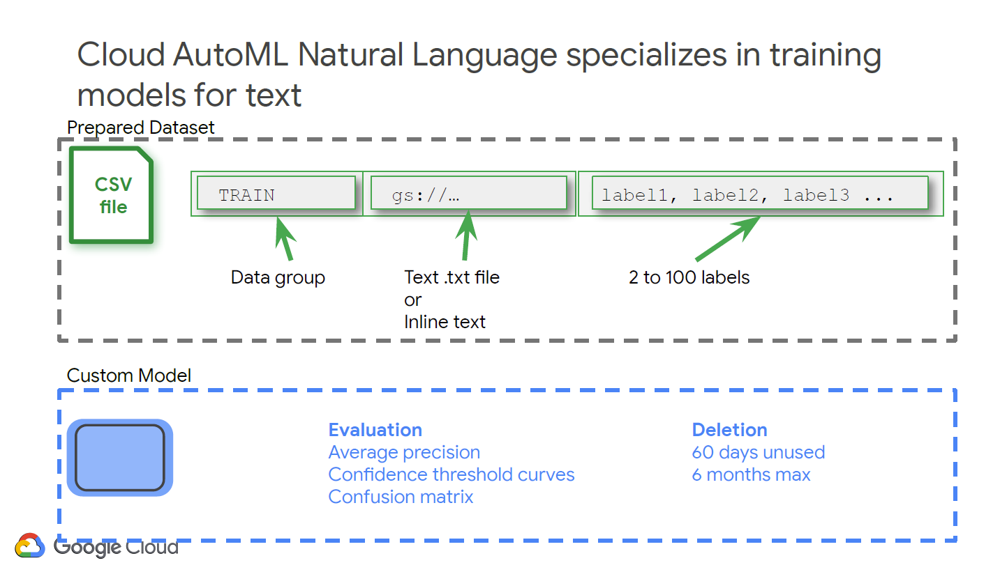

- Cloud AutoML Natural Language specialises in training models for text data
- For example, if you have a set of newspaper articles, you can use the AutoML NLP service to classify if a given article is about sports or politics
- The text to be recognised can be inline texts in the cell of the CSV file
- More commonly, the text is contained in documents which are `.txt` files or are compressed in a `.zip` format
- The path to the cloud storage location of the document appears in the CSV file
- The documents can be as small as one sentence or up to a maximum of 128KB
- You can have anywhere from 2-100 labels
- The custom model is evaluated on average precision
- That is a value from 0.5-1.0
- It's formal name is the area under the precsion/recall curve
- A higher number indicates more accurate classification and prediction
- The evaluation report also supplies confidence threshold curves which is a way of characterising false positive classification against true positives
- For models that apply one label per document, the evaluation report includes a confusion matrix
- The online documentation includes more information about the evaluations and how to interpret them
- If a natural language custom model is not used for 60 days, it will be deleted
- If a natural language custom model is being used, it will be deleted after 6 months
- So you'll be required to retrain your model
- The reason for this is that, training and serving methods inside Cloud AutoML are frequently improved and updated
- These changes are not guaranteed to be backwards compatible
- They may render a custom model incompatible with the current service

### Improving Natural Language Custom Models

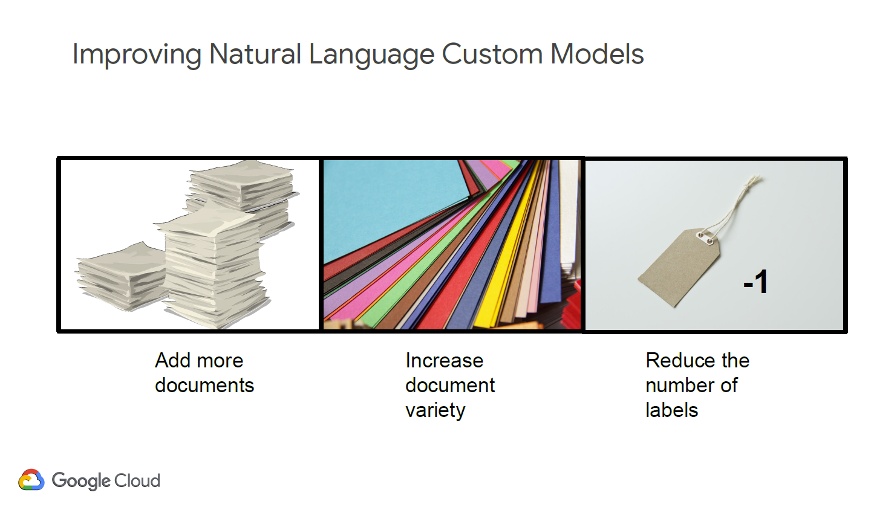

- High confusion and low average precision scores indicate that the prepared dataset needs additional entries or that the labels are being used inconsistently
- You may be able to improve low quality evaluations for particular labels with one of these methods
  - Add more documents associated with those labels. In other words, there might just not be enough training data to get a good result
  - You also may need to increase the variety of documents by adding longer or shorter examples, i.e.: documents with different writing styles or word choice or by different authors
  - Finally, for labels that are not useful or have low quality, you may want to remove them altogether to increase the accuracy of the remaining labels

## AutoML Tables

Finally, let's go into AutoML Tables for tabular data. Tabular data is what you mioght find in a spreadsheet for example

### Cloud AutoML Table is for structured data

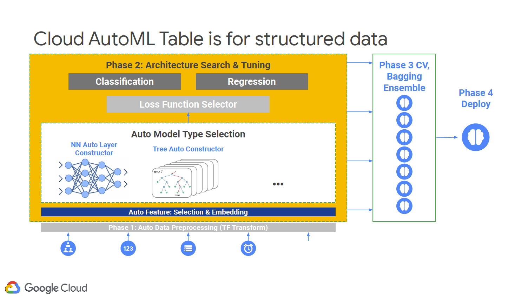

- While AutoML Vision and NLP are for unstructured data, AutoML Table is for structured data
- The development of AutoML table is a collaboration with the Google Brain team, while the technical details of the project haven't been released yet to the public, the team basically took the architecture search capability used for image classification and translation problems, and found a way to apply it to tabular data

### Example: Mercari Price Suggestion Challenge

- Let's describe a dataset where AutoML tables perform really well - the Mercari price suggestion challenge
- Mercari is Japan's biggest community powered shopping app and marketplace
- Mercari created the price suggestion challenge for predicting the price of a product offered on the marketplace, so that they could give price suggestions to their sellers
- Participants were given some 1.5 million rows of rich data with plenty of noise

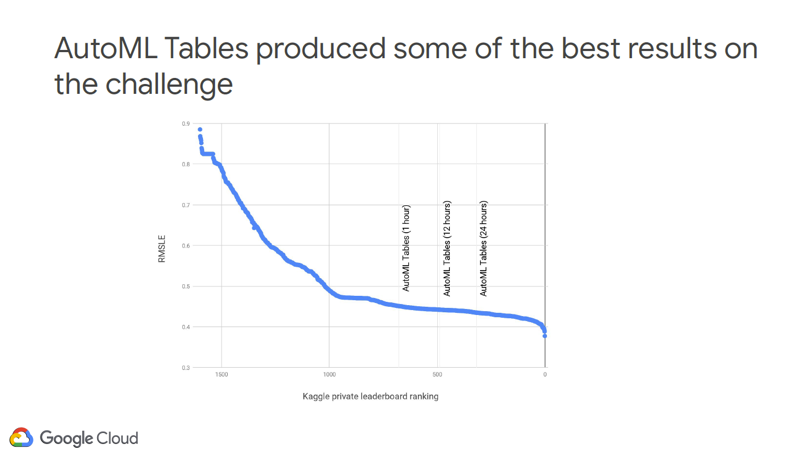

- The plot shows the performance of AutoML Tables on the Mercari challenge for several different training times
- You can see that after 24 hours of training, AutoML Table models are pretty much on the leaderboard
- Even after only one hour of training, you get to the plateau of leaders, which is extremely impressive performance on a million plus row dataset with significant complexity
- Compared to the $100k price for this challenge, one hour of training is just $19
- Since the search process for AutoML Tables is random, you might get slightly different results if you try to reproduce this performance

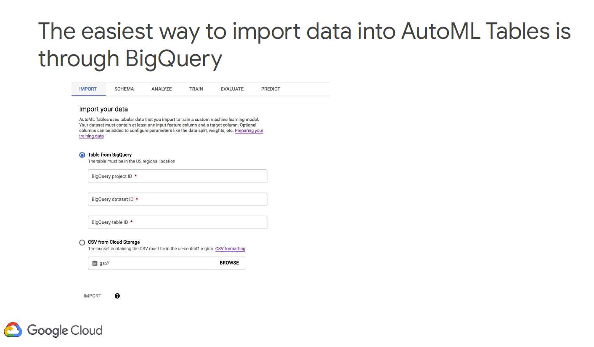

- The easiest way to import your data into AutoML Tables is through BigQuery
- You can also import data using CSV files stored locally or on cloud storage
- One of the advantages of importing data through BigQuery is its support for arrays and structs
- Regardless, for both import sources, your data must have between 1000 and 100 million rows, between 2 and 1000 columns and be 100GB or less in size

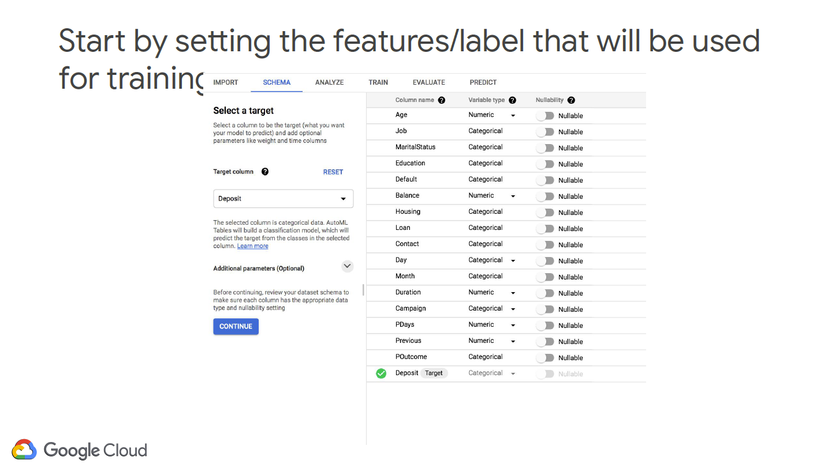

- Once your data is imported, the next step is to select the features you want to use and to specify the column you're trying to predict

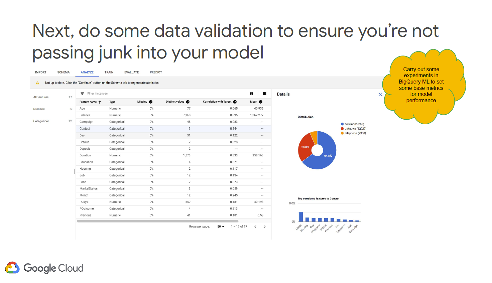

- In the next step of building an AutoML table model, you go through a data validation phases, the purpose of this step is to ensure you're not passing bad data to your model
- This includes checking for columns that have too many null values, outliers that are skewing the distribution of a column and columns that are not correlated to the target you're trying to predict

#### You can allocate budget when training the model

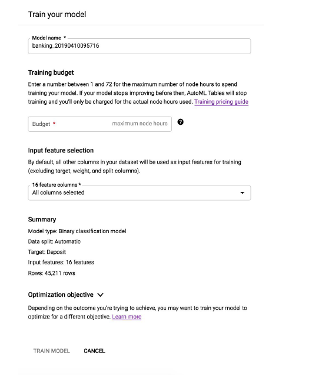

- As we saw previously for the AutoML Tables' performance on the Mercari challenge, you can train a model for a variable amount of time
- You can set a training budget in node hours to cap costs, by default AutoML Tables will stop training if the model isn't seeing significant performance gains anymore

#### Inspect the training metrics across multiple models

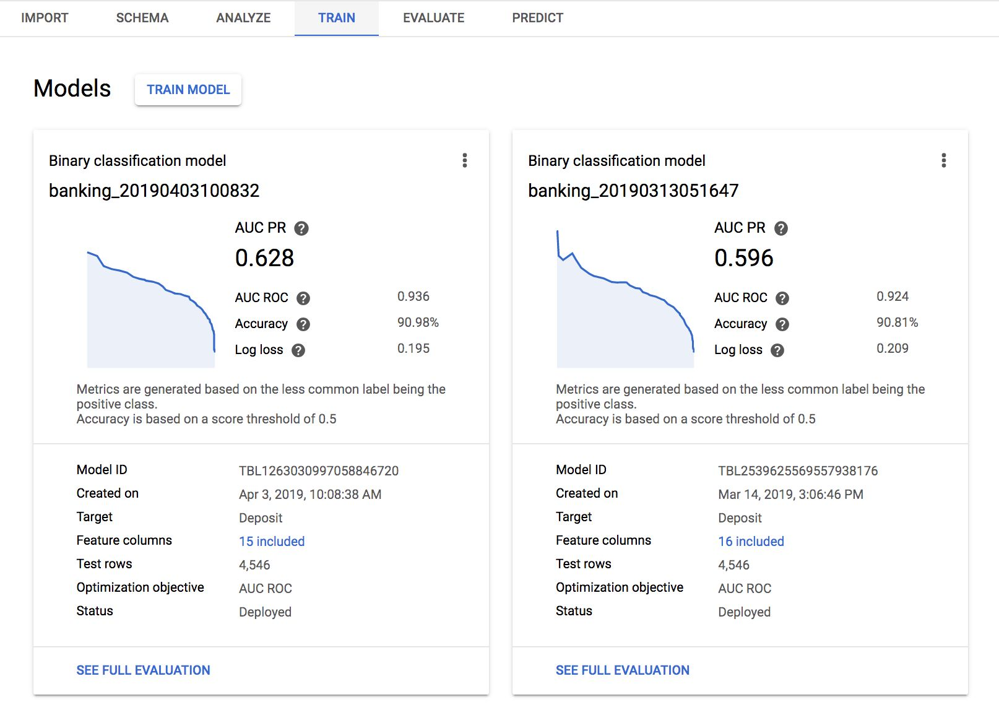

- Once your model is trained, you should look at the training metrics and be weary of models that are too good to be true
- In this case, you likely have a data issue you'll need to resolve, for classification, the report includes metrics such as area under the curve for a precision/recall curve, accuracy and the F1 score
- Also a confusion matrix is outputted along with feature importances
- These two sets of metrics are particularly useful in diagnosing low-performing models
- For regression models, the root mean squared error (RMSE), mean absolute error (MAE), and feature importances are returned among other metrics
- Check out AutoML Table documentation for a full list of metrics that get generated after model training

#### Check how models perform against test data to gauge how well it will generalise in the wild

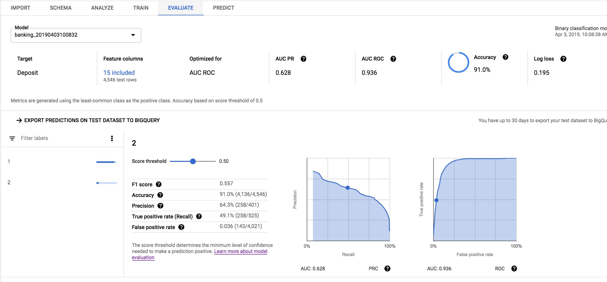

- It's arguably more important to look at the performance metrics generated on the test set, to get a feel for how well your model will generalise
- The same metrics generated for training data are also available for test data
- For classification models, it may be useful to set the score threshold to a value other than the default of 0.5
- Increase the score threshold to make your classifier output a positive label with more confidence

#### Integrate your trained model into your applications

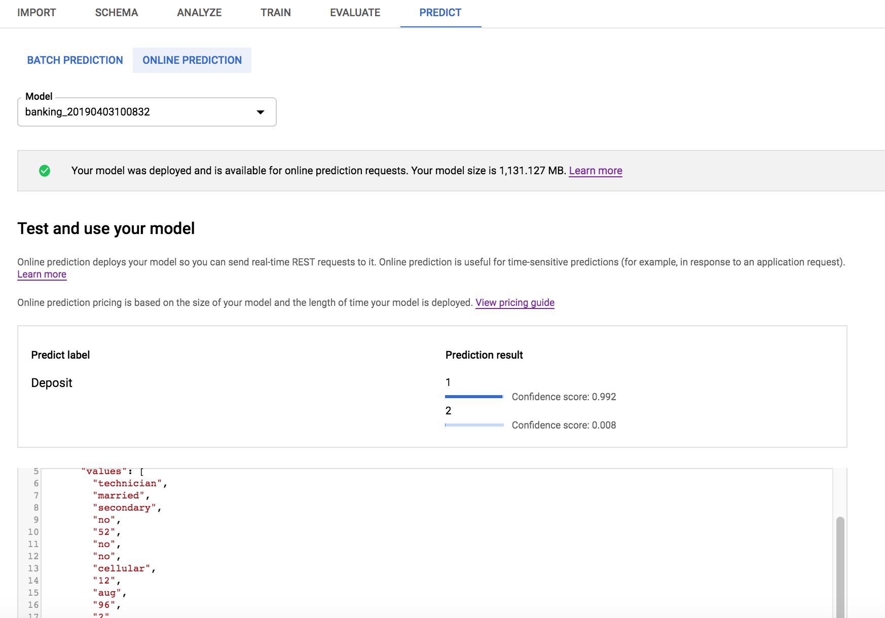

- Once you're happy with your model performance, you can go ahead and deploy it, you have the option of making batch or online predictions
- For online predictions, you can make calls using a `curl` command, or one of the Java, Node.js or Python APIs, the same APIs that are available for batch predictions
- You can make batch predictions on either BigQuery tables or CSV files
- However, the BigQuery data source tables must be no larger than 100GB
- For CSV files, each data soruce file can be no larger than 10GB, and if you include mutliple files, the sum of all files cannot exceed 100GB

#### How to choose between BQML, AutoML and a custom model

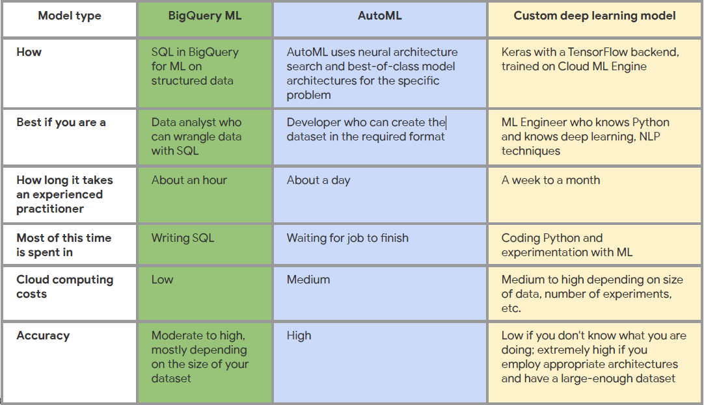

- When should you use BigQuery ML, AutoML or building a custom model? The short answer is, it depends on how much time you have to build the model and what resources you have available
- The table above provides some guidance. Given the low barrier of building a model in either BigQueryML or AutoML, it is recommended to give either a try first
- If the resulting model is not sufficient, only then should you throw more resources at it

## Module Summary

To summarise:

- Cloud AutoML can be used to create really powerful ML models without any coding with models that will be customised to your data
- Use AutoML Vision for image data
- Use AutoML NLP for text data
- Use AutoML Tables when you have structured data
