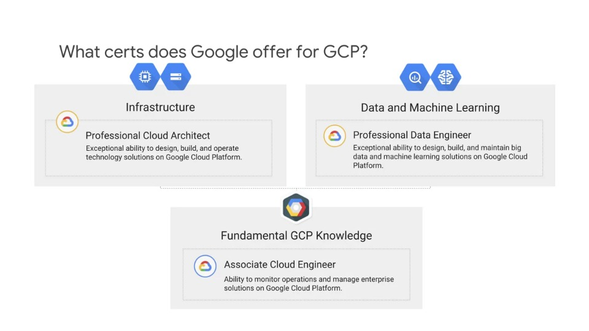
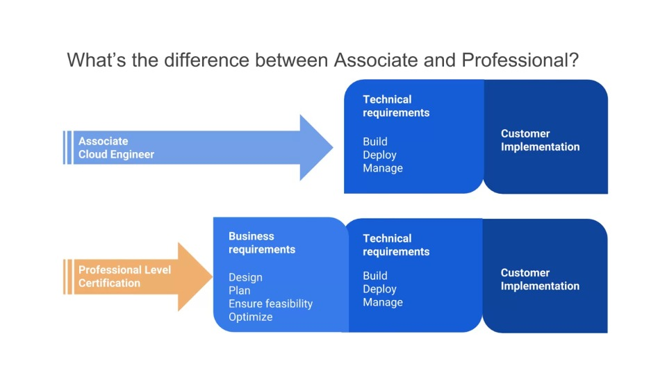
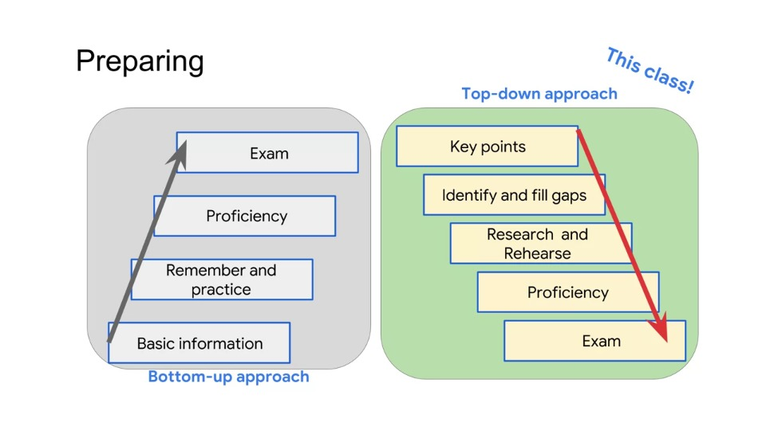
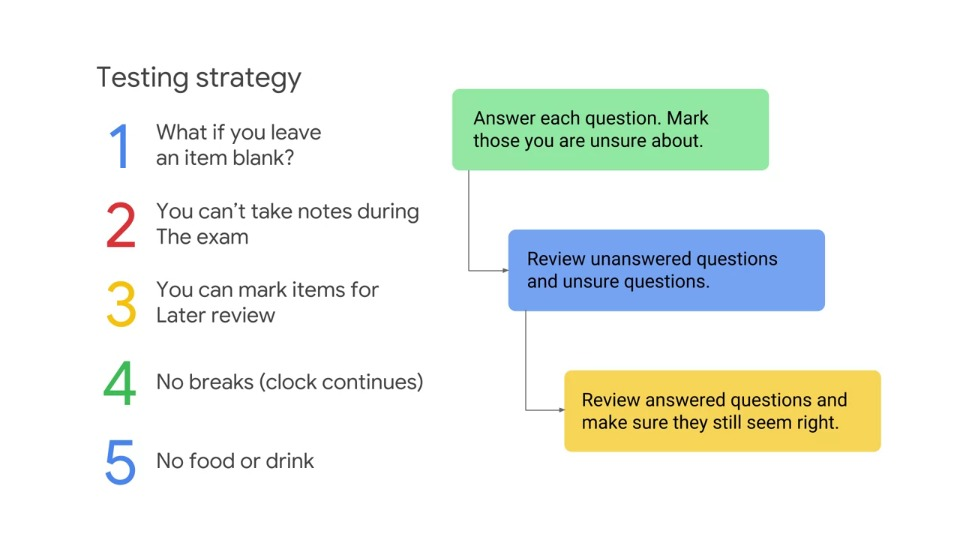

# Understanding the Professional Data Engineer Exam

## Introduction

- The tips sections of this course are organised around the data engineer exam guide outline (see below).
- The outline divides the exam into sections that focus on specific priorities and information about the job role
- This course follows the outline explaining each section of the course, providing tips and highlighting information that would be useful to kno- Some items in the outline are important to the job of a professional data engineer, but they're not technical, or maybe they're not specific to Google
- For example, a data engineer needs to know how to present solution proposals to customers and to communicate with executive staff

The following three categories are a good way of organising information for this course:

- Data representations
- Pipelines
- Processing infrastructure

Thinking of the material from the perspective of these categories will help prepare for the exam by surfacing what is important.

This means it is not just a list of details or trivial facts being tested, it's the ability to perform a job, which means thinking through data engineering problems in the abstract

Using these categories of abstraction, it's a good way to organise your thinking about preparing for the exam.

## Machine Learning

- In recent years, the industry evolved from database technologies to big data and data processing technologies
- Now the industry is continuing to evolve from big data to machine learning
- Hadoop isn't a replacement for MySQL, and ML & Tensorflow do not replace or eliminate big data or Hadoop in any way
- But what ML does bring is an entirely new perspective to data engineering
- We can take data that was complicated and maybe even collected without any particular purpose in mind, and we can extract business intelligence from it
- Machine Learning enables product innovation, making products better and process innovation, making processes better, it brings a new kind of analysis to business decision-making
- So ML isn't a subject that's tacked on or just included along with data engineering, it's a major part of data engineering and you'll see it mentioned extensively in this course

## Agenda

Below is an agenda for the course:

- *Understanding the Professional Data Engineer Certification* *
- **Designing Data Processing Systems**
- **Building and Operationalising Data Processing Systems**
- **Operationalising Machine Learning Models**
- **Reliability, Policy and Security to Ensure Solution Quality**
- Resources and Next Steps

The course begins by discussing what the certification is about, how it's positioned relative to other certifications and more specifically how it's designed relative to your job role, experience and career aspirations.

The next three modules in the course cover specific preparation tips and technologies such as information on how to choose among related technologies, for example, under what conditions would you choose BigTable over BigQuery.

Other information covered includes elements of data engineering specific to Google Cloud such as how subnets extend across zones within a region; a characteristic unique to Google Cloud.

The reason for this design is it makes designing for reliability even easiers since adjacent instances can be in the same subnet but on different zones giving them fault isolation.

This concept is important for a data engineer to know when designing processing infrastructure on Google Cloud.

In this course, we highlight the skills you need to know for the job, and then you'll either know the dependent concepts the skills are based on or research the concepts to fill in the gaps.

This class provides a high-level overview of subject areas and tips, and practice with exam-taking skills.

## Professional Data Engineer Exam Guide and Outline

### Certification exam guide

A Professional Data Engineer enables data-driven decision making by collecting, transforming, and publishing data. 

A data engineer should be able to design, build, operationalize, secure, and monitor data processing systems with a particular emphasis on security and compliance; scalability and efficiency; reliability and fidelity; and flexibility and portability. A data engineer should also be able to leverage, deploy, and continuously train pre-existing machine learning models.

## Exam outline

### 1. Designing data processing systems

1.1 Selecting the appropriate storage technologies. Considerations include:

- Mapping storage systems to business requirements
- Data modeling
- Tradeoffs involving latency, throughput, transactions
- Distributed systems
- Schema design

1.2 Designing data pipelines. Considerations include:

- Data publishing and visualization (e.g., BigQuery)
- Batch and streaming data (e.g., Cloud Dataflow, Cloud Dataproc, Apache Beam, Apache Spark and Hadoop ecosystem, Cloud Pub/Sub, Apache Kafka)
- Online (interactive) vs. batch predictions
- Job automation and orchestration (e.g., Cloud Composer)

1.3 Designing a data processing solution. Considerations include:

- Choice of infrastructure
- System availability and fault tolerance
- Use of distributed systems
- Capacity planning
- Hybrid cloud and edge computing
- Architecture options (e.g., message brokers, message queues, middleware, service-oriented architecture, serverless functions)
- At least once, in-order, and exactly once, etc., event processing

1.4 Migrating data warehousing and data processing. Considerations include:

- Awareness of current state and how to migrate a design to a future state
- Migrating from on-premises to cloud (Data Transfer Service, Transfer Appliance, Cloud Networking)
- Validating a migration

### 2. Building and operationalizing data processing systems

2.1 Building and operationalizing storage systems. Considerations include:

- Effective use of managed services (Cloud Bigtable, Cloud Spanner, Cloud SQL, BigQuery, Cloud Storage, Cloud Datastore, Cloud Memorystore)
- Storage costs and performance
- Lifecycle management of data

2.2 Building and operationalizing pipelines. Considerations include:

- Data cleansing
- Batch and streaming
- Transformation
- Data acquisition and import
- Integrating with new data sources

2.3 Building and operationalizing processing infrastructure. Considerations include:

- Provisioning resources
- Monitoring pipelines
- Adjusting pipelines
- Testing and quality control

### 3. Operationalizing machine learning models

3.1 Leveraging pre-built ML models as a service. Considerations include:

- ML APIs (e.g., Vision API, Speech API)
- Customizing ML APIs (e.g., AutoML Vision, Auto ML text)
- Conversational experiences (e.g., Dialogflow)

3.2 Deploying an ML pipeline. Considerations include:

- Ingesting appropriate data
- Retraining of machine learning models (Cloud Machine Learning Engine, BigQuery ML, Kubeflow, Spark ML)
- Continuous evaluation

3.3 Choosing the appropriate training and serving infrastructure. Considerations include:

- Distributed vs. single machine
- Use of edge compute
- Hardware accelerators (e.g., GPU, TPU)

3.4 Measuring, monitoring, and troubleshooting machine learning models. Considerations include:

- Machine learning terminology (e.g., features, labels, models, regression, classification, recommendation, supervised and unsupervised learning, evaluation metrics)
- Impact of dependencies of machine learning models
- Common sources of error (e.g., assumptions about data)

### 4. Ensuring solution quality

4.1 Designing for security and compliance. Considerations include:

- Identity and access management (e.g., Cloud IAM)
- Data security (encryption, key management)
- Ensuring privacy (e.g., Data Loss Prevention API)
- Legal compliance (e.g., Health Insurance Portability and Accountability Act (HIPAA), Children's Online Privacy Protection Act (COPPA), FedRAMP, General Data Protection Regulation (GDPR))

4.2 Ensuring scalability and efficiency. Considerations include:

- Building and running test suites
- Pipeline monitoring (e.g., Stackdriver)
- Assessing, troubleshooting, and improving data representations and data processing infrastructure
- Resizing and autoscaling resources

4.3 Ensuring reliability and fidelity. Considerations include:

- Performing data preparation and quality control (e.g., Cloud Dataprep)
- Verification and monitoring
- Planning, executing, and stress testing data recovery (fault tolerance, rerunning failed jobs, performing retrospective re-analysis)
- Choosing between ACID, idempotent, eventually consistent requirements

4.4 Ensuring flexibility and portability. Considerations include:

- Mapping to current and future business requirements
- Designing for data and application portability (e.g., multi-cloud, data residency requirements)
- Data staging, cataloging, and discovery

## About Cloud Certifications

- The GCP Professional Data Engineer certification is not a theoretical test
- It has been designed to confirm the skills required of a practitioner, i.e. whether you know how to *do* the job of a data engineer
- This means it doesn't just test on general information, but also its questions are geared towards *thinking* and *solving* problems like a data engineer

- The job focus of a data engineer is on designing and implementing solutions
- For example, a data engineer might consider how to design a Cloud Dataproc cluster so it meets customer requirements, whereas a Cloud Engineer might run jobs on the cluster and be more focused on monitoring the cluster and measuring and maintaining its performance
- The slide above shows that a Professional Data Engineer's responsibilities include:

> *Exceptional ability to design, build, and maintain big data and machine learning solutions on Google Cloud Platform*

- A main differentiator between the professional level of certification and the associate certification is the focus on designing and on business requirements

- The professional data engineer certification involves designing, planning, proof-of-concept and identifying business needs
- In addition to the business requirements, the professional cloud data engineer needs to know technical requirements such as designing, planning, ensuring feasibility and optimising solutions
- For example, a data engineer will need to know more about how different options will change how the solution is operated and maintained, instead of just being able to only operate and maintain a solution
- In summary, a Data Engineer roles involves understanding: 
  - Business requirements
  - Technical requirements
  - Implementation

### Preparing for the exam

- There are two ways to prepare for the exam, a bottom-up approach and a top-down approach
- This course is done in the style of a top-down approach

- We identify key points, so of which are complex or subtle and if you understand these points, you have an indicator that you have knowledge of all the elements that go in a solution
- If you do not understand a point or sense that you're missing or weak on some aspects, you can notes these items and use that as a guide for what to study
- Fill in the gaps on what you need to know by going back to the training that contains them or by exploring documentation or labs to solidify your understanding, rehearse the problem-solving skills, and when you're proficient, attempt the exam
- The benefit of the bootom-up approach is that is doesn't skip anything
- On the other hand, a lot of time is spent covering things you already know
- The benefit of the top-down approach is that it respects the studying and work you've already done, so it helps you focus much more quickly on what you need to learn

### Testing strategy

- If there's a question you do not know the answer to, there is no disadvantage in leaving in unanswered, in other words it is better to guess
- Some of the most important features of this exam is that you can bookmark questions you're unsure about and you can review those questions later
- If you have the time, you can even do iterative rounds
- There is also the ability to bookmark items and come back to them

### Key tip #1 for Data Engineering

> Think of Data Engineering on GCP as a *platform*. There are many alternative solutions that *could* work. Narrow the options down to the one that best meets the business and technical requirements

- For example, you can always install open-source software on a compute engine instance, e.g. MySQL or Hadoop and that might be one solution, or you can also use services that are provided like Cloud SQL and Cloud Dataproc
- Quite often, there are multiple solutions that could technically work, but there's one best solution that meets teh business needs and the technical requirements

### Key tip #2 for Data Engineering

- Finally, it is suggest that you identify the fundamental information you need to know for each technology
- For every technology:
  - **When to use it** - what s the technology or service commonly used for, when is it appropriate or best to use it
  - **How to control access** - is access at the project level or the dataset level or narrower? Are there different roles defined
  - **How to manage performance** - How do you monitor and manager performance? 
  - **Data distribution strategies** - What are the strategies for data distribution, distributed processing, scaling and backup?
  - **Key features** - What are the key features that give the service unique value and when would you use those features?

- As you go through the course, note what you know and what you don't know and that'll help you spend your time wisely studying the areas where you need to learn better

