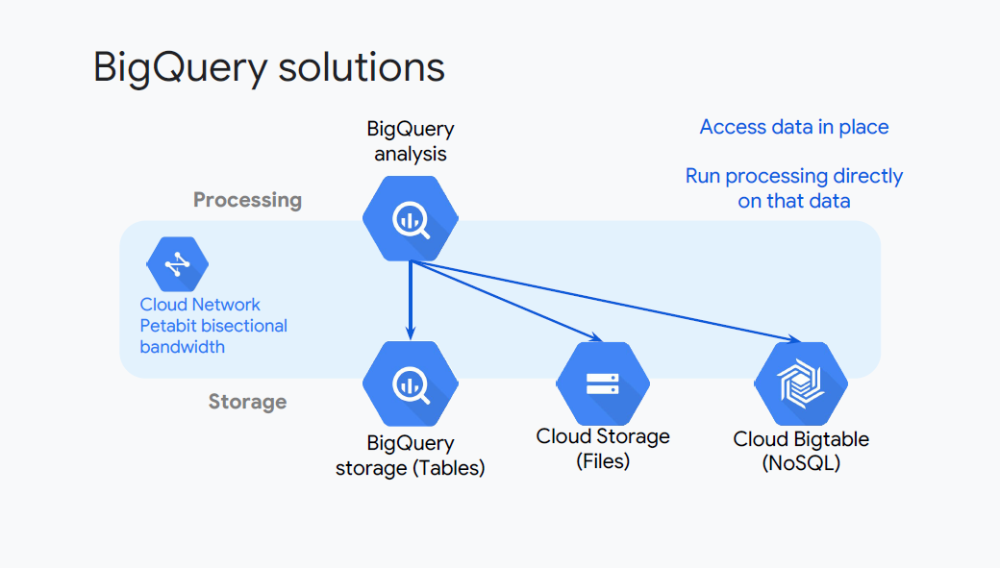

# Preparing for Infrastructure Solutions

## BigQuery and Cloud Dataflow Solutions

### BigQuery

BigQuery is two services, a front-end service that does analysis, and a back-end service that does storage. It offers near real time analysis of massive datasets.

The data storage is durable and inexpensive, and you could connect and work with different datasets to drive new insights and business value.

BigQuery uses SQL for queries, so it's immediateyl usable by many data analysts.

BigQuery is fast. If you're using it with structured data for analytics, it can take a few seconds. BigQuery connects to many services for flexible ingest and output.

BigQuery also supports nested and repeated fields for efficiency, and user-defined functions for extensibility.

> **Exam Tip #1**
>
> - Access control and BigQuery is at the project and the dataset level
> - For more info on Access Control in BigQuery, go to: https://cloud.google.com/bigquery/docs/access-control

### BigQuery Solutions

> **Design Tip**
>
> - Separate compute and processing from storage and databases enables serverless operations

#### BigQuery Analysis

BigQuery has its own analytic SQL Query front-end available in console and from the command line with `bq`.

The BigQuery front-end is a query engine, and the back-end data warehouse part of BigQuery stores data in tables.

BigQuery has the connectors to: Cloud Storage; this is commonly used to work directly with CSV files and to Cloud Bigtable.

> **Exam Tip #2**
>
> If you need more capabilities than a query engine, consider Cloud Dataproc and Cloud Dataflow.

This is all made possible with petabit bisectional bandwidth speend within the GCP cloud network.

It means that storing data in a service like cloud storage can be almost as fast and in some cases faster than storing the data locally, where it will be processed.

In other words, the network turns the concept of Hadoop and HDFS upside down.

It's more efficient, once again, to store the data separate from the processing resources.

#### Cloud Dataproc

Dataproc is another component to how all the platform parts fit together to create flexible and robust solutions

Cloud Dataproc can use cloud storage in place of HDFS for persistent data.

> **Exam Tips #3**
>
> - Cloud Dataproc can use Cloud Storage in place of HDFS for persistent data. If you use Cloud Storage, you can:
>   - **A)** shut down the cluster when it is not actually processing data, and;
>   - **B)** start up a cluster per job or per category or work, so you
don't have to tune the cluster to encompass different kinds of jobs.
> - Cloud Bigtable is a drop-in replacement for HBASE, again, separating state from the cluster so the cluster can be shut down when not in use and started up to run a specific kind of job.

Cloud Dataproc and Cloud Dataflow can output separate files as CSV files in Cloud Storage

#### Cloud Dataflow

> **Exam Tip #4**
>
> - Cloud Dataproc and Cloud Dataflow can output separate files as CSV files in Cloud Storage. This is an easy way to accumulate distributed results for later collating

In other words, you can have a distributed set of nodes or servers processing the data in parallel and writing the results out in separate small files.

In addition, the following can be achieved:

- Access any storage service from any data processing service
- Cloud Dataflow is an excellent ETL solution for BigQuery
- Use Cloud Dataflow to aggregate data in support of common queries

## Designing Data Processing Infrastructure

Now that we have all the pieces, let's start looking at how to put them together into data processing infrastructure.

There are a few common assemblies of services and technologies.

### Data Ingest Solutions

Here's an example showing the many manual ingest solutions available.

- We can use the `gsutil` command line tool to load files into Cloud Storage
- If we want to load data into BigQuery, we need to be able to identify the structure
- The BigQuery command line tool `bq` is good for uploading large data files and for scheduling data file uploads
- we can use the command to create tables, define schemas, load data and run queries
- The `bq` command is available on a Compute Engine instance in Cloud Shell, or you can install it on any client machine as part of the Google Cloud SDK

> **Exam Tip #1**
>
> Understand manual ingest solutions:
>
> - BigQuery CLI:
>   - Good for uploading large data files, scheduling data file uploads
>   - Create table, define schema, and load data with one command
>   - Can also run queries from the command line
>     - Interactively or batch mode queries
>     - Automating scripts using scripting language
>   - Run the bq command-line tool from:
>     - A Compute Engine instance
>     - Cloud Shell
>     - Client machine (requires installing the Google Cloud SDK)
> - Syntax for loading data via CLI:
>   - `bq load [--source_format=NEWLINE_DELIMITED_JSON|CSV] destination_table data_source_uri table_schema`

For more details go to: https://developers.google.com/bigquery/bq-command-line-tool

### Loading Data into BigQuery

There are three ways of loading data into BigQuery:

1. From the web GCP Console and files on disk, Cloud Storage or Cloud
Datastore
2. Stream data with Cloud Dataflow, from Cloud Audit Logging, or with POST
calls
3. Set up federated data source (serverless ETL!) for CSV, JSON, Avro on Cloud Storage or Google Sheets

- **#1** is easy: just do it from the Google Cloud Platform Console. It can also be done programmatically of course.
- **#3** is super-convenient. BigQuery will auto-detect CSV and JSON format! See
https://cloud.google.com/bigquery/federated-data-sources.

### Options for transferring storage

> **Exam Tip #2**
>
> - Think about data in terms of the three **v**s: **volume, velocity and variety** - how much, how often and how consistent? This will guide you to the best approach for ingesting data

In brief:

- Use `gsutil` for uploading files
- Use the Storage Transfer Service when the data is in another location, such as another Cloud platform
- Use the Transfer Appliance when the data's too big to transfer electronically

### Cloud PubSub Solutions

The Cloud Pub/Sub message broker enables complete ingest solutions. It provides loose coupling between systems and long-lived connections between systems

> **Exam Tip #3**
>
> Know how long Cloud Pub/Sub holds messages - **up to 7 days**

> **Exam Tip #4**
>
> Review the Pub/Sub [documentation](https://cloud.google.com/pubsub/docs) to make sure you're familiar with the details of Pub/Sub 

#### Common applications of Cloud Pub/Sub

Cloud Pub/Sub connects applications and services through a messaging infrastructure.

Pub/Sub simplifies event distribution by replacing synchronous point-to-point connections with a single high availability asynchronous bus.

You can avoid over-provisioning for traffic spikes with Pub/Sub. If you use Cloud Pub/Sub with Cloud Dataflow, you can get exactly once ordered processing.

Pub/Sub handles exactly once delivery and Dataflow handles de-duplications ordering and windowing.

Separation of duties enables a scalable solution that surpasses bottlenecks in competing messaging systems.

#### Serverless Analytics Solutions

This is the pattern you'll often see; Cloud Pub/Sub for data ingest, Cloud Datafow for data processing and ETL, and BigQuery for interactive analysis.

> **Exam Tip #5**
>
> - Be able to recognise this pattern in case scenarios

#### Data analytics solutions

This mobile gaming reference to architecture illustrates the analytics lifecycle pattern  at work:

Popular mobile games can attract millions of players and generate TBs of game-related data in a short burst of time. 

This creates pressure on the data processing infrastructure powering to provide timely actionable insights in a cost effective way.

To address these needs, a growing number of successful gaming companies use
Google’s web-scale analytics services to create personalized experiences for their players.

They use telemetry and smart instrumentation to gain insight into how
players engage with the game and to answer questions like: At what game level are players stuck? What virtual goods did they buy? And what's the best way to tailor the game to appeal to both casual and hardcore players?

## Practice Exam Questions 1

### Question 1

1. Storage for CSV files. Analysts will run ANSI SQL queries, Support complex aggregate queries and reuse existing I/O-intensive Apache Spark transform. How should you transform the input data?

    - A. Use BigQuery for storage. Use Cloud Dataflow to run the transformations :x:
    - B. Use BigQuery for storage. Use Cloud Dataproc to run the transformations :heavy_check_mark:
    - C. Use Cloud Storage for storage. Use Cloud Dataflow to run the transformations :x:
    - D. Use Cloud Storage for storage. Use Cloud Dataproc to run the transformations :x:

### Q1. Solution

> Use BigQuery for storage (for the analysts to run SQL queries) and use Dataproc to run the existing Spark transformations

- A is not correct because you should not use Cloud Dataflow for this scenario
- C and D are not correct because you should not use Cloud Storage for this scenario, and you should also not use Cloud Dataflow.
- Instead, you should just add secondary indexes

https://stackoverflow.com/questions/46436794/what-is-the-difference-between-google-cloud-dataflow-and-google-cloud-dataproc

### Question 2

- You are selecting a streaming service for log messages that must include final result message ordering as part of building a data pipeline on Google Cloud. Streaming log messages will be stored in a searchable repository. How should you set up the input messages? Requirements are final result message ordering, stream input for 5 days, and querying of the most recent message value
  - A. Use Cloud Pub/Sub for input. Attach a timestamp to every
message in the publisher. :heavy_check_mark:
  - B. Use Cloud Pub/Sub for input. Attach a unique identifier to
every message in the publisher.
  - C. Use Apache Kafka on Compute Engine for input. Attach a
timestamp to every message in the publisher.
  - D. Use Apache Kafka on Compute Engine for input. Attach a
unique identifier to every message in the publisher.

### Q2. Solution

> - **A** is correct because of the recommended Google practices (https://cloud.google.com/pubsub/docs/ordering)
> - We can kind of figure out that Apache Kafka is not the recommended solution in this scenario because you would have to set it up and maintain in
> - Using Cloud Pub/Sub would eliminate this overhead and works as a good solution for the problem already
> - We need a timestamp to implement the rest of the solution
> - Applying the timestamp at ingest in the published is a good consistent way to get the timestamp that's required
- B is not correct because you should not attach a GUID to each message to support the scenario.
- C and D are not correct because you should not use Apache Kafka for this scenario (it is overly complex compared to using Cloud Pub/Sub, which can support all of the requirements).

## Data representations, pipelines and processing infrastructure

### Storage

| Topic | Tips |
|-------|------|
| **Future advances in data technology** | Tradeoffs between common formats and efficient formats |
| **Changes to business requirements** | Notice business changes that imply possible solution changes |
| **Awareness of current state and how to migrate the design to a future state** | What state/format is the data in and for what purposes, and where does it need to go, for what new purpose and in what new state/format? |
| **Data modelling** | **How do data items relate to one another** |
| **Tradeoffs** | JSON, XML, AVRO, CSV, Databases: SQL, NoSQL, ... |
| **Distributed systems** | **Main points: can the application deal with out-of-order data? Eventual consistency? Can the application handle the overhead and delay of ordering or synchronising?** |
| **Schema design** | If the data is structured: "organised for a purpose" |

> **Exam Tips #6**
>
> - Ask if the data is useful as-is, or if it needs to be transformed or cleaned?
> - Ask if this is going to be an ongoing process or a one-time activity
> - Attempting a schema design on unstructured data can be useful and instructive to highlight what parts of the data have order or uniqueness to it and what parts are unbounded or optional

### Pipelines

| Topic | Tips |
|-------|------|
| **Future advances in data technology** | Proprietary vs. open? Proprietary may mean faster advances in production innovation |
| **Changes to business requirements** | **Can the pipeline be modified to fit the need? How extensive is the change required?** |
| **Awareness of current state and how to migrate the design to a future state** | Can you push the change earlier in the flow? For example, using ETL? Or does the solution need to be dynamic? |
| **Data modelling** | Diagram the data flow and transitions |
| **Tradeoffs** | There might be multiple valid methods to arrive at the result, but not all scale, perform, adapt the same. What qualities are desired/valued? |
| **System availability** | Is there an SLA? If not, what is your SLA and how will you support that? |
| **Distributed systems** | **Better scale but complex coordination. Is it worth it? Migration to a new scalable platform versus simplicity?** |
| **Schema design** | More...pipeline processing design... beware of inefficient equivalents |
| **Common sources of error (e.g. removing selection bias)** | Such as...recency bias... loads data on one server and hurts performance |

> **Exam Tips #7**
>
> - Revisit the data representation to make sure that the pipeline is efficient, for example transforming the data on input might radically reduce processing time later on in the pipeline

### Processing Infrastructure

| Topic | Tips |
|-------|------|
| **Future advances in data technology** | How important are present qualities versus future flexibility to the business? |
| **Changes to business requirements** | If the requirements change, will the service support it? |
| **Awareness of current state and how to migrate the design to a future state** | What future state might be required, and how can you keep that path/option open |
| **Data modelling** | Can the pipeline use platform-specific methods for better results? |
| **Tradeoffs** | **Proprietary vs. open? Support vs. lock-in?** |
| **System availability** | **What if the service is unavailable? Time issues? Alternative plans?** |
| **Distributed systems** | Performance, delay, complexity? |
| **Schema design** | Is the schema optimal for the platform? Ex: unstructured or structured? |
| **Capacity planning** | An ongoing process. Initial and adapting up/down scaling? When to reconsider service? |
| **Different types of architectures: message brokers, message queues, middleware, service-oriented** | Especially important for IoT, streaming and coordination of more complex systems/solutions |

> **Exam Tips #8**
>
> - There might be more than one way to get the same, results, for example Dataproc vs. Dataflow vs. BigQuery
> - All might functionally produce the results desired but the qualities of each will determine which is correct for the specific case