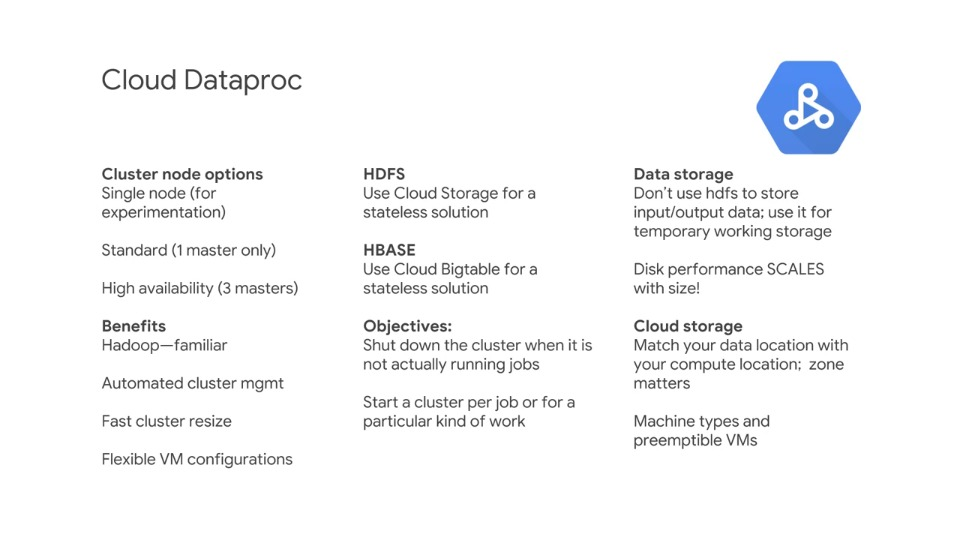
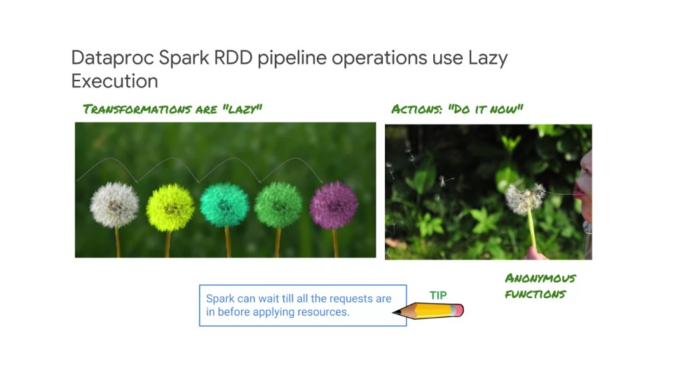
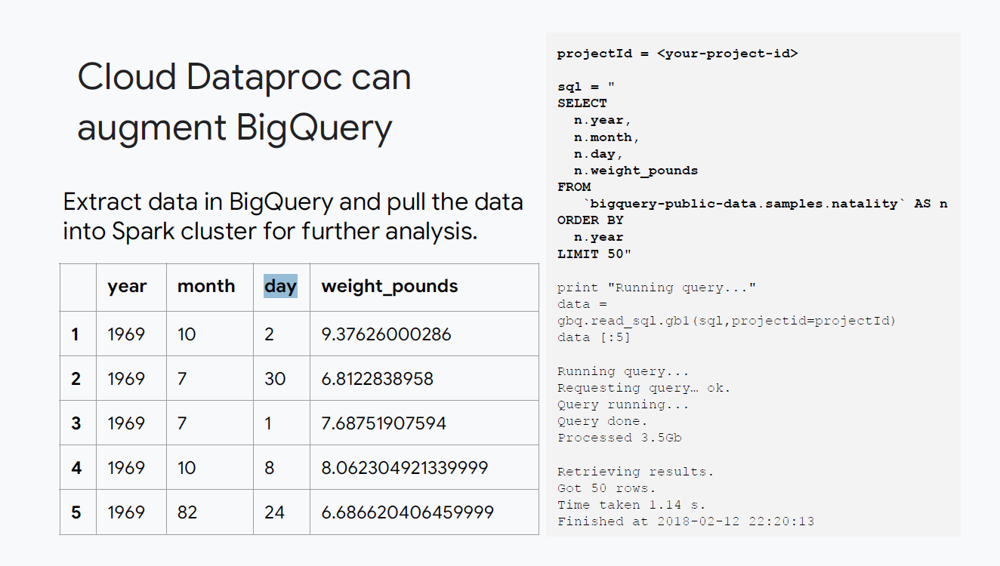
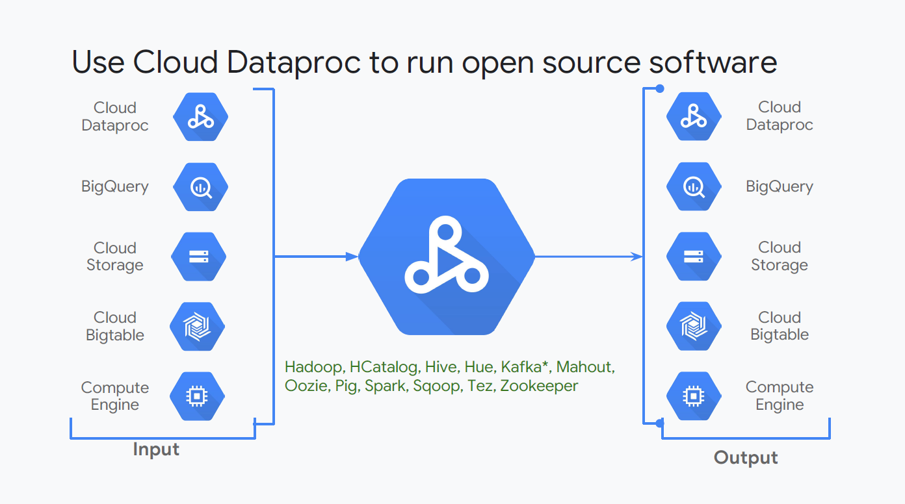
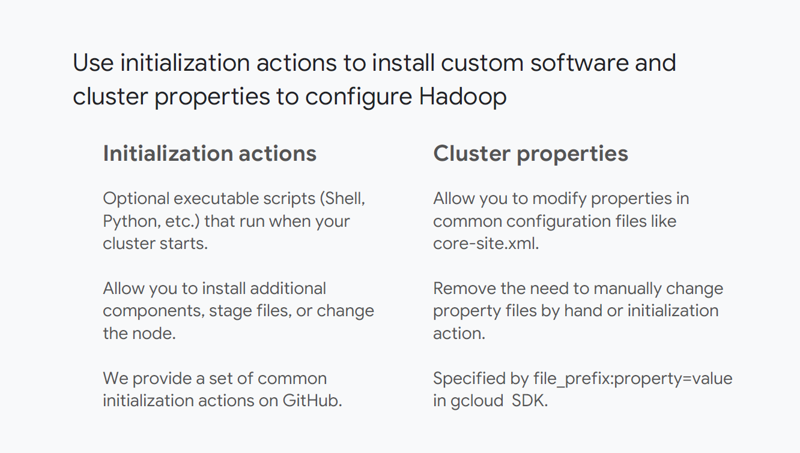
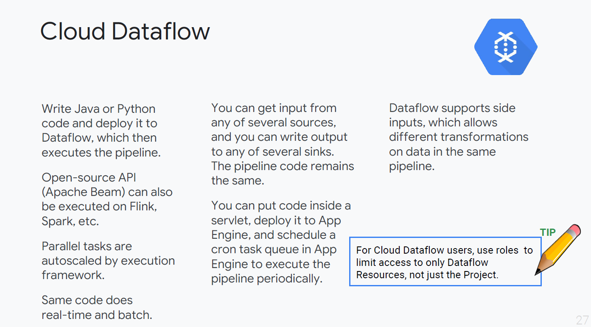
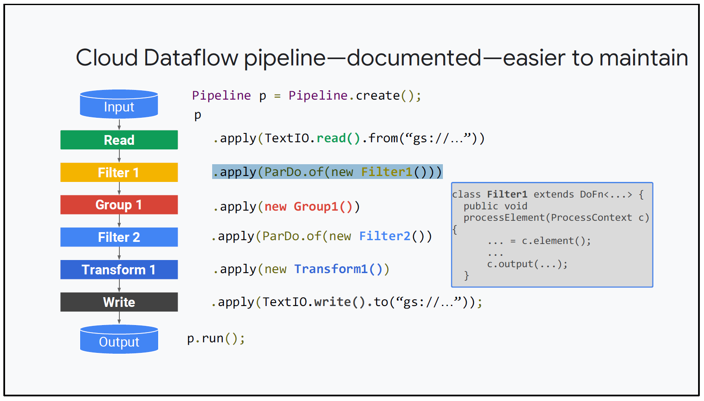
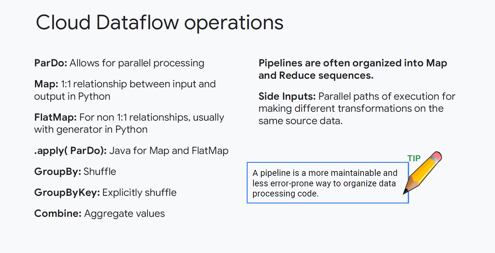

# Preparing for Pipelines

## Designing Data Pipelines

The next section of the exam guide is designing data pipelines. We've already covered how data is represented in Cloud Dataproc/Spark, in an RDD.

And in Cloud Dataflow it's a PCollection and in BigQuery it's a dataset in tables.

We've also covered that a pipeline is a seqence of actions or operations to be performed on the data representation.

But each service handles a pipeline differently; Cloud Dataproc is a managed Hadoop service.

### Cloud Dataproc

There are a number of things that you should know about Cloud Dataproc including standard software and the Hadoop ecosystem and components of Hadoop.

The main thing you should know about Cloud Dataproc is how to use it differently from standard Hadoop. If you store your data externally from the cluster, storing HDFS-type data in cloud storage and storing HBase type data in Cloud Bigtable

If you store your data externally from the cluster, storing HDFS-type data in Cloud Storage and storing HBASE-type data in Cloud Bigtable, then you can shut your cluster down when you are not actually processing a job. That is very important. 

There are two problems with Hadoop:

1. Trying to tweak all of its settings so it can run efficiently with multiple different types of jobs
2. Trying to cost-justify utilisation

This means you need users to increase you utilisation, which in turn means having to tune your cluster. If you succeed in making your cluster more efficient, it's probably time to grow the cluster.

With Cloud Dataproc, you can break out of that cycle by storing the data externally. And starting up a cluster and running it for one type of work and then shitting it down when you're done.

> **Key Takeway**
>
> - *Stateless clusters in <90 seconds*
> - *Supports Hadoop, Pig, Hive, Spark*

> **Exam Tip #1**
>
> *Spark is important because it does part of its pipeline processing in memory rather than copying from disk*
>
> *For some applications, this makes Spark very fast*

### Dataproc Spark RDD pipeline operations use Lazy Execution

Remember that with Spark you have **transforms** and **actions**. Spark builds its pipeline with transforms, called a Directed Acyclic Graph (DAG).

But it doesn't execute the pipeline until it sees an **Action**. Very simply, waiting until it has the whole story, all the information, allows Spark to choose the best way to distribute the work and run the pipeline. That's called **lazy execution**.

#### Transformation

- Input is an RDD and output is an RDD
- Registered in DAG awaiting an action (lazy).

#### Action

- Output is a result format, such as a text file
- Triggers Spark to process the pipeline

Transformations and Actions are API calls that reference the functions you want them to perform.

Anonymous functions (in Python, `Lambda` functions) are commonly used for the following reasons:

- A self-contained way to make a request to Spark.
- Lambda functions are defined "inline" making it easy to read and understand in sequence.
- They are limited to a single specific purpose.
- They don't clutter the namespace with function names for code that is only used in one place.

### Dataproc can augment BigQuery

You can use Cloud Dataproc and BigQuery together in several ways. BigQuery is great at running SQL queries. But what it isn't built for is modifying data; real data-processing work.

So if you need to do some kind of analysis that is really hard to accomplish in SQL, sometimes the answer is to extract the data from BigQuery into Cloud Dataproc and let Spark run the analysis.

Also, if you needed to alter or process the data, you might read from BigQuery into Cloud Dataproc, process the data, and write it back out to another dataset in BigQuery.

> **Exam Tip #2**:
>
> *If the situation you're analysing has data in BigQuery and perhaps the business logic is better expressed in terms of functional code instead of SQL, you may want to run a Spark job on the data*

### Use Cloud Dataproc to run open source software

Cloud Dataproc has connectors to all kinds of GCP resources. You can read from GCP sources, and write to GCP sourcees, and use Cloud Dataproc as interconnecting glue.

You can also run open source software from the Hadoop ecosystem on the cluster.

It would be wise to be at least familiar with the most popular Hadoop software and to know whether alternative services exist in the cloud.

For example, Kafka is a messaging service. And the alternative on GCP would be Cloud Pub/Sub. The GCP alternative to HBase is Cloud BigTable, and the GCP alternative to HDFS is Cloud Storage (GCS).

The below table outlines some of the comparisons:

| Hadoop software | GCP Equivalent |
|-----------------|----------------|
| Kafka           | Cloud Pub/Sub  |
| HBase           | Cloud BigTable |
| HDFS            | Cloud Storage  |

> **Exam Tip #3**:
>
> *Open source software for data engineering is always a Cloud GCP option. You can install/run Hadoop ecosystem software on the Cloud Dataproc cluster*
>
> *Having a good idea of the Hadoop software and equivalent GCP services*

### Use initialisation actions to install custom software and cluster properties to configure Hadoop

Use initialisation actions, which are `init` scripts, to load, install and customise software. The cluster itself has limited properties you can modify.

But if you use Cloud Dataproc as suggested, starting a cluster for each kind of work, you won't need to tweak the properties the way you would with a Hadoop Data Centre.

> **Exam Tip #4**
>
> - *Initialisation actions can be used to load/install software, however not all properties can be changed.*
> - *If you need to modify a Cloud Dataproc cluster, consider whether you have the right data-processing solution.*
> - *There are so many services available on Google Cloud you might be able to use a service rather than hosting your own on the cluster*
> - *You may want to customise some cluster configurations for it to work similarly. These are supported to varying extents, to see which properties are configurable go to:*
> - https://cloud.google.com/dataproc/docs/concepts/configuring-clusters/cluster-properties

## Cloud Dataflow Pipelines

### Cloud Dataflow Overview

Here are some things you should know about Cloud Dataflow:

- You can write pipeline code in Java or Python
- You can use the open source Apache Beam API to define the pipeline and submit it to Cloud Dataflow
- Then Cloud Dataflow provides the execution framework
- Parallel tasks are automatically scaled by the framework and the same code does real-time streaming and batch processing
- One great thing about Cloud Dataflow is that you can get input from many sources and write output to many sinks but the pipeline code inbetween remains the same
- Cloud Dataflow supports side inputs. That's where you can take data and transform it in one way and transform it in a different way in parallel so that the two can be used together in the same pipeline
- Security in Cloud Dataflow is controlled by access to the cluster as a resource
- Security and Cloud Dataflow is based on assigning roles that limit access to the Cloud Dataflow resources

> **Exam Tip #5**
>
> - *For Cloud Dataflow users, use roles to limit access to only Dataflow Resources, not just the Project*
> - *To see more about **Security and Permissions**, go to:*
>   - https://cloud.google.com/dataflow/security-and-permissions
> - ***Advanced Access control**, go to:*
>   - https://cloud.google.com/dataflow/access-control

### Maintaining Dataflow Pipelines

> **Exam Tip #6**
>
> - The dataflow pipeline not only appears/is written in code, but also is displayed in the GCP Console as a diagram
> - Pipelines reveal the progression of a data processing solution and the organisation of steps which make it much easier to maintain than other code solutions
> - Be able to disinguish between the API (Apache Beam) and the implementation/execution framework (Cloud Dataflow)

- Each step of the pipeline does a filter, group, transform, compare, join, and so on.
- Transforms, can be done in parallel
- `c.element()` get the input and `c.output()` sends the output to the next step of the pipeline.

### Cloud Dataflow operations

Here are some of the most commonly used Dataflow operations:

> **Exam Tip #6**
>
> - Do you know which operations are potentially computationally expensive?
> - `GroupByKey` for one, could consume resources on big data

This is one reason you might want to test your pipeline a few times on sample data to make sure you know how it scales before executing it on a production scale

> **Exam Tip #7**
>
> A pipeline is a more maintainable way to organise data processing code than for example; an application running on an instance

### Dataflow templates

> **Exam Tip #8**
>
> - Do you need to separate Cloud Dataflow developers of pipelines from Cloud Dataflow consumers/users of the pipelines? Templates create the single step of indirection that allows the two classes of users to have different access.

Cloud Dataflow templates enable a new development and execution workflow.

The templates help separate the development activities and the developers from the execution activities and the users. The user environment no longer has dependencies back to the development environment.

The need for recompilation to run a job is limited. The new approach facilitates the scheduling of batch jobs and opens up more
ways for users to submit jobs, and more opportunities for automation.

> **Exam Tip #9**
>
> - Your exam tip here is that Dataflow Templates open up new options for separation of work. That means better security and resource allocation

To see more, visit the [docs](https://cloud.google.com/dataflow/docs/templates/overview).

