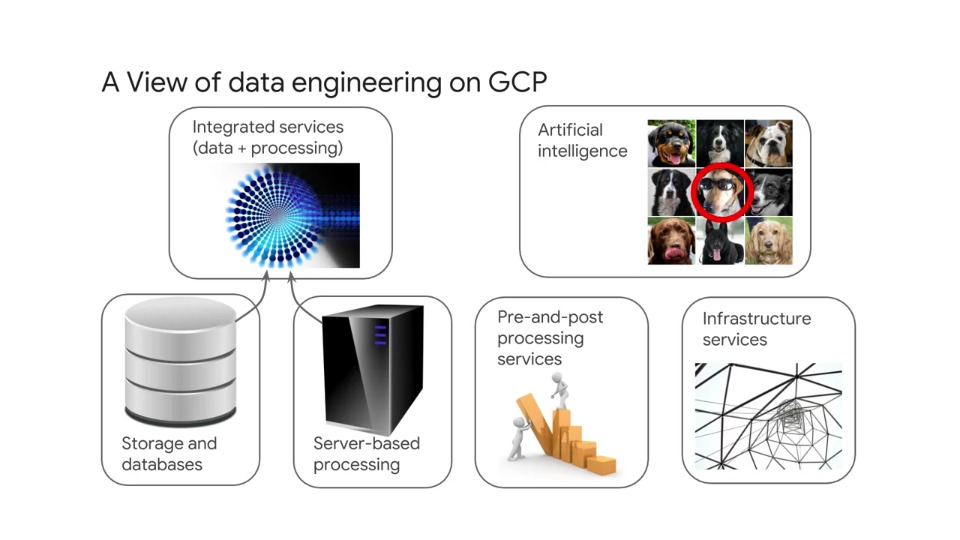
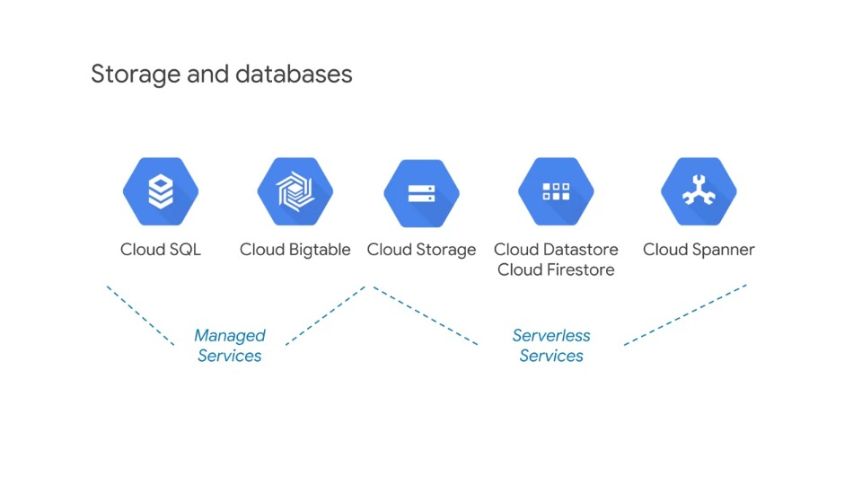
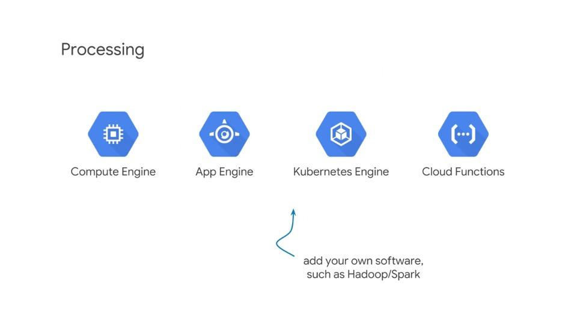
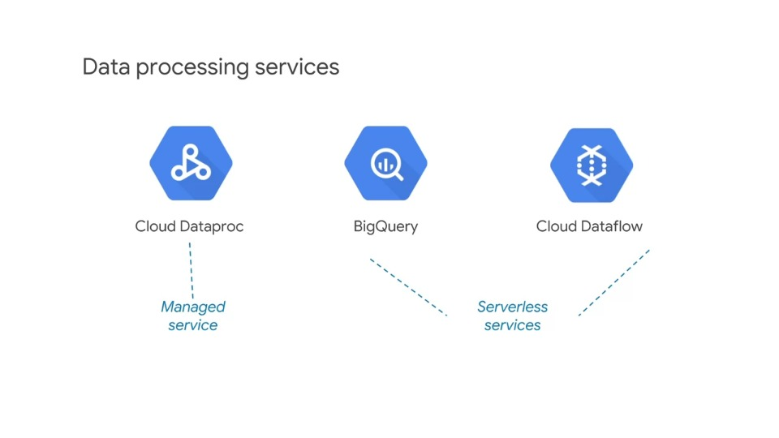
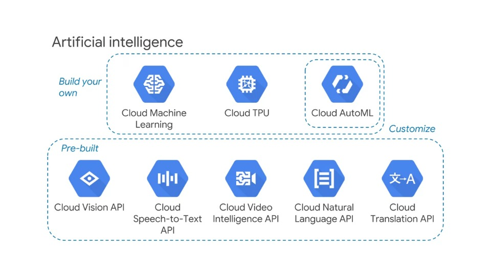
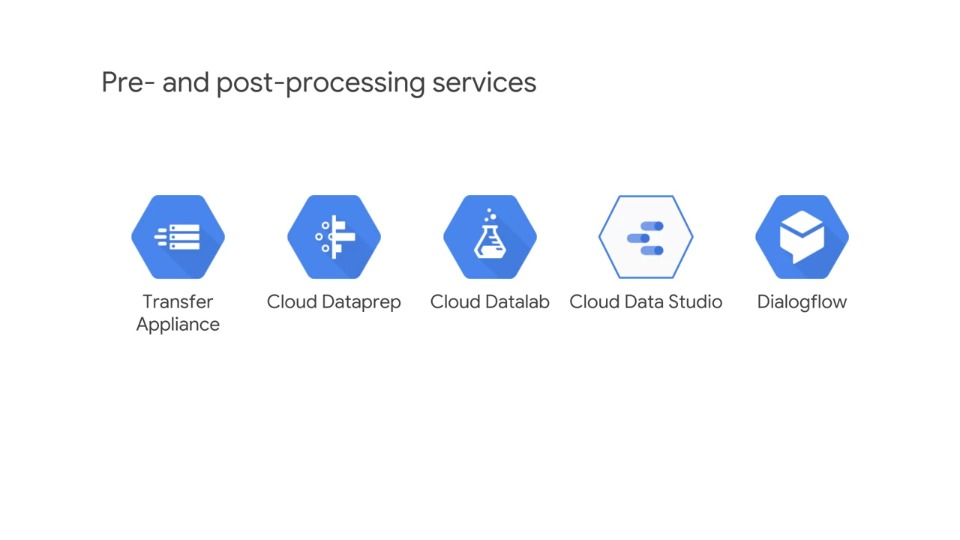
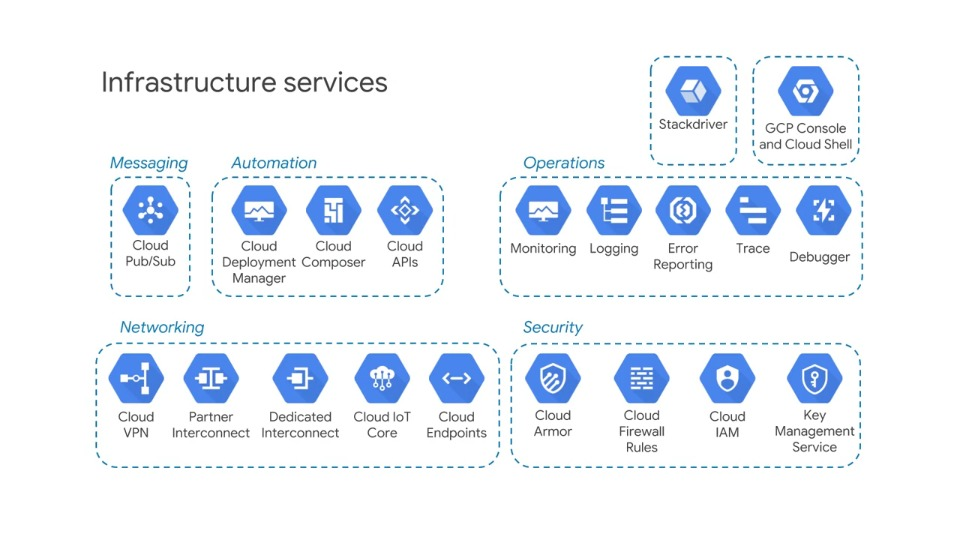

# Designing Data Processing Systems

## Touchstone concepts

A touchstone concept is a complex or key idea -- something that you would learn in a class AFTER you have learned all the basic dependent concepts. They are used in this course because they are a very efficient way for you to learn where you have confidence and where more preparation might be needed.

This approach is based on the **Deeper Learning** method of adult learning.

### Example

People seem to be able to relate well to this example.

**Touchstone**: "Unlike other vendor clouds, a subnet spans zones, enabling VMs with adjacent IPs to exist in separate zones, making design for availability easier to accomplish since the VMs can share tagged firewall rules."

To understand the above statement, the basic dependent knowledge that must already be understood includes, Regions, Zones, Subnets, IP Addresses, and Firewall Rules.

These basic concepts are not taught or reviewed in this course. They are taught in the training courses in this specialization and in the corresponding learning track in instructor led training.

### Advice: Evaluate the dependent basic concepts

Assess your confidence with each touchstone concept as it is presented. Don't expect to be taught the basic concept. If you don't understand the touchstone at all, or if you don't feel confident in your knowledge of it, or if you feel there are specific elements of it that you don't understand or are not confident about -- take note!

This is an area where more preparation can be of benefit for you.

Also -- note where you are confident, know the material, and the dependent concepts on which the touchstone is based. These areas require less preparation for you. So noting what you know well can help make your preparation activities more efficient.

## Designing data processing systems

Designing data processing systems includes:

- Designing flexible data representations,
- Designing data pipelines and;
- Designing data processing infrastructure

These three items show up in the first part of the exam with similar but not identical considerations.

The same questions or interest shows up in different contexts; data representations, pipelines and processing infrastructure.

For example, innovations in the technology could make the data representation of a chosen solution outdated, the data processing pipeline might have been implemented in a very involved transformation, which is now available as a single efficient command and the infrastructure could be replaced by a service with more desirable qualities.

However, as we'll see there are addition concerns with each part. For example, system availability is important to pipeline processing, but not data representation, and capacity is important to processing but not the abstract pipeline or the representation.

Thinking about Data Engineering and GCP as a platform consisting of components ("lego blocks") that can be assembled into solutions.

### A View of Data Engineering on GCP

Let's review the elements of GCP that form the data engineering platform.

- **Storage and Databases**:
  - Services that enable storing and retrieving data, different storage and retrieval methods that make them more efficient to specific use-cases
- **Server-based processing**:
  - Services that enable application code and software to run that can make sue of stored data to perform operations, actions and transformations producing results
- **Integrated services**:
  - Combines storage and scalable processing in a framework designed to process data rather than general applications, more efficient and flexible than isolated server database solutions
- **Artificial intelligence**:
  - Methods to help identify, tag, categorise and predict. These actions are very hard or impossible to accomplish in data processing without machine learning
- **Pre- and post-processing**:
  - Services working with data and pipelines before processing, such as data clean-up, or after processing such as data visualisation. Pre- and post-processing are important parts of a data processing solution
- **Infrastructure services**:
  - All the framework services that connect and integrate data processing and IT elements into a complete solution
  - Messaging, systems, data import, export, security, monitoring and so forth

### Storage and databases

Storage and database systems are designed and optimised for storing and retrieving.

They are not really built to do data transformation. It's assumed in their design that the computing power necessary to perform transformations on the data is external to the storage or database.

The organisation method and access method of each of these services is efficient for specific cases.

For example, a Cloud SQL database is very good at storing consistent individual transactions, but's its not really optimised for storing large amounts of unstructured data like video files.

Database services perform minimal operations on the data within the context of the access method, for example SQL queries can aggregate, accumulate, count and summarise results of a search query.

> #### Exam tip #1
>
> *Know the difference between **Cloud SQL and Cloud Spanner**, and when to use each:*

Service differentiators include access methods, the cost or speed of specific actions, sizes of data and how data is organised and stored.

Details and differences between the data technologies are discussed later in this course.

> #### Exam tip #2
>
> *Know how to identify technologies backwards from their properties*

For example, which data technology offers the fastest ingestive data? Which one might you use for ingestive streaming data? Managed services are ones where you can see the individual instance or cluster

> #### Exam tip #3
>
> *Managed services still have some IT overhead*

It doesn't completely eliminate the overhead or manual procedures, but it minimises them compared with on-prem solutions

Serverless services remove more of the IT responsibility, so managing the underlying servers is not part of you overhead and the individual instances are not visible

A more recent addition to this list is Cloud Firestore. Cloud Firestore is a NoSQL document database built for automatic scaling. It offers high performance and ease of application development, and it includes a data store compatibility mode.

## Processing

As mentioned, storage and databases provide limited capabilities, and what they do offer is in the context of search and retrieval

But if you need to perform more sophisticated actions and transformations on the data, you'll need data processing software and computing power.

So where do you get these resources? You could use any of these computing platforms to write you own application or parts of an application that you storage your database services.

You could install open-source software such as MySQL, an open-source database, or Hadoop, an open source data processing platform on Compute Engine.

Build-your-own solutions are driven mostly by business requirements and generally involve more IT overhead than using a Cloud platform service.

### Data Processing Services

These three data processing services feature in almost every data engineering solution. 

Each overlaps with the other meaning that some work could be accomplished in either two or three of these services. Advanced solutions may use one, two or all three.

Data processing services combine storage and compute and automate the storage and compute aspects of data processing through abstractions.

For example, in **Cloud Dataproc**, the data abstraction with Spark is a **resilient distributed dataset (RDD)**, and the processing abstraction is a **directed acyclic graph (DAG)**.

In **BigQuery**, the abstractions are **table** and **query**, and in **Dataflow**, the abstractions are **PCollection** and **pipeline**.

Implementing storage and processing as abstractions enables the underlying systems to adapt to the workload and the user data engineer to focus on the data and business problems that they're trying to solve.

### Artificial Intelligence

There's great potential value and product or process innovation using machine learning.

Machine learning can make unstructured data, such as logs useful by identifying or categorising the data and thereby enabling business intelligence.

Recognising an instance of something that exists is closely related to predicting a future instance based on past experience.

Machine learning can be used for identifying, categorising and predicting. It can make unstructured data useful.

> #### Exam tip #4
>
> *Understand the array of machine learning technologies offered on GCP, and when you might want to use each*

### Pre- and post-processing services

A data engineering solution involves data ingest, management during processing, analysis and visualisation.

These elements can be critical to the business requirements. Here are a few services that you should generally be familiar with.

- **Data Transfer** services operate online and a data transfer appliance is a shippable device that's used for synchonising data in the Cloud with an external source
- **Cloud Data Studio** is used for visualisation of data after it has been processed
- **Cloud Dataprep** is used to prepare or condition data and to prepare pipelines before processing data
- **Cloud Datalab** is a notebook that is a self-contained workspace that holds code, executes the code and displays results
- **Dialogflow** is a service for creating chatbots. It uses AI to provide a method for direct human interaction with data

### Infrastructure Services

> #### Exam tip #5
>
> *Familiarise yourself with infrastructure services that show up commonly in data engineering solutions. Often they're employed because of key features they provide*

For example, **Cloud Pub/Sub** can hold a message for up to 7 days providing resiliency to data engineering solutions that otherwise would be very difficult to implement.

Every service in Google Cloud platform could beused in a data engineering solution.

However, some of the most common and important services are shown here:

- **Cloud Pub/Sub:** a messaging service, features in virtually all live or streaming data solutions because it decouples data arrival from data ingest
- **Cloud VPN:** Partner Interconnect or Dedicated Interconnect, play a role whenever there's data on premise, it must be transmitted to services in the Cloud
- **Cloud IAM:** firewall rules, and key management are critical to some verticals such as the healthcare and financial industries

Every solution needs to be monitored and managed which usually involves panels displayed in Cloud Console and data sent to Stackdriver monitoring

It's a good idea to examine sample solutions that use data processing or data engineering technologies and pay attention to the infrastructure components of the solution.

It's important to know what the services contribute to the data solutions and to be familiar with key features and options.

There are lot's of details that do not need to be memorised, for example, the exact number of IAP supported by a specific instance, or the cost of a particular instance type - these are details which can be looked up when needed.

However, details such as an N4 standard instance having higher IAPs than an N1 standard instance, or the N4 standard cost more than the N1 standard are concepts that should be known as a data engineer.

