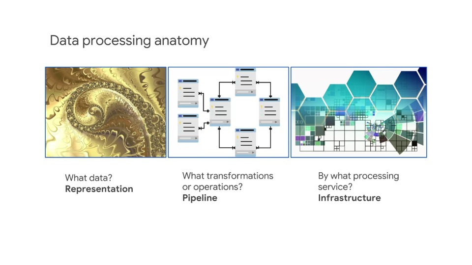
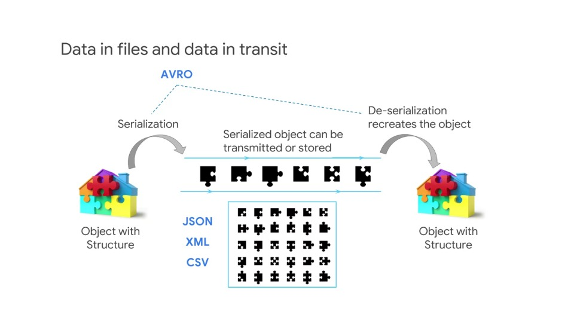
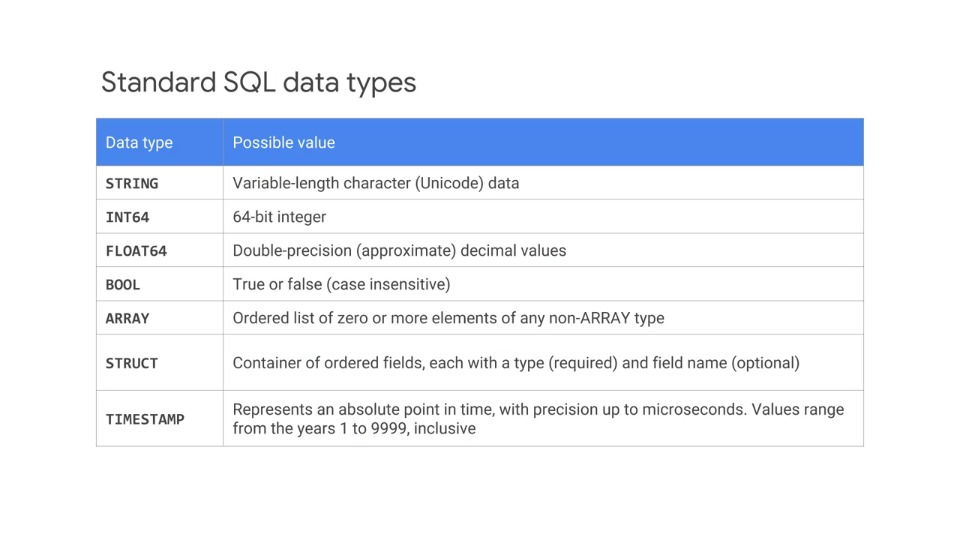
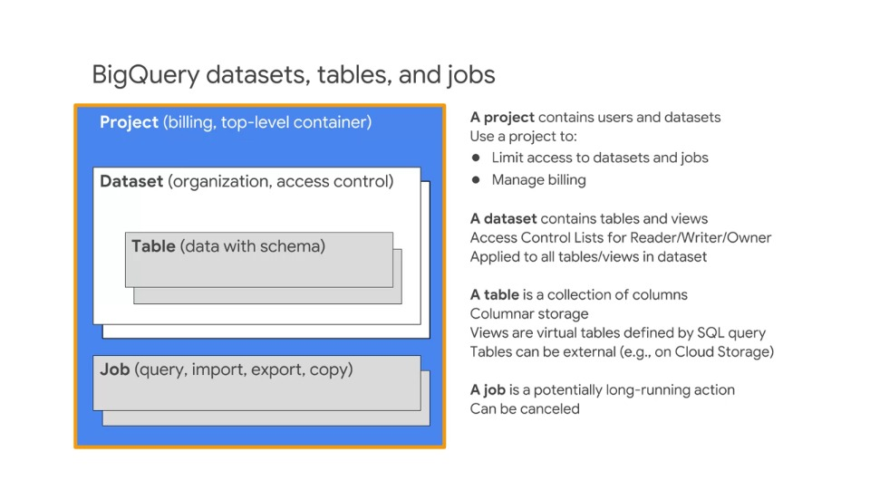
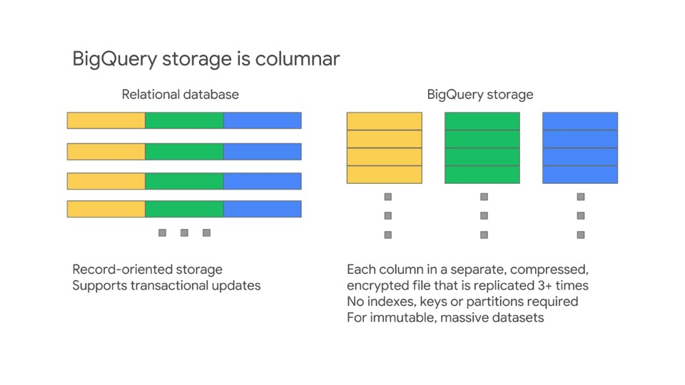
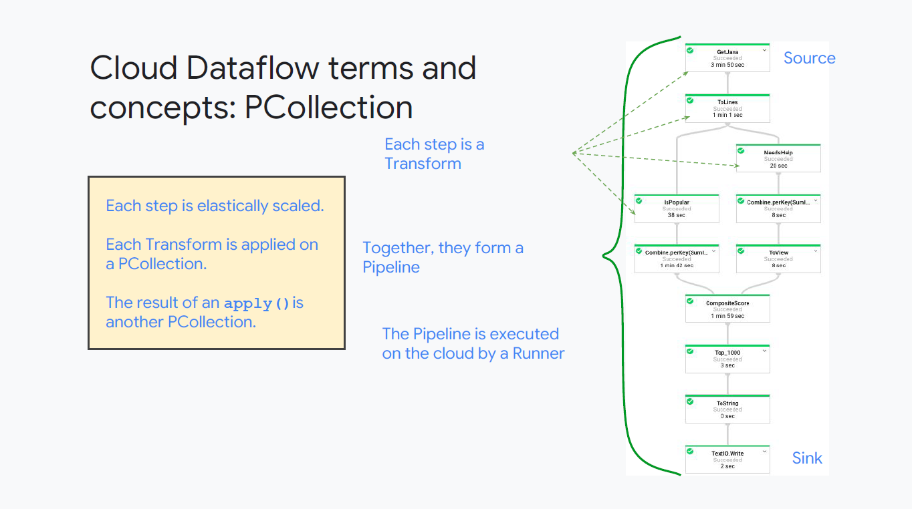
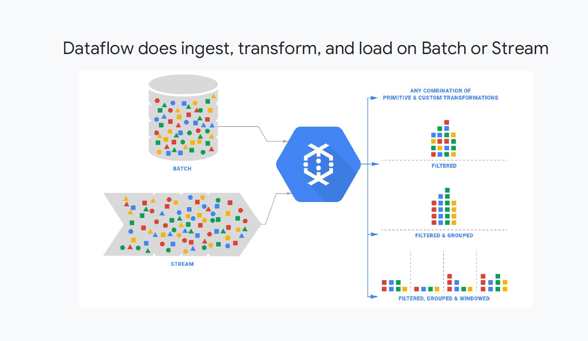
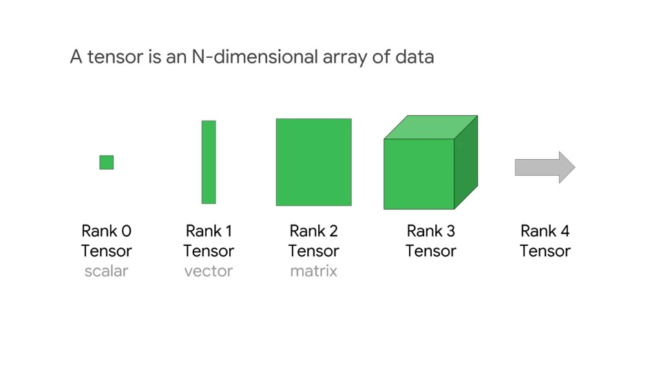

# Designing Data Processing Systems

## Touchstone concepts

A touchstone concept is a complex or key idea -- something that you would learn in a class AFTER you have learned all the basic dependent concepts. They are used in this course because they are a very efficient way for you to learn where you have confidence and where more preparation might be needed.

This approach is based on the **Deeper Learning** method of adult learning.

### Example

People seem to be able to relate well to this example.

**Touchstone**: "Unlike other vendor clouds, a subnet spans zones, enabling VMs with adjacent IPs to exist in separate zones, making design for availability easier to accomplish since the VMs can share tagged firewall rules."

To understand the above statement, the basic dependent knowledge that must already be understood includes, Regions, Zones, Subnets, IP Addresses, and Firewall Rules.

These basic concepts are not taught or reviewed in this course. They are taught in the training courses in this specialization and in the corresponding learning track in instructor led training.

### Advice: Evaluate the dependent basic concepts

Assess your confidence with each touchstone concept as it is presented. Don't expect to be taught the basic concept. If you don't understand the touchstone at all, or if you don't feel confident in your knowledge of it, or if you feel there are specific elements of it that you don't understand or are not confident about -- take note!

This is an area where more preparation can be of benefit for you.

Also -- note where you are confident, know the material, and the dependent concepts on which the touchstone is based. These areas require less preparation for you. So noting what you know well can help make your preparation activities more efficient.

## Designing data processing systems

Designing data processing systems includes:

- Designing flexible data representations,
- Designing data pipelines and;
- Designing data processing infrastructure

These three items show up in the first part of the exam with similar but not identical considerations.

The same questions or interest shows up in different contexts; data representations, pipelines and processing infrastructure.

For example, innovations in the technology could make the data representation of a chosen solution outdated, the data processing pipeline might have been implemented in a very involved transformation, which is now available as a single efficient command and the infrastructure could be replaced by a service with more desirable qualities.

However, as we'll see there are addition concerns with each part. For example, system availability is important to pipeline processing, but not data representation, and capacity is important to processing but not the abstract pipeline or the representation.

Thinking about Data Engineering and GCP as a platform consisting of components ("lego blocks") that can be assembled into solutions.

### A View of Data Engineering on GCP

Let's review the elements of GCP that form the data engineering platform.

- **Storage and Databases**:
  - Services that enable storing and retrieving data, different storage and retrieval methods that make them more efficient to specific use-cases
- **Server-based processing**:
  - Services that enable application code and software to run that can make sue of stored data to perform operations, actions and transformations producing results
- **Integrated services**:
  - Combines storage and scalable processing in a framework designed to process data rather than general applications, more efficient and flexible than isolated server database solutions
- **Artificial intelligence**:
  - Methods to help identify, tag, categorise and predict. These actions are very hard or impossible to accomplish in data processing without machine learning
- **Pre- and post-processing**:
  - Services working with data and pipelines before processing, such as data clean-up, or after processing such as data visualisation. Pre- and post-processing are important parts of a data processing solution
- **Infrastructure services**:
  - All the framework services that connect and integrate data processing and IT elements into a complete solution
  - Messaging, systems, data import, export, security, monitoring and so forth

### Storage and databases

Storage and database systems are designed and optimised for storing and retrieving.

They are not really built to do data transformation. It's assumed in their design that the computing power necessary to perform transformations on the data is external to the storage or database.

The organisation method and access method of each of these services is efficient for specific cases.

For example, a Cloud SQL database is very good at storing consistent individual transactions, but's its not really optimised for storing large amounts of unstructured data like video files.

Database services perform minimal operations on the data within the context of the access method, for example SQL queries can aggregate, accumulate, count and summarise results of a search query.

> **Exam tip #1**
>
> *Know the difference between **Cloud SQL and Cloud Spanner**, and when to use each:*

Service differentiators include access methods, the cost or speed of specific actions, sizes of data and how data is organised and stored.

Details and differences between the data technologies are discussed later in this course.

> **Exam tip #2**
>
> *Know how to identify technologies backwards from their properties*

For example, which data technology offers the fastest ingestive data? Which one might you use for ingestive streaming data? Managed services are ones where you can see the individual instance or cluster

> **Exam tip #3**
>
> *Managed services still have some IT overhead*

It doesn't completely eliminate the overhead or manual procedures, but it minimises them compared with on-prem solutions

Serverless services remove more of the IT responsibility, so managing the underlying servers is not part of you overhead and the individual instances are not visible

A more recent addition to this list is Cloud Firestore. Cloud Firestore is a NoSQL document database built for automatic scaling. It offers high performance and ease of application development, and it includes a data store compatibility mode.

## Processing

As mentioned, storage and databases provide limited capabilities, and what they do offer is in the context of search and retrieval

But if you need to perform more sophisticated actions and transformations on the data, you'll need data processing software and computing power.

So where do you get these resources? You could use any of these computing platforms to write you own application or parts of an application that you storage your database services.

You could install open-source software such as MySQL, an open-source database, or Hadoop, an open source data processing platform on Compute Engine.

Build-your-own solutions are driven mostly by business requirements and generally involve more IT overhead than using a Cloud platform service.

### Data Processing Services

These three data processing services feature in almost every data engineering solution.

Each overlaps with the other meaning that some work could be accomplished in either two or three of these services. Advanced solutions may use one, two or all three.

Data processing services combine storage and compute and automate the storage and compute aspects of data processing through abstractions.

For example, in **Cloud Dataproc**, the data abstraction with Spark is a **resilient distributed dataset (RDD)**, and the processing abstraction is a **directed acyclic graph (DAG)**.

In **BigQuery**, the abstractions are **table** and **query**, and in **Dataflow**, the abstractions are **PCollection** and **pipeline**.

Implementing storage and processing as abstractions enables the underlying systems to adapt to the workload and the user data engineer to focus on the data and business problems that they're trying to solve.

### Artificial Intelligence

There's great potential value and product or process innovation using machine learning.

Machine learning can make unstructured data, such as logs useful by identifying or categorising the data and thereby enabling business intelligence.

Recognising an instance of something that exists is closely related to predicting a future instance based on past experience.

Machine learning can be used for identifying, categorising and predicting. It can make unstructured data useful.

> **Exam tip #4**
>
> *Understand the array of machine learning technologies offered on GCP, and when you might want to use each*

### Pre- and post-processing services

A data engineering solution involves data ingest, management during processing, analysis and visualisation.

These elements can be critical to the business requirements. Here are a few services that you should generally be familiar with.

- **Data Transfer** services operate online and a data transfer appliance is a shippable device that's used for synchonising data in the Cloud with an external source
- **Cloud Data Studio** is used for visualisation of data after it has been processed
- **Cloud Dataprep** is used to prepare or condition data and to prepare pipelines before processing data
- **Cloud Datalab** is a notebook that is a self-contained workspace that holds code, executes the code and displays results
- **Dialogflow** is a service for creating chatbots. It uses AI to provide a method for direct human interaction with data

### Infrastructure Services

> **Exam tip #5**
>
> *Familiarise yourself with infrastructure services that show up commonly in data engineering solutions. Often they're employed because of key features they provide*

For example, **Cloud Pub/Sub** can hold a message for up to 7 days providing resiliency to data engineering solutions that otherwise would be very difficult to implement.

Every service in Google Cloud platform could beused in a data engineering solution.

However, some of the most common and important services are shown here:

- **Cloud Pub/Sub:** a messaging service, features in virtually all live or streaming data solutions because it decouples data arrival from data ingest
- **Cloud VPN:** Partner Interconnect or Dedicated Interconnect, play a role whenever there's data on premise, it must be transmitted to services in the Cloud
- **Cloud IAM:** firewall rules, and key management are critical to some verticals such as the healthcare and financial industries

Every solution needs to be monitored and managed which usually involves panels displayed in Cloud Console and data sent to Stackdriver monitoring

It's a good idea to examine sample solutions that use data processing or data engineering technologies and pay attention to the infrastructure components of the solution.

It's important to know what the services contribute to the data solutions and to be familiar with key features and options.

There are lot's of details that do not need to be memorised, for example, the exact number of IAP supported by a specific instance, or the cost of a particular instance type - these are details which can be looked up when needed.

However, details such as an N4 standard instance having higher IAPs than an N1 standard instance, or the N4 standard cost more than the N1 standard are concepts that should be known as a data engineer.

## Designing Flexible Data Representations

The key concept we'll explore is understanding how data is stored, and therefore how it's processed.

There are different abstractions for storing data. If you store data in one abstraction instead of anohter, it makes different processes easier or faster.

For example, if you store data in a **file system**, it makes it easier to retreive that data by **name**.

If you store data in a **database**, it makes it easier to find data by logic such as **SQL**.

If you store data in a **processing system** it maks it easier and faster to **transform the data** not just retrieve it.

### Data Representations

The data engineer needs to be familiar with basic concepts and terminology of data representation:

- Data is **Cloud Storage** is an **Object** stored in a **Bucket**
- Data is **Cloud Datastore** is a **property**, contained in an **Entity** and is in a **Kind** category
- Data is **Cloud SQL** consists of **Values** stored in **Rows** and **Columns** in a **Table** in a **Database**
- Data in **Cloud Spanner** consists of **Values** stored in **Rows** and **Columns** in a **Table** in a **Database**

For example, if a problem is described using the terms rows and columns, since those concepts are used in SQL, you might be thinking about a SQL database such as Cloud SQL or Cloud Spanner.

If an exam question describes an entity and a kind which are concepts used in Cloud Datastore, you need to know what these are going into the exam as you won't have time or resources to look these up.

> **Exam Tip #6**
>
> *Is it good to know HOW data is stored. What purpose or use-case is the storage/database optimised for?*

## Data in files and data in transit

Flat serialised data is easy to work with but it lacks structure and therefore meaning.

If you want to represent data that has meaningful relationships, you need a method that not only represents the data but also the relationships.

**CSV (comma-separated values)** files is a simple file format used to store tabular data

**XML (eXtensible Markup Language)** was designed to store and transport data and was designed to be self-descriptive

**JSON (JavaScript Object Notation)** is a lightweight data interchange format based on name-value pairs and an ordered list of values, which maps easily to common objects in many programming languages

Networking transmits serial data as a stream of bits (zeros and ones). This means, if you have a data object with a meaningful structure to it, you need some method to flatten and serialise the data first so that it's just zeros and ones

Then it can be transmitted and stored and when it's retrieved, the data needs to be deserialised to restore the structure into a meaningful data object.

One example of software that does this is Avro. Avro is a remote procedure call and data serialisation framework developed within Apache's Hadoop project.

It uses JSON for defining data types and protocols and serialises data in a compact binary format.

It's primary uses in Apache Hadoop where it can provide both a serialisation format for persistent data and a wire format for communication between Hadoop noges and from client programs to Hadoop services.

### Standard SQL data types

It helps to understand the data type supported in different representation systems.

For example, there's a data type in modern SQL called `NUMERIC`. 

`NUMERIC` is similar to floating point, however it provides a 38 digit value with 9 digits to represent the location of the decimal point.

`NUMERIC` is very good at storing common fractions associated with money. `NUMERIC` avoids the rounding error that occurs in a full floating point representation. So it's used primarily for financial transactions.

For more information on all data types supported by standard SQL, see:
https://cloud.google.com/bigquery/sql-reference/data-types

### BigQuery datasets, tables and jobs

Here is an example of the abstractions associated with a particular technology. You should already know that every resource in GCP exists inside a Project. And in addition to security and access control, a Project links usage of a resource to a credit card: it is what makes a resource billable.

Then in BigQuery, data is stored inside datasets. And datasets contain tables. And tables contain columns. When you process the data, BigQuery creates a job. Often the job runs an SQL query. Although there are some update and maintenance activities supported."

> **Exam Tip #7**
>
> *Know the hierarchy of objects within a data technology and how they relate to one another*

### BigQuery storage is columnar

BigQuery is called a columnar store: it's stores data in columns. This means that it's designed for processing columns, not rows. Column processing is very cheap and fast in BigQuery, and row processing is slow and expensive.

Most queries only work on a small number of fields, and BigQuery only needs to read those relevant columns to execute a query. Since each column has data of the same type, BigQuery could compress the column data much more effectively.

You can stream (append data) easily to BigQuery tables but you can't easily change existing values.

Replicating the data three times also helps the system determine optimal compute nodes to do filtering, mixing and so forth.

### Spark hides data complexity with an abstraction: RDDs

Data in Cloud Dataproc and Spark is stored in Resilient Distributed Datasets (RDDs). RDDs are an abstraction that hide the complexity of the where data is located and how it is replicated in a cluster.

Spark partitions data in memory across the cluster and knows how to recover the data through an RDD's lineage, if anything goes wrong.

Spark can direct processing to occur where there is a processing resource available.

You treat your data as a single entity; Spark knows the truth.
Data partitioning, data replication, data recovery, pipelining of processing: all are automated by Spark so you don't have to worry about them.

> **Exam Tip #8**
>
> *Know how different services store data, and how each method is optimised for specific use-cases as previously mentioned but also understand the key value of the approach*

In this case, RDDs hide complexity and allow Spark to make decisions on your behalf.

### Dataflow terms and concepts: PCollection

There are a number of concepts that you should know about Cloud Dataflow. Your data in Dataflow is represented in PCollections.

The pipeline shown in the example above reads data from BigQuery, does some processing and writes its output to cloud storage.

In Dataflow each step is a transformation and the collection of transforms makes a pipeline.

The entire pipeline is executed by a program called a runner. For development, there's a local runner, and for production there's a Cloud Runner.

When the pipeline is running on the Cloud each step, each transform is applied to a PCollection and results in a new PCollection.

So the PCollection is a unit of data that traverses the pipeline and each step scales elastically.

The idea is to write Python or Java Code and deploy it to Cloud Dataflow, which then executes the pipeline in a scalable serverless context.

Unlike Cloud Dataproc, there's no need to launch a cluster or scale the cluster, that's handled automatically.

#### PCollection

Here are some key concepts from Dataflow that a Data Engineer should know:

- In a Cloud Dataflow pipeline all the data is stored in a **PCollection**
- The input data is a PCollection
- Transformations make changes to a PCollection and then output another PCollection
- A PCollection is immutable, this means it cannot be modified
- Immutability in PCollections is the reason for it's speed
- Every time you pass data through a transformation it creates another PCollection

> **Exam Tip #9**
>
> -  *Data is Cloud Dataflow is stored in a PCollection*
> - *PCollections are immutable which is one source of it's speed  in Cloud Dataflow Pipeline Processing*

### Dataflow does ingest, transform, and load on Batch or Stream

Cloud Dataflow is designed to use the same pipeline, the same operations, the same code for both batch and stream processing.

Recall that batch data is also called *bounded* data and is usually a file. Batch data has a finite end.

Streaming data is called *unbounded data* and might be dynamically generated. For example, it might be generated by sensors or by sales transactions.

Streaming data just keeps going, whether it's day after day, year after year, it has no defined end. 

Algorithms that rely on a finite end won't work with streaming data. An example of this is a simple average, where all values are added together and divided by the total number of values. This approach is fine with batch data, as eventually you will have all values.

This approach does not work with streaming however, because there may be no end. Dataflow allows you to define a period or window and to calculate the average within that window.

That's an example of how both kinds of data can be processed with the same single block of code. Filtering and grouping are also supported.

Many Hadoop workloads can be run more easily and are easier to maintain with Cloud Dataflow. But PCollections and RDDs are **not** identical.

So, existing code has to be redesigned and adapted to run in the Cloud Dataflow pipeline. This can be a consideration because it can add time and expense to a project.

> **Exam Tip #10**
>
> *Cloud Dataflow is designed to use the same operations for both batch and stream, also called **bounded** and **unbounded** data*

### A tensor is an N-dimensional array of data

Data is Tensorflow is represented in tensors. Where does the name Tensorflow come from? The flow is a pipeline just like we discussed in Cloud Dataflow but the data object in Tensorflow is not a Pcollect but something called a tensor.

A Tensor is a special mathematical object that unifies scalars, vectors and matrices.

In the slide above:

- Tensor zero is just a single value - a scalar
- Tensor one is a vector
- Tensor two is a matrix
- Tensor three is a cube-shape

Tensors are very good at representing certain kinds of math functions such as coefficient in an equation, and Tensorflow makes it possible to work with tensor data objects of any dimension.

Tensorflow is the open source code that you use to create machine learning models.

There are transformations in tensor algebra that apply to any dimension or rank of tensor. So, it makes solving some problems much easier.
