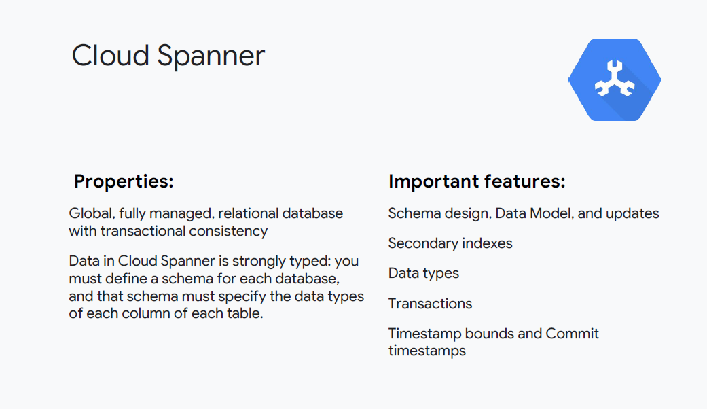
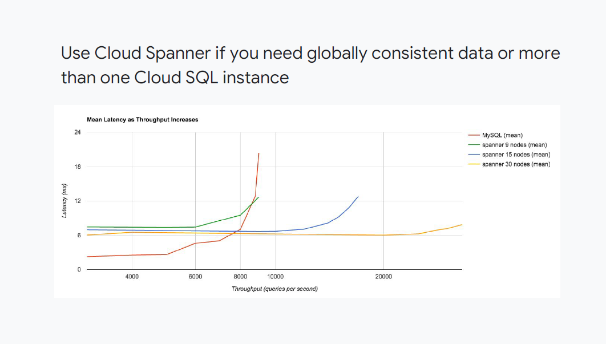

# Preparing for Building and Operationalising Solutions

## Building Data Processing Systems

The next section of the exam guide covers building data processing systems. This includes assembling data processing from parts as well as using full services.

### Building and maintaining data structures and databases

The first area of data processing we'll look at is building and maintaining structures and databases.

This is not just selecting a particular database or service, but also thinking about the qualities that are provided and starting to consider how to organise the data.

### Selecting storage options

Below is a flowchart for selecting storage options:

> **Exam Tips #1**
>
> - Familiarise yourself with the flowchart above
> - BigQuery is recommended as a data warehouse
> - BigQuery is also the default storage for tabular data
> - If you need transactions or you want low latency/high throughput, use Cloud Bigtable

### Flexible data representations

When designing for flexible data representations, you always want data to be divided up in a way that makes the most sense for your given use-case.

If the data is divided too much, it creates additional work. 

- In the example on the left, each data item is stored separately, making it easy to filter on a specific field and to perform updates.
- In the example on the right, all of the data is stored in a single record, like a single string.
- Editing/updating is difficult. Filtering on a particular field would be hard. 
- In the example on the bottom, a relation is defined by two tables. This might make it easier to manage and report on the list of locations

### What are the transaction requirements

> **Exam Tip #2**
>
> - **ACID** vs. **BASE** is essential data knowledge that you will want to be very familiar with so that you can easily determine whether a particular data solution is compatible with the requirements identified in the case
> - For example, for a financial transaction, a service that provides only *eventual consistency* might be incompatible

> **Exam Tip #3**
>
> - In some cases an eventually consistent solution can be made strongly consistent for a specific limited use case
> - See https://cloud.google.com/datastore/docs/articles/balancing-strong-and-eventual-consistency-with-google-cloud-datastore/ for more details

In Cloud Datastore, there are only two APIs that provide a strongly consistent view for reading entity values and indexes:

1) The lookup by key method and;
2) The ancestor query

Database services provide a model of consistency. Consistency makes certain guarantees with respect to data transactions. And whatever guarantees are not made by the data service become the responsibility of the application code.

- ACID: SQL databases such as MySQL and PostgreSQL.
- BASE: NoSQL systems like Cloud Bigtable.

https://en.wikipedia.org/wiki/Consistency_(database_systems)
https://en.wikipedia.org/wiki/ACID

- Atomicity: A transaction is either "all or nothing"
- Consistency: Any transaction brings the database from one valid state to another.
- Isolation: Transactions executed concurrently produce the same result as if executed sequentially
- Durability: When a transaction is committed, the results are stable. Even in the event of a
power loss, the result is non-volatile

BASE is described under eventual consistency in Wikipedia: https://en.wikipedia.org/wiki/Eventual_consistency

An eventually consistent system does not have atomic transactions. So when a transaction has started to be committed, there are no guarantees until all the parts of the system have converged.

This means that users requesting data may get "any" result (i.e., there are no guarantees), but in practice it means the user gets stale data. That is a guarantee that they will get SOME data, some result, but not necessarily the most current result.

https://en.wikipedia.org/wiki/CAP_theorem

In database systems, ACID (most SQL systems) optimize for consistency and BASE (most NoSQL systems) optimize for availability.

## Cloud Storage, Cloud SQL and Cloud Bigtable

### Cloud Storage

- Cloud Storage is persistent
- It has storage classes: Nearline, Coldline, Regional and Multi-Regional
- There's granular access control

> **Exam Tip #4**
>
> You should be familiar with all the methods of access control including IAM roles and signed URLs

Cloud Storage has a number of features that people often miss and end up trying to duplicate a function in code when all they need to do is use the capacity already available

For example, you can change storage classes, you can stream data to Cloud Storage. Cloud Storage supports a kind of versioning, and there are multiple encryption options to meet different needs.

It is also possible to automate some of these features using Lifecycle management. For example, you could change the class of storage for an object or delete that object after a period of time.

For more info, go to:

- Access control:
  - https://cloud.google.com/storage/docs/access-control/making-data-public
- Streaming:
  - https://cloud.google.com/storage/docs/streaming
- Changing storage classes:
  - https://cloud.google.com/storage/docs/changing-storage-classes
- Traffic Estimation:
  - https://cloud.google.com/storage/docs/best-practices 

### Cloud SQL

Cloud SQL is a manager service that provides a MySQL instance.

> **Exam Tip #5**
>
> - There are several ways to securely connect to a Cloud SQL instance, and it is important to be familiar with the different approaches and benefits of each way

### Cloud Bigtable

Cloud Bigtable is designed for high-throughput data. It has millisecond latency so it's much faster than BigQuery, for example.

Cloud Bigtable is a NoSQL database and works well as a columnar store. If you needed faster performance, you can use an SSD for the machines in the cluster rather than a HDD.

> **Exam Tip #6**
>
> - For more information on Bigtable, see:
>   - Schema design for Cloud Bigtable:
>     - https://cloud.google.com/bigtable/docs/schema-design
>   - Cloud Bigtable Schema Design for Time Series Data:
>     - https://cloud.google.com/bigtable/docs/schema-design-time-series
>   - Access Control: https://cloud.google.com/bigtable/docs/access-control
>   - Understanding Cloud Bigtable Performance:
>     - https://cloud.google.com/bigtable/docs/performance
>   - Choosing Between SSD and HDD Storage:
>     - https://cloud.google.com/bigtable/docs/choosing-ssd-hdd

- Tall and narrow: the example above shows stock trades, each trade is its own row. This will result in 100s of millions of rows per day. This is fine with Cloud Bigtable
- Autobalanced: tables are broken up into “tablets” based on row-key. Data is stored in a durable way with redundancy. As entries are deleted, Cloud Bigtable automatically compacts the table to reduce overall storage.

### Cloud Spanner

- Cloud Spanner is strongly typed and globally consistent
- The two characteristics that distinguish it from Cloud SQL are global consistent transactions and size
- Cloud Spanner can work with much larger databases than Cloud SQL, Cloud SQL is fine *if* you can get by with a **single database**
- If your needs are such that you need multiple databases, Cloud Spanner is a great choice

- The graph above shows that MySQL hits a performance wall around approx. ~8000 queries/second
- Looking at the 99th percenticle of latency, it's clear that performance degrades beyond 5000 queries/second
- Distributing MySQL is hard, however Cloud Spanner distributes easily and even globally and provides consistent performance. To support more throughput, just add more nodes

> **Exam Tip #7**
>
> Review and understand the following for Cloud Spanner:
>
> - Schema Design: https://cloud.google.com/spanner/docs/schema-design
> - Data Model: https://cloud.google.com/spanner/docs/schema-and-data-model
> - Schema updates: https://cloud.google.com/spanner/docs/schema-updates
> - Secondary indexes: https://cloud.google.com/spanner/docs/secondary-indexes
> - Data types: https://cloud.google.com/spanner/docs/data-types
> - Transactions: https://cloud.google.com/spanner/docs/transactions
> - Timestamp bounds: https://cloud.google.com/spanner/docs/timestamp-bounds
> - Timestamp commits: https://cloud.google.com/spanner/docs/commit-timestamp

### Cloud Datastore

- Cloud Datastore is a NoSQL solution that used to be private to App Engine
- It offers many features that are mainly useful to applications such as persisting state information
- It is now available to clients besides the App Engine

> **Exam Tip #8**
>
> Review and understand the following for Cloud Datastore:
>
> - Identity and Access Management: https://cloud.google.com/datastore/docs/access/iam
> - Storage size calculations: https://cloud.google.com/datastore/docs/concepts/storage-size
> - Multitenancy: https://cloud.google.com/datastore/docs/concepts/multitenancy
> - Encryption: https://cloud.google.com/datastore/docs/concepts/encryption-at-rest

## Summary

> **Exam Tip #9**
>
> - Memorise the above table
> - For example, if the exam question contains data warehouse, then BigQuery should immediately come to mind
> - Or if there is a case study involving large media files, then you should immediately be thinking of Cloud Storage

Google Cloud Platform delivers various storage service offerings which remove much of the burden of building and managing storage and infrastructure. Like Google’s other cloud services, storage services free you to focus on doing what you do best and differentiating at
the application or service layer.

Google’s storage offerings range across the spectrum. You can use different types of storage in the same project.

- Cloud SQL gives you fully managed MySQL so you have relational DB and a more traditional approach to queries.
- Cloud Datastore provides a nearly infinitely scalable, schemaless solution.
- If you want a disk, you can mount Persistent Disk as a block store that can be used by Compute Engine.
- For just pure data and blobs, Cloud Storage can deliver what you need.
- Cloud Bigtable offers companies a fast, fully managed, infinitely  scalable NoSQL database service ideal for web, mobile, and IoT applications.

## Building and operationalising pipelines

This section is on building and maintaining pipelines. We've covered some of this information in the design section.

- Apache Beam is an open programming platform for unifying batch and streaming
- Before Apache Beam, you needed two pipelines to balance latency, throughput and fault tolerance
- Cloud Dataflow is Apache Beam as a service, a fully manager auto-scaling service that runs Beam pipelines
- Continuous data can arrive out of order (top right - "Stream")
- Simple windowing can separate related events into independent windows (centre right - "Simle Windows")
- Losing relationship information, time-based windowing or shuffling overcomes this limitation (bottom right - "Time-based Windows")

- Cloud Dataflow resources are deployed on-demand per job and work is constantly rebalanced across resources
- Cloud Dataflow solves many stream processing issues, including changes in size, spikes and growth over time
- It can scale while remaining fault tolerant and it has a flexible programming model and methods to work with data arriving late or out-of-order
- Considerations for Dataflow can be summarised below:
  - **Size**: Data can change (spike) and grow over time
  - **Scalability**: Service must adapt and grow, yet remain fault-tolerant
  - **Programming model**: Compare traffic today with traffic last Friday; is this stream or batch?
  - **Unbounded data**: Unbounded data could arrive late or out of order

- All data processing is behind or lags events simply due to latency in the delivery of the event message

> **Exam Tip #10**
>
> - Understand windowing in Dataflow, and it's capability for streaming data (for which there is no real replacement)

- Windowing answers the question of "Where in event time?" by creating individual results for different slices of event time.
- Windowing divides a `PCollection` into finite chunks based on the event time of each element. It can be useful for computations over both bounded and unbounded `PCollections`, but it’s required when you are trying to create aggregations on infinite data.
- There are many different ways to implement windows on data, but some of the most common methods include **fixed time** (for example; hourly, daily, monthly), **overlapping sliding** windows (for example; the last 24 hours worth of data, every hour), and **session-based** windows that capture bursts of user activity.

> **Exam Tip #11**
>
> - Study and understand side inputs
> - If you understand side inputs, you'll necessarily understand many concepts that are part of Cloud Dataflow

## Building and operationalising processing infrastructure

We've covered a lot of information about the processing infrastructure in the design section already, this section covers **building and maintaining** processing infrastructure

### Building a streaming pipeline

- All data processing is behind or lags event simply due to latency and the delivery of the event message
- You can stream unbounded data into BigQuery, but it maxes out at 100,000 rows per second
- Cloud Pub/Sub guarantees delivery but might deliver the messages out of order
- If you have a timestamp, then Cloud Dataflow can remove duplicates and work out the order of messages

### Data processing solutions

> **Exam Tip #11**
>
> - Learn the above diagram as it useful for showing the progression and options for input and visualisation on the edges of the common solution design
> - BigQuery is an inexpensive data store for tabular data
> - It is cost-comparable with Cloud Storage, so it makes sense to ingest into BigQuery and leave the data there

Ingesting the data depends on where it is coming from. Cloud logs, GAP can
directly ingested into BigQuery.

From Cloud Pub/Sub, you have an API. In the most general case, you can use Cloud Dataflow and write code to ingest the data in batch/stream. You could also use OSS tools like Spark or Hadoop to do the processing, in which case you’d use Cloud Dataproc.

Analysis itself is done by BigQuery. The results can be visualized in a iPython notebook (Cloud Datalab) or in third-party tools.

So, BigQuery’s role is in both storage and analysis. In other words, it is a data warehousing solution.

### Scaling streaming beyond BigQuery

- Why use Cloud Bigtable and not Cloud Spanner? Cost! Note that we can support 100,000 queries per second with 10 nodes in Cloud Bigtable, but would need ~150 nodes in Cloud Spanner.
- See the following [blog post](https://cloudplatform.googleblog.com/2015/05/introducing-Google-Cloud-Bigtable.html) to show read/write performance and write throughput
- In general, a cluster's performance increases linearly as you add nodes to the cluster.
- For example, if you create an SSD cluster with 10 nodes, the cluster can support up to 100,000 QPS for a typical workload, with 6 ms latency for each read and write operation.

## Practice Exam Questions 2

### Question 1

An application that relies on Cloud SQL to read infrequently changing data is predicted to grow dramatically. How can you increase capacity for more read-only clients?

- A) Configure high availability on the Master node.
- B) Establish an external replica in the customer's data center.
- C) Use backups, so you can restore if there is an outage.
- D) Configure read replicas. :heavy_check_mark:

### Q1 Solution

> D is correct
>
> - The clue is the client is *read-only* and the challenge is **scale**.

- A: High availability does nothing to improve throughput, it makes the service more accessible
- B: An external replica is more of a backup/data replcation activity, it doesn't add to throughput on the cloud
- C: Backups would not make sense in this scenario

For more info see: https://cloud.google.com/sql/docs/mysql/replication/tips#read-replica

### Question 2

A BigQuery dataset was located near Tokyo. For efficiency reasons, the company wants the dataset duplicated in Germany.

- A). Change the dataset from a regional location to multi-region location, specifying the regions to be included.
- B). Export the data from BigQuery into a bucket in the new location, and import it into a new dataset at the new location.
- C). Copy the data from the dataset in the source region to the dataset in the target region using BigQuery commands.
- D). Export the data from BigQuery into a nearby bucket in Cloud Storage.  Copy to a new regional bucket in Cloud Storage. Import into the new dataset in the new location. :heavy_check_mark:

### Q2 Solution

> D is correct. BigQuery imports and exports data to local or multi-regional buckets in the same location. So you need to use Cloud Storage as an intermediary to transfer the data to the new location

- A, B and C are incorrect
- A: datasets are immutable, so the location can't be updated
- B: BigQuery writes and reads from nearby buckets, so the new location can't read the old location data
- C: BigQuery doesn't provide a location-to-location move or copy command

For more information, see: https://cloud.googel.com/bigquery/docs/dataset-locations

### Question 3

You client wants a transactionally consistent global relational repository. You need to be able to monitor and adjust node count for unpredictable traffic spikes.

- A). Use Cloud Spanner. Monitor storage usage and increase node count if more than 70% utilized. 
- B). Use Cloud Spanner. Monitor CPU utilization and increase node count if more than 70% utilized for your time span. :heavy_check_mark:
- C). Use Cloud Bigtable. Monitor data stored and increase node count if more than 70% utilized.
- D). Use Cloud Bigtable. Monitor CPU utilization and increase node count if more than 70% utilized for your time span.

### Q3 Solution

> - B is the correct answer because of the requirement of globally scalable transactions - use Cloud Spanner
> - CPU utilisation is the recommended metric for scaling, per Gogole best practices, linked below

- A is not correct because you should not use storage utilisation as a scaling metric
- C, D are not correct because you should not use Cloud Bigtable for this scenario

For more information see:
- https://cloud.google.com/spanner/docs/monitoring
- https://cloud.google.com/spanner/docs/monitoring-instance