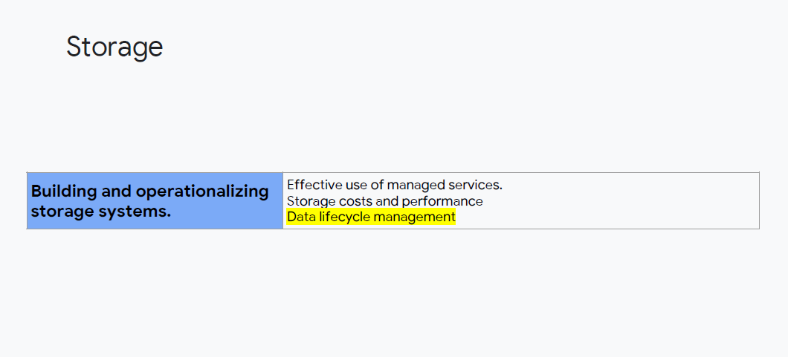
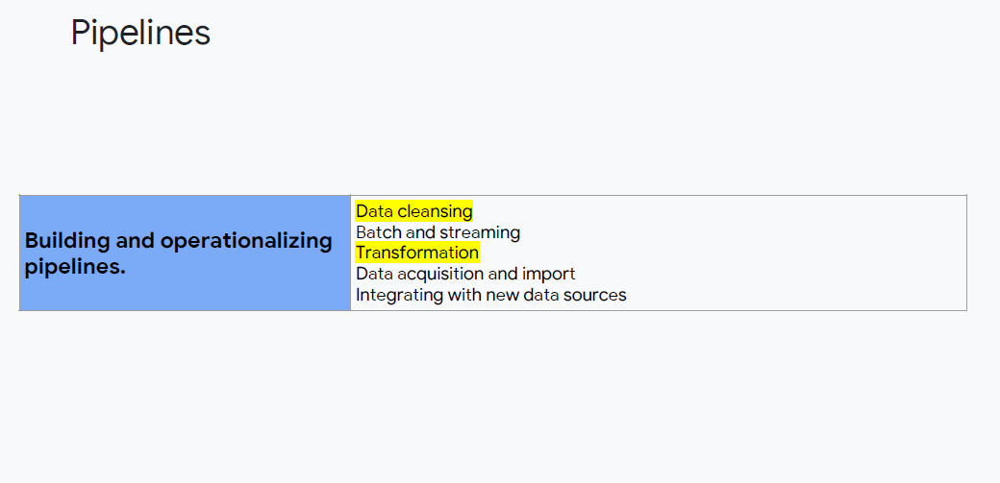
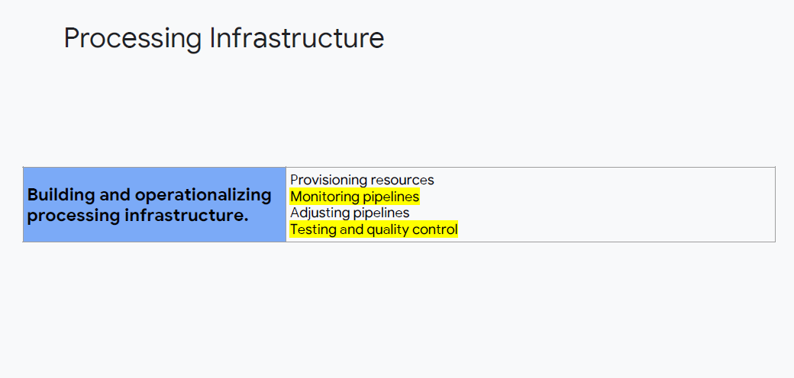

# Building and Operationalising Data Processing Systems - Exam Review

## Building and operationalising pipelines and processing infrastructure

### Building and operationalising pipelines

- Here are a few tips inspired by the exam guide outline

| Topic | Tips |
|-------|------|
| **Data cleansing** | What kinds of quality controls are there on the source data? |
| **Batch and streaming** | **What frequency of results is needed?** |
| **Transformation** | Is the data in a usable structure, or does it need to be transformed for practicality or efficiency? |
| **Acquire and import data** | How will data be acquired or imported?
| **Testing and quality control** | How will the quality of the data and results be validated? Metrics? |
| **Connecting to new data sources** | Are there new data sources that will be required, and how will that data be made available to the solution? Frequency? Validation? Quantity? Connection method? Security? |

- When looking at data processing, consider the frequency of results needed
- For example, is the business purpose to produce a report once a month? If so, you might have a very different design that if the report had to be generated daily or even on-demand
- What is the input and output side? Is the data useable as is or does it need to be transformed to be useful?
- If it doesn't need to be transformed, for example some CSV files, maybe you would leave them in Cloud Storage
- On the other hand, if transformation is required, you can start to consider which service can and should do that

### Building and operationalising processing infrastructure

| Topic | Tips |
|-------|------|
| **Provisioning resources** | Fixed or dynamic? How will resources be provisioned initially, and how will they be adjusted? Frequency of adjustment? Method? |
| **Monitoring pipelines** | How will workflow be monitored? For example, in Cloud Dataflow, the pipeline is visible in the console. How do capabilities connect with procedures? |
| **Adjusting pipelines** | What happens when the source data changes or the business circumstand changes? Who will make changes of what kind? |
| **Testing and quality control** | How do you know the pipeline is continuing to do what it is supposed to do and operating within paramters? What happens if there is a change in the flow of data? |

- How frequently and how significantly will resource demands change and how is this going to be handled? For example, is it an annual report that determines whether the Bigtable cluster need another instance? Is this a manual process or is there some automated method of handling growth? Such as using a serverless service

### Storage

> **Exam Tips**
>
> - **Tip**: Data management is often influenced by business requirements. After the data has been used for the "live" application, is it collected for reporting, for backup and recovery, for audits, or for legal compliance? What are the changing business purposes of the data in different time frames?
> - **Tip**: "Effective use of managed services" … choose the right service and the correct settings/features for specific use cases. 
> - Consider costs, performance, and effective use cases (key features) for these:
>   - Cloud Bigtable
>   - Cloud Spanner
>   - Cloud SQL
>   - BigQuery
>   - Cloud Storage
>   - Cloud Datastore
>   - Cloud Memorystore

### Pipelines

> **Exam Tips**
>
> - What is Data cleansing? Data cleansing is improving the data quality through consistency. You could use Cloud Dataprep to Extract, Transform, or Load (ETL). You could run a data transformation job on Cloud Dataproc.
> - Batch and streaming together? You should already be thinking "Cloud Dataflow".
> - Integrating with new data sources. You should be familiar with the connectors available between services in the cloud, and common import/acquisition configurations

### Processing Infrastructure

> **Exam Tip**
>
> - Testing and quality control and monitoring. You should be familiar with the common approaches to testing that are used in production environments, such as A/B testing, and other rollout scenarios. Likewise, there are operational and administrative monitoring elements for most services in the Cloud Console, and statistical and log monitoring in Stackdriver. Do you know how to enable and use Stackdriver with common services?