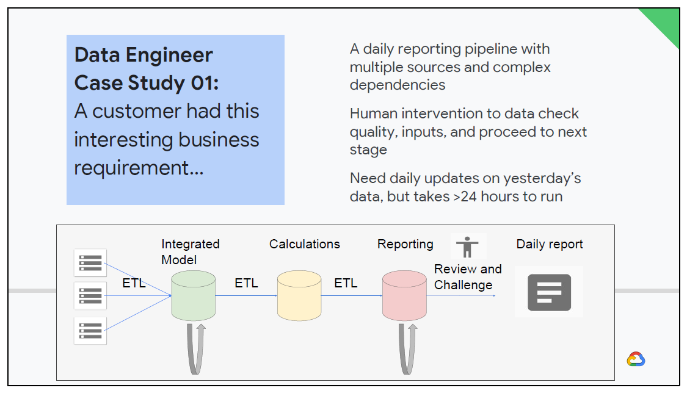
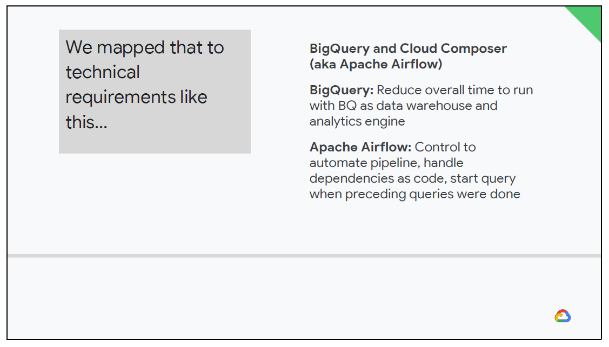
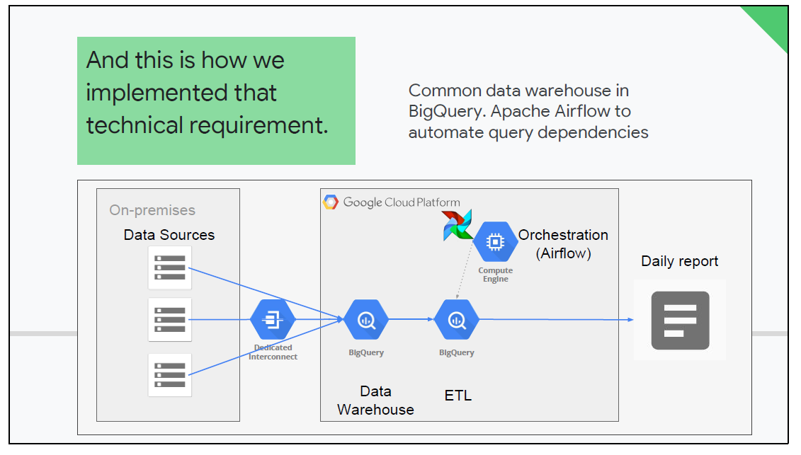

# Practice case study analysis

## Case Study 1

A client had a very complex reporting pipeline. They had a very large amount of data that had to be processing into a report htat was going to regulators on a daily basis.

They had to demonstrate that the risk in the financial data from the previous data indicated that they were following the regulatory rules. They put the data through mutliple systems or stages.

Each stage had a separate ETL sequence and then performed unique processing on the data.

The customer had this interesting business requirement:

- A daily reporting pipeline with multiple sources and complex dependencies.
- Human intervention to data check quality, inputs and process to next stage
- Need daily updates on yesterday;s data but takes greater than 24 hours to run

The complexity in the (simplified) diagram makes it look like it was a linear progression from start to finish, but this is meant to be symbolic.

The actual processes were much more complicated and it took 30 hours from start to finish to generate one report. The processes were actually more of a spiderweb with many dependencies

So one part would run and then halt waiting until another dependent part was complete before proceeding. And there were some processes that could run in parallel.

### Identifying Technical Watchpoints

- What are the technical watchpoints?
- Are there any parts of the requirements that indicate specific technologies or solution elements?

### Mapping Technical requirements

#### BigQuery & Cloud Composer (aka Apache Airflow)

- First, all the processes were diagrammed out and then an approach in how to implement this in Google Cloud using the available services was looked at
- Initially Dataproc or Dataflow was considered
- However, the customer already had analysts that were familiar with BigQuery and SQL
- If we developed in BigQuery, it would make the solution more maintainable and usable to the team/group
- If we developed in Dataproc, they would have had to rely on another team that had Spark programmers
- This is an example where the technical solution was influenced byu the business context
- To make this solution work, we needed some automation for that we chose Apache Airflow
- In the original design we ran Airflow on a Compute Engine instance
- However, after Cloud Composer (a managed GCP Apache Airflow service) was available, this was a more preferable solution
- BigQuery and Cloud Composer reduce the overall time too run with BQ as a data warehouse and analytics engine
- Apache Airflow, control to automate pipeline, handle dependencies as code, start query when preceding queries were done.

The technical requirements were mapped out as following:

### Implementing Technical requirements

The technical requirements were mapped out as following:

- Common Data Warehouse in BigQuery Apache Airflow to automate query dependencies

In this particular case, open source Apache Airflow was used, however this is now a fully managed service in GCP via Cloud Composer.

Cloud Composer or Apache Airflow allowed us to establish the dependencies between different queries that existed in the original reporting process.

BigQuery served as both a data storage solution and the data processing query solution.

We were able to implement all the processing as SQL queries in BigQuery. And we were able to implement all the dependencies through Airflow.

One of the time sinks in the original process had to do with the 30-hour start to finish window.

This involved processing jobs which would sometimes fail, because the data from a previous dependency wasn't yet available.

They had a manual process for restarting those jobs. We were able to automate away that toil and the rework by implementing logic in Apache Airflow.
