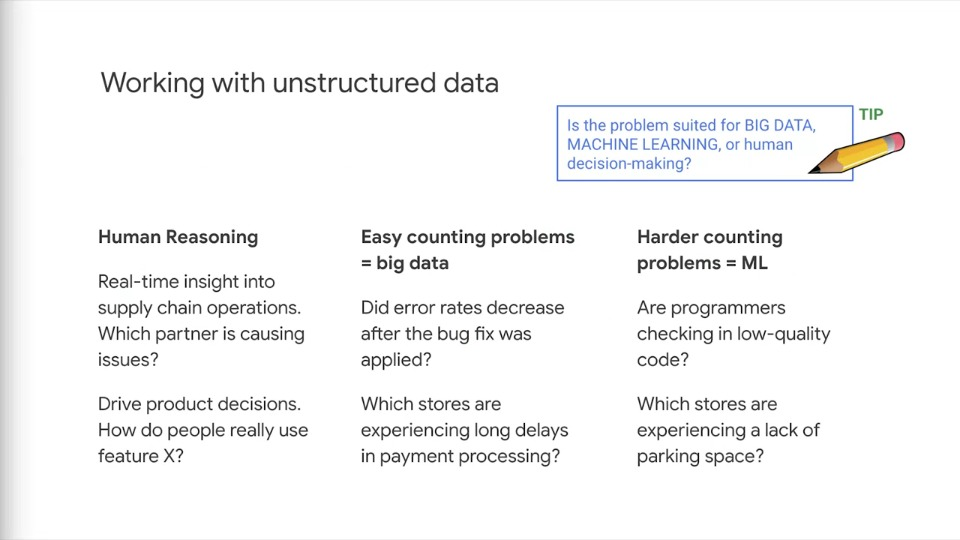

# Preparing for Machine Learning

## Video 1: Machine Learning

- Machine learning is composed of an orderly set of processes
- In questions about machine learning, make sure you **identify the step**
- Some steps involve similar or related actions
- On GCP, we can use logging APIs, Cloud Pub/Sub, etc and other real-time streaming to collect the data
- BigQuery, DataFlow and ML preprocessing SDK to organise the data using different types of organisation
- Use TensorFlow to create the model and use Cloud ML to train and deploy the model

### Tensorflow is an open-source high-performance library for numerical computation that uses directed graphs

    

- Tensorflow is an open source, high performance library for numerical computation
- It's not just for machine learning, it can work with any numeric computation
- For example, Tensorflow has been used for many times of GPU computing such as solving partial differential equations, which can be useful in domains such as fluid dynamics
- Tensorflow is a numeric programming library that's appealing becauase you can write your computation code in a high level language like Python and have it be executed in a fast way
- The way Tensorflow wroks is that you create a Directed Graph, to represent your computation
- For example, the nodes could represent mathematical operations such as adding, subtracting, multiplying and more complex functions
- Neural network training and evaluation could be represented as data flow graphs
- The tensor data representation is passed from node to node, where it's processed
- It's analogous to data flow and pipeline, but the input and output are mathematical operations
- Tensorflow is developed at Google and it's portable across GPUs, CPUs and special hardware called TPUs which are Tensorflow processing units

### Tensorflow toolkit hierarchy

- You'll want to be familiar with all the layers of Tensorflow and some of the key functions
- For example, it is recommended to know what the TF methods here do and what they're used for

    

### The Python API lets you build and run directed graphs

- Be able to read a Tensorflow program and understand generally what it's doing
- Know the major objects and methods

    

### Lazy evaluation

- Tensorflow does **lazy evaluation**, where you write/code a directed graph (DG), then you run the DG in the context of a session to get the results
- Tensorflow can also run in eager mode, using `tf.eager` method where the evaluation is immediate and it's not lazy
- But eager mode is typically not used in production programs, and is mostly for development
- To be clear: Tensorflow uses lazy evaluation and the eager execution module is a front end to Tensorflow that's used for interactive learning of Tensorflow and for experimentation and prototyping
- It enables imperative commands from Python that are executing immediately

- In the example shown above, NumPy and Tensorflow are doing the **same** thing. The difference, however is **execution**
- NumPy executes immediately, Tensorflow runs in stages
- The build stage builds the directed graph, and the run stage executes the graph and produces the results

### Graphs can be processed, compiled, remotely executed, and assigned to devices

- Because developing ML models are so processor intensive, it's important to get the model right before scaling up
- Otherwise, the models can become expensive
- The diagram above illustrates some of the processes involved in distributing the work for scaling

### Tensorflow can distribute computation

- One benefit of Google's machine learning platform is the ability to scale up to production level by distributing computation across many machines and many types of machines
- There is no need to tailor specific code and functions for specific types of CPUs or GPUs, Tensorflow handles all that for you

## ML and Unstructured Data

### What qualifies as unstructured data?

- Even data that has a schema might still be unstructured if it's not useful for your intended purpose
- Here's an example: imagine that you're selling products online
- After the product is delivered an email is sent out asking for feedback about the experience
- Upon reviewing the first dozen, or so emails you begin to regret not sending some survey
- Because compiling the results of the text from each email is going to be impossible
- For the purposes of identifying best practices and worst practices, the email text data is unstructured
- However, you could use sentiment analysis to tag the emails and group them
- Let the machine learning do the reading for you and sort the emails into representative groups
- Now, you can look at the most positive and most negative emails to identify what behaviours to enforce or avoid
- The machine learning process turns the unstructured data into structured data for your purposes

### Working with unstructured data

- Distinguish between:
  - One-off reasoning problems that are best solved by humans
  - Big data problems that can be solved by crunching a lot of data, and;
  - Machine learning problems that are best solved using modelling
- Case study: asked if a machine learning model could distinguish upside down images from right side up images
- You *could* train a model to do that, **but** most modern cameras add metadata into the image header about the orientation of the camera at the time the image was taken
- That data is accurate and easily accessed. So in this case, reading the metadata would be a **better** solution than training a machine learning model

### Data Engineers must focus on both the training and inference stages of ML

- It's important to recognise that machine learning has two stages, training and inference
- Sometimes the term prediction is preferred over inference because it implies a future state
- For example: recognising the image of the cat is not really predicting it to be a cat, it's really inferring from pixel data that a cat is represented in the image
- Data engineers often focus on training the model and minimise or forget about inference
- It's not enough to build a model, you need to **operationalize** it
- You need to put it into production so that it can run inferences

### In supervised learning, you have labels

- If you have an ML question or problem that refers to labels, it is a question about **supervised learning**

### Regression and classification are supervised ML model types

- If the question is about classification or regression, it's using **supervised learning**

### A data warehouse can be a source of structured data training examples for your ML model

- A very common source of structured data for machine learning is your data warehouse
- Unstructured data includes things like pictures, audio or video and freeform text
- People sometimes forget that structured data might make great training data, because it's already pre-tagged
- This example shows that birth data can be used to train a model to predict births
- Another example that is good to use is real estate data - there is a ton of information online about houses
- How big they are? How many bedrooms? What is the history of one house being sold, how much was paid? This is great training data for building a home pricing evaluation model
- In other words, the goal would be to describe the house to the Machine Learning model and have it return a price of what the house might be worth

### Defining metrics

- If you don't define a metric or measure how well you model works, you will not be able to know if it's working sufficiently to be useful for your business purpose
- You should be familiar with Mean Squared Error (MSE)

### Understanding the purpose of gradient descent

- Gradient descent is an important method to understand how an ML problem is turned into a search problem

### Recomputing errors

- Error metrics are measures of how well the model fits reality
- Categorising (classification) predicts discrete values and regression predicts continuous variables
- MSE and RMSE measure how well the model predicts continuous variables
  - One reason for using RMSE instead of MSE is that RMSE is in the units of the measurement being predicted, making it easier to read and understand the significance of the value
- Cross entropy loss measures how well a classification model predicts discrete values
- If the result you're looking for are discrete values or categories - it's a **classification** problem
- If the result you're looking for are continuous values - it's a **regression problem**

## Training and Validating

### Evaluating models

- This is implementation of the principle of practical not perfect
- When will your model be usable? When should you stop improving it? If this step is missing, you can have runaway cost, poor performance, or a model that doesn't work sufficiently and is misleading
- Note that after we calculate error on batch, we can either keep going or we can evaluate the model
- Evaluating the model needs to happen on a full dataset not just a small batch

### Experiment with models

- If you have one pool of data, then you'll need to split it into training and validation data
- You can't use it all in both places or you won't get measurable error
- Training and evaluating an ML model is an experiment with finding the right generalisable model that fits your training dataset but doesn't memorise it
- As you can see in the slide, we have an overly simplistic linear model that doesn't fit the relationships in the data
- You'll be able to see how bad this is immediately by looking at you loss metric during training and visually on this graph here as there are quite a few points outside the shape of the trend-line. This is called **under-fitting**
- One the opposite end of the spectrum is **overfitting** as shown on the right extreme. Here we greatly increase the complexity of our linear model and turned it into an nth order polynomial, which seems to model the training dataset really well, almost too well
- This is where the evaluation data set comes in. You can use the evaluation dataset to determine if the model parameters are leading to overfitting
- Overfitting or memorising your training dataset can be far worse than having a model that only adequately fits your data
- If someone said the have a machine learning model that recognises new instances and categorises them perfectly 100% of the time, it would be an indicator that the validation data somehow got mixed up with the training data, and that the data is no longer a good measure of how well the model's working

### Use independent test data, or cross-validate if the data is scarce

- Read these slides backwards:
  - If the question says data is scarce, then you should be thinking independent test data or cross validate our candidate answers
- Be familiar with the various methods of cross-validation including training validation, and test and cross-validation

### Working with Estimator API

- Expect to know the basics of Tensorflow and key methods
- To recap:
  - You need to know regression and classification, labels, features
  - You need to know the progression of train, evaluate and predict
  - You need to understand some basic Tensorflow API calls
