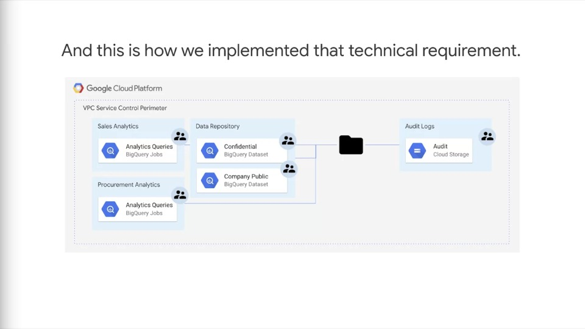

# Case Study #2

## Case study description

- This case involves a media company that's decided to move their in-house data processing into BigQuery
- This example is focussed on **security and compliance**
- As part of the migration, they've been moving their data centres from on-prem to BigQuery and the cloud.

## Concerns and questions

### Questions

- Who has access to the data they're migrating into the cloud?
- How is access audited and logged?
- What kind of additional controls can be placed?
- What is the exposure to data exfiltration and can it be prevented?

### Concerns

- They're worried about potential bad actors within the company, who as part of their role have access to certain data
- They want to make sure that employees who have access to that data can not then take the data, load it onto their own computer or load it onto another cloud project and from there perhaaps take that data somewhere else

## Business requirements summary

- Capture data reading and updates events to know who, what, when & where
- Separation of who manages the data and who can read the data
- Allocate costs appropriately, costs to read/process vs. costs to store
- Prevent exfilitration to other GCP projects and to external systems

## Mapping business requirements to technical requirements

- Wanted to focus the technologies and the capabilities already available in BigQuery
- Introduced the client concepts such as audit logs on GCP, and specifically the default logs available from BigQuery
- Presented the client with Admin Logs that record creating and deleting data sets, and then the more detailed access logs that identify when people are reading datasets or perhaps even reading or accessing parts of the BigQuery UI
- Encourage the client to have everything managed by IAM
- In IAM, develop groups based on role, then assign members to groups and establish permissions and apply those to the groups based on role

## Identifying Technical Watchpoints

### What are the technical watchpoints? Are there any parts of the requirements that indicate specific technologies or solution elements?

- ~~As previously indicated, the technical solution will use existing capabilities within BigQuery, as well as GCP IAM and using Stackdriver and other log collection services~~
- All access to data should be captured in audit logs
- All access to data should be managed via IAM
- Configure service perimeters with VPC service controls

## Technical solution 

### Given the case background, analysis, and technical watchpoints identified by the team. Describe the solution you would recommend.

#### My answer attempt

- Identify how contained on-prem data processing is, what does it contain, where is it stored, who has access. 
- Once key information about existing solution is obtained, start to implement a secure BigQuery solution. Ensure that requirements and tests for access, security, audit logs and VPC controls are already in place before migrating data.
- Finally perform data migration and check all tests are passing. If possible, undergo UAT to ensure that all requirements are being met and nothing has been overlooked

#### How technical requirements were implemented

- Each group was isolated in separate projects and allowed limited access between them using VPC service controls
- BigQuery allows separation of access by role, which meant that some roles were limited to only loading data nad others to only running queries
- Some groups were able to run queries in their own project using datasets for which they only had read access and the data was stored in a separate repository
- Aggregated log exports were enabled at the folder level of the resource hierarchy
- This ensured that even the owner of a project, who had the ability to redirect exports, wouldn;t be able to do so without specific exports because those rights were set at the folder level, where most team members didn't have access
- So by using aggregated log exports, all logs could be retrieved and stored in cloud storage to create a record of who ran which query at what time against what dataset
- The VPC perimeter enabled APIs to be allowed to run within the perimeter and only talk with other APIs blowing into other projects within the same perimeter
- This meant that if someone had a separate project and started a BigQuery job that was to read from a dataset within the perimeter, even though they have credentials and access to the dataset, they would not be able to use or run the queries because the APIs would not allow it at the perimeter

