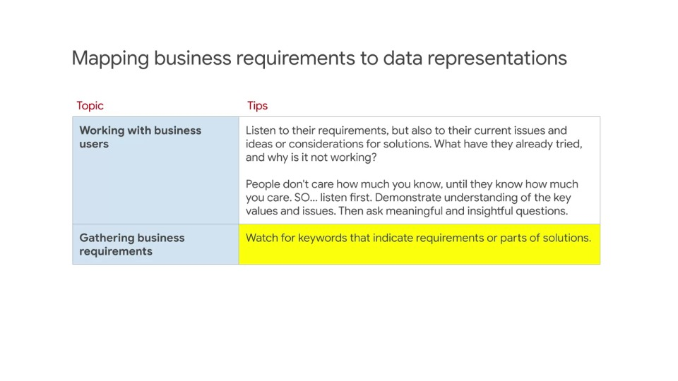
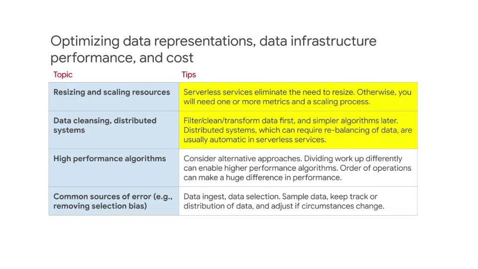

# Optimisation - outline review

## Video: Business requirements and optimisation

### Mapping business requirements to data representations

- Here's some standard consulting advice
- Very often in technical consulting, the technologist think they know the answer to their problem
- However, if they actually knew the answer to their problem, they probably wouldn't be speaking with the consultant
- So it's important to respect their proposed solution if one is presented, but to analyse and consider it carefully
- Because it's likely their solution is only partial or may not be functional or do everything they require
- Listen first, but don't accept everything you've heard
- Ask meaningful and insightful questions and planon doing some research before you respond

### Optimising data representations, data infrastructure performance and cost

- Below contains a few items which summarise the discussion on efficiency, and scale up inefficiency
- If it's not working well on a small-scale, it will not work at a larger scale
- Dirty data makes downstream work
- Some algorithms work at scale, but don't perform well when scaled up
- Some sources of error undermine efficiency
- For example, when 90% of the data lands in a single shard

