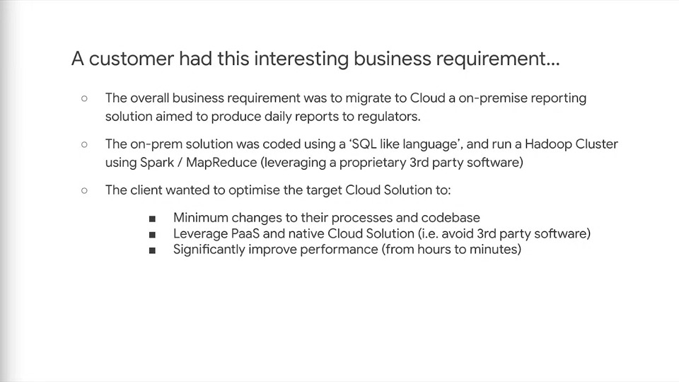
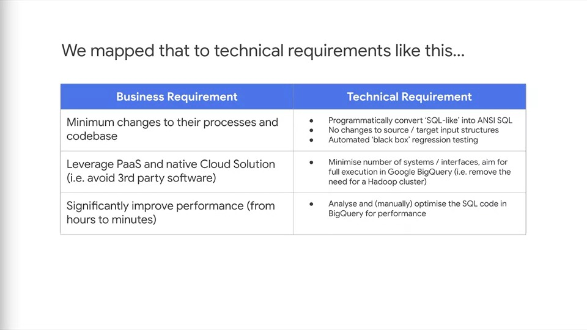
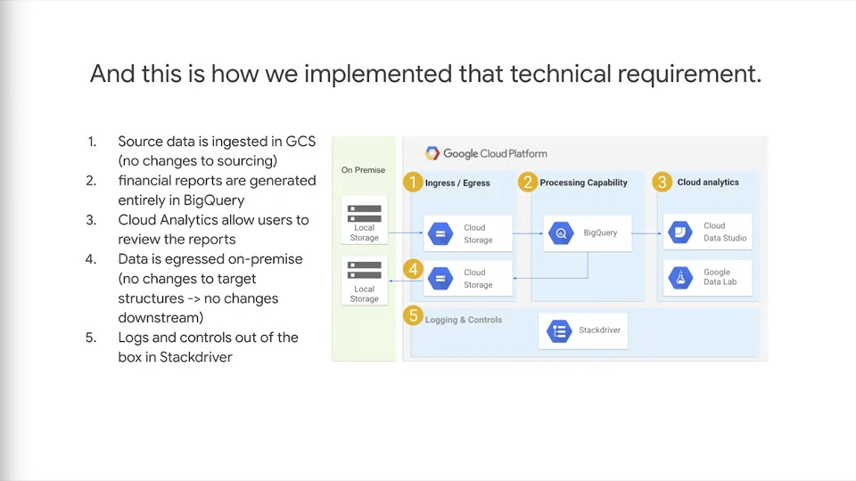

# Case Study #3

## Case Study Business Requirements

## Identifying technical watchpoints

**Q1: What are the technical watchpoints? Are there any parts of the requirments that indicate specific technologies or solutions elements?**

### A1 (attempt)

- Use Dataproc as an on-Cloud replacement for the on-prem Hadoop Cluster with Spark and MapReduce
- Identify Data Sources and Data Sinks, and map these to a replacement Dataproc cluster
- Identify on-prem cluster workloads (no. of workers, no. of jobs), ensure that Dataproc is configured to elastically scale to the required needs of producing daily reports
- Take advantage of the separation of compute and storage, to minimise costs and maximise performance

## Mapping technical requirements

### A1 (solution)

- The financial reporting applications run either daily or monthly
- So that was needed was to set up a pipeline to handle the requirements and then run the pipeline as required by their applications

## Proposed Solution

### A2 (attempt)

Implement the technical requirements as follows:

- Create a BigQuery dataset (database) and corresponding tables to house the data required for reporting
- Port (ANSI) SQL codebase over to BigQuery to perform necessary querying to generate report
- Implement 'black box' regression testing by creating one or more sample dataset(s)/report(s) to ensure that reporting does not deviate from original on-prem solution
- Inspect the BigQuery query execution map/path to ensure that the querying of the data does not have any bottlenecks or performance issues 
- Using data pipeline tools such as Apache Beam, Airflow or Dataflow to ensure timely scheduled reports

### A2 (solution)

#### How the technical requirement was implemented

- The final approach was a fairly simple solution
- The most **notable** part is what's not in the picture and that's Hadoop
- Recall that the customer's application that was performing the processing was on Hadoop with some MapReduce
- For the solution, the team were able to port the data out of the Hadoop Cluster to Cloud Storage
- Once in cloud storage, it was found that the processing being done was simple enough to be implemented in the processing front-end of BigQuery
- This created the liquidity report that the client wanted, and the team were able to use this for analytics in Cloud Data Studio and analytics processing in Cloud Data Lab
- The final reports were pushed first into cloud storage, and then back into on-prem storage
- This was important because it meant no changes in their business processes were needed
