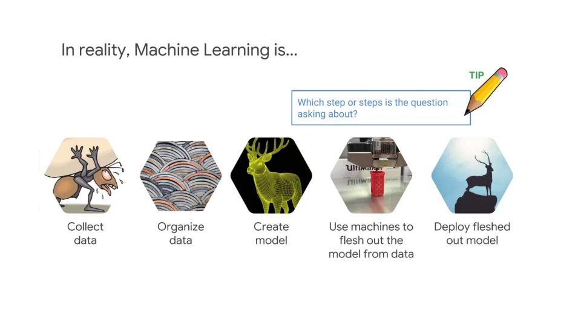
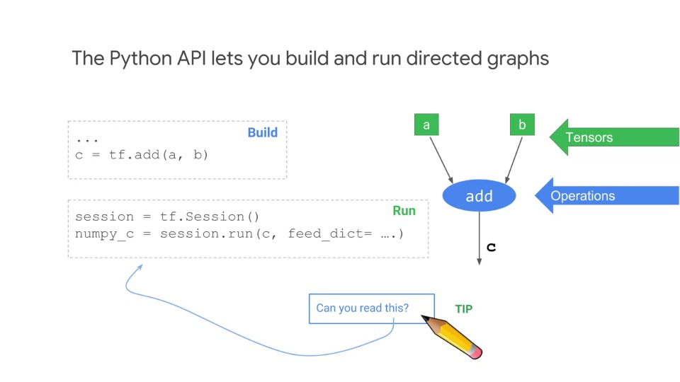

# Preparing for Machine Learning

## Video 1: Machine Learning

- Machine learning is composed of an orderly set of processes
- In questions about machine learning, make sure you **identify the step**
- Some steps involve similar or related actions
- On GCP, we can use logging APIs, Cloud Pub/Sub, etc and other real-time streaming to collect the data
- BigQuery, DataFlow and ML preprocessing SDK to organise the data using different types of organisation
- Use TensorFlow to create the model and use Cloud ML to train and deploy the model

### Tensorflow is an open-source high-performance library for numerical computation that uses directed graphs

    

- Tensorflow is an open source, high performance library for numerical computation
- It's not just for machine learning, it can work with any numeric computation
- For example, Tensorflow has been used for many times of GPU computing such as solving partial differential equations, which can be useful in domains such as fluid dynamics
- Tensorflow is a numeric programming library that's appealing becauase you can write your computation code in a high level language like Python and have it be executed in a fast way
- The way Tensorflow wroks is that you create a Directed Graph, to represent your computation
- For example, the nodes could represent mathematical operations such as adding, subtracting, multiplying and more complex functions
- Neural network training and evaluation could be represented as data flow graphs
- The tensor data representation is passed from node to node, where it's processed
- It's analogous to data flow and pipeline, but the input and output are mathematical operations
- Tensorflow is developed at Google and it's portable across GPUs, CPUs and special hardware called TPUs which are Tensorflow processing units

### Tensorflow toolkit hierarchy

- You'll want to be familiar with all the layers of Tensorflow and some of the key functions
- For example, it is recommended to know what the TF methods here do and what they're used for

    

### The Python API lets you build and run directed graphs

- Be able to read a Tensorflow program and understand generally what it's doing
- Know the major objects and methods

    

### Lazy evaluation

- Tensorflow does **lazy evaluation**, where you write/code a directed graph (DG), then you run the DG in the context of a session to get the results
- Tensorflow can also run in eager mode, using `tf.eager` method where the evaluation is immediate and it's not lazy
- But eager mode is typically not used in production programs, and is mostly for development
- To be clear: Tensorflow uses lazy evaluation and the eager execution module is a front end to Tensorflow that's used for interactive learning of Tensorflow and for experimentation and prototyping
- It enables imperative commands from Python that are executing immediately

- In the example shown above, NumPy and Tensorflow are doing the **same** thing. The difference, however is **execution**
- NumPy executes immediately, Tensorflow runs in stages
- The build stage builds the directory graph, and the run stage executes the graph and produces the results
