# Preparing for Performance and Optimisation

## Video 1: Modelling business processes for analysis and optimisation

- Modelling processes means thinking about them in some formal context or paradigm
- Some of these skills are not specific to Google or Google Cloud technologies
- However we'll discuss a few common frameworks

### What happens if your model is wrong?

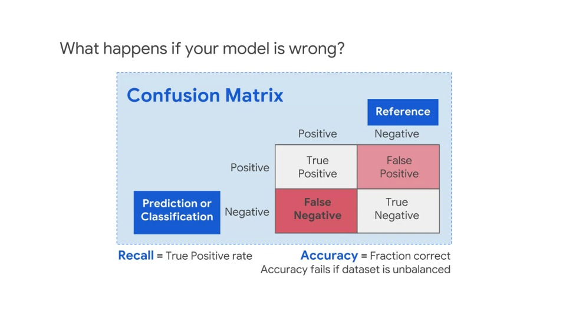

- A confusion mtrix classifies types of errors in classification models
- There are two kinds of mistakes the model can make: false positive and false negative
- Note that the consequences are not the same. For example, imagine you're predicting a dangerous condition in an automobile part
  - Positive means that the part is hazardous and dangerous, negative means the part is safe
  - A **false positive** means that the model predicted the part was dangerous when it wasn't
    - This would have an outcome of removing a part that didn't need to be eliminated
  - A **false negative** means that your model predicted that the part was safe when it was actually dangerous
    - This would lead to the part being used in an automobile because it was thought to be safe, but resulting in accidents due to it being dangerous
- Note that the logic could be reversed - if you were predicting that a part was safe, the false positive would be that it's actually dangerous
- Therefore it's important to think through the logic of the problem and understand what business decision, procedure or action shoulb be taken as result of the ML model

### Planning and reasoning design

- You may have to plan to explain your reasoning and design.
- In the example below, a confusion matrix is used to make the data engineering choices understandable to the business users

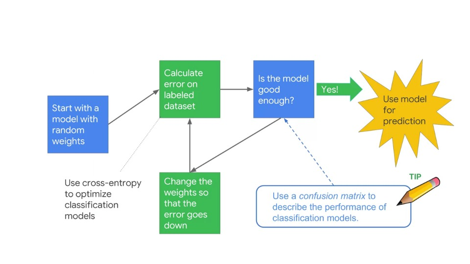

> **Exam Tip #1**
>
> Use a confusion matrix to describe performance of classification models

### Build, buy or modify

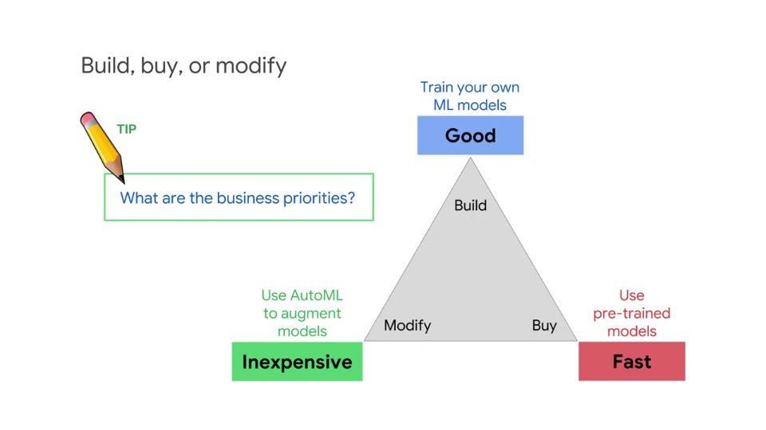

- What are the business priorities?
  - A high-quality model takes time or money (or both) to develop
- Using pre-trained models is fast and inexpensive, **but** may not be tailored to your needs
- A comprimise could be to use an existing trained model but to build additional capability in the model
  - This is the solution by **AutoML**

> **Exam Tip #2**
>
> Think about scenarios in terms of **good**, **fast** and **inexpensive** and identify what the question indicates the customer ***cares about***

### Ways to build effective ML

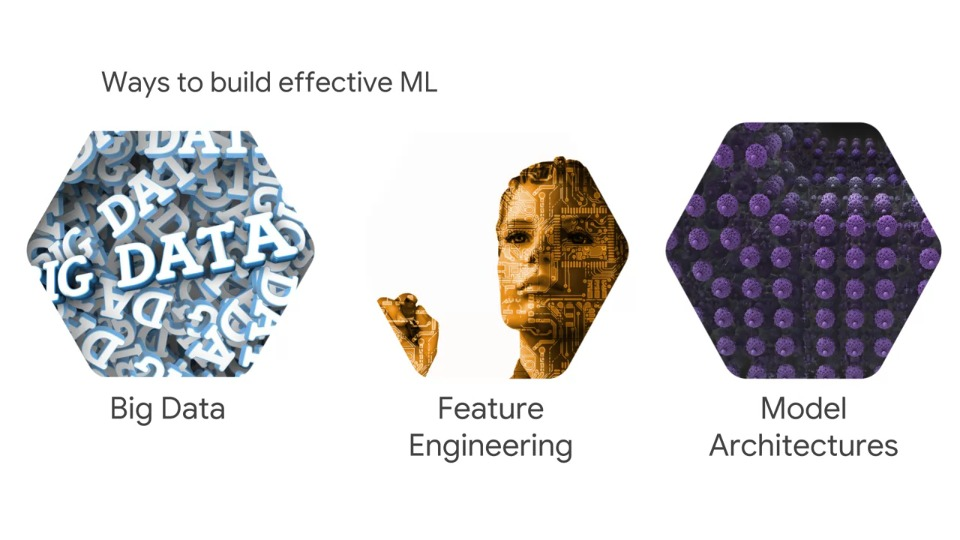

- One of the themes in ML is to start simply and build to production
- Shown is the general progression of building an ML solution
- You can start with big data, go through feature engineering and then create the model and deploy it

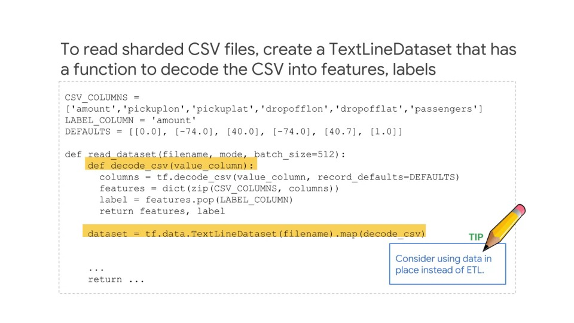

- In this example, data is read from a CSV file
- Sometimes it's most efficient to use the data in its current location and format rather than ingesting an ETL

> **Exam Tip #3**
>
> Consider using data where it is in place, maybe from cloud storage rather than using an ETL

### Repeat the data and send it along in chunks

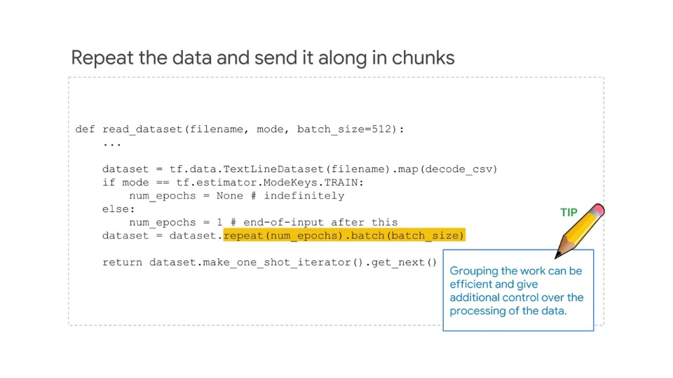

- Batching means grouping data and performing the work all at once
- For example, the pre-trained ML APIs have limits on how many requests can be sent during a period
- By batching the work before it's sent, you can reduce the number of API calls to get the same results

> **Exam Tip #4**
>
> Grouping the work can be efficient and give additional control over the processing of the data

### Making ML pipelines more robust

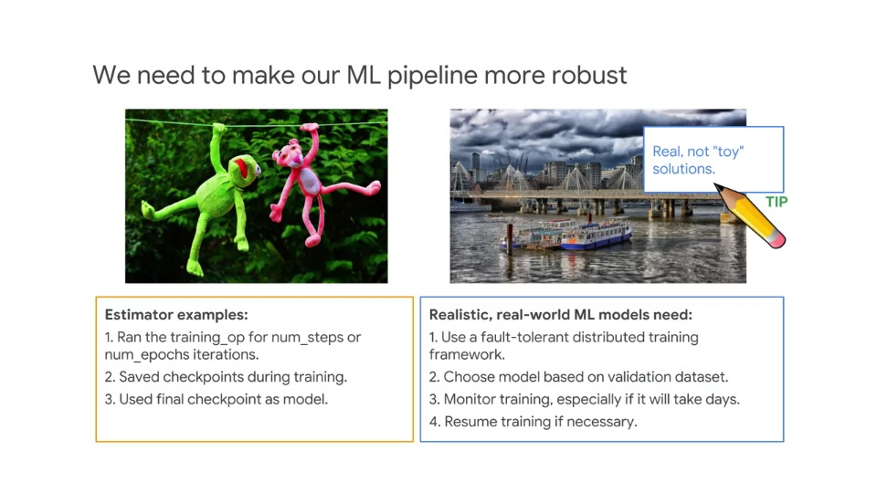

- Don't get confused between initial proof of concept and production activities
- In general, the cases will refer to real-world examples

> **Exam Tip #5**
>
> Identify toy solutions and distinguish them from real production solutions

## Video 2: Feature engineering and performance

### Feature engineering

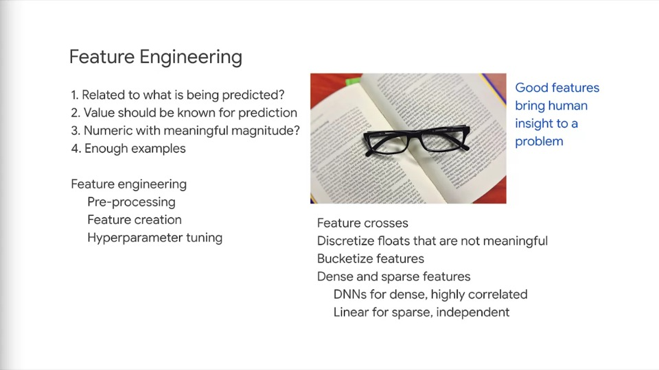

- Feature engineering is a unique discipline
- Selecting which feature or features to use in a model is critical, and there are a lot of things to consider including:
  - Whether the data of the feature is dense or sparse
  - If the value is numeric
  - Whether the magnitude is meaningful or abstract
- A good feature needs to have enough examples available to train, validate and evaluate the model

### Learning rate is an important parameter

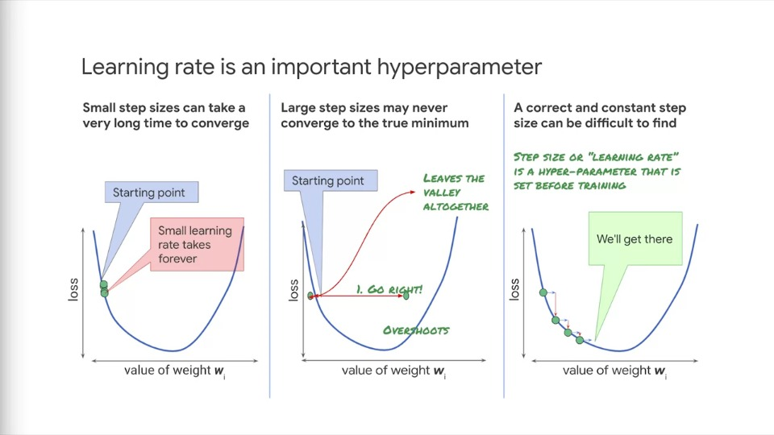

- Hyperparameters can determine whether your model converges on the truth quickly or not at all
- Learning rate can be illustrated via small, large and correct step sizes

#### Small step sizes

- If your step size is too small, your training might take forever
- You're guaranteed to find the minimum though so long as there's only one minimum like the linear regression loss curve shown above

#### Larger step sizes

- If your step size is too big you might either bounce from wall to wall, or bounce out of the valley and into an entirely new part of the loss surface
- Because of this, when the step size is too big, the process is not guaranteed to converge

#### The correct step size

- If your step size is just right, then you will be able to find the minimum loss, without training time taking too long
- However, whatever the value is, it's unlikely to be just as good on a different problem, so it's best to find the optimal learning rate for your problem

> **Exam Tip**
>
> Better understand what the learning rate is, and how to find the best learning rate through hyperparameter tuning

### BigQuery performance

- Performance is critical to practical solutions
- In a case study, there are often requirements that help define the level of performance required
- Here are some questions to consider:
  
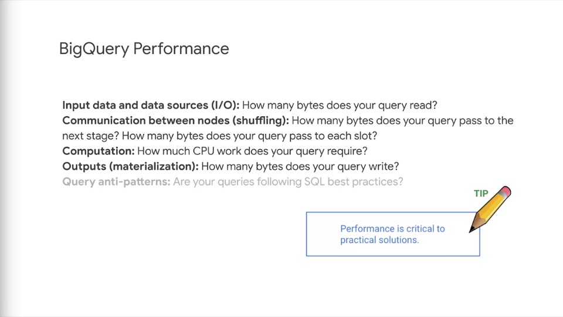

### Schema and performance

- This is page 10 from the IRS Form 990, which lists 24 different expense types
- What happens if another expense type needs to be added?
  - One approach may be to change the schema and provide nulls historically
  
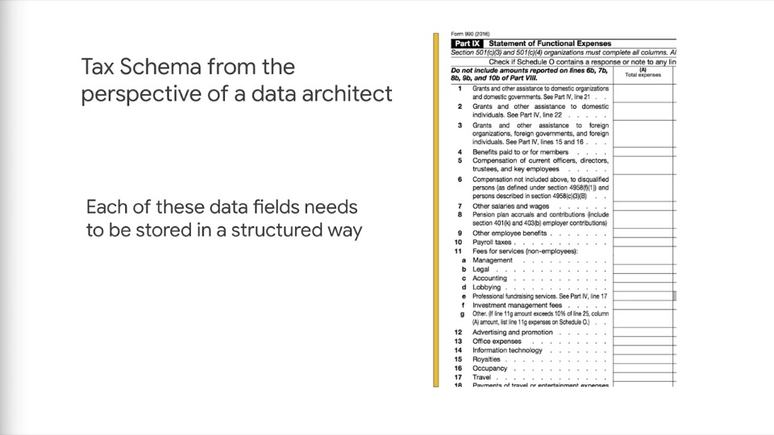

- However, if we add each expense field as a new column, the table becomes very wide and processing that wide table isn't scalable

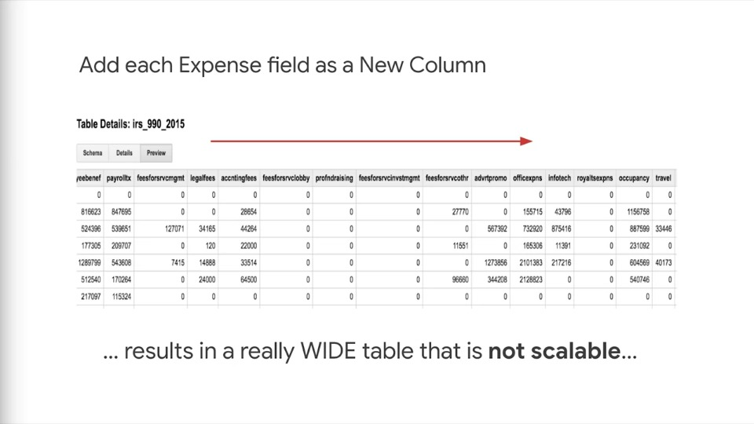

### Normalising data

- The trade-off between relationalism and flat structure is called normalisation
- This process of breaking out fields into another lookup table increasing the relations between the tables is called **normalisation**

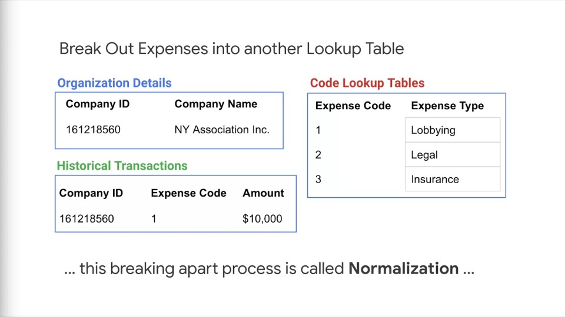

- Normalisation represents relations between tables

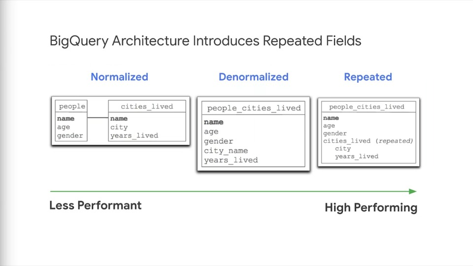

- Denormalised data represents information in a flat format
- Repeated fields tables related data to be handles in a loop making it more efficient to process

### Normalise for efficiency

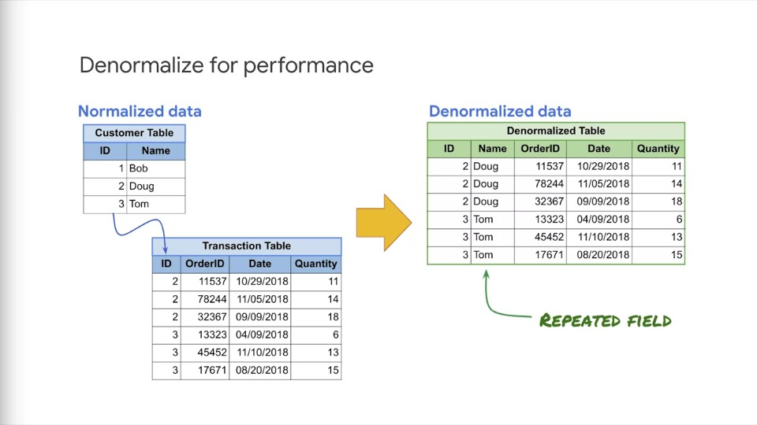

- The trade-off is performance vs. efficiency
- Normalised is more efficient, whereas denormalised is more performant
- The original data is organised visually but if you had to write an algorithm to process the data, how might you approach it?
- Could be by rows, by columns, by rows and fields, and the different approaches would perform different based on the query
- Also, your method might not be parallelisable
- The original data can be interpreted and stored in many ways in a database
- Normalising the data means turning it into a relational system
- This stoes the data efficiently and makes query processing a clear and direct task
- Normalising increases the orderliness oof the data
- Denormalising is the strategy of accepting repeated fields in the data to gain processing performance
- Data must first be normalised before it can be denormalised
- Denormalisation is another increase in the orderliness of the data because of the repeated fields. In the example, the name field in repeated
- The denormalised form takes more storage
- However, because it's no longer relational, queries can be processed more efficiently and in parallel using columnar processing

> **Exam Tip**
>
> Know when to understand normalisation and denormalisation and when to apply each to your data representation and design

### BigQuery can used nested schemas for highly scalable queries

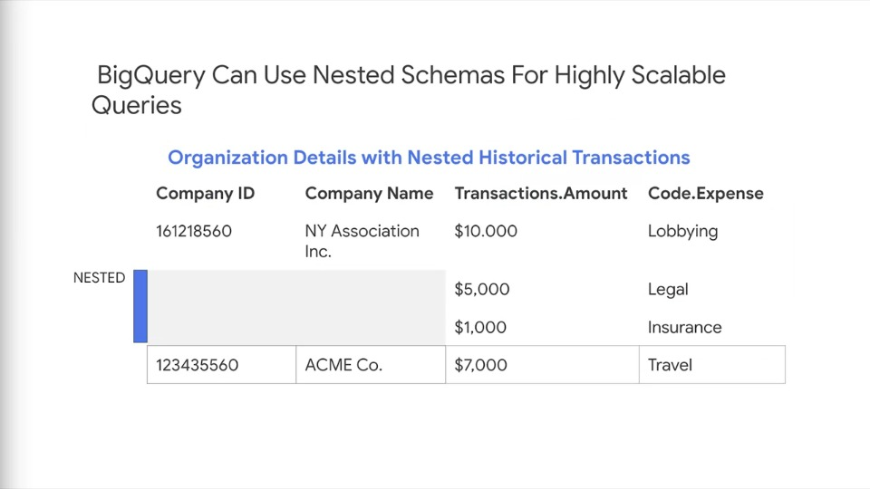

- BigQuery can use nested schemas for highly scalable queries
- In the example shown, the company field has multiple nested transactions

## Pipeline and performance

### For key elements of work

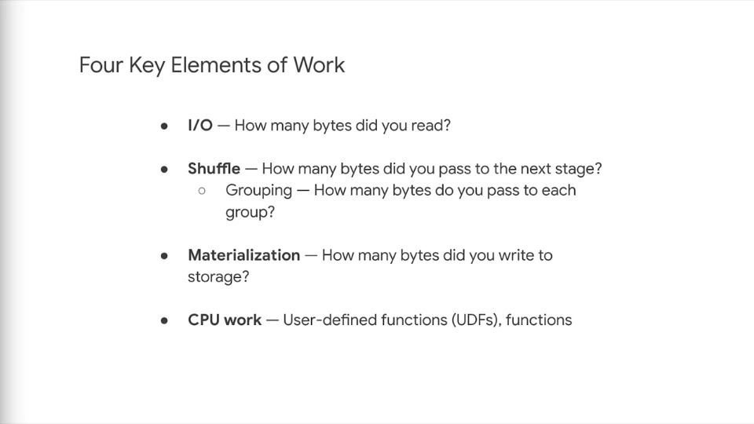

- Here are some items to consider when thinking about efficiency, speed of processing cost and inefficiency related issues
- For example, shuffling the data from one stage to another for the purposes of grouping can be a source of inefficiency
- That's not as easy to see or detect as say slow input or slow output
- Long-running jobs are a symptom, so you might want to measure resources and time between stages, or to run tests on successively larger samples to verify how the pipeline is scaling

### Avoid I/O wastefulness

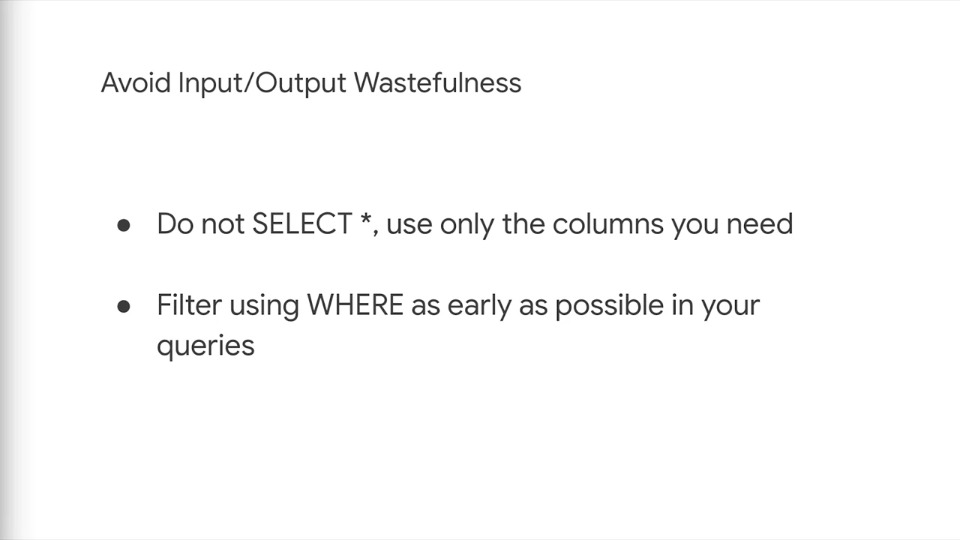

- Remember to avoid using select wildcard in SQL statements
- Filter with a `WHERE` caluse in SQL, **not** `LIMIT`
  - `limit` only limits the output, **not** the work it took to get there, where filters on input

### Be aware of data-skew in your dataset

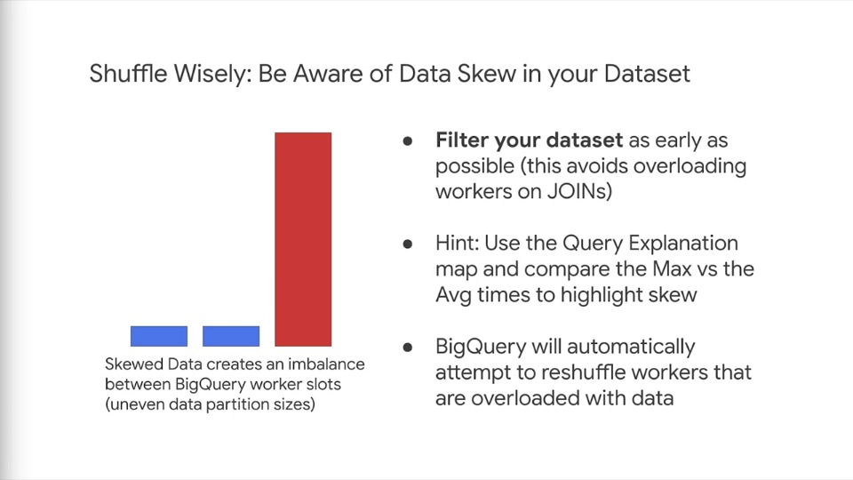

- Other than shuffling, another hidden casue of inefficiency can be data skew
- The skewed data causers most of the work to be allocated to one worker, and the rest of the workers to sit and wait for that worker to complete

### Use `GROUP BY` statements carefully

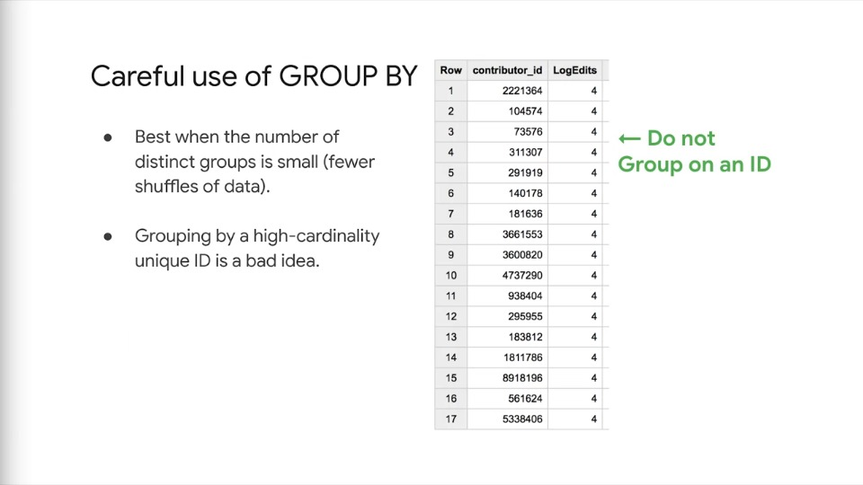

- The group by clause works best when the number of groups is small and the data is easily divided among them
- A large number of groups won't scale well
- For example, a cardinality sort on an ID could cause increasingly poorer results as the data grows, and the number of groups possible changes

### Joins and unions

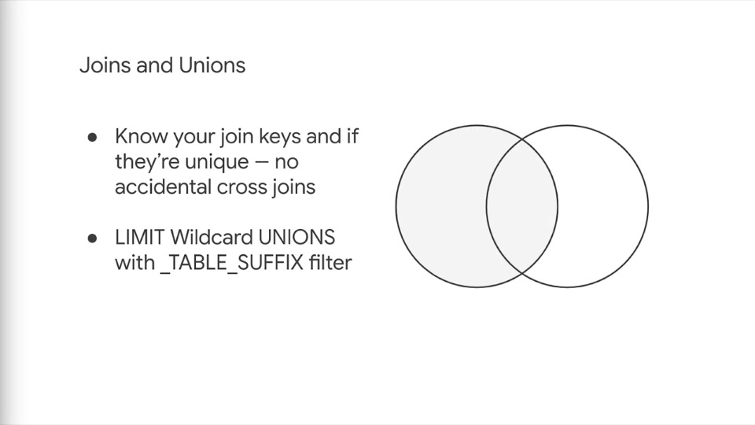

- Understanding fields you're using for keys when you're performing a join

### Limit UDFs to reduce computational load

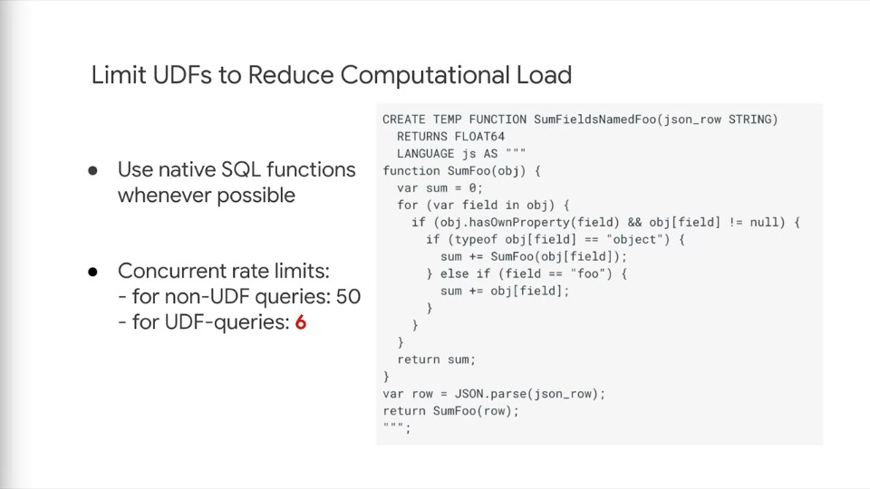

- Limit the use of user-defined functions, use native SQL whenever possible

### Diagnosing performance issues with the Query Explanation map

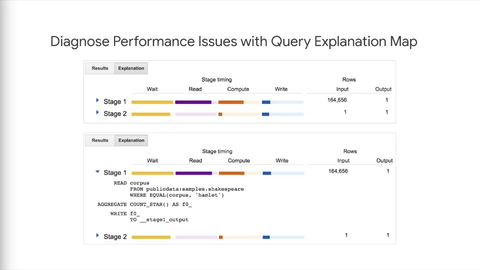

- There are tools available such as the query explanation map, which shows how processing occurred at each stage
- This is a great way to diagnose performance issues and narrow down specific parts of the query that might be the cause

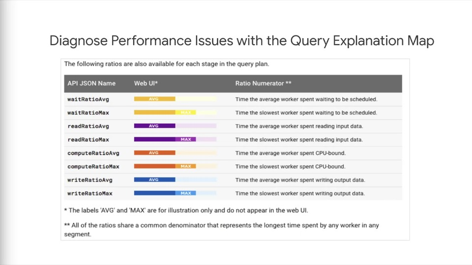

- You'll also find overall statistics and ratios that can be instructive
- For example, the time the slowest workers spent reading input data, CPU bounds, or writing output data which you can compare to the average

## Dividing work

### Table partitioning

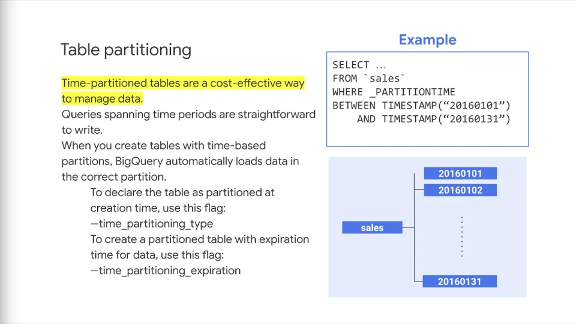

- Partitioning by time is often a way to evenly distribution work and avoid hotspots in processing data
- In this example, a partition table includes a pseudo column named partition time, that contains a database timestamp for data loaded into the table
- This improves efficiency for BigQuery
- However, the opposite advice is recommended for selecting training data for machine learning
- When you identify data for training ML, be careful to randomise rather than organise by time
- Because, you might train the model on the first part for example on summer data, and test using a second part which might be winter data, and it will appear the model isn't working

### Order of operations can influence shuffling overhead

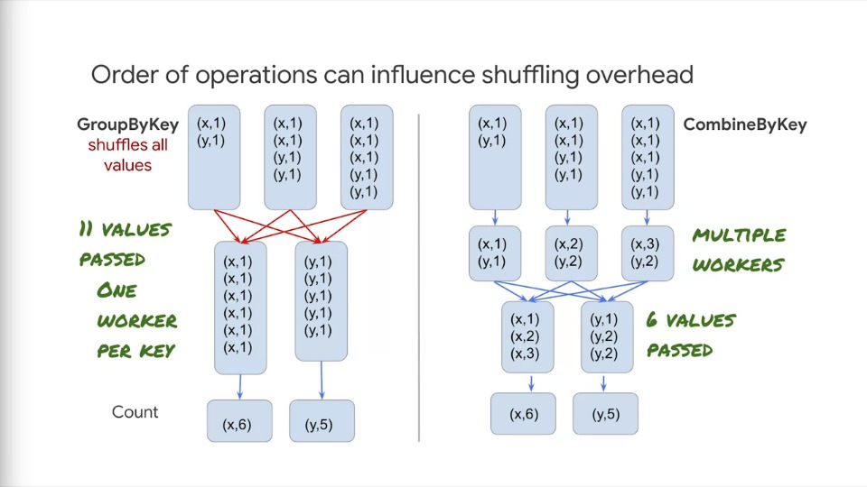

- Consider also the need to transfer data from one location to another over the network
- Data transfer can be costly compared wit a change in approach that might produce the same result with less data transfer
- In this example, GroupByKey can use no more than one worker per key which causes all the values to be shuffled so they're all transmitted over the network
- Then there's one worker for the x key and one worker for the y key creating a bottleneck
- Combine, allows cloud Dataflow to distribute a key to multiple workers and process it in parallel
- In this example, `CombineByKey`, first aggregates values and then processes the aggregates with multiple workers
- Also, only six aggregate values need to be passed over the network

### Grouping by time (Windowing)

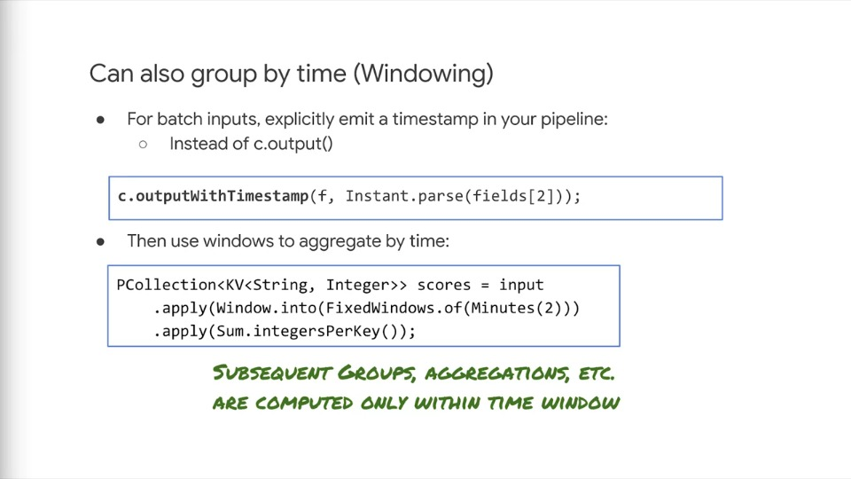

- Consider when data is unbounded or streaming that using windows to divide the data into groups can make the processing of the data much more manageable
- However, also consider the size of the window and whether the windows are overlapping

## Bigtable performance

### Bigtable seperates processing and storage

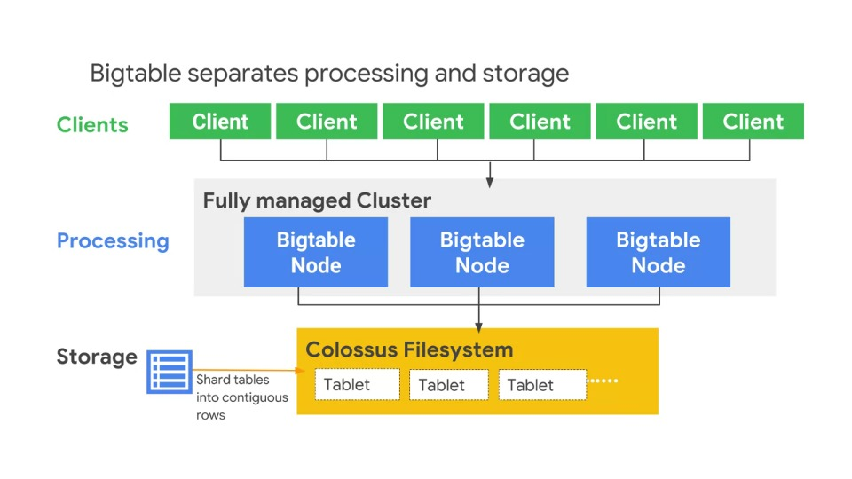

- This slide goes into detail about how Bigtable stores data internally
- A Bigtable table is sharded into blocks of contiguous rows called **tablets**  to help balance the workload of queries
- Data is never stored in Cloud Bigtable nodes themselves
- Each node has pointers, two sets of tablets that are stored in a storage service
- Rebalancing the tablets from one node to another is very fast because the actual data is not copied
- Recovery from the failure of a Cloud Bigtable node is also very fast because only metadata needs to be migrated to the replacement node
- When a Cloud Bigtable node fails, no data is lost
- BigTable has efficiency when it comes to fast streaming ingestion just storing data, whereas BigQuery is efficient for queries because it's optimized for SQL support

### A table can have only one index (the row key)

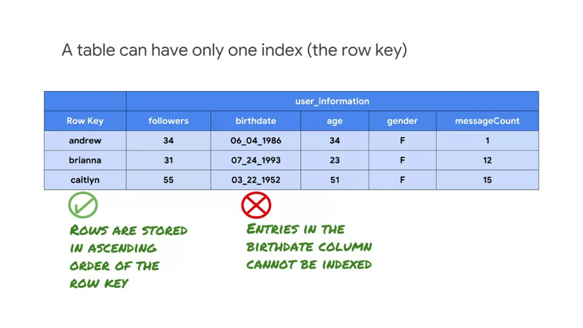

- In BigTable, each table has only one index, the **row key**
- There are no secondary indices and the data is stored in the row key in ascending order
- All operations are atomic at the row level

### Spanner Table Design - Wide and Sparse tables

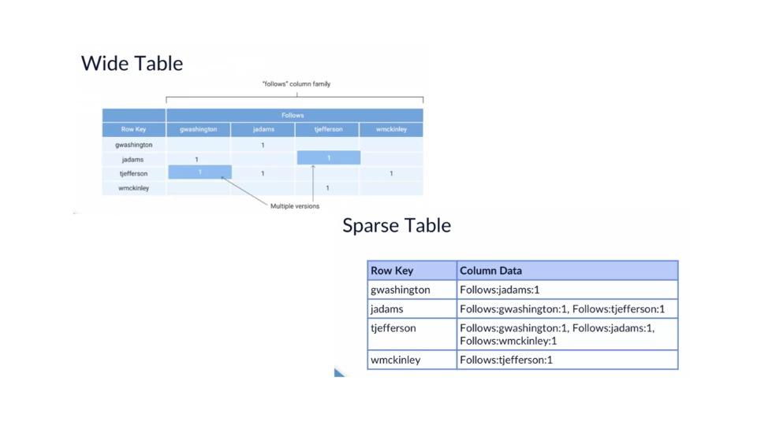

- This example compares Spanner organisation which uses a **wide table** design
- In other words, it's optimised for explicit columns, and for the columns to be grouped under column families
- Bigtable on the other hand is a sparse table design meaning that it's optimised for using single row key and undifferentiated column data
- Understanding these different representations and optimisations can help you determine whihc technology solution is appropriate in a given circumstance

### Row Key Design

- This slide discusses how to used the row key
- In the example, there is traffic data that arrives with a mile marker code anda timestamp indicating where vehicles were located at specific times
- The question we're trying to answer is, which value hould be used as the index? If you stored the data in timestamp order, the newest data will be at the bottom of the table
- If you're running queries that are based on most recent data and only use older data for some quereies, this organisation is the worst case

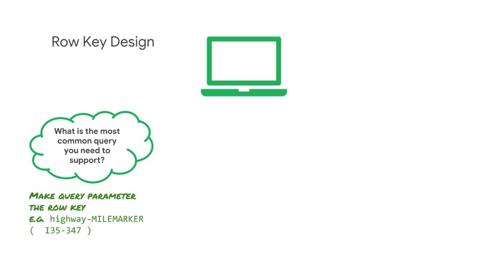

- Instead, to optimise the query for the use-case you might want to consider using a reverse timestamp
- But this doesn't work welll either, it introduces a new problem

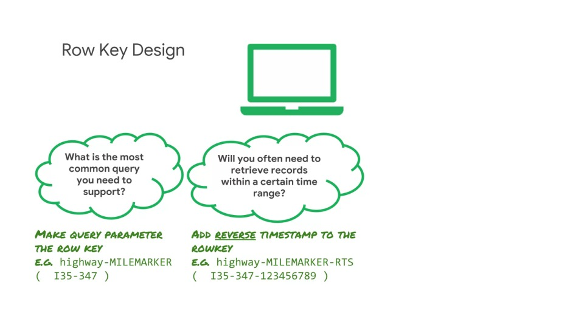

- Because the data is stored sequentially in Bigtable, events starting with the same timestamp will all be stored on the same tablet and that means the processing isn't distributed

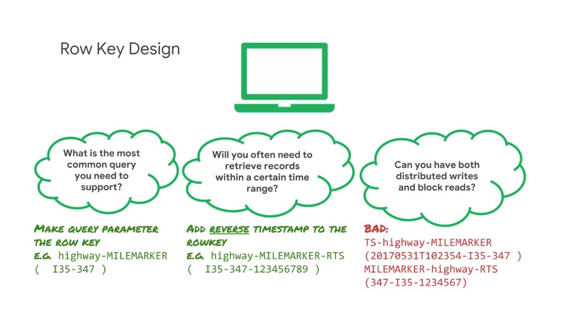

- In the end, this example uses the mile marker code as the row key
- It didn't necessarily make the data easy to read or faster for a specific kind of query but it randomises the access so the query was distributed

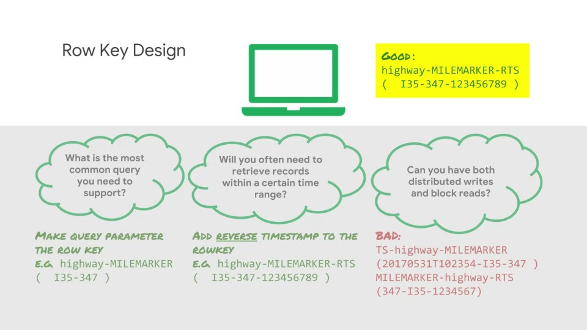

> **Exam Tip**
>
> Know how indexes and key values influence performance and possibly introduce bias

- Another example is time series where you baseline data comes from winter and your validation comes from summer, introducing a seasonal bias into your analysis

### Cloud Bigtable features

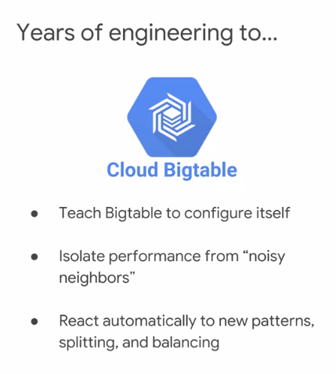

- Cloud BigTable is more sophisticated than we have so far described...
- It actually learns about your usage patterns and adjusts the way it works to balance and optimise its performance

### Bigtable looks at access patterns and improves itself

- Bigtable looks at access patterns to improve itself

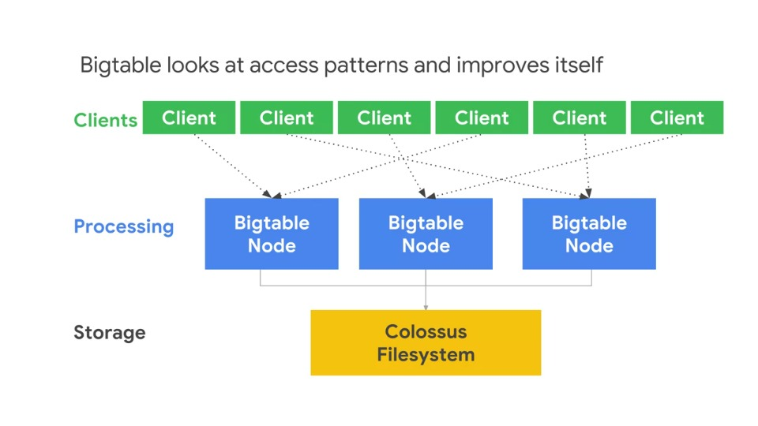

- This example illustrates that because A, B, C, D and E are not data but rather pointers and references, and cache rebalancing is not time consumed

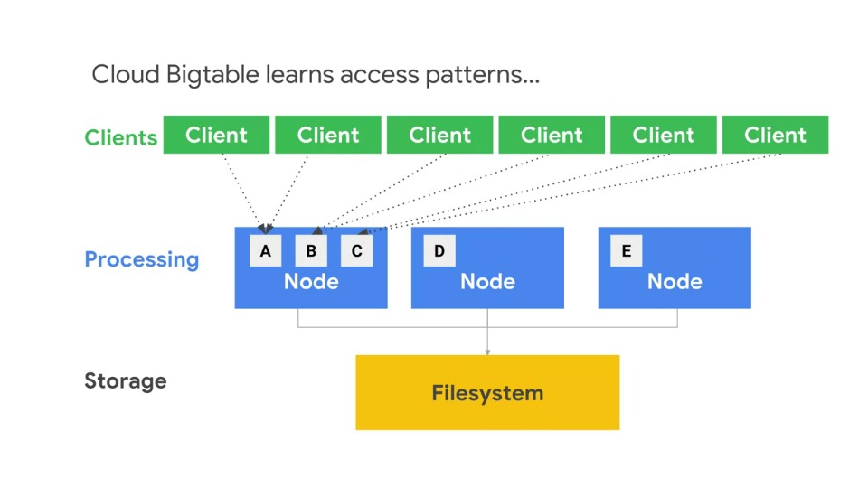

- Moving the points rebalances which nodes do the work, but the data isn't copied or transferred

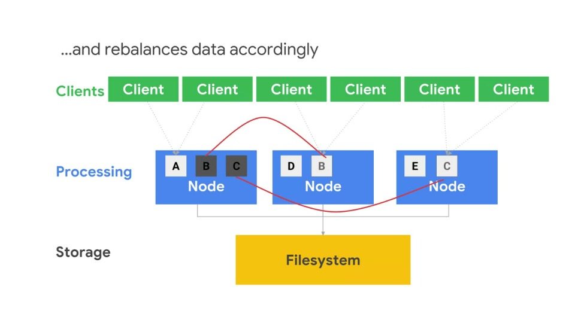

### Rebalance strategy: distribute reads

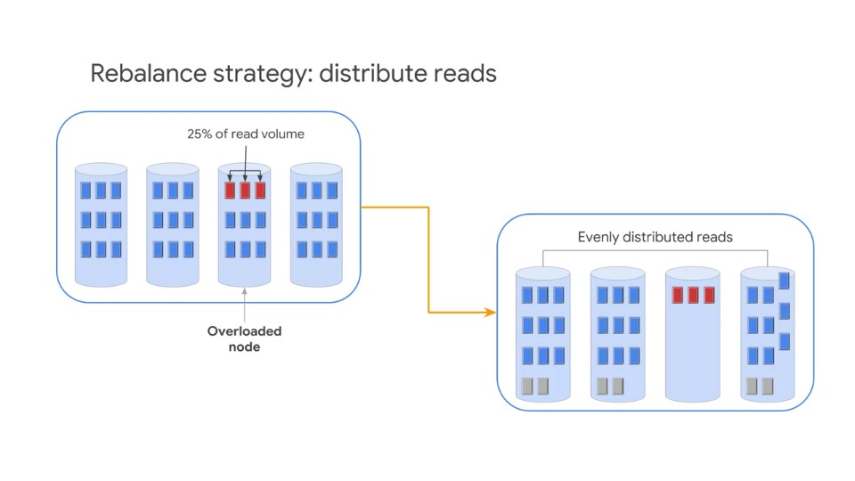

- This is an example when 25% of the read volume hits a single node
- The overload condition is detected and the pointers are shuffled to distribute the reads
- There are multiple copies of the data in the file service
- For resiliency, the data needs to exist on different nodes
- So BigTable knows to use copies on other nodes in the file system to improve performance

### Growing a Bigtable cluster

- Here are some tips to growing a BigTable cluster

- There are a number of steps you can take to increase performance
- One item to highlight is that there can be a delay of several minutes to hours when you add nodes to a cluster before you see the performance improvement
  - This makes sense - because the data and pointers have to be reshuffled and it takes BigTable some time to figure out how to adjust the usage patterns to the new resources

## BigQuery Price Estimation

### Three categories of BigQuery pricing

- There are 3 elements of BigQuery pricing:
  1. Storage
  2. Processing
  3. Free activities (such as loading data)

- So, you don;t pay to load the data for ingest, **but** you do pay to **store** the data once it's loaded

> **Exam Tip**
>
> Be suspicious of anything with `SELECT *` - understand the use of wildcards

### Pricing Calculator

- The pricing calculator can be used with BigQuery to estimate the cost of a query before you submit it

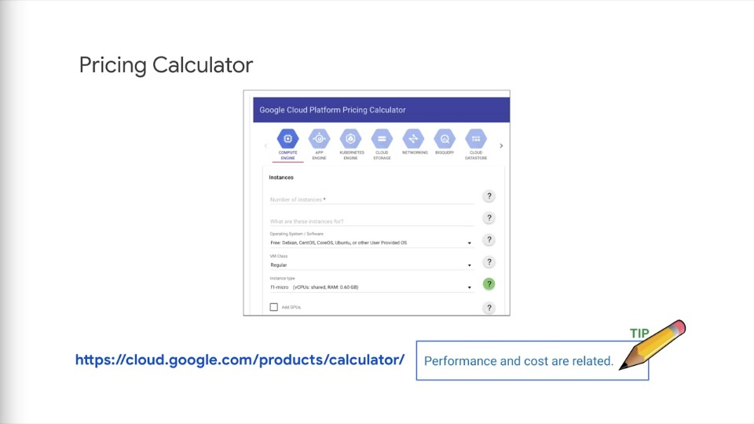

### Using the Query Validator with the Pricing Calculator

- The query validator also has estimates about how much data will be used by the query before you run it
- You can plug this into the pricing calculator to get an estimate of how much you'll spend before you run the query

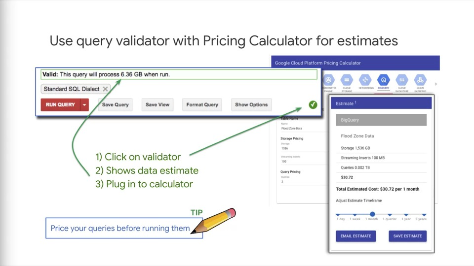