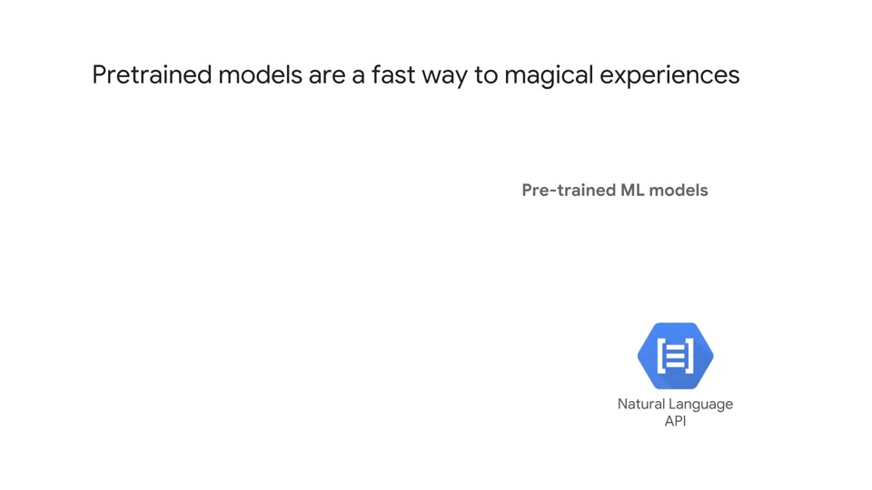
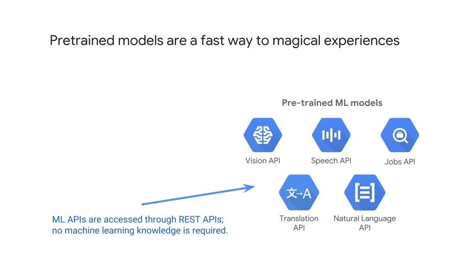
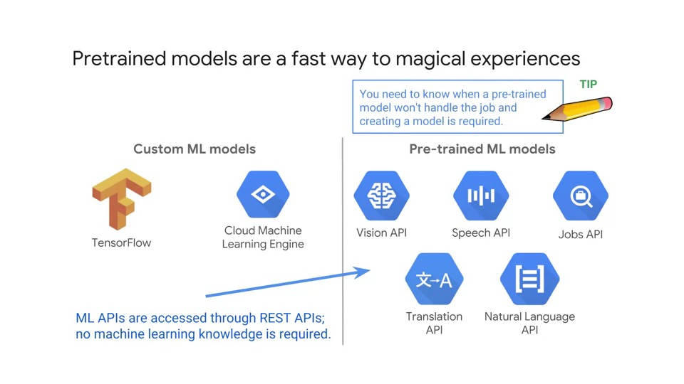
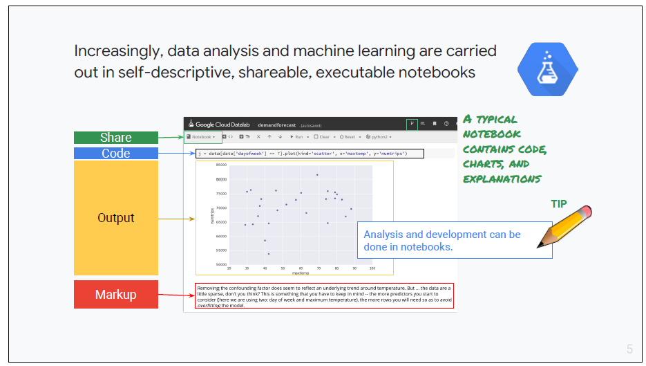
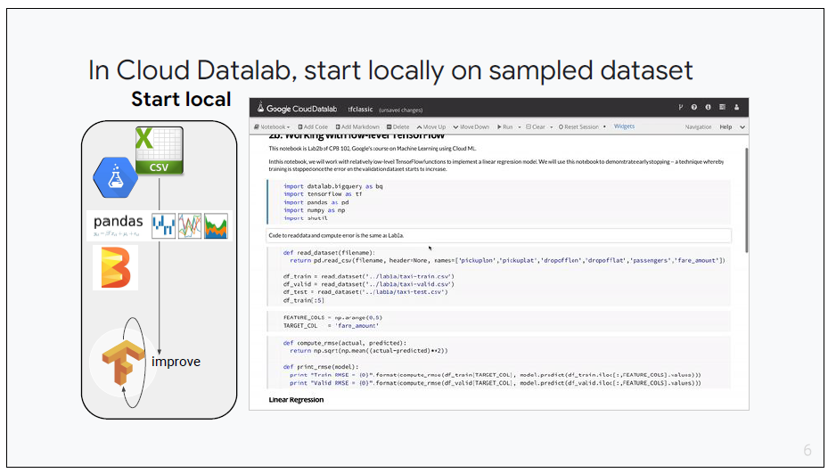
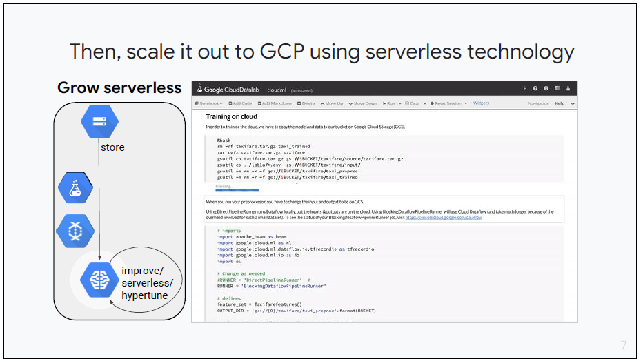
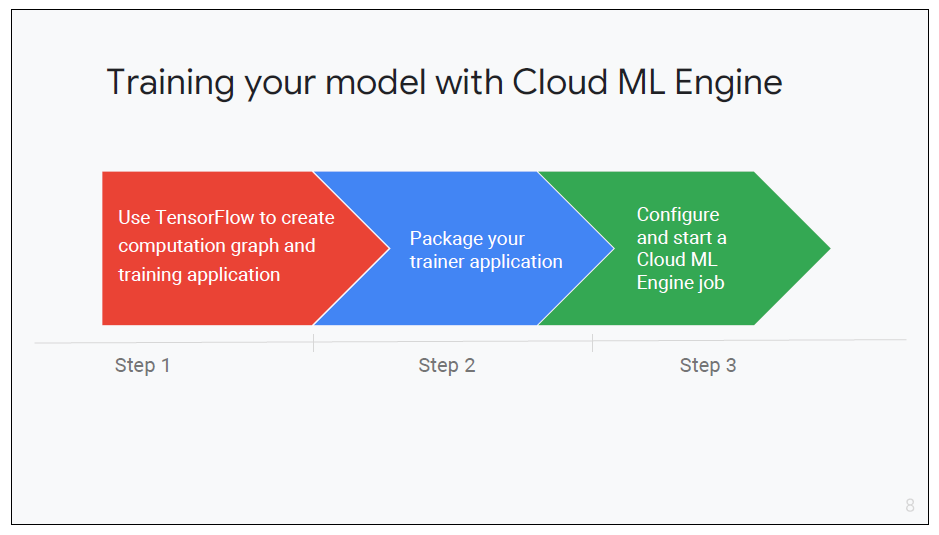

# Preparing for analysing

## Analysing and modelling

The next section of the exam guid is about analysing and modelling. Analysing is looking for patterns and gaining insight from data.

Modelling is about identifying patterns that can be used for categorising or recognising new data or predicting values or states in advance.

In the first section, we'll look at analysing data and enabling machine learning. The way these two are related is that a lot of businesses begin by analysing data.

After they get value from the analysis, they start to look deeper and often realise that they have unstructured data that could provide business insights.

This leads businesses to want to enable machine learning so this is a natural adoption path.

### Pretrained models are a fast way to magical experiences

- Make sure you're familiar with each pre-trained ML model
- For example, the three modes of the Natural Language API are:
  - Sentiment analysis
  - Entities
  - Syntax
- Would the Natural Language API be an appropriate tool for identifying all of the locations mentioned in the document?
  - Yes, it might be useful for that purpose
- Pre-trained models can turn apparently meaningless data into meaninful data
- The Translation API is a good example of this, if you have text in a language you don't understand, the meaning contained in the data is not available to you
- Use the Translation API to convert it to a language you can understand, and suddenly there's meaning and value in it

- Pre-trained models create value from spoken word, from text and from images, common sources of unstructured data
- If none of the pre-trained models work, you can use Tensorflow and Cloud Machine Learning Engine to create your own models

> **Exam Tip**
>
> - Make sure you are familiar with each pre-trained ML model
> - The following page has a list and description of all the ML and AI technologies available:
>   - [Google Cloud Machine Learning and AI Products](https://cloud.google.com/products/ai)

## Deploying an ML pipeline

- If you're a data analyst you might use SQL to analyse data - this is an area of strength for BigQuery
- As a data engineer, you're more interested in setting up the framework for data analysis that would then be used by a data analyst, than actually delivering insights from the data
- Analysing data in a data engineer context is about the systems you might put in place to make analysis possible for your users or clients

### Increasingly, data analysis and machine learning are carried out in self-descriptive, shareable and executable notebooks

> **Exam Tip**
>
> - Notebooks are a self-contained development environment and are often used in modern data processing and machine learning development because they combine code management, source code, control, visualisation and step-by-step execution for gradual development and debugging

- Notebooks are a great framework for experimenting in a programming environment
- There are a number of popular notebook frameworks in use today, including Jupyter, Colab and Datalab
- Cloud Datalab is based on Jupyter and it's open source
- It combines code, documentation, results and visualisations in an intuitive notebook format
- Cloud Datalab is built on Jupyter (formerly IPython)
- Supports Python, SQL, JavaScript and more
- Supports Google Charting or `matplotlib` for easy visualisations

Can be launched using the following:

- **From Cloud Shell**: `datalab create <vm-name>`
- Or via **Cloud Dataproc initialisation action**

### In Cloud Datalab, start locally on a sampled dataset

- Datalab is a fail fast tool to analyse and learn from your data
- Datalab can interactively explore data by:
  - Defining features with rich visualisation support
  - Launch training and evaluation
  - ML lifecycle support
  - Combine code, results, visualisations and documentation in notebook format
  - Share results with your team
  - Pick from a rich set of tutorials and samples to learn and get started with your project

- When analysing data that's unstructured or not organised in a format that's suitable for your purpose:
  - You can use a pre-trained ML model to quickly transform data to something useful
  - Or develop your own using Tensorflow or other ML packages

### Then, scale it out to GCP using serverless technology

### Training your model with Cloud ML Engine

This is the pattern for developing your own machine learning models;

1. Prepare the data, this means gather the training data, clean the data
2. Split it into pools or groups for different purposes
3. Select features and improve them with feature engineering
4. Use Tensorflow to create you training application, package it and then configure and start a cloud ML job

