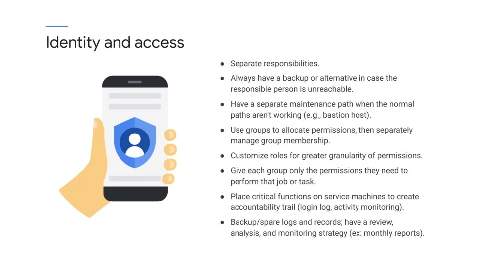
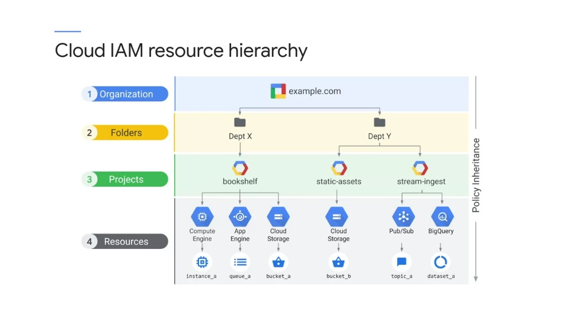
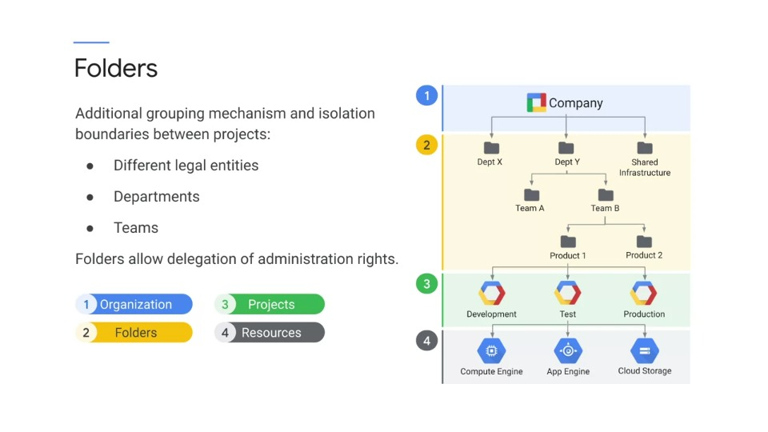
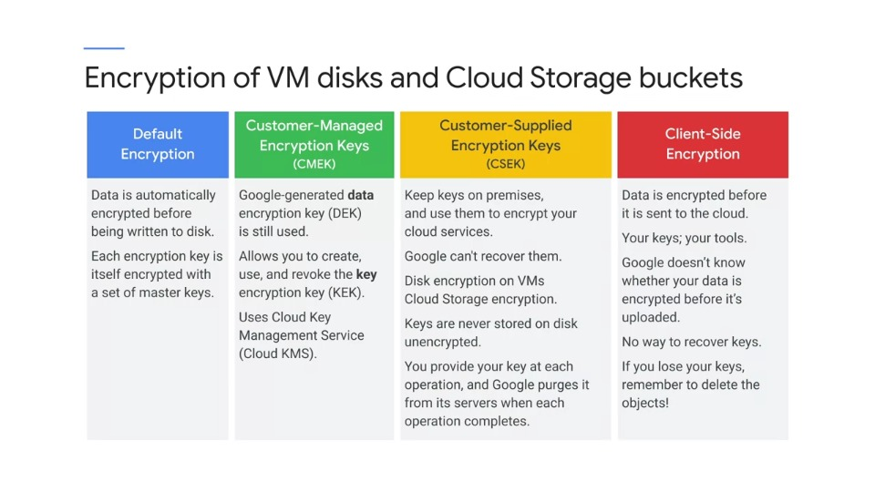
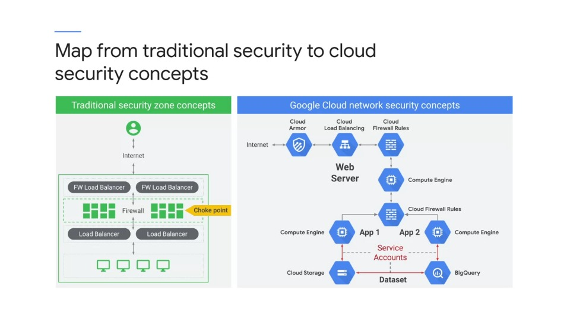

# Designing for  Security and Compliance

This module covers qualities of the Data Engineering solution beyond functionality and performance. It addresses **reliability**, **policies** and **security**.

Security is a broad term and includes:

- Privacy
- Authentication
- Authorisation
- Identity and Access Management

It could include intrusion detection, attack mitigation, resilience, and recovery. Security appears across the technologies not in just one place.

> **Exam Tip**
>
> _You need to be aware of the granularity of control for each service._

## Exercise

Imagine there are two people, one needs access and the other must not have access.

- What's the smallest unit or degree of control the technology supports?
- Can you distinguish security to an individual field or to a row or a record, or to specific columns, or to a specific database or entity? Or just the kinds of actions that can be performed on the service?

## Solution 

Commit a security checklist to memory. Sometimes writing down a list will rapidly identify a solution

## Identity and Access

- A key concept is to assign roles to groups and use group membership to grant permissions to individuals.
- How will the service be monitored or reported and how often will these items be reviewed? 
- Finally, you need to know what kinds of logs and reporting are available from each technology.

Below shows what can be achieved with Identity and access controls:

## Cloud IAM resource hierarchy

- A policy is set on a resource, and each policy contains a set of roles and role members.
- Resources inherit policies from parents.
- So a policy can be set on a resource, for example, a service, and another policy can be set on a parent such as a project that contains that service.
- The final policy is the union of the parent policy and the resource policy.

### What happens when policies are in conflict?

What if the policy on the resource only gives access to a single, lets say Cloud Storage Bucket, and restricts access to all other buckets? However, at the project level, a rule exist that grants access to all buckets in the project.

**Which rule wins?** The more restrictive rule on the resource or the more general rule on the project.

If the parent policy is less restrictive, it overrides a more restrictive resource policy. So in this case, the project policy wins.

## Folders

Folders map well to organisational structure. It's a way to isolate organizations or users or products while still having them share billing and corporate resources.

## Encryption of VM disks and Cloud Storage buckets

There are many encryption options for data at rest and in storage:

Default encryption at rest uses the **key management system** (KMS) to generate **key encryption keys** (KEKs) and DEKs, the **data encryption keys**.

When you use Cloud Dataproc, cluster and job data is stored on persistent disks associated with the computer engine VMs and the cluster and then a Cloud Storage bucket, this PDE and bucket data is encrypted using a Google generated data encryption key, the DEK and key encryption key, the KEK.

Customer managed encryption keys (**CMEK**) is a feature that allows you to create, use, and revoke the key encryption key, the KEK.

Google still controls the data encryption key, the DEK. Client-side encryption simply means that you encrypt the data or file before you upload it to the Cloud.

## Cloud Security Concepts

### Key Concepts

- Cloud Armour
- Cloud Load Balancing
- Cloud Firewall Rules
- Service Accounts
- Separation into front-end and back-end
- Isolation of resources using separate service accounts between services

Because of the pervasive availability of firewall rules, you don't have to install a router and the network at a particular location to get firewall protection.

That means you can layer the firewalls as shown in this example. Because of pervasive support for service accounts, you can lock down connections between components.

When faced with a security question on an exam or in practice, determine which of the specific technologies or services being discussed.

For example, authentication and encryption. Then determine exactly what the goals are for sufficient security.

Is it deterrence? Is it meeting a standard for compliance? Is the goal to eliminate a particular risk or vulnerability. This will help you define the scope of a solution, whether on an exam or in application.

## Practice Exam Questions

### Scenario #1

Groups Analyst1 and Analyt2 should not have access to each other's BigQuery data

- A. Place the data in separate tables, and assign appropriate group access
- B. Analyst1 and Analyst2 must be in separate projects, along with the data
- **C. Place the data in separate datasets and assign appropriate group access** :white_check_mark:
- D. Place the data in separate tables, but encrypt each table with a different group key 

**Answers**

- **C** is correct. BigQuery data access is controlled at the **dataset level**
- **A** is not correct because BigQuery does not provide IAM access control to the individual table
- **B** is not correct because the Analyst groups can be in the same project
- **D** is incorrect because encryption does not determine access

More info on BigQuery access control documentation [here](htttps://cloud.google.com/bigquery/docs/access-control)

### Scenario #2

Provide Analyst3 secure access to BigQuery query results, but not the underlying tables or datasets

- A. Export the query results to a public Cloud Storage bucket
- **B. Create a BigQuery Authorized View and assign a project-level user role to Analyst3**  :white_check_mark:
- C. Assign the `bigquery.resultsonly.viewer` role to Analyst3
- D. Create a BigQuery Authorized View and assign an organisation-level role to Analyst3

**Answers/Rationale**

- B is correct. You need to copy/store the query results in a separate dataset and provide authorization to view and/or use that dataset
- A is not secure
- C. The `readonly.viewer` role does not exist AND secure access cannot be applied to a query
- D. An organizational role is too broad and violates the principle of "least privilege"

More info on BigQuery share access views [here](htttps://cloud.google.com/bigquery/docs/share-access-views)

