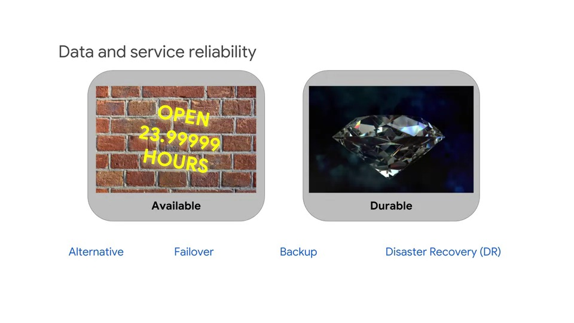

# Week 5: Preparing for Reliability and Recovery

## Reliability, Policy and Security

This module covers qualities of the data engineering solution beyond functionality and performance.

It addresses **reliability**, **policies** and **security**.

### Ensuring reliability

#### Data and service reliability

> **Reliable**: means that the service produces consistent outputs and operates as expected. If we were to quantify it, it would be a measure of how long the service performs its intended function
>
> **Available**: means that the service is accessible on demand, a measure of the percentage of time that the item is in an operable state
>
> **Durable**: has to do with data loss; it means data does not disappear and information is not lost over time. More accurately, it's a measure of the rate at which data is lost

- The qualities are related. Availability and durability are real-word values which are not always typically 100%.

- If a service fails, or has an outage, then it's not producing reliable results during that period.

- An alternate service or failover might bring the service back only and make it available again.

- Typically, an outage that causes a loss of data requires more time to recover if it's recovered from backup or from a disaster recovery plan.

- However, if you have an alternate service such as a copy that can be rapidly turned on, there might be little or no loss of data or time to recover

> **Takeaway**:
> The important thing to consider is what are the business requirements to revoer from different kinds of problems and how much time is allowed for each kind of recovery?

- For example, disaster recovery of a week might be acceptable for flood damage to a store front
- However, loss of a financial transaction might be completely unacceptable

### Distributing for scale may improve reliability

- Simply scaling up may improve reliability
- If the solution is designed to be fault-tolerant, increasing scale might improve reliability
