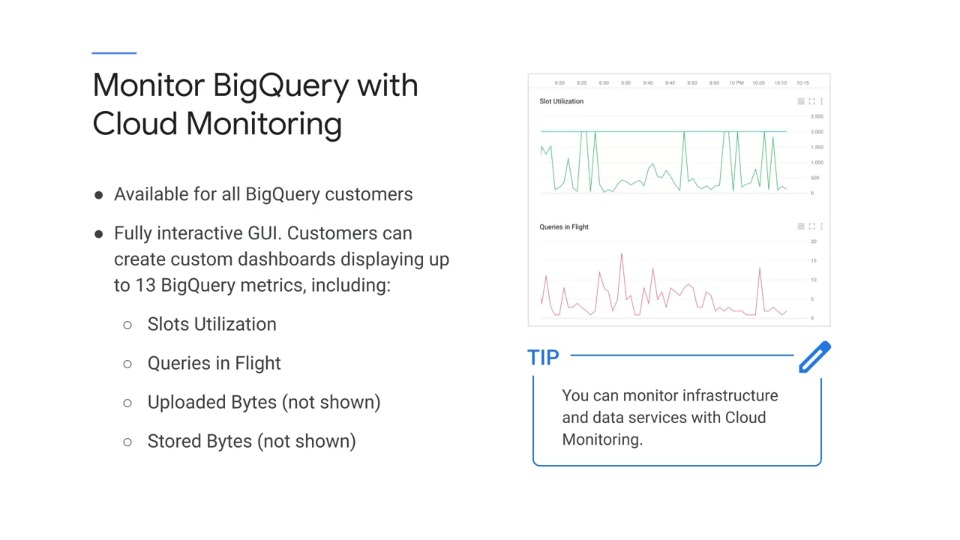
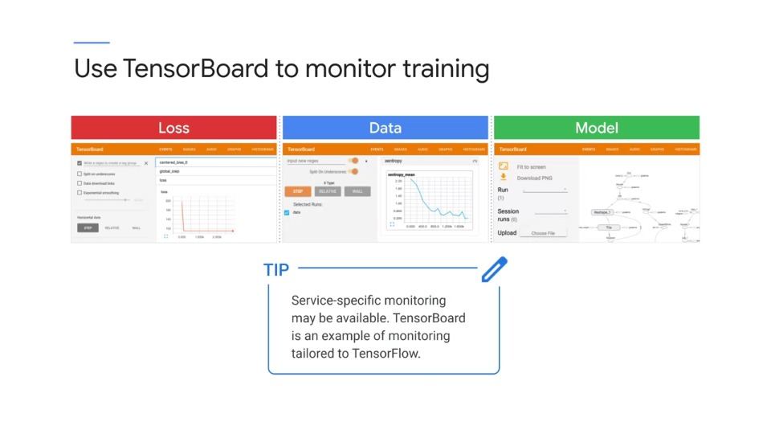
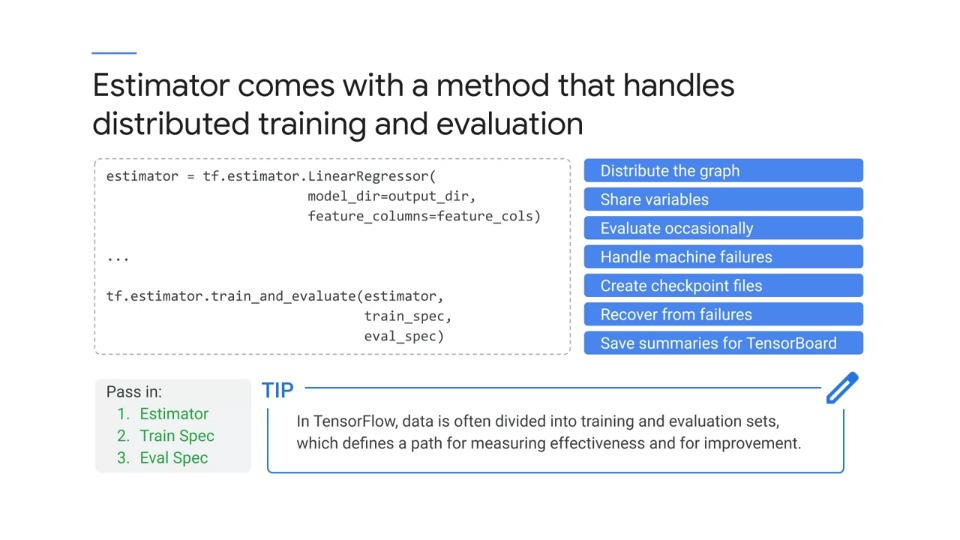
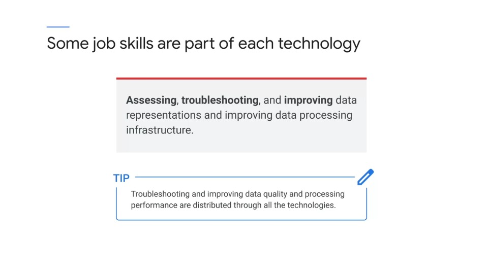
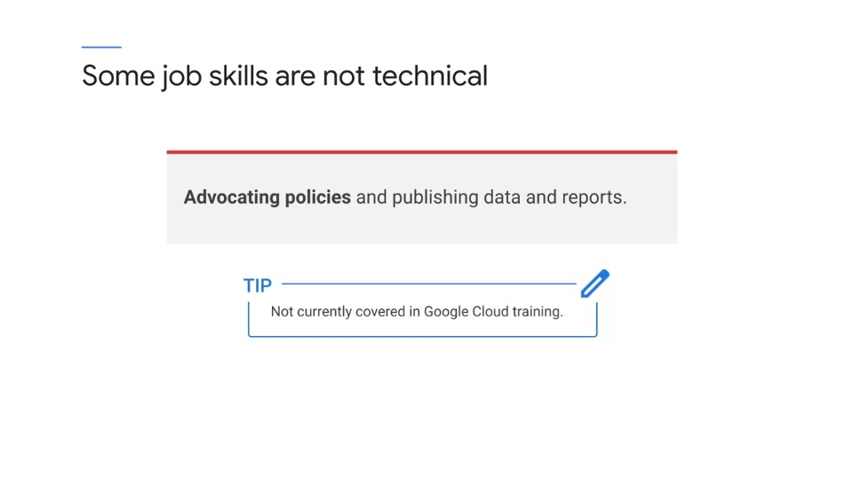

# Performing quality control

The next section of the exam guide refers to performing quality control. This is part of the reliability section of the exam guide, so it's referring to how you can monitor the quality of your solution.

## Monitor BigQuery with Cloud Monitoring

- Integrated monitoring across services can simplify the activity of monitoring a solution.
- You can get graphs for multiple values in a single dashboard.
- It's possible to surface application values as custom metrics and Stackdriver.
- These charts show slot utilization slots available and queries in flight for one hour period of BigQuery.

> **Exam Tip**
>
> *You can monitor infrastructure and data services with Cloud Monitoring*

## Using Tensorboard to monitor training

Tensorboard is a collection of visualization tools designed specifically to help you visualize:

- Tensorflow
- Tensorflow graph
- Plot quantitative metrics
- Pass and graph additional data

The other graphs show the linear model graph is built by tensorflow. And the exams appears that service specific monitoring may be available.

Tensorboard is an example of monitoring tailored for tensorflow

## Reliability with machine learning

There are a number of things you can do to improve reliability

- For example, you can recognize machine failures, create checkpoint files, and recover from failures.
- You can also control how often evaluation occurs to make the overall process more efficient.

> **Exam Tip**
>
> *The tip shown is that in tensorflow, data is often divided into training and evaluation sets, defining a path for measuring effectiveness an for improvement, so the overall exam tip is that there might be quality processes or reliability process is built into the technology, such as this demonstrates*

## Some job skills are part of each technology

- Troubleshooting and improving data quality and processing performance is distributed through all the technologies.
- It would be a good idea to make sure you know the main troubleshooting methods for each data engineering technology and service.
- Security and troubleshooting are the lateral subjects that crowd across all technologies. These should be looked at in the documentation for each technology area

## Some job skills are *not* technical

The training does cover the mechanics of generating an reports, but not explicitly how to present an advocate for policies.

The subject is in the exam outline its general job skill rather than a technical skill and not specifically covered in Google technical training.

Nevertheless, it is part of the job and could be on the exam, so this is one of the items I suggest you make sure you know, even though it's not in our training.
