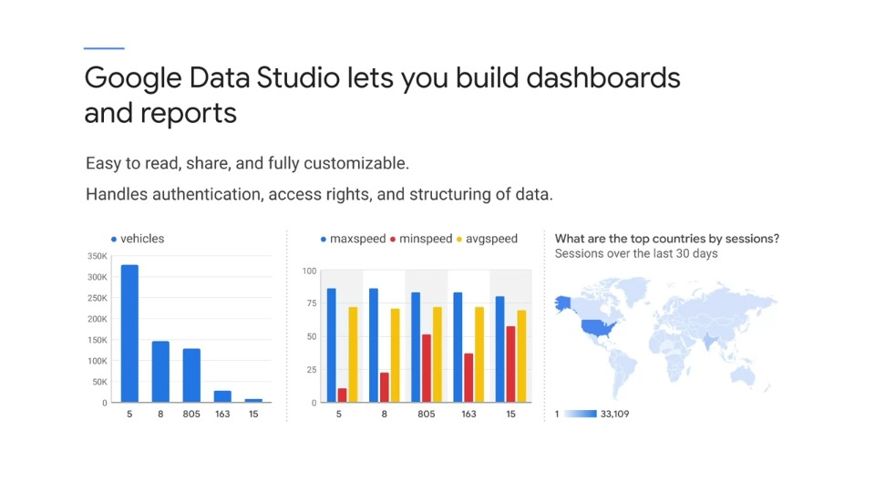
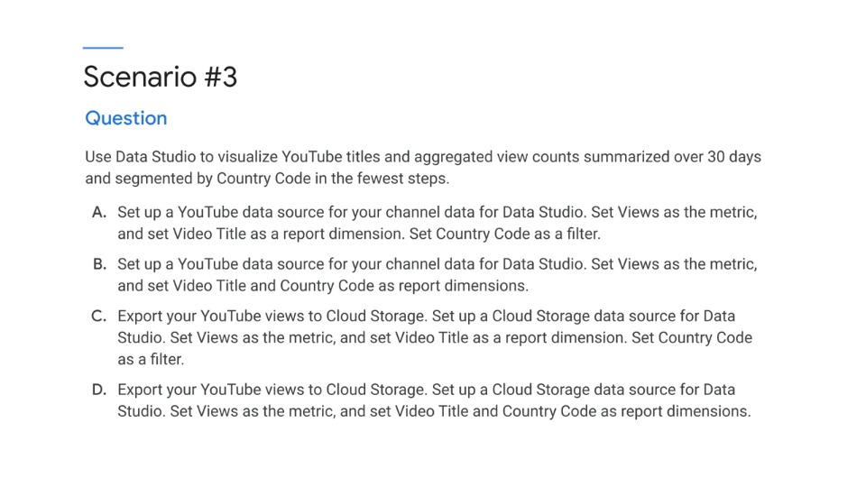

# Week 5: Security, Policy and Reliability

## Visualising Data and Advocating Policy

### Data visualisation and reporting tools

- Data Studio lets you build dashboards and reports. It's easy to read, share and it's fully customisable.
- Data Studio also handles authentication, access rights and structuring of data
- Its one of the key visualisation tools available for data on GCP

### Practice Questions #5

### Solution /Rationale

In this case you would use a connector. Dimensions describe and group data, so they have the effect of segmenting the report. However, Data Studio includes a feature called Segments, which is set separately for using Google Analytics segments.

- **B** is correct, because there is no need to export; you can use the existing YouTube data source. Country code is a dimension because it's a string and should be displayed as such, that is, showing all countries, instead of filtering 
- **A** is not correct because you cannot produce a summarised report that meets your business requirements using the options listed
- **C** and **D** are not correct because you do not need to export data from YouTube to Cloud Storage; you can simply use the existing YouTube data source.

#### See

- **Article**: *"About dimensions and metrices"* in Data Studio dashboard help
- **Article**: *"Manage segments"* in Data Studio dashboard help